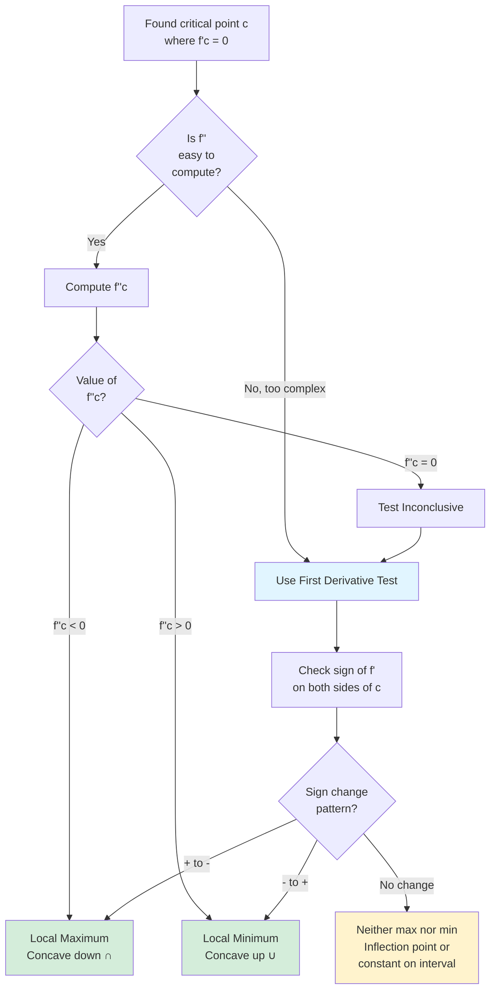
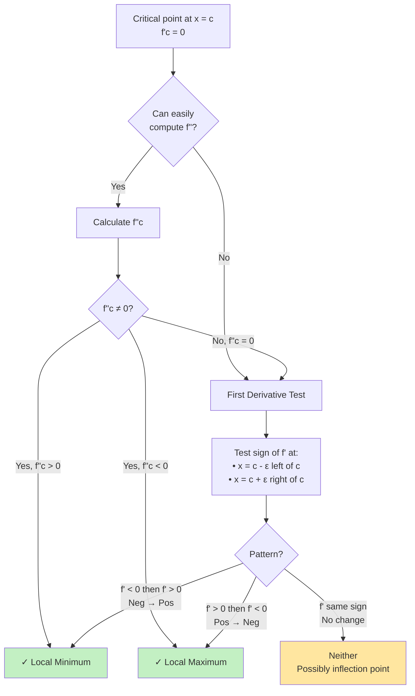

# The Second Derivative Test

The first derivative test requires checking signs on intervals around a critical point. The second derivative test provides a sometimes simpler alternative using concavity information.

## Statement of the Test

Suppose $f'(c) = 0$ (so $c$ is a critical point):

- If $f''(c) > 0$, then $f$ has a **local minimum** at $c$
- If $f''(c) < 0$, then $f$ has a **local maximum** at $c$
- If $f''(c) = 0$, the test is **inconclusive** (use first derivative test)

## Why It Works

- $f''(c) > 0$ means the graph is concave up at $c$ (like a cup)—if the tangent is horizontal, you're at the bottom of a cup: local minimum

- $f''(c) < 0$ means concave down at $c$ (like a frown)—horizontal tangent at the top of a frown: local maximum

## Examples

**Example 1:** Classify critical points of $f(x) = x^3 - 6x^2 + 9x + 2$.

$f'(x) = 3x^2 - 12x + 9 = 3(x^2 - 4x + 3) = 3(x-1)(x-3)$

Critical points: $x = 1$ and $x = 3$

$f''(x) = 6x - 12$

At $x = 1$: $f''(1) = 6 - 12 = -6 < 0$ → **local maximum**
At $x = 3$: $f''(3) = 18 - 12 = 6 > 0$ → **local minimum**

**Example 2:** Classify critical points of $f(x) = x^4 - 4x^3$.

$f'(x) = 4x^3 - 12x^2 = 4x^2(x - 3)$

Critical points: $x = 0$ and $x = 3$

$f''(x) = 12x^2 - 24x = 12x(x - 2)$

At $x = 0$: $f''(0) = 0$ → **inconclusive**
At $x = 3$: $f''(3) = 12(3)(1) = 36 > 0$ → **local minimum**

For $x = 0$, use first derivative test:
$f'(x) = 4x^2(x-3)$
- For $x < 0$: $f'(x) = (+)(-) < 0$
- For $0 < x < 3$: $f'(x) = (+)(-) < 0$

Sign doesn't change → $x = 0$ is **neither max nor min**

**Example 3:** $f(x) = e^{-x^2}$

$f'(x) = e^{-x^2} \cdot (-2x) = -2xe^{-x^2}$

Critical point: $f'(x) = 0$ when $x = 0$

$f''(x) = -2e^{-x^2} + (-2x)(-2x)e^{-x^2} = e^{-x^2}(-2 + 4x^2)$

At $x = 0$: $f''(0) = e^0(-2) = -2 < 0$ → **local maximum**

## When the Test Fails

The second derivative test is inconclusive when $f''(c) = 0$. In these cases:

1. Use the first derivative test, or
2. Look at higher derivatives (advanced technique)

**Classic example:** $f(x) = x^4$

$f'(x) = 4x^3$, so $f'(0) = 0$
$f''(x) = 12x^2$, so $f''(0) = 0$ (inconclusive)

First derivative test: $f'$ changes from − to + at $x = 0$ → local minimum

**Another example:** $f(x) = x^3$

$f'(x) = 3x^2$, $f'(0) = 0$
$f''(x) = 6x$, $f''(0) = 0$ (inconclusive)

First derivative test: $f' > 0$ on both sides of 0 → neither max nor min (inflection point with horizontal tangent)

## Comparing the Two Tests

| Aspect | First Derivative Test | Second Derivative Test |
|--------|----------------------|------------------------|
| Method | Check sign of $f'$ on intervals | Evaluate $f''$ at point |
| Always works? | Yes | Not when $f''(c) = 0$ |
| When easier | When $f''$ is hard to compute | When $f''$ is simple |
| Extra info | Shows where $f$ increases/decreases | Requires only one evaluation |

## Procedure for Classifying Critical Points

1. Find $f'(x)$ and solve $f'(x) = 0$ for critical points

2. Find $f''(x)$

3. For each critical point $c$:
   - If $f''(c) > 0$: local min
   - If $f''(c) < 0$: local max
   - If $f''(c) = 0$: use first derivative test

## Flowchart: Choosing Between First and Second Derivative Tests

## Combined Decision Process

When you have a critical point at $x = c$ where $f'(c) = 0$, use this decision tree:

## Finding Both Types of Information

**Example:** Full analysis of $f(x) = x^4 - 4x^3 + 4x^2$

$f'(x) = 4x^3 - 12x^2 + 8x = 4x(x^2 - 3x + 2) = 4x(x-1)(x-2)$

Critical points: $x = 0, 1, 2$

$f''(x) = 12x^2 - 24x + 8 = 4(3x^2 - 6x + 2)$

| $x$ | $f''(x)$ | Classification |
|-----|----------|----------------|
| 0 | $f''(0) = 8 > 0$ | Local minimum |
| 1 | $f''(1) = 12 - 24 + 8 = -4 < 0$ | Local maximum |
| 2 | $f''(2) = 48 - 48 + 8 = 8 > 0$ | Local minimum |

Values: $f(0) = 0$, $f(1) = 1$, $f(2) = 0$

## Summary

- Second derivative test: $f''(c) > 0$ → min, $f''(c) < 0$ → max
- The test fails when $f''(c) = 0$ (use first derivative test instead)
- Positive second derivative means concave up (minimum)
- Negative second derivative means concave down (maximum)
- Both tests give the same classification; choose the easier one
