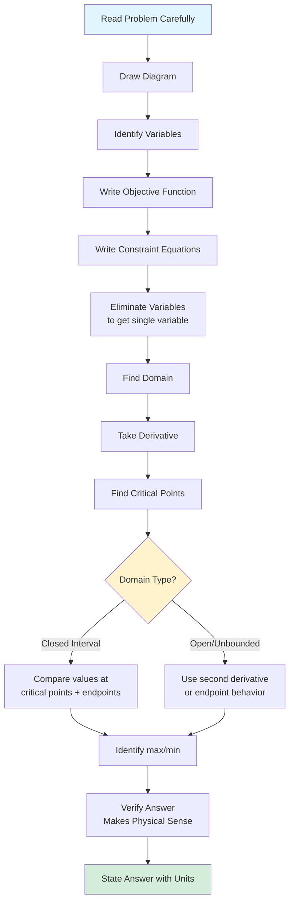

# Optimization: Comprehensive Review

This section consolidates everything we've learned about optimization, providing a complete problem-solving framework and a collection of common problem types with their solutions.

## The Complete Optimization Process

### Step-by-Step Breakdown

**Step 1: Understand the Problem**
- Read twice
- Identify what to optimize (maximize or minimize what?)
- Identify constraints

**Step 2: Draw and Label**
- Create a clear diagram
- Label all quantities with variable names
- Mark given values

**Step 3: Write Equations**
- **Objective function:** The quantity to optimize (call it $Q$)
- **Constraints:** Relationships between variables

**Step 4: Reduce to One Variable**
- Use constraints to eliminate extra variables
- Express objective in terms of one variable

**Step 5: Determine Domain**
- What values make physical sense?
- Positivity, capacity limits, etc.

**Step 6: Apply Calculus**
- Find $\frac{dQ}{dx}$
- Set equal to zero
- Solve for critical points

**Step 7: Find the Optimum**
- Closed interval: compare critical points and endpoints
- Unbounded: use second derivative test + boundary analysis

**Step 8: Verify and Interpret**
- Check units
- Confirm answer is reasonable
- State conclusion clearly

## Common Optimization Problem Types

### Type 1: Geometric - Fixed Perimeter

**Problem:** Maximize area of rectangle with perimeter $P$.

**Variables:** Length $\ell$, width $w$

**Constraint:** $2\ell + 2w = P \Rightarrow w = \frac{P - 2\ell}{2} = \frac{P}{2} - \ell$

**Objective:** $A = \ell w = \ell\left(\frac{P}{2} - \ell\right) = \frac{P\ell}{2} - \ell^2$

**Domain:** $0 < \ell < \frac{P}{2}$

**Optimize:** $\frac{dA}{d\ell} = \frac{P}{2} - 2\ell = 0 \Rightarrow \ell = \frac{P}{4}$

**Result:** $\ell = w = \frac{P}{4}$ (square)

**Answer:** The rectangle with maximum area for fixed perimeter is a square.

### Type 2: Geometric - Fixed Area

**Problem:** Minimize perimeter of rectangle with area $A$.

**Constraint:** $\ell w = A \Rightarrow w = \frac{A}{\ell}$

**Objective:** $P = 2\ell + 2w = 2\ell + \frac{2A}{\ell}$

**Optimize:** $\frac{dP}{d\ell} = 2 - \frac{2A}{\ell^2} = 0 \Rightarrow \ell = \sqrt{A}$

**Result:** $\ell = w = \sqrt{A}$ (square)

**Answer:** The rectangle with minimum perimeter for fixed area is a square.

### Type 3: Box from Sheet

**Problem:** Cut squares from corners of $L \times W$ sheet and fold to make open box. Maximize volume.

**Let $x$ =** side of each square cut

**Volume:** $V = x(L - 2x)(W - 2x)$

**Domain:** $0 < x < \min\left(\frac{L}{2}, \frac{W}{2}\right)$

**Optimize:** Expand and differentiate; solve the resulting quadratic.

For square sheet ($L = W$): optimal cut is $x = \frac{L}{6}$.

### Type 4: Cylinder with Fixed Volume

**Problem:** Minimize surface area of closed cylinder with volume $V$.

**Constraint:** $V = \pi r^2 h \Rightarrow h = \frac{V}{\pi r^2}$

**Objective:** $S = 2\pi r^2 + 2\pi rh = 2\pi r^2 + \frac{2V}{r}$

**Optimize:** $\frac{dS}{dr} = 4\pi r - \frac{2V}{r^2} = 0 \Rightarrow r^3 = \frac{V}{2\pi} \Rightarrow r = \left(\frac{V}{2\pi}\right)^{1/3}$

**Result:** $h = 2r$ (height equals diameter)

**Answer:** Optimal cylinder has height equal to its diameter.

### Type 5: Distance to a Curve

**Problem:** Find point on curve $y = f(x)$ closest to point $(a, b)$.

**Distance:** $D = \sqrt{(x-a)^2 + (f(x)-b)^2}$

**Better:** Minimize $D^2 = (x-a)^2 + (f(x)-b)^2$

**Optimize:** $\frac{d(D^2)}{dx} = 2(x-a) + 2(f(x)-b)f'(x) = 0$

### Type 6: Fencing Against a Wall

**Problem:** Maximize rectangular area using $P$ feet of fencing along three sides (wall forms fourth side).

**Constraint:** $2w + \ell = P \Rightarrow \ell = P - 2w$

**Objective:** $A = w\ell = w(P - 2w) = Pw - 2w^2$

**Optimize:** $\frac{dA}{dw} = P - 4w = 0 \Rightarrow w = \frac{P}{4}$

**Result:** $w = \frac{P}{4}$, $\ell = \frac{P}{2}$ (width is half the length)

### Type 7: Profit Maximization

**Problem:** Given cost $C(x)$ and revenue $R(x)$, maximize profit.

**Profit:** $P(x) = R(x) - C(x)$

**Optimize:** $P'(x) = R'(x) - C'(x) = 0$

**Condition:** Marginal revenue = Marginal cost

## Key Formulas Reference

| Problem Type | Key Relationship | Optimal Result |
|--------------|------------------|----------------|
| Rectangle, fixed perimeter | $A = \ell w$, $P = 2\ell + 2w$ | Square |
| Rectangle, fixed area | Same formulas | Square |
| Cylinder, fixed volume | $V = \pi r^2 h$, $S = 2\pi r^2 + 2\pi rh$ | $h = 2r$ |
| Fencing with wall | $P = 2w + \ell$ | $\ell = 2w$ |
| Box from sheet | $V = x(L-2x)(W-2x)$ | Solve cubic |
| Profit | $P = R - C$ | $R' = C'$ |

## Second Derivative Test Summary

For $f'(c) = 0$:

| Sign of $f''(c)$ | Conclusion |
|------------------|------------|
| $f''(c) > 0$ | Local minimum at $c$ |
| $f''(c) < 0$ | Local maximum at $c$ |
| $f''(c) = 0$ | Test inconclusive; use first derivative test |

## Verifying Your Answer

### Reasonableness Checks

1. **Dimensions are positive** (lengths, areas, volumes > 0)
2. **Units are correct** (area in square units, etc.)
3. **Magnitude is sensible** (not astronomically large or tiny)
4. **Boundary behavior confirms** (is value better than at endpoints?)

### Alternative Point Check

Pick a nearby value and verify the objective function is worse:
- If maximizing, check that $f(c) > f(c \pm \epsilon)$
- If minimizing, check that $f(c) < f(c \pm \epsilon)$

## Common Mistakes to Avoid

1. **Not checking domain:** Critical point must be in the feasible region
2. **Forgetting endpoints:** On closed intervals, extrema may occur at boundaries
3. **Wrong constraint:** Carefully read what's fixed and what varies
4. **Algebra errors in setup:** Double-check substitutions
5. **Missing the second derivative test:** Verify max vs. min
6. **Ignoring implicit constraints:** Positivity of dimensions

## Worked Example: Complete Solution

**Problem:** A poster must have 150 square inches of printed area, with 2-inch margins on sides and 3-inch margins on top and bottom. What dimensions minimize the total area of the poster?

**Variables:** Let $x$ = printed width, $y$ = printed height

**Constraint (printed area):** $xy = 150 \Rightarrow y = \frac{150}{x}$

**Total poster dimensions:**
- Width: $x + 4$ (2-inch margins each side)
- Height: $y + 6$ (3-inch margins top and bottom)

**Objective (total area):**
$$A = (x + 4)(y + 6) = (x + 4)\left(\frac{150}{x} + 6\right) = 150 + 6x + \frac{600}{x} + 24 = 174 + 6x + \frac{600}{x}$$

**Domain:** $x > 0$

**Optimize:**
$$\frac{dA}{dx} = 6 - \frac{600}{x^2} = 0$$
$$x^2 = 100$$
$$x = 10 \text{ inches}$$

**Second derivative:** $A'' = \frac{1200}{x^3} > 0$ for $x > 0$ → minimum ✓

**Printed height:** $y = \frac{150}{10} = 15$ inches

**Total dimensions:** $(10 + 4) \times (15 + 6) = 14 \times 21$ inches

**Verification:**
- Printed area: $10 \times 15 = 150$ ✓
- Total area: $14 \times 21 = 294$ square inches

**Answer:** The minimum total area is achieved with a poster of dimensions 14 inches wide by 21 inches tall.

## Summary

- Follow the systematic optimization process: understand → diagram → equations → reduce → domain → calculus → verify
- Know standard problem types and their characteristic results
- Use second derivative test to confirm max vs. min
- Always verify answer makes physical sense
- Check units and reasonableness
- Practice transforms problem recognition into skill
