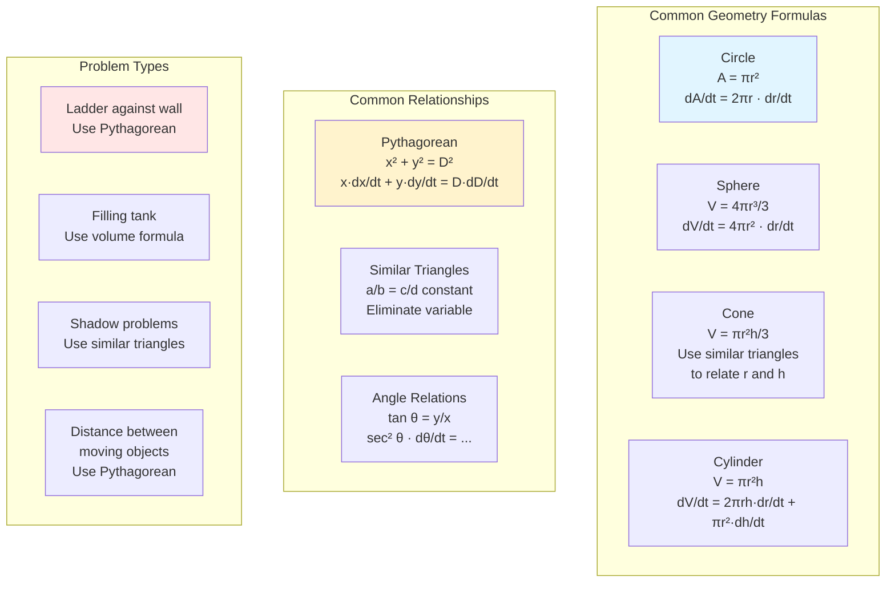

# Problem-Solving Strategies for Related Rates

This section consolidates techniques and strategies for tackling related rates problems systematically.

## The Complete Process

### Step 1: Read and Visualize
- Read the problem carefully—twice
- Draw a clear diagram
- Label all quantities with variable names
- Identify what changes with time and what's constant

### Step 2: Identify Rates
- What rate is given? Write it with correct sign.
- What rate is asked for?
- Are there other rates implicitly involved?

### Step 3: Find the Relationship
- What equation connects the variables?
- Common sources: Pythagorean theorem, similar triangles, geometry formulas, trig functions
- The equation should contain the variables whose rates matter

### Step 4: Eliminate Extra Variables
- If you have more variables than rates, use constraints
- Similar triangles are especially useful for cones
- Substitute to get an equation in the minimal set of variables

### Step 5: Differentiate with Respect to Time
- Treat every variable as a function of $t$
- Apply chain rule: $\frac{d}{dt}[f(x)] = f'(x)\frac{dx}{dt}$
- Apply product rule when needed

### Step 6: Substitute Known Values
- Plug in the specific values at the instant being analyzed
- Include both variable values and rates
- This is done AFTER differentiating

### Step 7: Solve and Interpret
- Solve for the unknown rate
- Interpret the sign (positive = increasing)
- Include units
- Check if answer is reasonable

## Common Mistakes and How to Avoid Them

### Mistake 1: Substituting Before Differentiating

**Wrong:**
If $x = 5$, then $A = 25$, so $\frac{dA}{dt} = 0$

**Right:**
$A = x^2$ → $\frac{dA}{dt} = 2x\frac{dx}{dt}$ → substitute $x = 5$

**Fix:** Always differentiate the general equation first.

### Mistake 2: Forgetting the Chain Rule

**Wrong:**
$\frac{d}{dt}[x^2] = 2x$

**Right:**
$\frac{d}{dt}[x^2] = 2x\frac{dx}{dt}$

**Fix:** Every variable is a function of $t$; include $\frac{d(\text{variable})}{dt}$.

### Mistake 3: Sign Errors

**Wrong interpretation:** "Moving away at -5 ft/s"

**Right:** If the distance is increasing, $\frac{dD}{dt} > 0$. A negative rate means decreasing.

**Fix:**
- State explicitly: "Let $\frac{dx}{dt} = 2$ (positive because increasing)"
- Verify sign makes physical sense at the end

### Mistake 4: Wrong Relationship

Using $D = x + y$ instead of $D^2 = x^2 + y^2$ for perpendicular motion.

**Fix:** Draw a careful diagram; use appropriate geometry.

### Mistake 5: Units Inconsistency

Mixing feet and miles, seconds and hours.

**Fix:** Convert everything to consistent units before starting.

## Strategy: When to Use What

### Use Pythagorean Theorem When:
- Two perpendicular distances combine to give total distance
- Ladder problems, moving objects at right angles, shadow length

### Use Similar Triangles When:
- A cone fills with liquid (radius and height related)
- Shadow problems (light source creates similar triangles)
- Any situation with proportional relationships

### Use Trigonometry When:
- The problem asks about an angle
- A rotating object or searchlight
- Camera tracking a moving object

### Use Area/Volume Formulas When:
- Expanding or contracting shapes
- Filling or draining containers
- Growing shapes (ripples, balloons)

## Worked Examples: Complete Solutions

### Example 1: Combined Motion

**Problem:** A man 6 ft tall walks at 5 ft/s toward a streetlight 16 ft high. How fast is his shadow shrinking when he is 20 ft from the light?

**Draw:** Streetlight at origin, man at distance $d$, shadow tip at distance $d + s$.

**Similar triangles:**
$$\frac{16}{d + s} = \frac{6}{s}$$

$16s = 6d + 6s$
$10s = 6d$
$s = 0.6d$

**Differentiate:**
$$\frac{ds}{dt} = 0.6\frac{dd}{dt}$$

**Given:** $\frac{dd}{dt} = -5$ ft/s (approaching, so negative)

$$\frac{ds}{dt} = 0.6(-5) = -3 \text{ ft/s}$$

**Answer:** Shadow shrinks at 3 ft/s. (Note: this rate is constant!)

### Example 2: Two Moving Objects

**Problem:** At noon, ship A is 40 miles north of ship B. Ship A sails south at 8 mph; ship B sails east at 6 mph. How fast is the distance between them changing at 2 PM?

**At time $t$ hours after noon:**
- A is at $(0, 40 - 8t)$
- B is at $(6t, 0)$

**Distance:** $D^2 = (6t)^2 + (40 - 8t)^2$

**Differentiate:**
$$2D\frac{dD}{dt} = 2(6t)(6) + 2(40-8t)(-8)$$
$$D\frac{dD}{dt} = 36t - 8(40-8t) = 36t - 320 + 64t = 100t - 320$$

**At $t = 2$:**
- A is at $(0, 24)$
- B is at $(12, 0)$
- $D = \sqrt{144 + 576} = \sqrt{720} = 12\sqrt{5}$

$$\frac{dD}{dt} = \frac{100(2) - 320}{12\sqrt{5}} = \frac{-120}{12\sqrt{5}} = \frac{-10}{\sqrt{5}} = -2\sqrt{5} \approx -4.47 \text{ mph}$$

**Answer:** They're getting closer at about 4.47 mph.

### Example 3: Angle and Distance

**Problem:** A kite is 100 m above the ground, moving horizontally at 8 m/s. A person holds the string 1.5 m above ground. How fast is the string being let out when the kite is 150 m from the person horizontally?

**Setup:**
- Vertical distance: $100 - 1.5 = 98.5$ m (constant)
- Horizontal distance: $x = 150$ m
- String length: $L^2 = x^2 + 98.5^2$

**Differentiate:**
$$2L\frac{dL}{dt} = 2x\frac{dx}{dt}$$

**At $x = 150$:**
$L = \sqrt{22500 + 9702.25} = \sqrt{32202.25} \approx 179.5$ m

$$\frac{dL}{dt} = \frac{x\frac{dx}{dt}}{L} = \frac{150 \times 8}{179.5} \approx 6.7 \text{ m/s}$$

**Answer:** String is let out at about 6.7 m/s.

## Quick Reference: Rate Formulas

| Situation | Key Formula |
|-----------|-------------|
| Circle area | $\frac{dA}{dt} = 2\pi r \frac{dr}{dt}$ |
| Sphere volume | $\frac{dV}{dt} = 4\pi r^2 \frac{dr}{dt}$ |
| Pythagorean | $D\frac{dD}{dt} = x\frac{dx}{dt} + y\frac{dy}{dt}$ |
| Tangent angle | $\sec^2\theta \frac{d\theta}{dt} = \frac{1}{a}\frac{dx}{dt}$ (for $\tan\theta = x/a$) |
| Cone (similar triangles) | $r = kh$, then use $V = \frac{\pi k^2 h^3}{3}$ |

## Summary

- Follow a systematic process: diagram → variables → relationship → differentiate → substitute → solve
- Differentiate before substituting specific values
- Include $\frac{d(\text{var})}{dt}$ for every changing variable
- Use similar triangles, Pythagorean theorem, or trig as appropriate
- Verify sign and units of final answer
- Check reasonableness: does the answer make physical sense?
