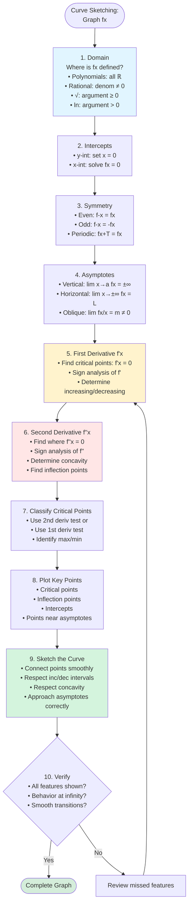

# Curve Sketching Overview

Curve sketching combines all the tools of differential calculus to produce accurate graphs of functions. By analyzing derivatives systematically, we can sketch curves without plotting hundreds of points.

## Why Sketch Curves?

While graphing calculators and software can plot functions, understanding curve sketching:
- Reveals the function's essential behavior
- Identifies key features (maxima, minima, asymptotes)
- Builds intuition about how calculus describes shape
- Helps verify computational results
- Answers qualitative questions about functions

## The Curve Sketching Checklist

A complete analysis includes:

1. **Domain** — Where is the function defined?
2. **Intercepts** — Where does it cross the axes?
3. **Symmetry** — Is it even, odd, or periodic?
4. **Asymptotes** — Vertical, horizontal, or oblique?
5. **First derivative** — Where is it increasing/decreasing? Critical points?
6. **Second derivative** — Concavity? Inflection points?
7. **Key points** — Plot critical points, inflection points, intercepts
8. **Sketch** — Connect the dots respecting all the analysis

## Domain

**Find where the function is defined:**

- Polynomial: all real numbers
- Rational: exclude zeros of denominator
- Square root: argument must be ≥ 0
- Logarithm: argument must be > 0
- Combinations: intersect all restrictions

**Example:** $f(x) = \frac{\sqrt{x-1}}{x-3}$

Need $x - 1 \geq 0$ and $x \neq 3$

Domain: $[1, 3) \cup (3, \infty)$

## Intercepts

**y-intercept:** Set $x = 0$, find $y = f(0)$ (if $0$ is in domain)

**x-intercepts:** Set $y = 0$, solve $f(x) = 0$

**Example:** $f(x) = x^3 - 4x$

- y-intercept: $f(0) = 0$, so $(0, 0)$
- x-intercepts: $x^3 - 4x = x(x^2 - 4) = x(x-2)(x+2) = 0$
  - $x = 0, 2, -2$
  - Points: $(-2, 0), (0, 0), (2, 0)$

## Symmetry

**Even function:** $f(-x) = f(x)$ — symmetric about y-axis

**Odd function:** $f(-x) = -f(x)$ — symmetric about origin

**Periodic:** $f(x + T) = f(x)$ for some period $T$

**Example:** Is $f(x) = \frac{x^2}{x^2 + 1}$ even, odd, or neither?

$f(-x) = \frac{(-x)^2}{(-x)^2 + 1} = \frac{x^2}{x^2 + 1} = f(x)$

It's **even** — symmetric about y-axis.

**Example:** Is $f(x) = \frac{x}{x^2 + 1}$ even, odd, or neither?

$f(-x) = \frac{-x}{x^2 + 1} = -f(x)$

It's **odd** — symmetric about origin.

## Overview of Derivative Analysis

### First Derivative

$f'(x)$ tells us about slope and monotonicity:

| $f'(x)$ | $f(x)$ is... |
|---------|--------------|
| $> 0$ | increasing |
| $< 0$ | decreasing |
| $= 0$ | has horizontal tangent (critical point) |

### Second Derivative

$f''(x)$ tells us about concavity:

| $f''(x)$ | $f(x)$ is... |
|----------|--------------|
| $> 0$ | concave up (opens upward) |
| $< 0$ | concave down (opens downward) |
| changes sign | inflection point |

## Combining Information

The power of curve sketching is combining all information:

- **Local maximum:** $f' = 0$ and $f'' < 0$ (or $f'$ changes from + to −)
- **Local minimum:** $f' = 0$ and $f'' > 0$ (or $f'$ changes from − to +)
- **Inflection point:** $f'' = 0$ and changes sign
- **Asymptote:** boundary behavior as $x \to a$ or $x \to \pm\infty$

## Quick Example

**Sketch $f(x) = x^3 - 3x$**

**Domain:** All real numbers

**Intercepts:**
- $f(0) = 0$ → y-int: $(0, 0)$
- $x^3 - 3x = x(x^2 - 3) = 0$ → x-int: $x = 0, \pm\sqrt{3}$

**Symmetry:** $f(-x) = -x^3 + 3x = -(x^3 - 3x) = -f(x)$ → odd

**First derivative:**
$f'(x) = 3x^2 - 3 = 3(x^2 - 1) = 3(x-1)(x+1)$
- Critical points: $x = -1, 1$
- $f'(x) > 0$ when $x < -1$ or $x > 1$ (increasing)
- $f'(x) < 0$ when $-1 < x < 1$ (decreasing)

**Critical values:**
- $f(-1) = -1 + 3 = 2$ → local max at $(-1, 2)$
- $f(1) = 1 - 3 = -2$ → local min at $(1, -2)$

**Second derivative:**
$f''(x) = 6x$
- $f''(x) = 0$ at $x = 0$
- $f''(x) < 0$ for $x < 0$ (concave down)
- $f''(x) > 0$ for $x > 0$ (concave up)
- Inflection point at $(0, 0)$

**Asymptotes:** None (polynomial)

**End behavior:** As $x \to \infty$, $f \to \infty$; as $x \to -\infty$, $f \to -\infty$

**Sketch:** An S-shaped cubic with local max at $(-1, 2)$, local min at $(1, -2)$, inflection at origin.

## The Value of Systematic Analysis

Each piece of information constrains the graph:
- Domain tells us where to draw
- Intercepts give anchor points
- Symmetry can halve our work
- Derivatives reveal shape
- Asymptotes show boundary behavior

Together, they determine the graph's essential features.

## Summary

- Curve sketching uses calculus to understand graph shape
- Analyze: domain, intercepts, symmetry, asymptotes, derivatives
- First derivative → increasing/decreasing, critical points
- Second derivative → concavity, inflection points
- Combine all information to sketch accurately
- The goal is understanding, not just plotting
