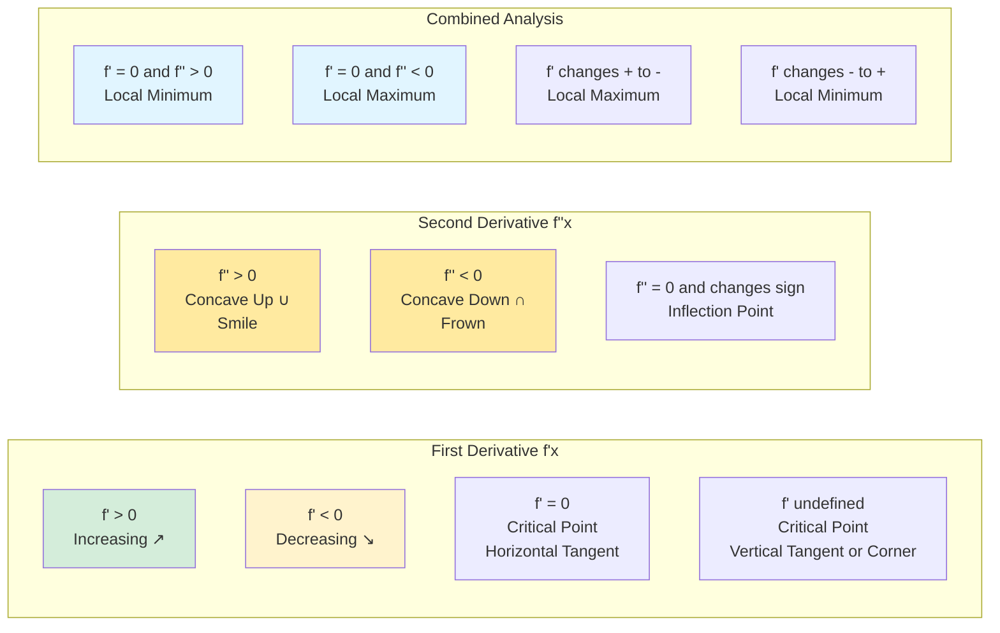

# Complete Curve Sketching

This section demonstrates the full curve sketching process through detailed examples, bringing together all the techniques.

## The Complete Checklist

1. **Domain** — Where is $f$ defined?
2. **Intercepts** — Find $(0, f(0))$ and solve $f(x) = 0$
3. **Symmetry** — Is $f$ even, odd, or periodic?
4. **Asymptotes** — Vertical, horizontal, oblique?
5. **First derivative** — $f'(x)$, critical points, increasing/decreasing intervals
6. **Second derivative** — $f''(x)$, concavity, inflection points
7. **Special points** — Calculate values at critical points, inflection points
8. **Sketch** — Plot points and connect with correct shape

## Example 1: Rational Function

**Sketch $f(x) = \frac{x^2 - 1}{x^2 - 4}$**

### 1. Domain
$x^2 - 4 = 0$ when $x = \pm 2$
Domain: $(-\infty, -2) \cup (-2, 2) \cup (2, \infty)$

### 2. Intercepts
y-intercept: $f(0) = \frac{-1}{-4} = \frac{1}{4}$ → $(0, \frac{1}{4})$

x-intercepts: $x^2 - 1 = 0$ → $x = \pm 1$ → $(-1, 0)$ and $(1, 0)$

### 3. Symmetry
$f(-x) = \frac{(-x)^2 - 1}{(-x)^2 - 4} = \frac{x^2-1}{x^2-4} = f(x)$

**Even function** — symmetric about y-axis

### 4. Asymptotes
**Vertical:** $x = -2$ and $x = 2$

Behavior near $x = 2$:
- As $x \to 2^+$: num $\to 3$, den $\to 0^+$ → $f \to +\infty$
- As $x \to 2^-$: den $\to 0^-$ → $f \to -\infty$

(By symmetry, same pattern at $x = -2$)

**Horizontal:** Degrees equal, so $y = \frac{1}{1} = 1$

### 5. First Derivative
$$f'(x) = \frac{2x(x^2-4) - (x^2-1)(2x)}{(x^2-4)^2} = \frac{2x[(x^2-4) - (x^2-1)]}{(x^2-4)^2} = \frac{2x(-3)}{(x^2-4)^2} = \frac{-6x}{(x^2-4)^2}$$

$f'(x) = 0$ when $x = 0$

Sign: denominator always positive, so sign of $f'$ = sign of $-6x$
- $x < 0$: $f' > 0$ (increasing)
- $x > 0$: $f' < 0$ (decreasing)

**Local maximum at $x = 0$:** $f(0) = \frac{1}{4}$

### 6. Second Derivative
Differentiating $f'(x) = -6x(x^2-4)^{-2}$:

$$f''(x) = -6(x^2-4)^{-2} + (-6x)(-2)(x^2-4)^{-3}(2x)$$
$$= \frac{-6}{(x^2-4)^2} + \frac{24x^2}{(x^2-4)^3} = \frac{-6(x^2-4) + 24x^2}{(x^2-4)^3}$$
$$= \frac{18x^2 + 24}{(x^2-4)^3}$$

Numerator: $18x^2 + 24 > 0$ always

Sign of $f''$ determined by $(x^2-4)^3$:
- $|x| > 2$: $x^2 - 4 > 0$ → $f'' > 0$ (concave up)
- $|x| < 2$: $x^2 - 4 < 0$ → $f'' < 0$ (concave down)

**No inflection points** (concavity only changes at vertical asymptotes)

### 7. Summary
- Domain: $x \neq \pm 2$
- y-int: $(0, \frac{1}{4})$; x-int: $(\pm 1, 0)$
- Even (y-axis symmetry)
- VA: $x = \pm 2$; HA: $y = 1$
- Local max: $(0, \frac{1}{4})$
- Concave up on $|x| > 2$; concave down on $|x| < 2$

### 8. Sketch
The graph has a maximum at $(0, \frac{1}{4})$, passes through $(\pm 1, 0)$, has vertical asymptotes at $x = \pm 2$ where it goes to $\pm\infty$, and approaches $y = 1$ as $x \to \pm\infty$.

---

## Example 2: Polynomial

**Sketch $f(x) = x^4 - 4x^3$**

### 1. Domain
All real numbers

### 2. Intercepts
y-int: $f(0) = 0$

x-int: $x^4 - 4x^3 = x^3(x-4) = 0$ → $x = 0, 4$

### 3. Symmetry
$f(-x) = x^4 + 4x^3 \neq f(x)$ and $\neq -f(x)$
**Neither even nor odd**

### 4. Asymptotes
None (polynomial)

End behavior: $x^4$ dominates → $f \to +\infty$ as $x \to \pm\infty$

### 5. First Derivative
$f'(x) = 4x^3 - 12x^2 = 4x^2(x - 3)$

Critical points: $x = 0$ and $x = 3$

Sign chart:
```
            0       3
    --------+-------+----
f'     (−)  |  (−)  | (+)
```

(Note: $4x^2 \geq 0$ always, so sign depends on $x - 3$)

- Decreasing on $(-\infty, 3)$
- Increasing on $(3, \infty)$
- Local minimum at $x = 3$: $f(3) = 81 - 108 = -27$
- $x = 0$ is NOT a local extremum (no sign change)

### 6. Second Derivative
$f''(x) = 12x^2 - 24x = 12x(x - 2)$

$f'' = 0$ at $x = 0$ and $x = 2$

Sign chart:
```
            0       2
    --------+-------+----
f''    (+)  |  (−)  | (+)
```

- Concave up: $(-\infty, 0)$ and $(2, \infty)$
- Concave down: $(0, 2)$
- Inflection points: $(0, 0)$ and $(2, f(2)) = (2, -16)$

### 7. Summary
- Intercepts: $(0, 0)$, $(4, 0)$
- Local min: $(3, -27)$
- Inflection points: $(0, 0)$, $(2, -16)$
- Decreasing on $(-\infty, 3)$, increasing on $(3, \infty)$
- Both ends go to $+\infty$

### 8. Sketch
A quartic that starts high on the left, decreases through $(0,0)$, continues down to a minimum at $(3, -27)$, then increases through $(4, 0)$ and up to $+\infty$. There's an inflection at $(2, -16)$ where concavity changes.

---

## Example 3: Function with Vertical Tangent

**Sketch $f(x) = x^{1/3}(x + 4)$**

### 1. Domain
All real numbers

### 2. Intercepts
$f(0) = 0$
$x^{1/3}(x+4) = 0$ → $x = 0$ or $x = -4$

### 3. Symmetry
Neither even nor odd

### 4. Asymptotes
None. End behavior: as $x \to \infty$, $f \to \infty$; as $x \to -\infty$, $f \to +\infty$

### 5. First Derivative
$f(x) = x^{4/3} + 4x^{1/3}$

$f'(x) = \frac{4}{3}x^{1/3} + \frac{4}{3}x^{-2/3} = \frac{4}{3}x^{-2/3}(x + 1) = \frac{4(x+1)}{3x^{2/3}}$

Critical points:
- $f'(x) = 0$ when $x = -1$
- $f'(x)$ undefined when $x = 0$ (but $f(0)$ exists)

Sign chart:
```
           −1       0
    --------+-------+----
f'     (−)  |  (+)  | (+)
```

- Decreasing on $(-\infty, -1)$
- Increasing on $(-1, 0)$ and $(0, \infty)$
- Local min at $x = -1$: $f(-1) = (-1)(3) = -3$
- Vertical tangent at $x = 0$ (since $f'(0)$ undefined)

### 6. Second Derivative
$f''(x) = \frac{4}{9}x^{-2/3} - \frac{8}{9}x^{-5/3} = \frac{4}{9}x^{-5/3}(x - 2)$

$f'' = 0$ at $x = 2$; undefined at $x = 0$

Sign chart:
```
            0       2
    --------+-------+----
f''    (+)  |  (−)  | (+)
```

- Concave up: $(-\infty, 0)$ and $(2, \infty)$
- Concave down: $(0, 2)$
- Inflection points: $(0, 0)$ and $(2, f(2)) = (2, 2^{1/3} \cdot 6) \approx (2, 7.56)$

### 7. Summary
- Intercepts: $(-4, 0)$, $(0, 0)$
- Local min: $(-1, -3)$
- Inflection: $(0, 0)$, $(2, 7.56)$
- Vertical tangent at origin

---

## Tips for Efficient Curve Sketching

1. **Start with easy parts** — domain, intercepts, symmetry
2. **Factor completely** — helps with sign analysis
3. **Use symmetry** — if function is even/odd, only analyze half
4. **Organize with tables** — critical points, intervals, concavity
5. **Plot key points first** — extrema, inflection points, intercepts
6. **Connect with correct shape** — respect increasing/decreasing and concavity
7. **Verify with reasoning** — does the sketch make sense?

## Visual Summary: Curve Behavior Chart



## Summary

- Complete curve sketching combines domain, intercepts, symmetry, asymptotes, and derivative analysis
- First derivative: increasing/decreasing, local extrema
- Second derivative: concavity, inflection points
- Each piece of information constrains the graph
- Practice with various function types builds proficiency
