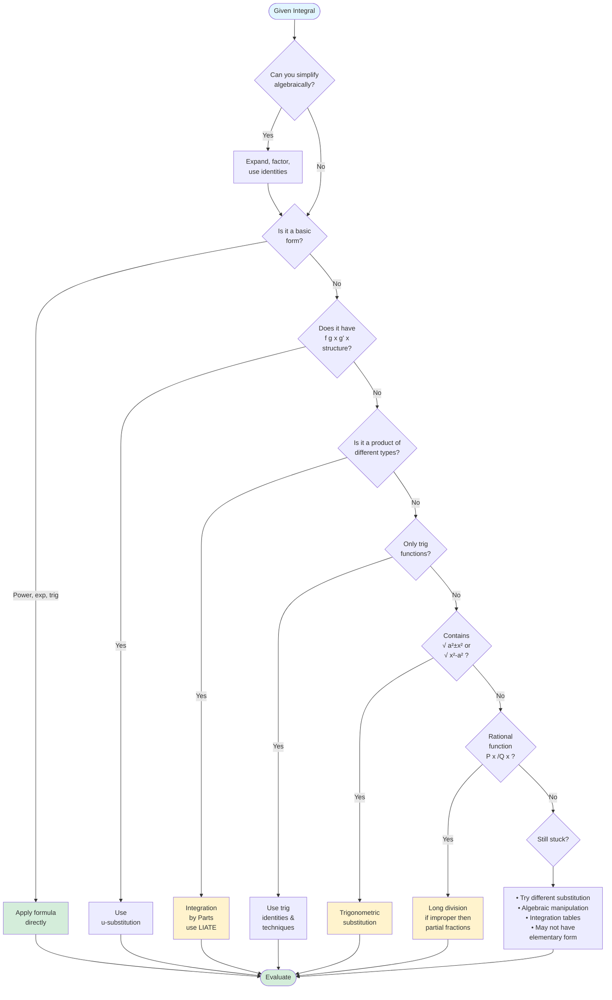

# Integration Strategy

Integration is fundamentally different from differentiation. While differentiation follows algorithmic rules that always work, integration is an art that requires pattern recognition, creativity, and strategic thinking. Given an integral, there's no guaranteed procedure that will solve it. Success depends on recognizing which technique applies, when to simplify first, and how to combine methods. This section develops the strategic mindset needed to approach integrals systematically and efficiently.

## The Fundamental Problem

Unlike differentiation, integration has no universal algorithm. Consider:

**Differentiation (algorithmic):**
- $\frac{d}{dx}[x^2 e^x] = 2x e^x + x^2 e^x$ (apply product rule)
- Always works the same way

**Integration (strategic):**
- $\int x^2 e^x \, dx$ requires integration by parts (twice)
- $\int x e^{x^2} \, dx$ requires substitution
- $\int e^{x^2} \, dx$ has no elementary antiderivative!

The difference? Pattern recognition and choosing the right technique.

## The Strategy Hierarchy

When faced with an integral, work through this decision tree:

### Level 1: Simplify First

Before applying advanced techniques, try algebraic simplification:

**Expand products:**
$$\int (x + 1)(x - 2) \, dx = \int (x^2 - x - 2) \, dx = \frac{x^3}{3} - \frac{x^2}{2} - 2x + C$$

**Split fractions:**
$$\int \frac{x^3 + 2x}{x} \, dx = \int \left(x^2 + 2\right) \, dx = \frac{x^3}{3} + 2x + C$$

**Use identities:**
$$\int (1 - \cos 2x) \, dx = x - \frac{\sin 2x}{2} + C$$

**Factor:**
$$\int \frac{x^2 - 4}{x - 2} \, dx = \int \frac{(x - 2)(x + 2)}{x - 2} \, dx = \int (x + 2) \, dx = \frac{x^2}{2} + 2x + C$$

**Key principle:** Simplification before integration often reveals trivial antiderivatives.

### Level 2: Recognition Patterns

Look for integrals that match standard forms:

**Power rule:**
$$\int x^n \, dx = \frac{x^{n+1}}{n+1} + C \quad (n \neq -1)$$

**Exponential:**
$$\int e^{ax} \, dx = \frac{1}{a}e^{ax} + C$$

**Logarithmic:**
$$\int \frac{1}{x} \, dx = \ln|x| + C$$

**Trigonometric:**
$$\int \sin x \, dx = -\cos x + C, \quad \int \cos x \, dx = \sin x + C$$

**Inverse trigonometric:**
$$\int \frac{1}{1 + x^2} \, dx = \arctan x + C$$

$$\int \frac{1}{\sqrt{1 - x^2}} \, dx = \arcsin x + C$$

### Level 3: Substitution (u-substitution)

If you see $f(g(x)) \cdot g'(x)$, try $u = g(x)$:

**Example:**
$$\int 2x \cos(x^2) \, dx$$

Recognize: $g(x) = x^2$, $g'(x) = 2x$

Substitute: $u = x^2$, $du = 2x \, dx$

$$\int \cos u \, du = \sin u + C = \sin(x^2) + C$$

**Common patterns to watch for:**
- Chain rule structure: $\int f'(g(x))g'(x) \, dx$
- Fraction where numerator is derivative of denominator: $\int \frac{f'(x)}{f(x)} \, dx = \ln|f(x)| + C$
- Composition with linear: $\int f(ax + b) \, dx = \frac{1}{a}F(ax + b) + C$

### Level 4: Integration by Parts

Use when you have a **product of different function types**:

**Trigger patterns:**
- Polynomial times exponential: $\int x e^x \, dx$
- Polynomial times trigonometric: $\int x \sin x \, dx$
- Logarithmic function: $\int \ln x \, dx = \int (\ln x)(1) \, dx$
- Inverse trig times polynomial: $\int x \arctan x \, dx$
- Exponential times trigonometric: $\int e^x \sin x \, dx$

**Remember LIATE** for choosing $u$:
- **L**ogarithmic
- **I**nverse trig
- **A**lgebraic
- **T**rigonometric
- **E**xponential

### Level 5: Trigonometric Techniques

**Powers of sine/cosine:**
- Odd power → save one factor, convert rest, substitute
- Even powers → half-angle identities

**Powers of tangent/secant:**
- $\tan^2 x = \sec^2 x - 1$
- Even power of secant → save $\sec^2 x$, substitute $u = \tan x$

**Products with different arguments:**
- Use product-to-sum formulas

### Level 6: Trigonometric Substitution

When you see **radicals** of specific forms:

| Expression | Substitution | Identity |
|------------|--------------|----------|
| $\sqrt{a^2 - x^2}$ | $x = a\sin\theta$ | $1 - \sin^2\theta = \cos^2\theta$ |
| $\sqrt{a^2 + x^2}$ | $x = a\tan\theta$ | $1 + \tan^2\theta = \sec^2\theta$ |
| $\sqrt{x^2 - a^2}$ | $x = a\sec\theta$ | $\sec^2\theta - 1 = \tan^2\theta$ |

**Example:**
$$\int \sqrt{4 - x^2} \, dx$$

Recognize $\sqrt{a^2 - x^2}$ with $a = 2$. Use $x = 2\sin\theta$.

### Level 7: Rational Functions

For $\int \frac{P(x)}{Q(x)} \, dx$:

**Step 1:** Check if proper (degree of $P$ < degree of $Q$)
- If improper, use polynomial long division

**Step 2:** Factor $Q(x)$ completely

**Step 3:** Apply partial fraction decomposition

**Step 4:** For irreducible quadratics, complete the square

## Choosing the Right Technique: Examples

### Example 1: Recognizing Substitution

**Integral:** $\int \frac{e^x}{1 + e^x} \, dx$

**Analysis:**
- Numerator $e^x$ is derivative of part of denominator
- Pattern: $\frac{f'(x)}{f(x)}$

**Solution:** Let $u = 1 + e^x$, $du = e^x \, dx$
$$\int \frac{1}{u} \, du = \ln|u| + C = \ln(1 + e^x) + C$$

### Example 2: When to Use Parts

**Integral:** $\int x \ln x \, dx$

**Analysis:**
- Product of two function types
- $\ln x$ is logarithmic (high on LIATE)
- Choose $u = \ln x$, $dv = x \, dx$

**Solution:**
- $u = \ln x$, $du = \frac{1}{x} \, dx$
- $dv = x \, dx$, $v = \frac{x^2}{2}$

$$\int x \ln x \, dx = \frac{x^2}{2}\ln x - \int \frac{x^2}{2} \cdot \frac{1}{x} \, dx$$

$$= \frac{x^2}{2}\ln x - \int \frac{x}{2} \, dx = \frac{x^2}{2}\ln x - \frac{x^2}{4} + C$$

### Example 3: Simplify vs. Technique

**Integral:** $\int \frac{\sin^2 x}{\cos x} \, dx$

**Wrong approach:** Immediately try substitution or trig substitution

**Right approach:** Simplify using $\sin^2 x = 1 - \cos^2 x$

$$\int \frac{1 - \cos^2 x}{\cos x} \, dx = \int \left(\sec x - \cos x\right) \, dx$$

$$= \ln|\sec x + \tan x| - \sin x + C$$

### Example 4: Combining Techniques

**Integral:** $\int e^{\sqrt{x}} \, dx$

**Analysis:**
- Contains $\sqrt{x}$ in exponent
- Not a standard form
- Try substitution to simplify

**Solution:** Let $u = \sqrt{x}$, so $x = u^2$, $dx = 2u \, du$

$$\int e^{\sqrt{x}} \, dx = \int e^u \cdot 2u \, du = 2\int u e^u \, du$$

Now use integration by parts:
- $v = u$, $dw = e^u \, du$
- $dv = du$, $w = e^u$

$$2\int u e^u \, du = 2(u e^u - \int e^u \, du) = 2(u e^u - e^u) + C$$

$$= 2e^u(u - 1) + C = 2e^{\sqrt{x}}(\sqrt{x} - 1) + C$$

## Decision Flowchart

Here's a systematic approach to choosing the right integration technique:

**How to use this flowchart:**

1. **Start at the top** with your given integral
2. **Work through each decision node** systematically
3. **Answer each question** based on the structure of your integrand
4. **Follow the path** to the recommended technique
5. **Apply the technique** and evaluate

## Common Strategic Mistakes

**Mistake 1: Jumping to advanced techniques too quickly**

Always simplify first. Many integrals that look complicated become trivial after algebra.

**Mistake 2: Wrong substitution choice**

If your substitution makes things worse, try a different $u$.

**Mistake 3: Forcing a technique**

Not every integral yields to every method. Be flexible.

**Mistake 4: Giving up too soon**

Integration often requires multiple attempts with different approaches.

**Mistake 5: Not verifying your answer**

Differentiate your result. Does it match the integrand?

## Practice Develops Intuition

The more integrals you solve, the faster you'll recognize patterns:

- **$\int x e^x \, dx$** → immediately think "integration by parts"
- **$\int \frac{2x}{x^2 + 1} \, dx$** → immediately think "substitution, $u = x^2 + 1$"
- **$\int \sqrt{9 - x^2} \, dx$** → immediately think "trig substitution, $x = 3\sin\theta$"

This pattern recognition comes only through practice.

## Summary

- **Simplify first** before applying advanced techniques
- **Recognize standard forms** for immediate integration
- **Look for substitution patterns** ($f(g(x))g'(x)$ structure)
- **Use integration by parts** for products (remember LIATE)
- **Apply trig techniques** for powers and products of trig functions
- **Use trig substitution** for specific radical forms
- **Handle rational functions** with long division and partial fractions
- **Combine techniques** when needed
- **Verify by differentiation** to catch errors
- **Build intuition through practice** for faster pattern recognition
