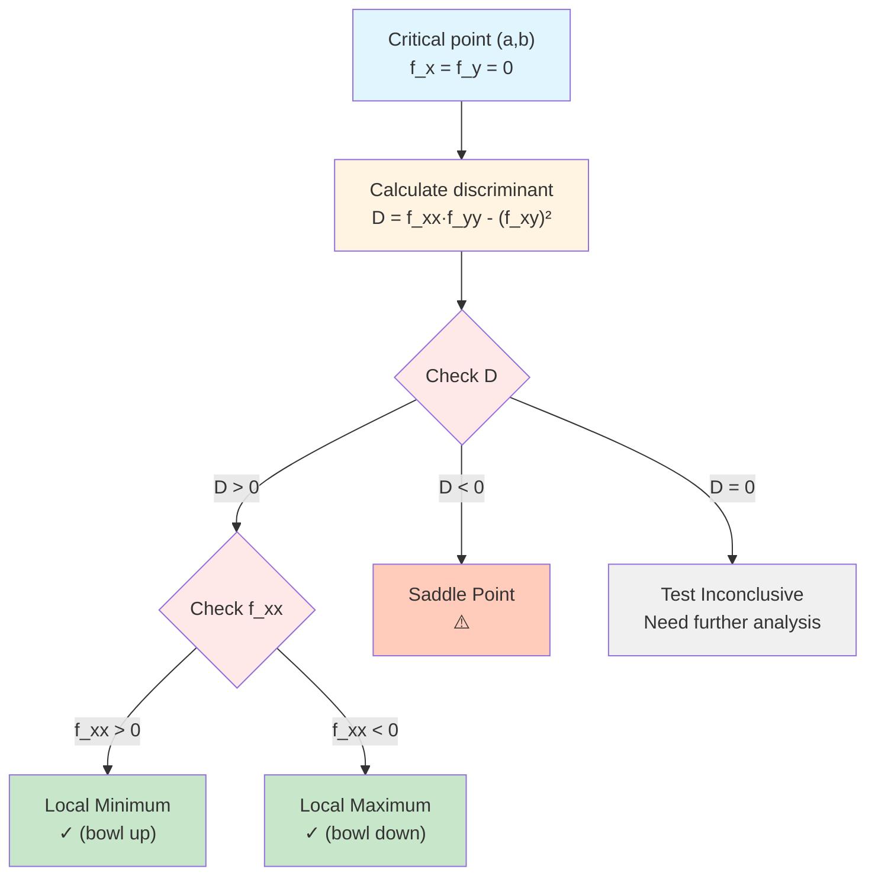

# Second Derivative Test

## Introduction

The second derivative test provides a systematic method for classifying critical points of multivariable functions. While first derivatives identify where extrema might occur (critical points), second derivatives determine whether these points are local maxima, local minima, or saddle points. The test involves computing the **Hessian matrix**, which contains all second partial derivatives, and analyzing its determinant and trace. This generalizes the single-variable second derivative test and is fundamental to optimization theory.

## Review: Single-Variable Case

For $y = f(x)$ with $f'(c) = 0$:

- If $f''(c) > 0$: local minimum (concave up)
- If $f''(c) < 0$: local maximum (concave down)
- If $f''(c) = 0$: test inconclusive

## Hessian Matrix

### Definition

For $f(x, y)$, the **Hessian matrix** at point $(a, b)$ is:

$$H = \begin{pmatrix} f_{xx} & f_{xy} \\ f_{yx} & f_{yy} \end{pmatrix}$$

evaluated at $(a, b)$.

By Clairaut's theorem (for continuous partials), $f_{xy} = f_{yx}$, so $H$ is symmetric.

### Determinant of Hessian

The **discriminant** $D$ is:

$$D = \det(H) = f_{xx}f_{yy} - (f_{xy})^2$$

This quantity determines the classification.

## Second Derivative Test

Let $(a, b)$ be a critical point of $f$ (so $f_x(a, b) = f_y(a, b) = 0$). Compute the discriminant:

$$D = f_{xx}f_{yy} - (f_{xy})^2$$

evaluated at $(a, b)$.

### Classification Flowchart

The following flowchart shows how to classify critical points using the second derivative test:

### Case 1: $D > 0$ and $f_{xx} > 0$

**Local minimum**. The surface curves upward in all directions.

### Case 2: $D > 0$ and $f_{xx} < 0$

**Local maximum**. The surface curves downward in all directions.

(Note: When $D > 0$, we have $f_{yy}$ has the same sign as $f_{xx}$, so checking either suffices.)

### Case 3: $D < 0$

**Saddle point**. The surface curves upward in some directions and downward in others.

### Case 4: $D = 0$

**Test inconclusive**. The critical point could be any type; further analysis is required.

## Examples

### Example 1: Local Minimum

$$f(x, y) = x^2 + 2y^2 - 4x + 8y + 10$$

Find and classify critical points.

$$f_x = 2x - 4 = 0 \implies x = 2$$
$$f_y = 4y + 8 = 0 \implies y = -2$$

Critical point: $(2, -2)$.

Second derivatives:

$$f_{xx} = 2, \quad f_{yy} = 4, \quad f_{xy} = 0$$

$$D = (2)(4) - 0^2 = 8 > 0$$

Since $D > 0$ and $f_{xx} = 2 > 0$, $(2, -2)$ is a **local minimum**.

### Example 2: Local Maximum

$$f(x, y) = -x^2 - y^2 + 6x - 4y$$

$$f_x = -2x + 6 = 0 \implies x = 3$$
$$f_y = -2y - 4 = 0 \implies y = -2$$

Critical point: $(3, -2)$.

$$f_{xx} = -2, \quad f_{yy} = -2, \quad f_{xy} = 0$$

$$D = (-2)(-2) - 0 = 4 > 0$$

Since $D > 0$ and $f_{xx} = -2 < 0$, $(3, -2)$ is a **local maximum**.

### Example 3: Saddle Point

$$f(x, y) = x^2 - y^2$$

$$f_x = 2x = 0 \implies x = 0$$
$$f_y = -2y = 0 \implies y = 0$$

Critical point: $(0, 0)$.

$$f_{xx} = 2, \quad f_{yy} = -2, \quad f_{xy} = 0$$

$$D = (2)(-2) - 0 = -4 < 0$$

Since $D < 0$, $(0, 0)$ is a **saddle point**.

### Example 4: Multiple Critical Points

$$f(x, y) = x^3 - 3xy + y^3$$

From Topic 4.1, critical points are $(0, 0)$ and $(1, 1)$.

$$f_{xx} = 6x, \quad f_{yy} = 6y, \quad f_{xy} = -3$$

**At $(0, 0)$**:

$$f_{xx} = 0, \quad f_{yy} = 0, \quad f_{xy} = -3$$

$$D = (0)(0) - (-3)^2 = -9 < 0$$

$(0, 0)$ is a **saddle point**.

**At $(1, 1)$**:

$$f_{xx} = 6, \quad f_{yy} = 6, \quad f_{xy} = -3$$

$$D = (6)(6) - 9 = 36 - 9 = 27 > 0$$

Since $D > 0$ and $f_{xx} = 6 > 0$, $(1, 1)$ is a **local minimum**.

### Example 5: Inconclusive Test

$$f(x, y) = x^4 + y^4$$

$$f_x = 4x^3 = 0 \implies x = 0$$
$$f_y = 4y^3 = 0 \implies y = 0$$

Critical point: $(0, 0)$.

$$f_{xx} = 12x^2, \quad f_{yy} = 12y^2, \quad f_{xy} = 0$$

At $(0, 0)$:

$$f_{xx} = 0, \quad f_{yy} = 0, \quad f_{xy} = 0$$

$$D = 0$$

The test is **inconclusive**. However, inspection shows $f(x, y) = x^4 + y^4 \ge 0 = f(0, 0)$, so $(0, 0)$ is a **global minimum**.

## Geometric Interpretation

The second derivatives measure curvature:

- $f_{xx}$: curvature in the $x$-direction
- $f_{yy}$: curvature in the $y$-direction
- $f_{xy}$: twist or mixed curvature

When $D > 0$, both principal curvatures have the same sign (both concave up or both concave down), indicating a local extremum.

When $D < 0$, the principal curvatures have opposite signs (concave up in one direction, concave down in another), indicating a saddle point.

## Connection to Eigenvalues

The classification can also be understood via eigenvalues of the Hessian matrix:

- Both eigenvalues positive: local minimum
- Both eigenvalues negative: local maximum
- Eigenvalues of opposite signs: saddle point
- At least one eigenvalue zero: inconclusive

The determinant $D$ equals the product of eigenvalues, and $f_{xx} + f_{yy}$ (trace) equals their sum.

## Three Variables

For $f(x, y, z)$, the Hessian is a $3 \times 3$ matrix:

$$H = \begin{pmatrix} f_{xx} & f_{xy} & f_{xz} \\ f_{yx} & f_{yy} & f_{yz} \\ f_{zx} & f_{zy} & f_{zz} \end{pmatrix}$$

Classification uses **Sylvester's criterion** (leading principal minors) or eigenvalue analysis.

## Applications

### Optimization in Economics

Firms maximize profit $\pi(q_1, q_2)$ where $q_1, q_2$ are quantities. The second derivative test confirms whether critical points are maxima.

### Physics: Potential Energy

Stable equilibria correspond to local minima of potential energy $U(\mathbf{x})$.

### Machine Learning

Training neural networks involves minimizing loss functions. The Hessian provides second-order information used in optimization algorithms (Newton's method, trust region methods).

## Summary Table

| Condition | $f_{xx}$ | Classification |
|-----------|----------|----------------|
| $D > 0$ | $> 0$ | Local minimum |
| $D > 0$ | $< 0$ | Local maximum |
| $D < 0$ | any | Saddle point |
| $D = 0$ | any | Inconclusive |

## Limitations

### When the Test Fails

$D = 0$ cases require:
- Higher-order derivative analysis
- Direct examination of function behavior
- Numerical methods

### Example 6: Monkey Saddle

$$f(x, y) = x^3 - 3xy^2$$

$$f_x = 3x^2 - 3y^2 = 0$$
$$f_y = -6xy = 0$$

Critical point: $(0, 0)$.

$$f_{xx} = 6x, \quad f_{yy} = -6x, \quad f_{xy} = -6y$$

At $(0, 0)$: all second partials vanish, so $D = 0$.

Examining $f$ along different rays:
- Along $y = 0$: $f = x^3$ (inflection)
- Along $x = 0$: $f = 0$ (constant)
- Along $y = x$: $f = x^3 - 3x^3 = -2x^3$ (inflection opposite direction)

$(0, 0)$ is a **monkey saddle** (named because it has three downward slopes and three upward slopes, like a saddle for a monkey with a tail).

## Summary

The second derivative test classifies critical points using the Hessian determinant $D = f_{xx}f_{yy} - (f_{xy})^2$. If $D > 0$, the critical point is a local extremum (minimum if $f_{xx} > 0$, maximum if $f_{xx} < 0$). If $D < 0$, it's a saddle point. If $D = 0$, the test is inconclusive. The Hessian matrix encodes second-order information about the surface's curvature, and its eigenvalues provide geometric insight. This test is fundamental to optimization and appears throughout economics, physics, engineering, and machine learning.
