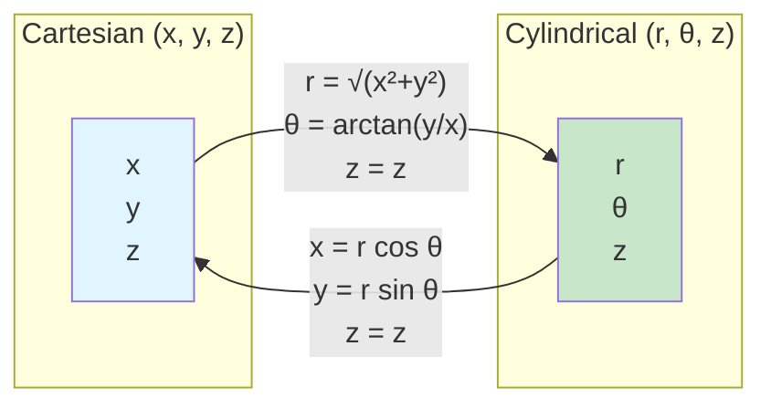
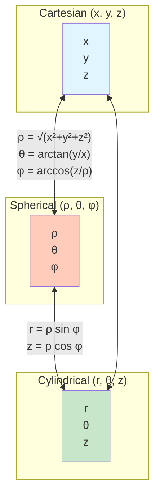
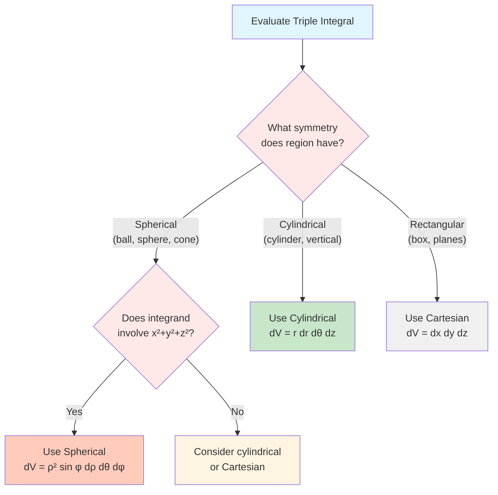

# Cylindrical and Spherical Coordinate Systems

## Introduction

Just as polar coordinates simplify double integrals over regions with circular symmetry, cylindrical and spherical coordinates provide natural frameworks for triple integrals over three-dimensional regions with cylindrical or spherical symmetry. These coordinate systems align with the geometry of many physical problems, from electromagnetic fields to gravitational potentials.

## Cylindrical Coordinates

**Cylindrical coordinates** extend polar coordinates to three dimensions by adding a height component. A point is specified by $(r, \theta, z)$ where:
- $r \geq 0$ is the distance from the $z$-axis (radius in the $xy$-plane)
- $\theta$ is the angle from the positive $x$-axis (measured counterclockwise in the $xy$-plane)
- $z$ is the height (same as in Cartesian coordinates)

### Conversion Formulas

**From cylindrical to Cartesian:**
$$x = r\cos\theta, \quad y = r\sin\theta, \quad z = z$$

**From Cartesian to cylindrical:**
$$r = \sqrt{x^2 + y^2}, \quad \theta = \arctan(y/x), \quad z = z$$

### Volume Element in Cylindrical Coordinates

The volume element in cylindrical coordinates is:

$$dV = r \, dr \, d\theta \, dz$$

This can be understood geometrically: a small cylindrical wedge with dimensions $\Delta r$, $r\Delta\theta$, and $\Delta z$ has volume approximately $r \Delta r \Delta\theta \Delta z$.

### Triple Integrals in Cylindrical Coordinates

For a region $E$ in cylindrical coordinates:

$$\iiint_E f(x, y, z) \, dV = \iiint_E F(r, \theta, z) \cdot r \, dr \, d\theta \, dz$$

where $F(r, \theta, z) = f(r\cos\theta, r\sin\theta, z)$.

### Example 1: Cylinder

Find the volume of the cylinder $x^2 + y^2 \leq 4$, $0 \leq z \leq 5$.

**Solution:**

In cylindrical coordinates: $0 \leq r \leq 2$, $0 \leq \theta \leq 2\pi$, $0 \leq z \leq 5$.

$$\text{Volume} = \int_0^{2\pi} \int_0^2 \int_0^5 r \, dz \, dr \, d\theta$$

$$= \int_0^{2\pi} \int_0^2 5r \, dr \, d\theta = \int_0^{2\pi} \left[\frac{5r^2}{2}\right]_0^2 d\theta$$

$$= \int_0^{2\pi} 10 \, d\theta = 20\pi$$

This confirms the familiar formula $V = \pi r^2 h = \pi(4)(5) = 20\pi$.

### Example 2: Paraboloid

Evaluate $\iiint_E z \, dV$ where $E$ is the region bounded by $z = x^2 + y^2$ and $z = 4$.

**Solution:**

In cylindrical coordinates: $z = r^2$ and the top is $z = 4$.

The paraboloid and plane intersect where $r^2 = 4$, so $r = 2$.

The region: $0 \leq r \leq 2$, $0 \leq \theta \leq 2\pi$, $r^2 \leq z \leq 4$.

$$\iiint_E z \, dV = \int_0^{2\pi} \int_0^2 \int_{r^2}^4 z \cdot r \, dz \, dr \, d\theta$$

Inner integral:
$$\int_{r^2}^4 zr \, dz = r\left[\frac{z^2}{2}\right]_{r^2}^4 = \frac{r}{2}(16 - r^4)$$

Middle integral:
$$\int_0^2 \frac{r}{2}(16 - r^4) \, dr = \frac{1}{2}\int_0^2 (16r - r^5) \, dr$$

$$= \frac{1}{2}\left[8r^2 - \frac{r^6}{6}\right]_0^2 = \frac{1}{2}\left(32 - \frac{64}{6}\right) = \frac{1}{2} \cdot \frac{128}{6} = \frac{32}{3}$$

Outer integral:
$$\int_0^{2\pi} \frac{32}{3} \, d\theta = \frac{64\pi}{3}$$

### Example 3: Mass with Variable Density

Find the mass of a solid cylinder of radius $a$ and height $h$ if the density at any point is proportional to the distance from the axis, $\rho(r, \theta, z) = kr$.

**Solution:**

$$m = \int_0^{2\pi} \int_0^a \int_0^h kr \cdot r \, dz \, dr \, d\theta = \int_0^{2\pi} \int_0^a \int_0^h kr^2 \, dz \, dr \, d\theta$$

$$= \int_0^{2\pi} \int_0^a khr^2 \, dr \, d\theta = \int_0^{2\pi} \left[\frac{khr^3}{3}\right]_0^a d\theta$$

$$= \int_0^{2\pi} \frac{kha^3}{3} \, d\theta = \frac{2\pi kha^3}{3}$$

## Spherical Coordinates

**Spherical coordinates** specify a point by $(\rho, \theta, \phi)$ where:
- $\rho \geq 0$ is the distance from the origin
- $\theta$ is the same angle as in cylindrical coordinates (azimuthal angle)
- $\phi$ is the angle down from the positive $z$-axis (polar angle), with $0 \leq \phi \leq \pi$

Note: Some texts use $\phi$ for the azimuthal angle and $\theta$ for the polar angle. Always check conventions.

### Conversion Formulas

**From spherical to Cartesian:**
$$x = \rho\sin\phi\cos\theta, \quad y = \rho\sin\phi\sin\theta, \quad z = \rho\cos\phi$$

**From Cartesian to spherical:**
$$\rho = \sqrt{x^2 + y^2 + z^2}, \quad \theta = \arctan(y/x), \quad \phi = \arccos(z/\rho)$$

**Relationship with cylindrical:**
$$r = \rho\sin\phi, \quad z = \rho\cos\phi$$

### Volume Element in Spherical Coordinates

The volume element in spherical coordinates is:

$$dV = \rho^2 \sin\phi \, d\rho \, d\theta \, d\phi$$

This formula comes from the Jacobian of the transformation (which we'll study in detail later). Geometrically, a small spherical wedge has approximate dimensions:
- Radial: $\Delta\rho$
- Azimuthal arc: $\rho\sin\phi \, \Delta\theta$
- Polar arc: $\rho \, \Delta\phi$

Volume: $\Delta V \approx \Delta\rho \cdot (\rho\sin\phi \, \Delta\theta) \cdot (\rho \, \Delta\phi) = \rho^2\sin\phi \, \Delta\rho \, \Delta\theta \, \Delta\phi$.

### Triple Integrals in Spherical Coordinates

For a region $E$ in spherical coordinates:

$$\iiint_E f(x, y, z) \, dV = \iiint_E F(\rho, \theta, \phi) \cdot \rho^2\sin\phi \, d\rho \, d\theta \, d\phi$$

where $F(\rho, \theta, \phi) = f(\rho\sin\phi\cos\theta, \rho\sin\phi\sin\theta, \rho\cos\phi)$.

### Example 4: Sphere

Find the volume of a sphere of radius $a$.

**Solution:**

In spherical coordinates: $0 \leq \rho \leq a$, $0 \leq \theta \leq 2\pi$, $0 \leq \phi \leq \pi$.

$$\text{Volume} = \int_0^{2\pi} \int_0^\pi \int_0^a \rho^2\sin\phi \, d\rho \, d\phi \, d\theta$$

Innermost integral:
$$\int_0^a \rho^2 \, d\rho = \left[\frac{\rho^3}{3}\right]_0^a = \frac{a^3}{3}$$

Middle integral:
$$\int_0^\pi \frac{a^3}{3}\sin\phi \, d\phi = \frac{a^3}{3}[-\cos\phi]_0^\pi = \frac{a^3}{3}[1 - (-1)] = \frac{2a^3}{3}$$

Outer integral:
$$\int_0^{2\pi} \frac{2a^3}{3} \, d\theta = \frac{4\pi a^3}{3}$$

This confirms the familiar formula for the volume of a sphere.

### Example 5: Hemispherical Shell

Find the mass of a hemispherical shell of inner radius $a$, outer radius $b$, with constant density $\rho_0$.

**Solution:**

The region: $a \leq \rho \leq b$, $0 \leq \theta \leq 2\pi$, $0 \leq \phi \leq \pi/2$ (upper hemisphere).

$$m = \int_0^{2\pi} \int_0^{\pi/2} \int_a^b \rho_0 \cdot \rho^2\sin\phi \, d\rho \, d\phi \, d\theta$$

$$= \rho_0 \int_0^{2\pi} d\theta \int_0^{\pi/2} \sin\phi \, d\phi \int_a^b \rho^2 \, d\rho$$

$$= \rho_0 \cdot (2\pi) \cdot [-\cos\phi]_0^{\pi/2} \cdot \left[\frac{\rho^3}{3}\right]_a^b$$

$$= \rho_0 \cdot 2\pi \cdot 1 \cdot \frac{b^3 - a^3}{3} = \frac{2\pi\rho_0(b^3 - a^3)}{3}$$

### Example 6: Function with Radial Symmetry

Evaluate $\iiint_E e^{-(x^2+y^2+z^2)^{3/2}} \, dV$ where $E$ is the ball $x^2 + y^2 + z^2 \leq 1$.

**Solution:**

In spherical coordinates: $x^2 + y^2 + z^2 = \rho^2$, so the integrand becomes $e^{-\rho^3}$.

The region: $0 \leq \rho \leq 1$, $0 \leq \theta \leq 2\pi$, $0 \leq \phi \leq \pi$.

$$\iiint_E e^{-\rho^3} \, dV = \int_0^{2\pi} \int_0^\pi \int_0^1 e^{-\rho^3} \rho^2\sin\phi \, d\rho \, d\phi \, d\theta$$

Since the integrand factors:

$$= \left[\int_0^{2\pi} d\theta\right]\left[\int_0^\pi \sin\phi \, d\phi\right]\left[\int_0^1 \rho^2 e^{-\rho^3} \, d\rho\right]$$

$$= (2\pi) \cdot (2) \cdot \left[-\frac{1}{3}e^{-\rho^3}\right]_0^1 = 4\pi \cdot \frac{1 - e^{-1}}{3} = \frac{4\pi(1 - e^{-1})}{3}$$

## When to Use Each Coordinate System

The choice of coordinate system dramatically affects computational difficulty. Use this decision guide:

### Use Cartesian Coordinates When:
- The region has flat boundaries parallel to coordinate planes
- No particular symmetry exists

### Use Cylindrical Coordinates When:
- The region has circular symmetry about the $z$-axis
- Boundaries are cylinders, cones (with vertical axes), or planes
- Examples: cylinders, pipes, vertical cones

### Use Spherical Coordinates When:
- The region has spherical symmetry about the origin
- Boundaries are spheres or cones (through the origin)
- The integrand involves $x^2 + y^2 + z^2$
- Examples: balls, spherical shells, ice cream cones

### Example 7: Cone

Find the volume of the cone $z = \sqrt{x^2 + y^2}$ below $z = h$.

**Cylindrical coordinates:** $z = r$, giving $0 \leq r \leq z \leq h$... this gets messy.

Better description: $0 \leq z \leq h$, $0 \leq r \leq z$, $0 \leq \theta \leq 2\pi$.

$$V = \int_0^{2\pi} \int_0^h \int_0^z r \, dr \, dz \, d\theta = \int_0^{2\pi} \int_0^h \frac{z^2}{2} \, dz \, d\theta$$

$$= \int_0^{2\pi} \frac{h^3}{6} \, d\theta = \frac{\pi h^3}{3}$$

**Spherical coordinates:** The cone $z = \sqrt{x^2 + y^2}$ means $\rho\cos\phi = \rho\sin\phi$, so $\phi = \pi/4$.

Region: $0 \leq \rho \leq h/\cos\phi = h\sqrt{2}$... actually this is more complex because we need $z \leq h$.

For this cone, cylindrical is more natural!

## Conclusion

Cylindrical and spherical coordinates provide powerful alternatives to Cartesian coordinates for evaluating triple integrals. The key is recognizing the symmetry of the region and choosing the coordinate system that best aligns with that symmetry. The volume elements $r \, dr \, d\theta \, dz$ and $\rho^2\sin\phi \, d\rho \, d\theta \, d\phi$ are essential formulas that account for the geometry of these coordinate systems. In the next section, we study the general theory of change of variables, which explains where these volume elements come from and allows us to create custom coordinate systems for any problem.
