# Curl and Divergence

## Introduction

The **curl** and **divergence** are two fundamental differential operators that act on vector fields. While the gradient operates on scalar fields to produce vector fields, curl and divergence operate on vector fields. The curl measures the rotation or circulation of a field, while the divergence measures the expansion or compression. These operators are central to the major theorems of vector calculus and have profound physical interpretations in fluid dynamics, electromagnetism, and other areas of physics.

### Vector Calculus Operators Overview

```mermaid
graph TD
    Scalar["Scalar Field f(x,y,z)"] -->|"Gradient ∇f"| VectorField["Vector Field F(x,y,z)"]
    VectorField -->|"Divergence ∇·F"| ScalarOut["Scalar Field<br/>(source/sink strength)"]
    VectorField -->|"Curl ∇×F"| VectorOut["Vector Field<br/>(rotation axis)"]

    style Scalar fill:#e1f5ff
    style VectorField fill:#c8e6c9
    style ScalarOut fill:#fff4e1
    style VectorOut fill:#ffccbc
```

## Divergence

### Definition

The **divergence** of a vector field $\mathbf{F} = \langle P, Q, R \rangle$ is a scalar function defined by:

$$\text{div } \mathbf{F} = \nabla \cdot \mathbf{F} = \frac{\partial P}{\partial x} + \frac{\partial Q}{\partial y} + \frac{\partial R}{\partial z}$$

The notation $\nabla \cdot \mathbf{F}$ uses the dot product of the del operator $\nabla = \left\langle \frac{\partial}{\partial x}, \frac{\partial}{\partial y}, \frac{\partial}{\partial z} \right\rangle$ with $\mathbf{F}$.

### Two Dimensions

In two dimensions, for $\mathbf{F} = \langle P, Q \rangle$:

$$\text{div } \mathbf{F} = \frac{\partial P}{\partial x} + \frac{\partial Q}{\partial y}$$

### Physical Interpretation

The divergence at a point measures the **rate of expansion** or **source strength** at that point:

- **$\nabla \cdot \mathbf{F} > 0$**: The field is diverging (expanding) at the point; a **source**
- **$\nabla \cdot \mathbf{F} < 0$**: The field is converging (compressing) at the point; a **sink**
- **$\nabla \cdot \mathbf{F} = 0$**: No net expansion or compression; the field is **incompressible** or **divergence-free**

#### Fluid Flow Interpretation

If $\mathbf{F}$ represents the velocity field of a fluid:
- Positive divergence: fluid is being created (source) or expanding
- Negative divergence: fluid is being destroyed (sink) or compressing
- Zero divergence: incompressible flow (constant density)

The divergence measures the net outward flux per unit volume at a point.

### Examples of Divergence

#### Example 1: Radial Field

For $\mathbf{F}(x, y, z) = \langle x, y, z \rangle$:

$$\text{div } \mathbf{F} = \frac{\partial x}{\partial x} + \frac{\partial y}{\partial y} + \frac{\partial z}{\partial z} = 1 + 1 + 1 = 3$$

This field uniformly expands in all directions with divergence 3 everywhere.

#### Example 2: Rotation Field

For $\mathbf{F}(x, y) = \langle -y, x \rangle$:

$$\text{div } \mathbf{F} = \frac{\partial(-y)}{\partial x} + \frac{\partial x}{\partial y} = 0 + 0 = 0$$

This rotational field has zero divergence—it's incompressible.

#### Example 3: Inverse Square Field

For $\mathbf{F}(x, y, z) = \frac{\langle x, y, z \rangle}{(x^2 + y^2 + z^2)^{3/2}}$ (like a gravitational or electric field):

After calculation (using the quotient rule):

$$\text{div } \mathbf{F} = 0 \quad \text{(for } (x,y,z) \neq (0,0,0)\text{)}$$

This is a fundamental property of inverse square law fields.

#### Example 4: Computing Divergence

Find $\nabla \cdot \mathbf{F}$ where $\mathbf{F}(x, y, z) = \langle xy^2, yz^2, zx^2 \rangle$.

**Solution:**

$$\nabla \cdot \mathbf{F} = \frac{\partial(xy^2)}{\partial x} + \frac{\partial(yz^2)}{\partial y} + \frac{\partial(zx^2)}{\partial z}$$

$$= y^2 + z^2 + x^2$$

## Curl

### Definition

The **curl** of a vector field $\mathbf{F} = \langle P, Q, R \rangle$ is a vector field defined by:

$$\text{curl } \mathbf{F} = \nabla \times \mathbf{F} = \begin{vmatrix} \mathbf{i} & \mathbf{j} & \mathbf{k} \\ \frac{\partial}{\partial x} & \frac{\partial}{\partial y} & \frac{\partial}{\partial z} \\ P & Q & R \end{vmatrix}$$

Expanding the determinant:

$$\text{curl } \mathbf{F} = \left\langle \frac{\partial R}{\partial y} - \frac{\partial Q}{\partial z}, \frac{\partial P}{\partial z} - \frac{\partial R}{\partial x}, \frac{\partial Q}{\partial x} - \frac{\partial P}{\partial y} \right\rangle$$

### Two Dimensions

In two dimensions, for $\mathbf{F} = \langle P, Q, 0 \rangle$:

$$\text{curl } \mathbf{F} = \left\langle 0, 0, \frac{\partial Q}{\partial x} - \frac{\partial P}{\partial y} \right\rangle$$

The scalar $\frac{\partial Q}{\partial x} - \frac{\partial P}{\partial y}$ is sometimes called the **scalar curl** or **2D curl**.

### Physical Interpretation

The curl measures the **rotation** or **circulation** of a vector field:

- **$\nabla \times \mathbf{F} \neq \mathbf{0}$**: The field has rotational component; there is **circulation**
- **$\nabla \times \mathbf{F} = \mathbf{0}$**: The field is **irrotational** (no local rotation)

The direction of the curl vector indicates the axis of rotation (by the right-hand rule), and its magnitude indicates the strength of rotation.

#### Fluid Flow Interpretation

If $\mathbf{F}$ is the velocity field of a fluid:
- Nonzero curl: the fluid is rotating (has **vorticity**)
- Zero curl: irrotational flow

If you placed a tiny paddle wheel in the fluid, the curl indicates whether and how fast it would spin.

### Examples of Curl

#### Example 5: Rotation Field

For $\mathbf{F}(x, y) = \langle -y, x, 0 \rangle$:

$$\text{curl } \mathbf{F} = \begin{vmatrix} \mathbf{i} & \mathbf{j} & \mathbf{k} \\ \frac{\partial}{\partial x} & \frac{\partial}{\partial y} & \frac{\partial}{\partial z} \\ -y & x & 0 \end{vmatrix}$$

$$= \left\langle 0, 0, \frac{\partial x}{\partial x} - \frac{\partial(-y)}{\partial y} \right\rangle = \langle 0, 0, 1 - (-1) \rangle = \langle 0, 0, 2 \rangle$$

This field rotates counterclockwise around the $z$-axis with curl pointing in the $+z$ direction.

#### Example 6: Radial Field

For $\mathbf{F}(x, y, z) = \langle x, y, z \rangle$:

$$\text{curl } \mathbf{F} = \left\langle \frac{\partial z}{\partial y} - \frac{\partial y}{\partial z}, \frac{\partial x}{\partial z} - \frac{\partial z}{\partial x}, \frac{\partial y}{\partial x} - \frac{\partial x}{\partial y} \right\rangle = \langle 0, 0, 0 \rangle$$

The radial field has no rotation.

#### Example 7: Gradient Field

For any scalar function $f$, $\mathbf{F} = \nabla f$ is a gradient field. We showed earlier that:

$$\text{curl}(\nabla f) = \nabla \times (\nabla f) = \mathbf{0}$$

This is always true: **gradient fields are irrotational**.

#### Example 8: Computing Curl

Find $\nabla \times \mathbf{F}$ where $\mathbf{F}(x, y, z) = \langle yz, xz, xy \rangle$.

**Solution:**

$$\text{curl } \mathbf{F} = \begin{vmatrix} \mathbf{i} & \mathbf{j} & \mathbf{k} \\ \frac{\partial}{\partial x} & \frac{\partial}{\partial y} & \frac{\partial}{\partial z} \\ yz & xz & xy \end{vmatrix}$$

$$= \mathbf{i}\left(\frac{\partial(xy)}{\partial y} - \frac{\partial(xz)}{\partial z}\right) - \mathbf{j}\left(\frac{\partial(xy)}{\partial x} - \frac{\partial(yz)}{\partial z}\right) + \mathbf{k}\left(\frac{\partial(xz)}{\partial x} - \frac{\partial(yz)}{\partial y}\right)$$

$$= \mathbf{i}(x - x) - \mathbf{j}(y - y) + \mathbf{k}(z - z) = \langle 0, 0, 0 \rangle$$

Since the curl is zero, $\mathbf{F}$ is conservative. Indeed, $\mathbf{F} = \nabla(xyz)$.

## Important Identities

### Fundamental Vector Calculus Identities

These two identities are cornerstones of vector calculus:

```mermaid
graph TD
    Scalar["Scalar Function f"] -->|"∇f<br/>(gradient)"| Grad["Vector Field ∇f"]
    Grad -->|"∇×(∇f)<br/>(curl)"| Zero1["𝟎<br/>(zero vector)"]

    Vector["Vector Field F"] -->|"∇×F<br/>(curl)"| Curl["Vector Field ∇×F"]
    Curl -->|"∇·(∇×F)<br/>(divergence)"| Zero2["0<br/>(zero scalar)"]

    style Scalar fill:#e1f5ff
    style Grad fill:#c8e6c9
    style Zero1 fill:#ffccbc
    style Vector fill:#c8e6c9
    style Curl fill:#ffccbc
    style Zero2 fill:#ffe8e8
```

### Curl of a Gradient

For any scalar function $f$ with continuous second partial derivatives:

$$\nabla \times (\nabla f) = \mathbf{0}$$

**Consequence:** If $\mathbf{F} = \nabla f$, then $\mathbf{F}$ is irrotational (curl-free).

### Divergence of a Curl

For any vector field $\mathbf{F}$ with continuous second partial derivatives:

$$\nabla \cdot (\nabla \times \mathbf{F}) = 0$$

**Consequence:** The divergence of any curl is always zero.

### Laplacian

The **Laplacian** of a scalar function $f$ is:

$$\nabla^2 f = \nabla \cdot (\nabla f) = \frac{\partial^2 f}{\partial x^2} + \frac{\partial^2 f}{\partial y^2} + \frac{\partial^2 f}{\partial z^2}$$

This appears in the heat equation, wave equation, and Laplace's equation.

### Vector Identities

Several useful identities involve curl and divergence:

1. $\nabla \times (f\mathbf{F}) = f(\nabla \times \mathbf{F}) + (\nabla f) \times \mathbf{F}$

2. $\nabla \cdot (f\mathbf{F}) = f(\nabla \cdot \mathbf{F}) + \mathbf{F} \cdot (\nabla f)$

3. $\nabla \times (\mathbf{F} \times \mathbf{G}) = \mathbf{F}(\nabla \cdot \mathbf{G}) - \mathbf{G}(\nabla \cdot \mathbf{F}) + (\mathbf{G} \cdot \nabla)\mathbf{F} - (\mathbf{F} \cdot \nabla)\mathbf{G}$

## Applications in Physics

### Electromagnetism (Maxwell's Equations)

Maxwell's equations in differential form use div and curl:

1. **Gauss's law**: $\nabla \cdot \mathbf{E} = \frac{\rho}{\epsilon_0}$
2. **No magnetic monopoles**: $\nabla \cdot \mathbf{B} = 0$
3. **Faraday's law**: $\nabla \times \mathbf{E} = -\frac{\partial \mathbf{B}}{\partial t}$
4. **Ampère-Maxwell law**: $\nabla \times \mathbf{B} = \mu_0\mathbf{J} + \mu_0\epsilon_0\frac{\partial \mathbf{E}}{\partial t}$

### Fluid Dynamics

- **Continuity equation**: $\nabla \cdot \mathbf{v} = 0$ for incompressible flow
- **Vorticity**: $\boldsymbol{\omega} = \nabla \times \mathbf{v}$ measures fluid rotation

### Heat Flow

- **Heat equation**: $\frac{\partial T}{\partial t} = k\nabla^2 T$

## Visualization

### Divergence Visualization

Imagine drawing small boxes around each point:
- Positive divergence: net flow outward from the box (source)
- Negative divergence: net flow inward to the box (sink)
- Zero divergence: equal flow in and out

### Curl Visualization

Imagine placing a small paddle wheel at each point:
- Nonzero curl: the wheel rotates
- Zero curl: the wheel doesn't rotate (even if there's flow)

The curl measures rotation, not just circulation around a path.

## Computing Examples

### Example 9: Divergence and Curl Together

For $\mathbf{F}(x, y, z) = \langle x^2y, y^2z, z^2x \rangle$, find $\nabla \cdot \mathbf{F}$ and $\nabla \times \mathbf{F}$.

**Divergence:**
$$\nabla \cdot \mathbf{F} = \frac{\partial(x^2y)}{\partial x} + \frac{\partial(y^2z)}{\partial y} + \frac{\partial(z^2x)}{\partial z} = 2xy + 2yz + 2zx$$

**Curl:**
$$\nabla \times \mathbf{F} = \begin{vmatrix} \mathbf{i} & \mathbf{j} & \mathbf{k} \\ \frac{\partial}{\partial x} & \frac{\partial}{\partial y} & \frac{\partial}{\partial z} \\ x^2y & y^2z & z^2x \end{vmatrix}$$

$$= \mathbf{i}(y^2 - y^2) - \mathbf{j}(z^2 - 0) + \mathbf{k}(0 - x^2) = \langle 0, -z^2, -x^2 \rangle$$

## Conclusion

Divergence and curl are fundamental differential operators on vector fields. Divergence measures expansion/compression and produces a scalar, while curl measures rotation and produces a vector. These operators satisfy important identities (curl of gradient is zero, divergence of curl is zero) and appear throughout physics in Maxwell's equations, fluid dynamics, and other areas. They are also central to the major theorems of vector calculus—Green's Theorem, Stokes' Theorem, and the Divergence Theorem—which we explore in the following sections.
