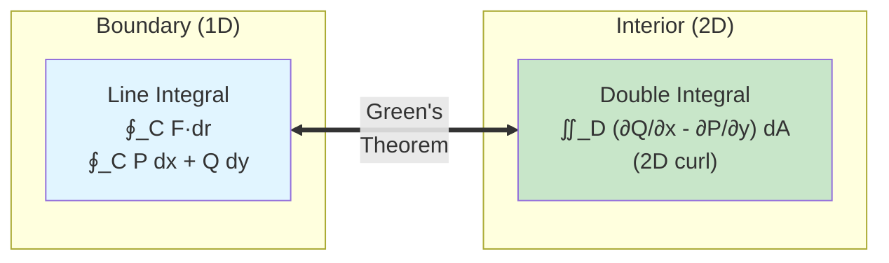

# Green's Theorem

## Introduction

Green's Theorem is one of the fundamental theorems of vector calculus, establishing a profound relationship between line integrals around closed curves in the plane and double integrals over the regions they enclose. Named after the British mathematician George Green, this theorem provides a powerful tool for converting between different types of integrals and has important applications in physics, particularly in fluid dynamics and electromagnetism.

## Statement of Green's Theorem

Let $C$ be a positively oriented (counterclockwise), piecewise smooth, simple closed curve in the plane, and let $D$ be the region bounded by $C$. If $P$ and $Q$ have continuous partial derivatives on an open region containing $D$, then:

$$\oint_C P \, dx + Q \, dy = \iint_D \left(\frac{\partial Q}{\partial x} - \frac{\partial P}{\partial y}\right) dA$$

Equivalently, for a vector field $\mathbf{F} = \langle P, Q \rangle$:

$$\oint_C \mathbf{F} \cdot d\mathbf{r} = \iint_D \left(\frac{\partial Q}{\partial x} - \frac{\partial P}{\partial y}\right) dA$$

### Visual Relationship

Green's Theorem connects a line integral around a boundary to a double integral over the interior:

### Key Features

- **Left side**: Line integral around the boundary (circulation)
- **Right side**: Double integral over the interior region
- The quantity $\frac{\partial Q}{\partial x} - \frac{\partial P}{\partial y}$ is the 2D curl (or scalar curl)

### Positive Orientation

A curve is **positively oriented** if it's traversed counterclockwise, so that the region $D$ is always on the left as you walk along the curve.

## Geometric Interpretation

Green's Theorem states that the circulation around the boundary of a region equals the total "rotation" (curl) inside the region. This connects a one-dimensional quantity (line integral) with a two-dimensional quantity (double integral).

## Proof Outline

We'll sketch the proof for a simple region that is both Type I and Type II.

### For a Type I Region

Suppose $D = \{(x, y) \mid a \leq x \leq b, g_1(x) \leq y \leq g_2(x)\}$.

Consider the integral $\iint_D -\frac{\partial P}{\partial y} \, dA$:

$$\iint_D -\frac{\partial P}{\partial y} \, dA = \int_a^b \int_{g_1(x)}^{g_2(x)} -\frac{\partial P}{\partial y} \, dy \, dx$$

$$= \int_a^b \left[-P(x, y)\right]_{g_1(x)}^{g_2(x)} dx = \int_a^b [P(x, g_1(x)) - P(x, g_2(x))] \, dx$$

The boundary consists of:
- Bottom curve $C_1$: $y = g_1(x)$, $a \leq x \leq b$ (left to right)
- Top curve $C_2$: $y = g_2(x)$, $a \leq x \leq b$ (right to left for positive orientation)

$$\int_{C_1} P \, dx = \int_a^b P(x, g_1(x)) \, dx$$

$$\int_{C_2} P \, dx = -\int_a^b P(x, g_2(x)) \, dx$$ (negative due to direction)

Therefore: $\iint_D -\frac{\partial P}{\partial y} \, dA = \oint_C P \, dx$.

Similarly, for a Type II region: $\iint_D \frac{\partial Q}{\partial x} \, dA = \oint_C Q \, dy$.

Combining these results gives Green's Theorem.

## Examples

### Example 1: Verifying Green's Theorem

Verify Green's Theorem for $\mathbf{F} = \langle x + y, x - y \rangle$ where $C$ is the square with vertices $(0, 0)$, $(1, 0)$, $(1, 1)$, $(0, 1)$, traversed counterclockwise.

**Solution:**

$P = x + y$, $Q = x - y$.

**Line integral:** We compute $\oint_C (x+y) \, dx + (x-y) \, dy$ along each edge.

- **Bottom** ($y = 0$, $0 \leq x \leq 1$): $(x+0)dx + (x-0) \cdot 0 = x \, dx$, integral = $\frac{1}{2}$
- **Right** ($x = 1$, $0 \leq y \leq 1$): $(1+y) \cdot 0 + (1-y)dy = (1-y)dy$, integral = $\frac{1}{2}$
- **Top** ($y = 1$, $1 \geq x \geq 0$): $(x+1)(-dx) + (x-1) \cdot 0 = -(x+1)dx$, integral = $-\frac{3}{2}$
- **Left** ($x = 0$, $1 \geq y \geq 0$): $(0+y) \cdot 0 + (0-y)(-dy) = y \, dy$, integral = $\frac{1}{2}$

Total: $\frac{1}{2} + \frac{1}{2} - \frac{3}{2} + \frac{1}{2} = 0$

**Double integral:**

$$\frac{\partial Q}{\partial x} - \frac{\partial P}{\partial y} = \frac{\partial(x-y)}{\partial x} - \frac{\partial(x+y)}{\partial y} = 1 - 1 = 0$$

$$\iint_D 0 \, dA = 0$$

Both give 0, verifying Green's Theorem.

### Example 2: Computing a Line Integral Using Green's Theorem

Evaluate $\oint_C (y^2 \, dx + x^2 \, dy)$ where $C$ is the circle $x^2 + y^2 = R^2$ traversed counterclockwise.

**Solution:**

Using Green's Theorem with $P = y^2$, $Q = x^2$:

$$\frac{\partial Q}{\partial x} - \frac{\partial P}{\partial y} = 2x - 2y$$

$$\oint_C (y^2 \, dx + x^2 \, dy) = \iint_D (2x - 2y) \, dA$$

The region $D$ is the disk $x^2 + y^2 \leq R^2$. By symmetry, $\iint_D x \, dA = 0$ and $\iint_D y \, dA = 0$.

Therefore: $\oint_C (y^2 \, dx + x^2 \, dy) = 0$.

### Example 3: Finding Work Done

Find the work done by $\mathbf{F} = \langle x^2 + y, x + y^2 \rangle$ in moving a particle counterclockwise around the triangle with vertices $(0, 0)$, $(2, 0)$, $(0, 2)$.

**Solution:**

$P = x^2 + y$, $Q = x + y^2$.

$$\frac{\partial Q}{\partial x} - \frac{\partial P}{\partial y} = 1 - 1 = 0$$

By Green's Theorem: $\oint_C \mathbf{F} \cdot d\mathbf{r} = \iint_D 0 \, dA = 0$.

The work is zero! This makes sense because $\mathbf{F}$ is conservative (the curl is zero).

### Example 4: Area Using Green's Theorem

Use Green's Theorem to find the area enclosed by the ellipse $\frac{x^2}{a^2} + \frac{y^2}{b^2} = 1$.

**Solution:**

The area can be expressed as:

$$\text{Area}(D) = \iint_D 1 \, dA$$

By Green's Theorem, if we choose $P$ and $Q$ such that $\frac{\partial Q}{\partial x} - \frac{\partial P}{\partial y} = 1$, then:

$$\text{Area}(D) = \oint_C P \, dx + Q \, dy$$

A convenient choice is $P = 0$, $Q = x$ (or $P = -y$, $Q = 0$, or $P = -y/2$, $Q = x/2$).

Using $P = 0$, $Q = x$:

$$\text{Area}(D) = \oint_C x \, dy$$

Parametrize the ellipse: $x = a\cos t$, $y = b\sin t$, $0 \leq t \leq 2\pi$.

$$dy = b\cos t \, dt$$

$$\text{Area} = \int_0^{2\pi} (a\cos t)(b\cos t) \, dt = ab\int_0^{2\pi} \cos^2 t \, dt = ab \cdot \pi = \pi ab$$

This confirms the familiar formula for the area of an ellipse.

## Applications

### Circulation and Curl

Green's Theorem relates circulation (line integral) to curl (double integral):

$$\text{Circulation} = \oint_C \mathbf{F} \cdot d\mathbf{r} = \iint_D (\nabla \times \mathbf{F})_z \, dA$$

where $(\nabla \times \mathbf{F})_z = \frac{\partial Q}{\partial x} - \frac{\partial P}{\partial y}$ is the $z$-component of the curl.

### Flux Form of Green's Theorem

There's an alternative form for flux:

$$\oint_C \mathbf{F} \cdot \mathbf{n} \, ds = \iint_D \nabla \cdot \mathbf{F} \, dA$$

where $\mathbf{n}$ is the outward unit normal to $C$.

For $\mathbf{F} = \langle P, Q \rangle$:

$$\oint_C P \, dy - Q \, dx = \iint_D \left(\frac{\partial P}{\partial x} + \frac{\partial Q}{\partial y}\right) dA$$

This relates flux through the boundary to divergence in the interior.

### Example 5: Flux Across a Curve

Find the flux of $\mathbf{F} = \langle x^2, y^2 \rangle$ outward across the circle $x^2 + y^2 = 1$.

**Solution:**

Using the flux form of Green's Theorem:

$$\nabla \cdot \mathbf{F} = \frac{\partial(x^2)}{\partial x} + \frac{\partial(y^2)}{\partial y} = 2x + 2y$$

$$\text{Flux} = \iint_D (2x + 2y) \, dA$$

By symmetry over the unit disk: $\iint_D x \, dA = 0$ and $\iint_D y \, dA = 0$.

Therefore: Flux = $0$.

## Regions with Holes

Green's Theorem extends to regions with holes. If $D$ is bounded by an outer curve $C_1$ and inner curves $C_2, \ldots, C_n$ (all positively oriented, meaning counterclockwise for outer, clockwise for inner):

$$\oint_{C_1} \mathbf{F} \cdot d\mathbf{r} + \oint_{C_2} \mathbf{F} \cdot d\mathbf{r} + \cdots + \oint_{C_n} \mathbf{F} \cdot d\mathbf{r} = \iint_D \left(\frac{\partial Q}{\partial x} - \frac{\partial P}{\partial y}\right) dA$$

The inner curves are traversed clockwise to maintain the region on the left.

### Example 6: Annular Region

For $\mathbf{F} = \frac{1}{x^2+y^2}\langle -y, x \rangle$ (undefined at the origin), compute $\oint_C \mathbf{F} \cdot d\mathbf{r}$ where $C$ is the circle $x^2 + y^2 = R^2$ traversed counterclockwise.

**Solution:**

One can verify that $\nabla \times \mathbf{F} = 0$ for $(x, y) \neq (0, 0)$.

If we try to apply Green's Theorem directly over the disk, we encounter a problem: $\mathbf{F}$ is undefined at the origin.

Instead, consider an annular region between two circles of radii $r$ and $R$ (with $r < R$). Green's Theorem gives:

$$\oint_{C_R} \mathbf{F} \cdot d\mathbf{r} - \oint_{C_r} \mathbf{F} \cdot d\mathbf{r} = \iint_{\text{annulus}} 0 \, dA = 0$$

Therefore: $\oint_{C_R} \mathbf{F} \cdot d\mathbf{r} = \oint_{C_r} \mathbf{F} \cdot d\mathbf{r}$ for any $r$ and $R$.

Direct computation on the circle of radius $R$ gives $2\pi$, so the circulation is $2\pi$ around any circle centered at the origin.

## Relationship to Conservative Fields

Green's Theorem provides another perspective on conservative fields:

A vector field $\mathbf{F} = \langle P, Q \rangle$ is conservative in a simply connected region if and only if $\frac{\partial Q}{\partial x} = \frac{\partial P}{\partial y}$ everywhere.

By Green's Theorem, this condition ensures $\oint_C \mathbf{F} \cdot d\mathbf{r} = 0$ for all closed curves $C$ in the region.

## Conclusion

Green's Theorem establishes a fundamental connection between line integrals around closed curves and double integrals over the enclosed regions. It provides a powerful computational tool, allowing us to convert difficult line integrals into (often simpler) double integrals, and vice versa. The theorem also deepens our understanding of circulation and flux, relating these boundary quantities to interior properties (curl and divergence). Green's Theorem is a special case of the more general Stokes' Theorem, which extends this relationship to three dimensions.
