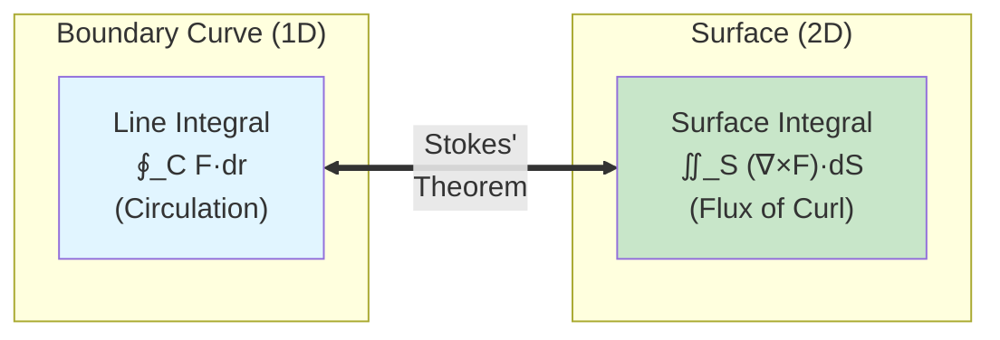
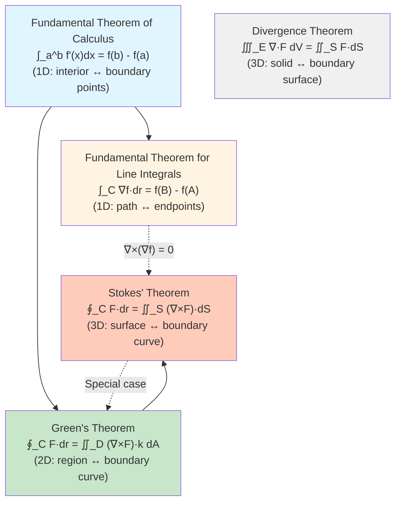

# Stokes' Theorem

## Introduction

Stokes' Theorem is a profound generalization of Green's Theorem to three dimensions. While Green's Theorem relates a line integral around a planar curve to a double integral over the enclosed region, Stokes' Theorem relates a line integral around the boundary of a surface in three-dimensional space to a surface integral over that surface. Named after Sir George Gabriel Stokes, this theorem is fundamental in physics, particularly in electromagnetism and fluid dynamics.

## Statement of Stokes' Theorem

Let $S$ be an oriented, piecewise smooth surface bounded by a simple, closed, piecewise smooth boundary curve $C$ with positive orientation. Let $\mathbf{F}$ be a vector field whose components have continuous partial derivatives on an open region containing $S$. Then:

$$\oint_C \mathbf{F} \cdot d\mathbf{r} = \iint_S (\nabla \times \mathbf{F}) \cdot d\mathbf{S}$$

or equivalently:

$$\oint_C \mathbf{F} \cdot d\mathbf{r} = \iint_S (\nabla \times \mathbf{F}) \cdot \mathbf{n} \, dS$$

### Visual Relationship

Stokes' Theorem connects a line integral around a boundary curve to a surface integral over the enclosed surface:

### Key Components

- **Left side**: Line integral of $\mathbf{F}$ around the boundary curve $C$ (circulation)
- **Right side**: Surface integral of the curl of $\mathbf{F}$ over $S$ (flux of curl)
- The curve $C$ is oriented according to the right-hand rule: if your thumb points in the direction of the normal $\mathbf{n}$, your fingers curl in the direction of $C$

### Orientation Convention

The positive orientation of $C$ relative to $S$ follows the **right-hand rule**: if you point your right thumb in the direction of the normal vector $\mathbf{n}$ to $S$, your fingers curl in the positive direction around $C$.

## Relationship to Green's Theorem

Green's Theorem is a special case of Stokes' Theorem. If $S$ is a flat region in the $xy$-plane with $\mathbf{n} = \mathbf{k}$ (upward normal), and $\mathbf{F} = \langle P, Q, 0 \rangle$:

$$\nabla \times \mathbf{F} = \left\langle 0, 0, \frac{\partial Q}{\partial x} - \frac{\partial P}{\partial y} \right\rangle$$

$$\iint_S (\nabla \times \mathbf{F}) \cdot \mathbf{n} \, dS = \iint_S \left(\frac{\partial Q}{\partial x} - \frac{\partial P}{\partial y}\right) dA$$

which is exactly Green's Theorem.

## Geometric Interpretation

Stokes' Theorem states that the circulation of $\mathbf{F}$ around the boundary of a surface equals the total "rotation" (curl) across the surface. The curl measures the infinitesimal circulation per unit area, and integrating over the surface sums all these contributions.

## Examples

### Example 1: Verifying Stokes' Theorem

Verify Stokes' Theorem for $\mathbf{F} = \langle -y, x, 0 \rangle$ where $S$ is the paraboloid $z = 1 - x^2 - y^2$ with $z \geq 0$, oriented upward.

**Solution:**

The boundary curve $C$ is the circle $x^2 + y^2 = 1$ in the plane $z = 0$.

**Line integral:**

Parametrize $C$: $\mathbf{r}(t) = \langle \cos t, \sin t, 0 \rangle$, $0 \leq t \leq 2\pi$.

$$\mathbf{r}'(t) = \langle -\sin t, \cos t, 0 \rangle$$

$$\mathbf{F}(\mathbf{r}(t)) = \langle -\sin t, \cos t, 0 \rangle$$

$$\mathbf{F} \cdot \mathbf{r}'(t) = \sin^2 t + \cos^2 t = 1$$

$$\oint_C \mathbf{F} \cdot d\mathbf{r} = \int_0^{2\pi} 1 \, dt = 2\pi$$

**Surface integral:**

$$\nabla \times \mathbf{F} = \begin{vmatrix} \mathbf{i} & \mathbf{j} & \mathbf{k} \\ \frac{\partial}{\partial x} & \frac{\partial}{\partial y} & \frac{\partial}{\partial z} \\ -y & x & 0 \end{vmatrix} = \langle 0, 0, 2 \rangle$$

For the paraboloid $z = g(x, y) = 1 - x^2 - y^2$:

$$\mathbf{r}_x \times \mathbf{r}_y = \langle -g_x, -g_y, 1 \rangle = \langle 2x, 2y, 1 \rangle$$ (upward)

$$(\nabla \times \mathbf{F}) \cdot (\mathbf{r}_x \times \mathbf{r}_y) = \langle 0, 0, 2 \rangle \cdot \langle 2x, 2y, 1 \rangle = 2$$

$$\iint_S (\nabla \times \mathbf{F}) \cdot d\mathbf{S} = \iint_D 2 \, dA = 2 \cdot \text{Area of unit disk} = 2\pi$$

Both give $2\pi$, verifying Stokes' Theorem.

### Example 2: Computing Using Stokes' Theorem

Evaluate $\oint_C \mathbf{F} \cdot d\mathbf{r}$ where $\mathbf{F} = \langle yz, xz, xy \rangle$ and $C$ is the intersection of the cylinder $x^2 + y^2 = 1$ and the plane $x + y + z = 1$, oriented counterclockwise when viewed from above.

**Solution:**

This line integral would be tedious to compute directly. Instead, use Stokes' Theorem with a convenient surface.

Choose $S$ to be the portion of the plane $x + y + z = 1$ inside the cylinder $x^2 + y^2 = 1$.

Compute the curl:

$$\nabla \times \mathbf{F} = \begin{vmatrix} \mathbf{i} & \mathbf{j} & \mathbf{k} \\ \frac{\partial}{\partial x} & \frac{\partial}{\partial y} & \frac{\partial}{\partial z} \\ yz & xz & xy \end{vmatrix} = \langle x - x, y - y, z - z \rangle = \langle 0, 0, 0 \rangle$$

Since $\nabla \times \mathbf{F} = \mathbf{0}$:

$$\oint_C \mathbf{F} \cdot d\mathbf{r} = \iint_S \mathbf{0} \cdot d\mathbf{S} = 0$$

The field $\mathbf{F}$ is conservative (indeed, $\mathbf{F} = \nabla(xyz)$), so the circulation is zero.

### Example 3: Different Surfaces, Same Boundary

Let $C$ be the circle $x^2 + y^2 = 4$ in the plane $z = 0$, and let $\mathbf{F} = \langle z, x, y \rangle$. Compute $\oint_C \mathbf{F} \cdot d\mathbf{r}$ using two different surfaces.

**Solution:**

**Surface 1:** The disk $S_1$ in the plane $z = 0$.

$$\nabla \times \mathbf{F} = \begin{vmatrix} \mathbf{i} & \mathbf{j} & \mathbf{k} \\ \frac{\partial}{\partial x} & \frac{\partial}{\partial y} & \frac{\partial}{\partial z} \\ z & x & y \end{vmatrix} = \langle 1, 1, 1 \rangle$$

For the disk, $\mathbf{n} = \langle 0, 0, 1 \rangle$ (upward).

$$(\nabla \times \mathbf{F}) \cdot \mathbf{n} = \langle 1, 1, 1 \rangle \cdot \langle 0, 0, 1 \rangle = 1$$

$$\oint_C \mathbf{F} \cdot d\mathbf{r} = \iint_{S_1} 1 \, dA = \text{Area of disk} = 4\pi$$

**Surface 2:** The hemisphere $S_2$ given by $z = \sqrt{4 - x^2 - y^2}$ (upper half of sphere of radius 2).

The computation is more complex, but Stokes' Theorem guarantees the same answer: $4\pi$.

This illustrates that the line integral depends only on the boundary, not on which surface we choose!

### Example 4: Computing a Difficult Circulation

Evaluate $\oint_C (y \, dx + z \, dy + x \, dz)$ where $C$ is the triangle with vertices $(1, 0, 0)$, $(0, 1, 0)$, $(0, 0, 1)$, oriented counterclockwise when viewed from the origin.

**Solution:**

Let $\mathbf{F} = \langle y, z, x \rangle$.

$$\nabla \times \mathbf{F} = \begin{vmatrix} \mathbf{i} & \mathbf{j} & \mathbf{k} \\ \frac{\partial}{\partial x} & \frac{\partial}{\partial y} & \frac{\partial}{\partial z} \\ y & z & x \end{vmatrix} = \langle -1, -1, -1 \rangle$$

The triangle lies in the plane $x + y + z = 1$, which has normal $\mathbf{n} = \frac{1}{\sqrt{3}}\langle 1, 1, 1 \rangle$ (outward from origin).

$$(\nabla \times \mathbf{F}) \cdot \mathbf{n} = \langle -1, -1, -1 \rangle \cdot \frac{1}{\sqrt{3}}\langle 1, 1, 1 \rangle = -\frac{3}{\sqrt{3}} = -\sqrt{3}$$

The area of the triangle (equilateral with side length $\sqrt{2}$) is $\frac{\sqrt{3}}{2}$.

$$\oint_C \mathbf{F} \cdot d\mathbf{r} = -\sqrt{3} \cdot \frac{\sqrt{3}}{2} = -\frac{3}{2}$$

## Applications

### Circulation and Vorticity

In fluid dynamics, if $\mathbf{v}$ is the velocity field, then $\nabla \times \mathbf{v}$ is the **vorticity**. Stokes' Theorem relates circulation around a curve to the total vorticity flux through any surface bounded by that curve:

$$\text{Circulation} = \oint_C \mathbf{v} \cdot d\mathbf{r} = \iint_S (\nabla \times \mathbf{v}) \cdot d\mathbf{S}$$

### Faraday's Law (Electromagnetism)

Faraday's law of electromagnetic induction can be stated using Stokes' Theorem:

$$\oint_C \mathbf{E} \cdot d\mathbf{r} = -\frac{d}{dt}\iint_S \mathbf{B} \cdot d\mathbf{S}$$

In differential form: $\nabla \times \mathbf{E} = -\frac{\partial \mathbf{B}}{\partial t}$.

Stokes' Theorem connects the line integral form to the curl form.

### Ampère's Law

Similarly, Ampère's law (in the static case):

$$\oint_C \mathbf{B} \cdot d\mathbf{r} = \mu_0 I_{\text{enc}}$$

can be related to the curl via Stokes' Theorem, leading to the differential form $\nabla \times \mathbf{B} = \mu_0 \mathbf{J}$.

## Independence of Surface

A key consequence of Stokes' Theorem: if two surfaces $S_1$ and $S_2$ have the same boundary curve $C$, then:

$$\iint_{S_1} (\nabla \times \mathbf{F}) \cdot d\mathbf{S} = \iint_{S_2} (\nabla \times \mathbf{F}) \cdot d\mathbf{S}$$

This is because both equal $\oint_C \mathbf{F} \cdot d\mathbf{r}$.

This property is useful for choosing the most convenient surface for computation.

## Conservative Fields Revisited

If $\mathbf{F}$ is conservative (i.e., $\mathbf{F} = \nabla f$), then $\nabla \times \mathbf{F} = \mathbf{0}$, and Stokes' Theorem gives:

$$\oint_C \mathbf{F} \cdot d\mathbf{r} = \iint_S \mathbf{0} \cdot d\mathbf{S} = 0$$

for any closed curve $C$ and surface $S$ bounded by $C$. This provides another proof that line integrals of conservative fields around closed paths are zero.

## Proof Sketch

The proof of Stokes' Theorem involves:
1. Approximating the surface $S$ by small patches
2. Applying Green's Theorem to each patch
3. Summing the contributions (interior edges cancel)
4. Taking a limit as the patches become infinitesimal

The detailed proof is quite technical and beyond our scope, but the idea mirrors the proof of Green's Theorem extended to curved surfaces.

## Relation to Other Theorems

Stokes' Theorem is part of a family of fundamental theorems that all share a common theme: relating an integral over a region to an integral over its boundary.

**Key Insight**: All these theorems relate an integral over a region to an integral over its boundary. The dimension of the boundary is always one less than the dimension of the region.

## Conclusion

Stokes' Theorem is a powerful generalization of Green's Theorem to three-dimensional surfaces, relating circulation around a boundary curve to the flux of curl through the surface. This theorem provides both a computational tool (allowing us to choose convenient surfaces) and deep theoretical insights into the relationship between local properties (curl) and global properties (circulation). It's fundamental in physics, connecting integral and differential forms of important laws in electromagnetism and fluid dynamics. Together with the Divergence Theorem, Stokes' Theorem completes the fundamental theorems of vector calculus.
