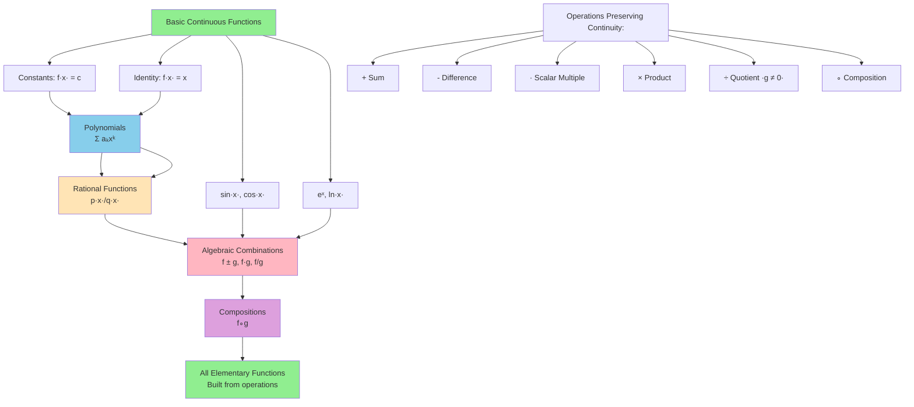

# Properties of Continuous Functions

## Introduction

One of the most powerful aspects of continuity is that continuous functions are closed under various algebraic operations and compositions. This means that we can build complex continuous functions from simpler ones without needing to verify continuity from scratch each time. These structural properties dramatically simplify the analysis of functions: once we establish that polynomials, trigonometric functions, and exponentials are continuous, we immediately know that any algebraic combination or composition of them is also continuous. Beyond algebraic properties, continuous functions on compact sets enjoy remarkable preservation theorems—they are bounded, attain their extreme values, and are uniformly continuous. These results, which are among the crown jewels of real analysis, reveal deep connections between continuity, topology, and the structure of the real numbers.

## Algebraic Properties

The following theorem shows that continuity is preserved under the standard arithmetic operations:

**Theorem 3.1 (Algebraic Properties of Continuity):** Let $f, g: D \to \mathbb{R}$ be functions that are continuous at $c \in D$, and let $k \in \mathbb{R}$ be a constant. Then:

1. **Sum:** $f + g$ is continuous at $c$
2. **Difference:** $f - g$ is continuous at $c$
3. **Scalar multiple:** $kf$ is continuous at $c$
4. **Product:** $fg$ is continuous at $c$
5. **Quotient:** $f/g$ is continuous at $c$ (provided $g(c) \neq 0$)

**Proof:** We prove each part using the sequential criterion for continuity.

**(1) Sum:** Let $(x_n)$ be any sequence in $D$ converging to $c$. Since $f$ and $g$ are continuous at $c$:
$$
f(x_n) \to f(c) \quad \text{and} \quad g(x_n) \to g(c)
$$

By the sum rule for sequences:
$$
(f + g)(x_n) = f(x_n) + g(x_n) \to f(c) + g(c) = (f + g)(c)
$$

Therefore $f + g$ is continuous at $c$.

**(2) Difference:** Similar to (1), using the difference rule for sequences.

**(3) Scalar multiple:** Let $(x_n)$ be any sequence in $D$ converging to $c$. Then:
$$
(kf)(x_n) = k \cdot f(x_n) \to k \cdot f(c) = (kf)(c)
$$

**(4) Product:** Let $(x_n)$ be any sequence in $D$ converging to $c$. By the product rule for sequences:
$$
(fg)(x_n) = f(x_n) \cdot g(x_n) \to f(c) \cdot g(c) = (fg)(c)
$$

**(5) Quotient:** Since $g(c) \neq 0$ and $g$ is continuous at $c$, there exists an open interval around $c$ where $g(x) \neq 0$. Let $(x_n)$ be a sequence in $D$ converging to $c$. For sufficiently large $n$, $g(x_n) \neq 0$, and by the quotient rule for sequences:
$$
\left(\frac{f}{g}\right)(x_n) = \frac{f(x_n)}{g(x_n)} \to \frac{f(c)}{g(c)} = \left(\frac{f}{g}\right)(c)
$$

**Alternative Proof Using Epsilon-Delta:** We prove (4) as an example.

Let $\epsilon > 0$. We need to find $\delta > 0$ such that $|x - c| < \delta$ implies $|f(x)g(x) - f(c)g(c)| < \epsilon$.

Add and subtract $f(x)g(c)$:
$$
|f(x)g(x) - f(c)g(c)| = |f(x)g(x) - f(x)g(c) + f(x)g(c) - f(c)g(c)|
$$
$$
\leq |f(x)||g(x) - g(c)| + |g(c)||f(x) - f(c)|
$$

Since $f$ is continuous at $c$, it is bounded near $c$: there exists $\delta_1 > 0$ and $M > 0$ such that $|x - c| < \delta_1$ implies $|f(x)| < M$.

Since $g$ is continuous at $c$, there exists $\delta_2 > 0$ such that $|x - c| < \delta_2$ implies $|g(x) - g(c)| < \frac{\epsilon}{2M}$.

Since $f$ is continuous at $c$, there exists $\delta_3 > 0$ such that $|x - c| < \delta_3$ implies $|f(x) - f(c)| < \frac{\epsilon}{2(|g(c)| + 1)}$.

Choose $\delta = \min\{\delta_1, \delta_2, \delta_3\}$. Then if $|x - c| < \delta$:
$$
|f(x)g(x) - f(c)g(c)| \leq M \cdot \frac{\epsilon}{2M} + (|g(c)| + 1) \cdot \frac{\epsilon}{2(|g(c)| + 1)} = \frac{\epsilon}{2} + \frac{\epsilon}{2} = \epsilon
$$

**Corollary 3.1:** Every polynomial $p(x) = a_nx^n + a_{n-1}x^{n-1} + \cdots + a_1x + a_0$ is continuous on $\mathbb{R}$.

**Proof:** The constant functions and $f(x) = x$ are continuous. By repeated application of Theorem 3.1(3) and (4), each monomial $a_kx^k$ is continuous. By repeated application of Theorem 3.1(1), the sum is continuous.

**Corollary 3.2:** Every rational function $r(x) = \frac{p(x)}{q(x)}$ is continuous on its domain $\{x : q(x) \neq 0\}$.

**Proof:** By Corollary 3.1 and Theorem 3.1(5).

### Building Continuous Functions

The following diagram shows how we can construct complex continuous functions from basic building blocks:

**Key principle**: Start with basic continuous functions, then use algebraic operations and composition to build more complex continuous functions. Each step preserves continuity!

## Worked Examples

**Example 3.1:** Determine where $f(x) = \frac{x^2 + 3x - 4}{x^2 - 1}$ is continuous.

**Solution:** The numerator $p(x) = x^2 + 3x - 4$ and denominator $q(x) = x^2 - 1$ are both polynomials, hence continuous everywhere.

The function $f$ is continuous wherever $q(x) \neq 0$, i.e., where $x^2 \neq 1$.

Therefore $f$ is continuous on $\mathbb{R} \setminus \{-1, 1\}$.

**Example 3.2:** Show that $f(x) = x^2\sin(x)$ is continuous on $\mathbb{R}$.

**Solution:** The function $g(x) = x^2$ is a polynomial, hence continuous. The function $h(x) = \sin(x)$ is continuous on $\mathbb{R}$. By Theorem 3.1(4), their product $f(x) = g(x)h(x)$ is continuous.

**Example 3.3:** Determine where $f(x) = \sqrt{x^2 - 4}$ is continuous.

**Solution:** The function $g(x) = x^2 - 4$ is a polynomial, hence continuous on $\mathbb{R}$. The function $h(y) = \sqrt{y}$ is continuous on $[0, \infty)$.

By the composition theorem (Theorem 3.3 below), $f(x) = h(g(x))$ is continuous wherever $g(x) \geq 0$, i.e., where $x^2 \geq 4$.

Therefore $f$ is continuous on $(-\infty, -2] \cup [2, \infty)$.

## Composition of Continuous Functions

**Theorem 3.3 (Continuity of Compositions):** Let $g: D \to \mathbb{R}$ be continuous at $c \in D$, and let $f: E \to \mathbb{R}$ be continuous at $g(c)$, where $g(D) \subseteq E$. Then $f \circ g$ is continuous at $c$.

**Proof:** Let $(x_n)$ be any sequence in $D$ converging to $c$. Since $g$ is continuous at $c$:
$$
g(x_n) \to g(c)
$$

Since $f$ is continuous at $g(c)$ and $g(x_n) \to g(c)$:
$$
f(g(x_n)) \to f(g(c))
$$

Therefore $(f \circ g)(x_n) \to (f \circ g)(c)$, showing that $f \circ g$ is continuous at $c$.

**Corollary 3.3:** If $g$ is continuous on $D$ and $f$ is continuous on $g(D)$, then $f \circ g$ is continuous on $D$.

**Example 3.4:** Show that $f(x) = e^{x^2 + 1}$ is continuous on $\mathbb{R}$.

**Solution:** Let $g(x) = x^2 + 1$ (polynomial, continuous on $\mathbb{R}$) and $h(y) = e^y$ (exponential, continuous on $\mathbb{R}$).

Then $f(x) = h(g(x))$ is continuous by Theorem 3.3.

**Example 3.5:** Show that $f(x) = \cos^3(x)$ is continuous on $\mathbb{R}$.

**Solution:** Let $g(x) = \cos(x)$ and $h(y) = y^3$. Both are continuous on $\mathbb{R}$, so $f(x) = h(g(x))$ is continuous by Theorem 3.3.

## Maximum and Minimum Functions

**Theorem 3.4:** If $f$ and $g$ are continuous at $c$, then so are $\max\{f, g\}$ and $\min\{f, g\}$.

**Proof:** We use the identities:
$$
\max\{f, g\} = \frac{f + g + |f - g|}{2}
$$
$$
\min\{f, g\} = \frac{f + g - |f - g|}{2}
$$

Since $f$ and $g$ are continuous at $c$, so is $f - g$ (by Theorem 3.1). We need to show $|f - g|$ is continuous.

**Lemma 3.1:** If $f$ is continuous at $c$, then $|f|$ is continuous at $c$.

**Proof of Lemma:** Let $(x_n)$ converge to $c$. Since $f$ is continuous, $f(x_n) \to f(c)$.

By the reverse triangle inequality, $||a| - |b|| \leq |a - b|$ for all $a, b$, we have:
$$
||f(x_n)| - |f(c)|| \leq |f(x_n) - f(c)| \to 0
$$

Therefore $|f(x_n)| \to |f(c)|$, proving $|f|$ is continuous at $c$.

Now, since $f - g$ is continuous, so is $|f - g|$ by the lemma. Therefore $\max\{f, g\}$ and $\min\{f, g\}$ are continuous by Theorem 3.1.

**Example 3.6:** The function $f(x) = \max\{x, x^2\}$ is continuous on $\mathbb{R}$.

## Boundedness Theorem

We now turn to global properties of continuous functions on closed, bounded intervals.

**Theorem 3.5 (Boundedness Theorem):** If $f: [a, b] \to \mathbb{R}$ is continuous, then $f$ is bounded on $[a, b]$.

That is, there exists $M > 0$ such that $|f(x)| \leq M$ for all $x \in [a, b]$.

**Proof:** Suppose, for contradiction, that $f$ is unbounded. Then for each $n \in \mathbb{N}$, there exists $x_n \in [a, b]$ such that $|f(x_n)| > n$.

By the Bolzano-Weierstrass Theorem, the sequence $(x_n)$ has a convergent subsequence $(x_{n_k})$ converging to some $c \in [a, b]$ (since $[a, b]$ is closed and bounded).

Since $f$ is continuous at $c$ and $x_{n_k} \to c$, we have $f(x_{n_k}) \to f(c)$ by the sequential criterion.

But this means $(f(x_{n_k}))$ is a convergent sequence, hence bounded. This contradicts the fact that $|f(x_{n_k})| > n_k \to \infty$.

Therefore $f$ must be bounded.

**Example 3.7:** The continuity and closedness hypotheses are both necessary:

- $f(x) = \frac{1}{x}$ on $(0, 1]$ is continuous but unbounded (interval not closed)
- $f(x) = \begin{cases} x & \text{if } x \in [0, 1) \\ 2 & \text{if } x = 1 \end{cases}$ on $[0, 1]$ is bounded but the bound comes from the discontinuity
- $f(x) = x$ on $[0, \infty)$ is continuous but unbounded (interval not bounded)

## Extreme Value Theorem

**Theorem 3.6 (Extreme Value Theorem - EVT):** If $f: [a, b] \to \mathbb{R}$ is continuous, then $f$ attains both its maximum and minimum values on $[a, b]$.

That is, there exist $c, d \in [a, b]$ such that:
$$
f(c) \leq f(x) \leq f(d) \quad \text{for all } x \in [a, b]
$$

**Proof:** We prove that $f$ attains its maximum; the proof for the minimum is similar.

By Theorem 3.5, $f$ is bounded, so $M = \sup\{f(x) : x \in [a, b]\}$ exists and is finite.

By the approximation property of supremum, for each $n \in \mathbb{N}$, there exists $x_n \in [a, b]$ such that:
$$
M - \frac{1}{n} < f(x_n) \leq M
$$

By the Bolzano-Weierstrass Theorem, $(x_n)$ has a convergent subsequence $(x_{n_k})$ with $x_{n_k} \to d$ for some $d \in [a, b]$.

Since $f$ is continuous at $d$:
$$
f(d) = \lim_{k \to \infty} f(x_{n_k})
$$

But $M - \frac{1}{n_k} < f(x_{n_k}) \leq M$ and $\frac{1}{n_k} \to 0$, so by the squeeze theorem:
$$
f(d) = M
$$

Therefore $f$ attains its maximum at $d \in [a, b]$.

**Example 3.8:** Find the maximum and minimum of $f(x) = x^3 - 3x$ on $[-2, 2]$.

**Solution:** By the EVT, maximum and minimum exist. Critical points occur where $f'(x) = 3x^2 - 3 = 0$, giving $x = \pm 1$.

Evaluate:
- $f(-2) = -8 + 6 = -2$
- $f(-1) = -1 + 3 = 2$
- $f(1) = 1 - 3 = -2$
- $f(2) = 8 - 6 = 2$

Maximum value: $2$ (attained at $x = -1$ and $x = 2$)
Minimum value: $-2$ (attained at $x = -2$ and $x = 1$)

## Preservation of Intervals

**Theorem 3.7 (Preservation of Intervals):** If $f: I \to \mathbb{R}$ is continuous where $I$ is an interval, then $f(I)$ is also an interval.

**Proof:** We show that if $y_1, y_2 \in f(I)$ with $y_1 < y_2$, then every $y \in (y_1, y_2)$ is also in $f(I)$.

Since $y_1, y_2 \in f(I)$, there exist $x_1, x_2 \in I$ with $f(x_1) = y_1$ and $f(x_2) = y_2$.

Without loss of generality, assume $x_1 < x_2$. Then $[x_1, x_2] \subseteq I$ (since $I$ is an interval).

By the Intermediate Value Theorem (proven in the next section), for any $y \in (y_1, y_2)$, there exists $c \in (x_1, x_2) \subseteq I$ with $f(c) = y$.

Therefore $y \in f(I)$, proving that $f(I)$ is an interval.

**Example 3.9:** The image of $f(x) = x^2$ on $[-1, 2]$ is $[0, 4]$, which is an interval.

The image of $f(x) = x^2$ on $[-1, 0) \cup (0, 1]$ is $(0, 1]$, which is an interval.

## Uniform Continuity on Compact Sets

**Theorem 3.8 (Uniform Continuity Theorem):** If $f: [a, b] \to \mathbb{R}$ is continuous, then $f$ is uniformly continuous on $[a, b]$.

This important result will be proven in detail in the next section on uniform continuity.

## Important Observations

1. **Compact Sets Are Special:** Many of these theorems (boundedness, extreme values, uniform continuity) require the domain to be a closed and bounded interval. This is our first encounter with the special properties of compact sets.

2. **Pointwise vs. Global:** Theorems 3.1-3.4 are pointwise results (about continuity at a point), while Theorems 3.5-3.8 are global results (about functions on intervals).

3. **Sequential Characterization:** The sequential criterion often simplifies proofs by reducing function properties to sequence properties.

4. **Building Blocks:** Once we know basic functions (polynomials, trig functions, exponentials) are continuous, algebraic properties and composition allow us to build vast classes of continuous functions.

5. **Pathological Examples:** Functions on open intervals or discontinuous functions can fail to have these nice properties, showing the hypotheses are truly necessary.

## Connections to Other Topics

- **Sequences:** The sequential criterion connects continuity to convergence, and the Bolzano-Weierstrass Theorem is essential for proving global properties.

- **Topology:** The preservation of intervals is a special case of the topological fact that continuous images of connected sets are connected.

- **Compactness:** The theorems on closed, bounded intervals are special cases of results for compact sets in general topological spaces.

- **Optimization:** The Extreme Value Theorem is the theoretical foundation for optimization in calculus—it guarantees that continuous objective functions on closed, bounded domains have optimal solutions.

- **Intermediate Value Theorem:** The preservation of intervals is intimately connected to the IVT, explored in detail in the next section.

## Summary

Continuous functions enjoy a rich algebraic structure: they are closed under addition, multiplication, scalar multiplication, and composition. These properties allow us to build complex continuous functions from simple building blocks. On closed, bounded intervals, continuous functions exhibit remarkable global behavior—they are bounded, attain their extreme values, and map intervals to intervals. These preservation theorems, which rely fundamentally on the completeness of the real numbers and the Bolzano-Weierstrass Theorem, distinguish continuous functions from more general function classes and provide the theoretical foundation for calculus and optimization. The interplay between local (pointwise) properties and global properties on compact sets is a recurring theme throughout real analysis.
