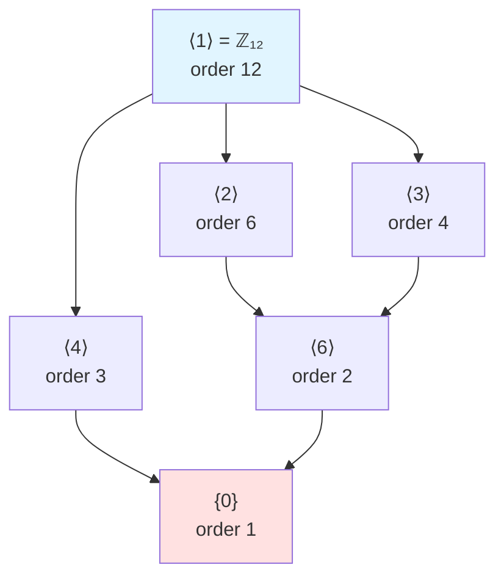

# Subgroups

## Definition and Motivation

Many mathematical structures contain smaller structures of the same type. For instance, the even integers form a group under addition, and they are contained within the larger group of all integers. This motivates the concept of a subgroup.

**Definition**: Let $(G, \ast)$ be a group. A subset $H \subseteq G$ is called a **subgroup** of $G$ if $(H, \ast)$ is itself a group under the same operation.

**Notation**: We write $H \leq G$ to denote that $H$ is a subgroup of $G$. If $H \leq G$ and $H \neq G$, we write $H < G$ and call $H$ a **proper subgroup** of $G$.

## Subgroup Conditions

For $H$ to be a subgroup of $G$, it must satisfy:
1. **Closure**: For all $a, b \in H$, we have $a \ast b \in H$
2. **Associativity**: Inherited from $G$ (automatically satisfied)
3. **Identity**: The identity $e$ of $G$ is in $H$
4. **Inverses**: For all $a \in H$, we have $a^{-1} \in H$

**Important Note**: Associativity is automatically satisfied since $H \subseteq G$ and the operation is the same. We don't need to verify it separately.

## Basic Examples

### Example 1: Even Integers

Let $2\mathbb{Z} = \{2k : k \in \mathbb{Z}\} = \{\ldots, -4, -2, 0, 2, 4, \ldots\}$ be the set of even integers.

**Claim**: $2\mathbb{Z} \leq (\mathbb{Z}, +)$.

**Proof**:
- **Closure**: If $a, b \in 2\mathbb{Z}$, then $a = 2m$ and $b = 2n$ for some $m, n \in \mathbb{Z}$. Thus $a + b = 2m + 2n = 2(m + n) \in 2\mathbb{Z}$. ✓

- **Identity**: $0 = 2 \cdot 0 \in 2\mathbb{Z}$. ✓

- **Inverses**: If $a = 2m \in 2\mathbb{Z}$, then $-a = -2m = 2(-m) \in 2\mathbb{Z}$. ✓

Therefore, $2\mathbb{Z} \leq \mathbb{Z}$. $\square$

### Example 2: Multiples of $n$

More generally, for any $n \in \mathbb{Z}$, the set $n\mathbb{Z} = \{nk : k \in \mathbb{Z}\}$ is a subgroup of $\mathbb{Z}$ under addition.

### Example 3: Special Linear Group

The **special linear group** $SL_n(\mathbb{R})$ consists of all $n \times n$ matrices with determinant 1:
$$SL_n(\mathbb{R}) = \{A \in GL_n(\mathbb{R}) : \det(A) = 1\}$$

**Claim**: $SL_n(\mathbb{R}) \leq GL_n(\mathbb{R})$.

**Proof**:
- **Closure**: If $\det(A) = 1$ and $\det(B) = 1$, then $\det(AB) = \det(A)\det(B) = 1 \cdot 1 = 1$. ✓

- **Identity**: $\det(I_n) = 1$, so $I_n \in SL_n(\mathbb{R})$. ✓

- **Inverses**: If $\det(A) = 1$, then $\det(A^{-1}) = \frac{1}{\det(A)} = \frac{1}{1} = 1$. ✓

Therefore, $SL_n(\mathbb{R}) \leq GL_n(\mathbb{R})$. $\square$

### Example 4: Units Modulo $n$

For a positive integer $n$, let $U(n)$ denote the set of integers modulo $n$ that are relatively prime to $n$:
$$U(n) = \{a \in \mathbb{Z}_n : \gcd(a, n) = 1\}$$

Under multiplication modulo $n$, $U(n)$ forms a group. For example:
- $U(8) = \{1, 3, 5, 7\}$ under multiplication modulo 8
- $U(10) = \{1, 3, 7, 9\}$ under multiplication modulo 10

## Trivial Subgroups

Every group $G$ has at least two subgroups:

**Theorem 1**: For any group $G$:
1. $\{e\} \leq G$ (the **trivial subgroup**)
2. $G \leq G$ (the **improper subgroup**)

**Proof**: Both clearly satisfy the subgroup conditions. $\square$

These are called the **trivial subgroups** of $G$. All other subgroups are called **nontrivial** or **proper** subgroups.

## Subgroup Lattice Visualization

A **subgroup lattice** is a diagram showing all subgroups of a group and their inclusion relationships. Lines connect subgroups where one is contained in the other.

### Example: Subgroups of $\mathbb{Z}_{12}$

The divisors of $12$ are $\{1, 2, 3, 4, 6, 12\}$, giving us six subgroups:

**Note**: The subgroup $\langle 6 \rangle$ is contained in both $\langle 2 \rangle$ and $\langle 3 \rangle$ because $6 = \text{lcm}(2,3)$.

## Intersection of Subgroups

**Theorem 2**: If $H$ and $K$ are subgroups of $G$, then $H \cap K$ is also a subgroup of $G$.

**Proof**: We verify the subgroup conditions:

- **Closure**: Let $a, b \in H \cap K$. Then $a, b \in H$ and $a, b \in K$. Since $H$ is a subgroup, $a \ast b \in H$. Since $K$ is a subgroup, $a \ast b \in K$. Therefore, $a \ast b \in H \cap K$. ✓

- **Identity**: Since $H$ and $K$ are subgroups, $e \in H$ and $e \in K$. Thus $e \in H \cap K$. ✓

- **Inverses**: Let $a \in H \cap K$. Then $a \in H$ and $a \in K$. Since $H$ is a subgroup, $a^{-1} \in H$. Since $K$ is a subgroup, $a^{-1} \in K$. Therefore, $a^{-1} \in H \cap K$. ✓

Thus $H \cap K \leq G$. $\square$

**Generalization**: The intersection of any collection of subgroups is a subgroup.

**Example**: In $(\mathbb{Z}, +)$:
- $2\mathbb{Z} \cap 3\mathbb{Z} = 6\mathbb{Z}$ (multiples of lcm(2,3))
- $4\mathbb{Z} \cap 6\mathbb{Z} = 12\mathbb{Z}$

**Warning**: The union of subgroups is generally NOT a subgroup.

**Counterexample**: Consider $2\mathbb{Z}$ and $3\mathbb{Z}$ as subgroups of $\mathbb{Z}$. Then:
- $2 \in 2\mathbb{Z} \subseteq 2\mathbb{Z} \cup 3\mathbb{Z}$
- $3 \in 3\mathbb{Z} \subseteq 2\mathbb{Z} \cup 3\mathbb{Z}$
- But $2 + 3 = 5 \notin 2\mathbb{Z} \cup 3\mathbb{Z}$

So $2\mathbb{Z} \cup 3\mathbb{Z}$ is not closed under addition, hence not a subgroup.

## Subgroups Generated by an Element

**Definition**: Let $G$ be a group and $a \in G$. The **cyclic subgroup generated by $a$** is:
$$\langle a \rangle = \{a^n : n \in \mathbb{Z}\}$$

In additive notation: $\langle a \rangle = \{na : n \in \mathbb{Z}\}$.

**Theorem 3**: For any $a \in G$, the set $\langle a \rangle$ is a subgroup of $G$.

**Proof**:
- **Closure**: If $a^m, a^n \in \langle a \rangle$, then $a^m \ast a^n = a^{m+n} \in \langle a \rangle$. ✓

- **Identity**: $e = a^0 \in \langle a \rangle$. ✓

- **Inverses**: If $a^n \in \langle a \rangle$, then $(a^n)^{-1} = a^{-n} \in \langle a \rangle$. ✓

Therefore, $\langle a \rangle \leq G$. $\square$

### Examples

**Example 1**: In $(\mathbb{Z}, +)$:
- $\langle 1 \rangle = \{n \cdot 1 : n \in \mathbb{Z}\} = \mathbb{Z}$
- $\langle 2 \rangle = \{n \cdot 2 : n \in \mathbb{Z}\} = 2\mathbb{Z}$
- $\langle 5 \rangle = 5\mathbb{Z}$

**Example 2**: In $\mathbb{Z}_{12}$ under addition:
- $\langle 3 \rangle = \{0, 3, 6, 9\}$
- $\langle 4 \rangle = \{0, 4, 8\}$
- $\langle 5 \rangle = \mathbb{Z}_{12}$

**Example 3**: In the group of rotational symmetries of a square:
- If $r$ is rotation by 90°, then $\langle r \rangle = \{e, r, r^2, r^3\}$ is the entire rotation group

## Centralizer and Center

**Definition**: Let $G$ be a group and $a \in G$. The **centralizer** of $a$ is:
$$C(a) = \{g \in G : g \ast a = a \ast g\}$$

The centralizer consists of all elements that commute with $a$.

**Theorem 4**: $C(a) \leq G$ for any $a \in G$.

**Proof**: Exercise (verify closure, identity, and inverses). $\square$

**Definition**: The **center** of $G$ is:
$$Z(G) = \{g \in G : g \ast a = a \ast g \text{ for all } a \in G\}$$

The center consists of all elements that commute with every element of $G$.

**Theorem 5**: $Z(G) \leq G$ for any group $G$.

**Proof**:
- **Closure**: If $g, h \in Z(G)$, then for any $a \in G$:
$$(g \ast h) \ast a = g \ast (h \ast a) = g \ast (a \ast h) = (g \ast a) \ast h = (a \ast g) \ast h = a \ast (g \ast h)$$
So $g \ast h \in Z(G)$. ✓

- **Identity**: Clearly $e \ast a = a \ast e$ for all $a$, so $e \in Z(G)$. ✓

- **Inverses**: If $g \in Z(G)$, then $g \ast a = a \ast g$ for all $a$. Multiplying both sides by $g^{-1}$ on the left and right:
$$a = g^{-1} \ast a \ast g$$
$$g^{-1} \ast a = a \ast g^{-1}$$
So $g^{-1} \in Z(G)$. ✓

Therefore, $Z(G) \leq G$. $\square$

**Note**: A group $G$ is abelian if and only if $Z(G) = G$.

### Examples

**Example 1**: $Z(\mathbb{Z}) = \mathbb{Z}$ (all integers commute)

**Example 2**: $Z(GL_n(\mathbb{R})) = \{cI_n : c \in \mathbb{R}, c \neq 0\}$ (scalar matrices)

**Example 3**: For $D_n$ (dihedral group), $Z(D_n)$ depends on $n$:
- If $n$ is odd, $Z(D_n) = \{e\}$
- If $n$ is even, $Z(D_n) = \{e, r^{n/2}\}$ where $r$ is rotation by $360°/n$

## Summary

Subgroups are fundamental objects in group theory. They allow us to study the internal structure of groups and relationships between different groups. The key results are:
- Intersections of subgroups are subgroups
- Every element generates a cyclic subgroup
- The center and centralizers are important subgroups that capture commutativity properties
