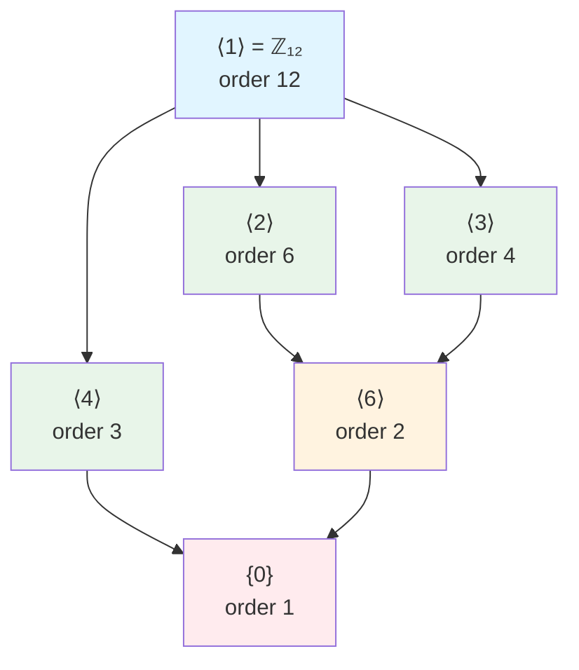
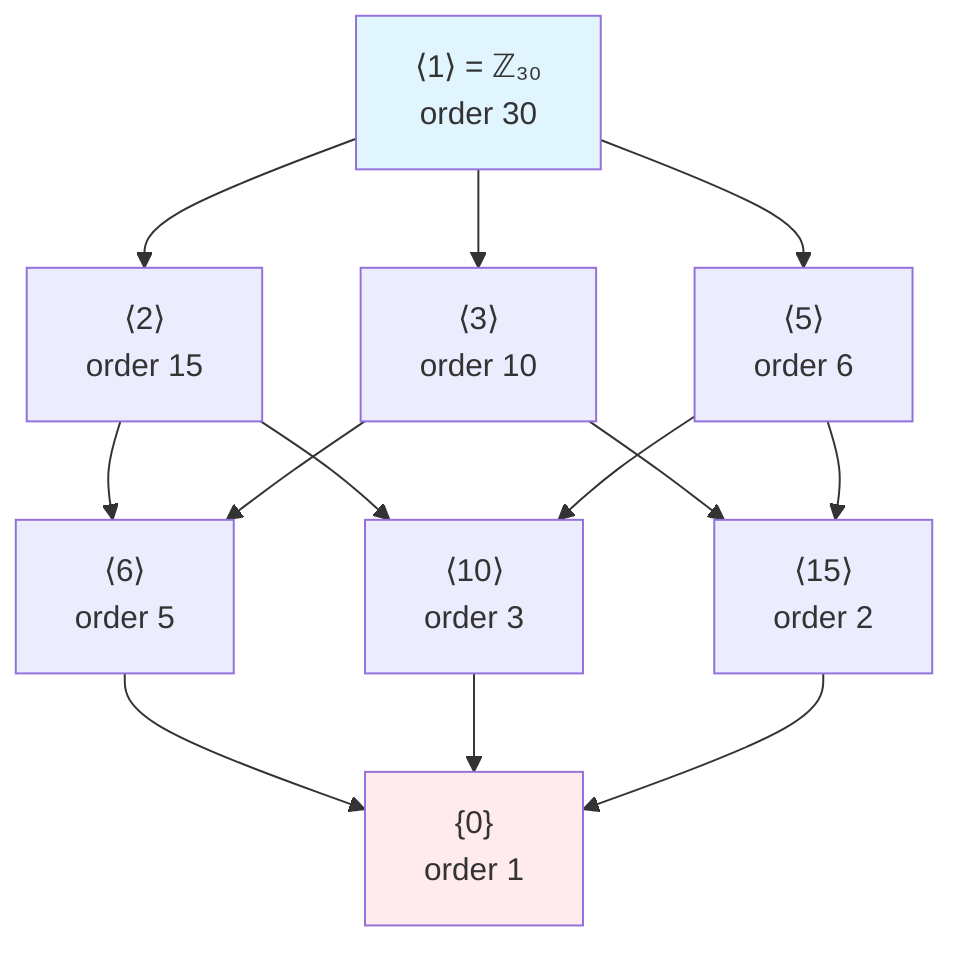

# Subgroups of Cyclic Groups

## The Cyclic Subgroup Property

One of the most important properties of cyclic groups is that their subgroups maintain the cyclic structure.

**Theorem 1**: Every subgroup of a cyclic group is cyclic.

We proved this earlier, but let's explore its consequences in depth.

## Constructing Subgroups

Given a cyclic group $G = \langle a \rangle$ of order $n$, we can systematically construct all its subgroups.

**Method**: For each divisor $d$ of $n$, the element $a^{n/d}$ generates a unique subgroup of order $d$.

### Example: $\mathbb{Z}_{20}$

$n = 20 = 2^2 \cdot 5$

Divisors: 1, 2, 4, 5, 10, 20

**Subgroups**:
- $d = 1$: $\langle 20 \rangle = \langle 0 \rangle = \{0\}$
- $d = 2$: $\langle 10 \rangle = \{0, 10\}$
- $d = 4$: $\langle 5 \rangle = \{0, 5, 10, 15\}$
- $d = 5$: $\langle 4 \rangle = \{0, 4, 8, 12, 16\}$
- $d = 10$: $\langle 2 \rangle = \{0, 2, 4, 6, 8, 10, 12, 14, 16, 18\}$
- $d = 20$: $\langle 1 \rangle = \mathbb{Z}_{20}$

**Verification for $\langle 5 \rangle$**:
$$|\langle 5 \rangle| = |5| = \frac{20}{\gcd(20, 5)} = \frac{20}{5} = 4$$
$$\langle 5 \rangle = \{0, 5, 10, 15\}$$

## Subgroup Inclusions

**Theorem 2**: Let $H = \langle a^m \rangle$ and $K = \langle a^k \rangle$ be subgroups of $G = \langle a \rangle$ with $|a| = n$. Then $H \subseteq K$ if and only if $k | m$.

**Proof**:
($\Rightarrow$) If $H \subseteq K$, then $a^m \in K = \langle a^k \rangle$, so $a^m = (a^k)^j$ for some $j$. Thus $m = kj$, meaning $k | m$.

($\Leftarrow$) If $k | m$, say $m = k\ell$, then for any $a^{mt} \in H$:
$$a^{mt} = a^{k\ell t} = (a^k)^{\ell t} \in K$$
Thus $H \subseteq K$. $\square$

**Corollary**: In $\mathbb{Z}_n$, we have $\langle m \rangle \subseteq \langle k \rangle$ if and only if $k | m$.

### Example

In $\mathbb{Z}_{24}$:
- $\langle 6 \rangle \subseteq \langle 2 \rangle$ since $2 | 6$ ✓
- $\langle 8 \rangle \subseteq \langle 4 \rangle$ since $4 | 8$ ✓
- $\langle 6 \rangle \not\subseteq \langle 4 \rangle$ since $4 \nmid 6$ ✓

## Subgroup Lattices

The subgroup lattice visualizes all subgroups and their inclusion relationships. Each subgroup $\langle d \rangle$ has order $n/d$ where $d$ divides $n$.

### Example: Lattice of $\mathbb{Z}_{12}$

**Relations**:
- $\langle 6 \rangle \subseteq \langle 2 \rangle, \langle 3 \rangle$ (since $2|6$ and $3|6$)
- $\langle 2 \rangle, \langle 3 \rangle, \langle 4 \rangle \subseteq \langle 1 \rangle = \mathbb{Z}_{12}$

### Example: Lattice of $\mathbb{Z}_{30}$

$30 = 2 \cdot 3 \cdot 5$ has divisors: $1, 2, 3, 5, 6, 10, 15, 30$

**Key insight**: This lattice reflects the divisibility structure of $30$. A path from $\langle a \rangle$ to $\langle b \rangle$ exists if and only if $a | b$.

## Intersection and Join of Subgroups

**Theorem 3**: Let $H$ and $K$ be subgroups of cyclic group $\mathbb{Z}_n$. Then:
1. $H \cap K$ is the unique subgroup of order $\gcd(|H|, |K|)$
2. $\langle H \cup K \rangle = H + K$ is the unique subgroup of order $\text{lcm}(|H|, |K|)$

**Proof**: Let $H = \langle m \rangle$ and $K = \langle k \rangle$.

The intersection $H \cap K$ is a subgroup, hence cyclic: $H \cap K = \langle \ell \rangle$ for some $\ell$.

We have $H \cap K \subseteq H$, so $m | \ell$. Similarly, $k | \ell$. Thus $\text{lcm}(m, k) | \ell$.

Conversely, $\ell \in H$ implies $m | \ell$, and $\ell \in K$ implies $k | \ell$. So $\ell$ is a common multiple of $m$ and $k$, meaning $\text{lcm}(m, k) | \ell$.

Therefore, $\ell = \text{lcm}(m, k)$, and:
$$|H \cap K| = \frac{n}{\text{lcm}(m, k)} = \gcd(|H|, |K|)$$

Similar reasoning gives the join property. $\square$

### Example

In $\mathbb{Z}_{60}$:
- $H = \langle 12 \rangle$ has order $60/12 = 5$
- $K = \langle 15 \rangle$ has order $60/15 = 4$

**Intersection**:
$$|H \cap K| = \gcd(5, 4) = 1$$
$$H \cap K = \{0\}$$

**Join**:
$$|H + K| = \text{lcm}(5, 4) = 20$$

To find the generator: $\gcd(12, 15) = 3$, so $H + K = \langle 3 \rangle$.

Verify: $|\langle 3 \rangle| = 60/3 = 20$ ✓

## Finding All Elements of Given Order

**Problem**: Find all elements of order $d$ in cyclic group $\mathbb{Z}_n$.

**Solution**: An element $k \in \mathbb{Z}_n$ has order $d$ if and only if:
$$\frac{n}{\gcd(n, k)} = d$$

This gives $\gcd(n, k) = n/d$.

So we need elements $k$ such that $\gcd(n, k) = n/d$.

**Count**: The number of such elements is $\phi(d)$ (Euler's totient function).

### Example

Find all elements of order 6 in $\mathbb{Z}_{18}$.

Need $\gcd(18, k) = 18/6 = 3$.

Elements $k$ with $\gcd(18, k) = 3$: these are $k = 3m$ where $\gcd(6, m) = 1$.

So $m \in \{1, 5\}$, giving $k \in \{3, 15\}$.

**Verification**:
- $|3| = 18/\gcd(18, 3) = 18/3 = 6$ ✓
- $|15| = 18/\gcd(18, 15) = 18/3 = 6$ ✓

Count: $\phi(6) = 2$ ✓

## Maximal Subgroups

**Definition**: A subgroup $M$ of $G$ is **maximal** if $M \neq G$ and there is no subgroup $H$ with $M \subset H \subset G$.

**Theorem 4**: The maximal subgroups of $\mathbb{Z}_n$ are precisely $\langle p \rangle$ where $p$ is a prime divisor of $n$.

**Proof**: The subgroup $\langle p \rangle$ has order $n/p$. If $H$ properly contains $\langle p \rangle$, then $|H|$ properly divides $n/p$, but the only such divisor giving a larger subgroup is $n$ itself. $\square$

### Example

Maximal subgroups of $\mathbb{Z}_{12}$:

Prime divisors of 12: 2, 3

Maximal subgroups:
- $\langle 2 \rangle = \{0, 2, 4, 6, 8, 10\}$ (order 6)
- $\langle 3 \rangle = \{0, 3, 6, 9\}$ (order 4)

These are the subgroups immediately below $\mathbb{Z}_{12}$ in the lattice.

## Generating Sets

While cyclic groups need only one generator, we can study minimal generating sets for subgroups.

**Observation**: Every subgroup of a cyclic group needs only one generator (by definition of cyclic).

**Problem**: Given elements $a_1, \ldots, a_k \in \mathbb{Z}_n$, what is $\langle a_1, \ldots, a_k \rangle$?

**Answer**: $\langle a_1, \ldots, a_k \rangle = \langle \gcd(n, a_1, \ldots, a_k) \rangle$

### Example

In $\mathbb{Z}_{36}$:
$$\langle 12, 18 \rangle = \langle \gcd(36, 12, 18) \rangle = \langle 6 \rangle = \{0, 6, 12, 18, 24, 30\}$$

## Index of Subgroups

**Definition**: If $H \leq G$, the **index** of $H$ in $G$ is $[G : H] = |G|/|H|$ (for finite groups).

**Theorem 5**: If $H$ is a subgroup of $\mathbb{Z}_n$ with $|H| = d$, then $[mathbb{Z}_n : H] = n/d$.

This equals the number of distinct cosets of $H$ in $\mathbb{Z}_n$ (we'll study cosets later).

### Example

In $\mathbb{Z}_{20}$:
- $H = \langle 5 \rangle$ has order 4
- $[\mathbb{Z}_{20} : H] = 20/4 = 5$

The 5 cosets are: $\{0, 5, 10, 15\}, \{1, 6, 11, 16\}, \{2, 7, 12, 17\}, \{3, 8, 13, 18\}, \{4, 9, 14, 19\}$.

## Applications

### Divisibility Testing

The subgroup structure of $\mathbb{Z}_n$ relates to divisibility.

**Example**: In $\mathbb{Z}_{12}$, the subgroup $\langle 3 \rangle = \{0, 3, 6, 9\}$ consists of residues divisible by 3.

### Cryptographic Applications

Understanding subgroup structure helps analyze:
- Subgroup attacks in discrete log problems
- Order of elements in cryptographic groups
- Security of group-based protocols

## Summary

Key facts about subgroups of cyclic groups:
- All subgroups are cyclic
- Unique subgroup for each divisor
- Subgroup lattice mirrors divisibility
- $|H \cap K| = \gcd(|H|, |K|)$
- $|H + K| = \text{lcm}(|H|, |K|)$
- Number of elements of order $d$ is $\phi(d)$

The simple, elegant structure of cyclic groups makes them fundamental building blocks in algebra.
