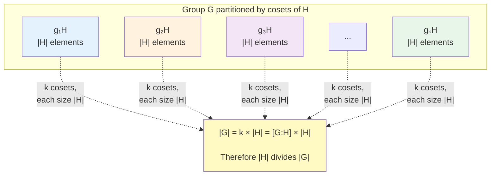

# Lagrange's Theorem

## Statement

**Lagrange's Theorem**: If $H$ is a subgroup of finite group $G$, then $|H|$ divides $|G|$. Moreover:
$$|G| = |H| \cdot [G:H]$$

where $[G:H]$ is the number of distinct left (or right) cosets of $H$ in $G$.

This fundamental theorem provides a crucial constraint on the possible sizes of subgroups within a finite group. It tells us that the order of every subgroup must be a divisor of the order of the parent group, significantly limiting the possibilities for subgroup structure.

## Proof

The proof relies on the key observation that left cosets partition the group into disjoint sets of equal size.

**Detailed Proof**:

First, recall that left cosets of $H$ are sets of the form $gH = \{gh : h \in H\}$ for $g \in G$.

**Step 1**: Each coset has exactly $|H|$ elements.

For any $g \in G$, the map $\phi: H \to gH$ defined by $\phi(h) = gh$ is a bijection:
- **Injective**: If $gh_1 = gh_2$, then $h_1 = h_2$ by left cancellation
- **Surjective**: Every element of $gH$ has form $gh$ for some $h \in H$

Therefore $|gH| = |H|$.

**Step 2**: Distinct cosets are disjoint.

Suppose $g_1H$ and $g_2H$ have a common element $x$. Then $x = g_1h_1 = g_2h_2$ for some $h_1, h_2 \in H$. This gives $g_2^{-1}g_1 = h_2h_1^{-1} \in H$, so $g_1 \in g_2H$.

For any $g_1h \in g_1H$, we can write $g_1 = g_2k$ for some $k \in H$, so $g_1h = g_2(kh) \in g_2H$. Similarly, $g_2H \subseteq g_1H$, proving $g_1H = g_2H$.

**Step 3**: The cosets partition $G$.

Every element $g \in G$ belongs to some coset (namely $gH$, since $g = ge \in gH$). By Step 2, cosets are either identical or disjoint.

**Conclusion**: If there are $k$ distinct cosets, then:
$$|G| = k \cdot |H| = [G:H] \cdot |H|$$

Therefore $|H|$ divides $|G|$. $\square$

## Immediate Consequences

**Corollary 1**: The order of any element divides the order of the group.

**Proof**: If $a \in G$, then $\langle a \rangle$ is a subgroup of $G$, so $|\langle a \rangle|$ divides $|G|$ by Lagrange. But $|\langle a \rangle| = |a|$ (the order of the cyclic subgroup generated by $a$ equals the order of $a$). $\square$

**Corollary 2**: If $|G| = p$ (prime), then $G$ is cyclic.

**Proof**: Let $a \in G$ with $a \neq e$. Then $|a| > 1$ and $|a|$ divides $p$ by Corollary 1. Since $p$ is prime, its only divisors are 1 and $p$. Since $|a| > 1$, we must have $|a| = p = |G|$. Therefore $\langle a \rangle = G$, proving $G$ is cyclic. $\square$

This result completely classifies all groups of prime order - they are all cyclic and isomorphic to $\mathbb{Z}_p$.

**Corollary 3**: For $g \in G$, we have $g^{|G|} = e$.

**Proof**: Let $|g| = k$. By Corollary 1, $k | |G|$, so $|G| = km$ for some integer $m$. Thus:
$$g^{|G|} = g^{km} = (g^k)^m = e^m = e$$
$\square$

This generalizes Fermat's Little Theorem! In fact, when applied to $G = (\mathbb{Z}/p\mathbb{Z})^*$ (the multiplicative group of nonzero elements mod $p$), we get Fermat's Little Theorem: $a^{p-1} \equiv 1 \pmod{p}$ for $\gcd(a,p) = 1$.

## Examples

### Example 1

$G = S_3$, $|G| = 6$. Possible subgroup orders: 1, 2, 3, 6 (divisors of 6).

Indeed:
- Order 1: $\{e\}$
- Order 2: $\{e, (1\,2)\}$, $\{e, (1\,3)\}$, $\{e, (2\,3)\}$
- Order 3: $\{e, (1\,2\,3), (1\,3\,2)\}$
- Order 6: $S_3$

Notice that every divisor of 6 appears as a subgroup order. However, this is not always the case (see Non-Converse section).

### Example 2

$G = \mathbb{Z}_{12}$, $|G| = 12$. Divisors: 1, 2, 3, 4, 6, 12.

Subgroups:
- $|\langle 6 \rangle| = 2$ ✓ ($\langle 6 \rangle = \{0, 6\}$)
- $|\langle 4 \rangle| = 3$ ✓ ($\langle 4 \rangle = \{0, 4, 8\}$)
- $|\langle 3 \rangle| = 4$ ✓ ($\langle 3 \rangle = \{0, 3, 6, 9\}$)
- $|\langle 2 \rangle| = 6$ ✓ ($\langle 2 \rangle = \{0, 2, 4, 6, 8, 10\}$)

All subgroup orders divide 12, as predicted by Lagrange's Theorem. In this cyclic group, there exists exactly one subgroup for each divisor of the order.

### Example 3

No subgroup of $S_3$ has order 4 or 5 (don't divide 6).

This is an immediate consequence of Lagrange's Theorem - we can rule out subgroups of certain orders without checking directly.

## Computing Index

From $|G| = |H| \cdot [G:H]$:
$$[G:H] = \frac{|G|}{|H|}$$

The index measures how many times $H$ "fits into" $G$ via cosets.

### Example 4

$H = A_5 \leq S_5$. Then $|H| = 60$, $|G| = 120$, so:
$$[S_5 : A_5] = \frac{120}{60} = 2$$

This tells us there are exactly 2 cosets of $A_5$ in $S_5$: the even permutations ($A_5$ itself) and the odd permutations.

## Non-Converse

**Warning**: Lagrange's theorem does NOT say: "If $d | |G|$, then there exists a subgroup of order $d$."

This is a common misconception. While every subgroup order must divide the group order, not every divisor of the group order corresponds to an actual subgroup.

**Counterexample**: $A_4$ has order 12, but no subgroup of order 6!

Divisors of 12: 1, 2, 3, 4, 6, 12.

$A_4$ has subgroups of orders:
- Order 1: $\{e\}$
- Order 2: $\{e, (1\,2)(3\,4)\}$, $\{e, (1\,3)(2\,4)\}$, $\{e, (1\,4)(2\,3)\}$ (three such subgroups)
- Order 3: Various cyclic subgroups generated by 3-cycles
- Order 4: Klein four-group $V_4 = \{e, (1\,2)(3\,4), (1\,3)(2\,4), (1\,4)(2\,3)\}$
- Order 12: $A_4$ itself

But there is NO subgroup of order 6! This can be proven by considering that such a subgroup would be normal (having index 2) and showing this leads to a contradiction.

## Historical Note

Joseph-Louis Lagrange (1736-1813) proved this theorem for permutation groups while studying solutions of polynomial equations. The general version for abstract groups came later in the 19th century with the development of abstract algebra by mathematicians like Cayley, Jordan, and Sylow. Lagrange's work predated the formal definition of a group by nearly a century, making his insight even more remarkable.

## Applications

### Application 1: Element Orders in Finite Groups

In a group of order 30, possible element orders are divisors of 30: 1, 2, 3, 5, 6, 10, 15, 30.

An element cannot have order 4, 7, 8, or any other non-divisor of 30.

### Application 2: Prime Order Groups

**Theorem**: Every group of prime order is cyclic (and hence abelian).

This was already proven as Corollary 2. This result is fundamental in classifying small groups - all groups of prime order are completely understood.

### Application 3: Counting Subgroups

If $|G| = 15 = 3 \cdot 5$, possible subgroup orders are: 1, 3, 5, 15.

We can immediately rule out subgroups of orders 2, 4, 6, 7, 8, 9, 10, 11, 12, 13, or 14 without any computation.

### Application 4: Simplifying Group Analysis

When studying a group of order 24 = $2^3 \cdot 3$, we know possible subgroup orders are: 1, 2, 3, 4, 6, 8, 12, 24. This drastically narrows the search space when looking for subgroups.

## Tower Law

**Theorem**: If $K \leq H \leq G$ (a chain of subgroups), then:
$$[G:K] = [G:H] \cdot [H:K]$$

**Proof**: Consider the partition of $G$ by cosets of $K$. Each coset of $H$ in $G$ contains exactly $[H:K]$ cosets of $K$ (since $K \leq H$). Since there are $[G:H]$ cosets of $H$ in $G$, the total number of cosets of $K$ in $G$ is $[G:H] \cdot [H:K]$. $\square$

**Corollary**: $|G| = |K| \cdot [G:K] = |K| \cdot [G:H] \cdot [H:K]$.

This can also be written as:
$$|G| = |K| \cdot \frac{|H|}{|K|} \cdot \frac{|G|}{|H|} = |G|$$

verifying the consistency of our formulas.

### Example 5

$\{0\} \leq 4\mathbb{Z} \leq 2\mathbb{Z} \leq \mathbb{Z}$

Check: $[2\mathbb{Z} : 4\mathbb{Z}] = 2$ (cosets: $4\mathbb{Z}$ and $2 + 4\mathbb{Z}$)

$[\mathbb{Z} : 2\mathbb{Z}] = 2$ (cosets: $2\mathbb{Z}$ and $1 + 2\mathbb{Z}$)

Therefore $[\mathbb{Z} : 4\mathbb{Z}] = 2 \cdot 2 = 4$. ✓

Indeed, the cosets of $4\mathbb{Z}$ in $\mathbb{Z}$ are: $4\mathbb{Z}$, $1 + 4\mathbb{Z}$, $2 + 4\mathbb{Z}$, $3 + 4\mathbb{Z}$.

## Summary

Lagrange's Theorem establishes that:
- $|H|$ divides $|G|$ for any subgroup $H$ of finite group $G$
- The relationship is quantified by $|G| = |H| \cdot [G:H]$
- The order of every element divides the order of the group
- Groups of prime order are necessarily cyclic
- The converse is false: not every divisor of $|G|$ corresponds to a subgroup
- The Tower Law extends the theorem to chains of subgroups

This is one of the most fundamental theorems in group theory, providing essential constraints on group structure and serving as the foundation for many deeper results in finite group theory.

## Key Takeaways

- Lagrange's Theorem restricts possible subgroup sizes to divisors of the group order
- The proof uses the partition of the group by cosets of equal size
- Every element's order divides the group order, leading to the identity $g^{|G|} = e$
- Groups of prime order are always cyclic (complete classification)
- The converse fails: $A_4$ has order 12 but no subgroup of order 6
- The index formula $[G:H] = |G|/|H|$ enables quick calculations
- The Tower Law provides multiplicativity of indices in chains of subgroups
- Applications include Fermat's Little Theorem, Euler's Theorem, and constraints on group structure
