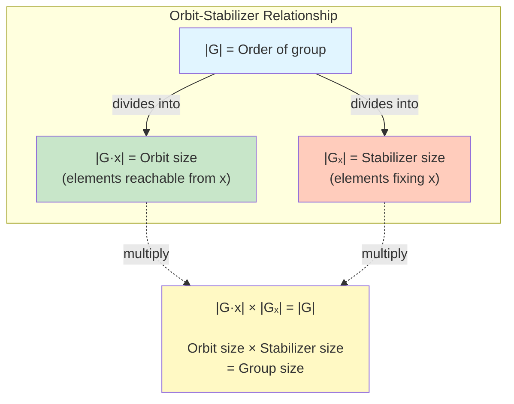
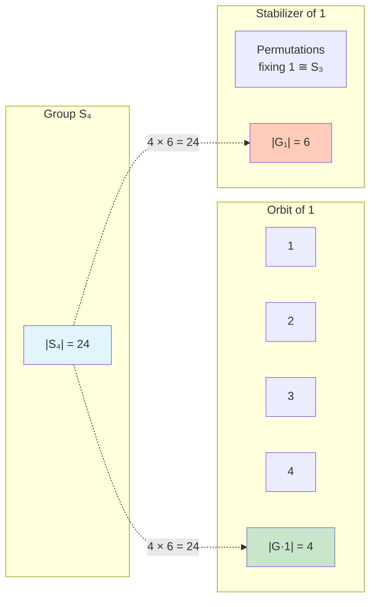

# Orbit-Stabilizer Theorem

## Statement

**Orbit-Stabilizer Theorem**: Let $G$ act on a set $X$ and let $x \in X$. Then:

$$|G \cdot x| \cdot |G_x| = |G|$$

Or equivalently, for finite groups:
$$|G \cdot x| = [G : G_x] = \frac{|G|}{|G_x|}$$

This fundamental result connects the size of an orbit with the size of the corresponding stabilizer.

## Proof

Define $\phi: G \to G \cdot x$ by $\phi(g) = g \cdot x$.

**Claim**: $\phi(g_1) = \phi(g_2)$ if and only if $g_1$ and $g_2$ are in the same left coset of $G_x$.

**Proof of claim**:
$$\begin{align}
\phi(g_1) = \phi(g_2) &\Leftrightarrow g_1 \cdot x = g_2 \cdot x \\
&\Leftrightarrow (g_2^{-1}g_1) \cdot x = x \\
&\Leftrightarrow g_2^{-1}g_1 \in G_x \\
&\Leftrightarrow g_1 \in g_2 G_x \\
&\Leftrightarrow g_1 G_x = g_2 G_x
\end{align}$$

Therefore, the fibers of $\phi$ are precisely the left cosets of $G_x$ in $G$.

Since each fiber has size $|G_x|$ and there are $|G \cdot x|$ distinct values in the image:
$$|G| = (\text{number of fibers}) \times (\text{size of each fiber}) = |G \cdot x| \cdot |G_x|$$

$\square$

## Examples

### Example 1: $S_4$ on $\{1,2,3,4\}$

Pick $x = 1$. Then:
- Orbit: $G \cdot 1 = \{1, 2, 3, 4\}$ (any element can be moved to any other), so $|G \cdot 1| = 4$
- Stabilizer: $G_1 = \{\sigma \in S_4 : \sigma(1) = 1\} \cong S_3$ (permutations fixing 1), so $|G_1| = 6$

**Verify**: $|S_4| = 24 = 4 \times 6 = |G \cdot 1| \times |G_1|$. ✓

### Example 2: $D_6$ on Hexagon Vertices

$D_6$ has order $2 \times 6 = 12$. Pick vertex $v$.

- Orbit: All 6 vertices (transitive action), so $|G \cdot v| = 6$
- Stabilizer: $G_v = \{e, s_v\}$ where $s_v$ is reflection through $v$, so $|G_v| = 2$

**Verify**: $12 = 6 \times 2$. ✓

### Example 3: Conjugation Action

$G$ acts on itself by conjugation: $g \cdot h = ghg^{-1}$.

For $a \in G$:
- Orbit: $\text{cl}(a) = \{gag^{-1} : g \in G\}$ (conjugacy class)
- Stabilizer: $C(a) = \{g \in G : gag^{-1} = a\} = \{g : ga = ag\}$ (centralizer)

**Orbit-Stabilizer**:
$$|\text{cl}(a)| = \frac{|G|}{|C(a)|} = [G : C(a)]$$

This is the **fundamental counting formula for conjugacy classes**.

**Example 3a**: In $S_3$, consider $a = (1\,2)$:
- $C(a) = \{e, (1\,2)\}$ has order 2
- $|\text{cl}(a)| = 6/2 = 3$
- Indeed: $\text{cl}((1\,2)) = \{(1\,2), (1\,3), (2\,3)\}$

### Example 4: Computing Unknown Quantities

If $|G| = 60$, orbit has 12 elements, what is $|G_x|$?

$$|G_x| = \frac{|G|}{|G \cdot x|} = \frac{60}{12} = 5$$

## Class Equation

Applying Orbit-Stabilizer to the conjugation action yields the **Class Equation**:

$$|G| = |Z(G)| + \sum_{i} [G : C(g_i)]$$

where the sum runs over one representative $g_i$ from each non-central conjugacy class.

**Derivation**: Partition $G$ into conjugacy classes. Elements in center $Z(G)$ have singleton conjugacy classes (order 1). Non-central elements have larger classes with size $[G : C(g_i)]$ by Orbit-Stabilizer.

### Example 5: Class Equation of $S_3$

Conjugacy classes: $\{e\}$, $\{(1\,2), (1\,3), (2\,3)\}$, $\{(1\,2\,3), (1\,3\,2)\}$

Center: $Z(S_3) = \{e\}$ (only identity commutes with everything)

Class equation:
$$6 = 1 + 3 + 2$$

Representatives: $(1\,2)$ with $|C((1\,2))| = 2$, giving $[S_3 : C((1\,2))] = 3$.
And $(1\,2\,3)$ with $|C((1\,2\,3))| = 3$, giving $[S_3 : C((1\,2\,3))] = 2$.

## Burnside's Lemma

**Burnside's Lemma** (also called Cauchy-Frobenius Lemma): The number of orbits of $G$ acting on $X$ equals:

$$\frac{1}{|G|} \sum_{g \in G} |\text{Fix}(g)|$$

where $\text{Fix}(g) = \{x \in X : g \cdot x = x\}$.

### Proof

Count pairs $(g, x)$ with $g \cdot x = x$ in two ways:

**By elements**: $\sum_{x \in X} |G_x|$

**By group elements**: $\sum_{g \in G} |\text{Fix}(g)|$

These are equal. Now, for elements in the same orbit:
$$\sum_{y \in G \cdot x} |G_y| = |G \cdot x| \cdot |G_x| = |G|$$

(All stabilizers in an orbit have the same size, related by conjugation.)

Summing over orbit representatives:
$$\sum_{g \in G} |\text{Fix}(g)| = \sum_{\text{orbits}} \sum_{y \in \text{orbit}} |G_y| = (\text{number of orbits}) \times |G|$$

Therefore:
$$\text{number of orbits} = \frac{1}{|G|} \sum_{g \in G} |\text{Fix}(g)|$$

$\square$

### Example 6: Coloring Square Vertices

How many ways to color vertices of a square with 2 colors (red/blue), up to symmetries of $D_4$?

Total colorings without symmetry: $2^4 = 16$.

$D_4 = \{e, r, r^2, r^3, s, rs, r^2s, r^3s\}$ with $|D_4| = 8$.

Count fixed points for each symmetry:

- $e$: all 16 colorings fixed
- $r$ (90° rotation): only all-red or all-blue fixed, so $|\text{Fix}(r)| = 2$
- $r^2$ (180°): opposite vertices must match. $2^2 = 4$ colorings
- $r^3$ (270°): same as $r$, so 2 colorings
- $s$ (reflection through vertical axis): left must equal right. $2^2 = 4$
- $rs, r^2s, r^3s$ (other reflections): each has 4 fixed colorings

**Burnside's Lemma**:
$$\text{orbits} = \frac{1}{8}(16 + 2 + 4 + 2 + 4 + 4 + 4 + 4) = \frac{40}{8} = 5$$

There are **5 distinct colorings** up to symmetry.

## Applications

### Application 1: Counting Orbits

Given group action, compute number of orbits using Burnside's Lemma.

### Application 2: Determining Stabilizer Size

If orbit size is known, find stabilizer size using $|G_x| = |G|/|G \cdot x|$.

### Application 3: Proving Divisibility

Orbit-Stabilizer implies $|G \cdot x|$ divides $|G|$ (it equals the index $[G : G_x]$).

**Corollary**: Size of any conjugacy class divides $|G|$.

### Application 4: Cayley's Theorem Refinement

For transitive action, $|X| = [G : G_x]$ divides $|G|$.

## Advanced Example

**Example 7**: How many ways to place 6 distinct objects around a circular table, up to rotation?

Without rotation: $6!$ arrangements.

With rotation: Cyclic group $C_6$ acts. But objects are distinct, so no non-identity element fixes any arrangement.

Actually, this is subtle. Rotations are elements of $C_6$, acting on $6!$ labeled arrangements. Each non-identity rotation moves every arrangement (since objects are distinct). Only identity fixes anything.

$$\text{orbits} = \frac{1}{6}(6! + 0 + \cdots + 0) = \frac{720}{6} = 120 = 5!$$

This makes sense: fix one person's position to break rotational symmetry, then arrange remaining 5.

## Summary

**Orbit-Stabilizer Theorem**: $|G \cdot x| \cdot |G_x| = |G|$

**Key Insights**:
- Connects orbit and stabilizer sizes
- Orbit size equals index of stabilizer
- All orbits have size dividing $|G|$

**Class Equation**: $|G| = |Z(G)| + \sum [G : C(g_i)]$

**Burnside's Lemma**: Number of orbits $ = \frac{1}{|G|} \sum_g |\text{Fix}(g)|$

**Applications**:
- Counting with symmetry
- Combinatorial enumeration
- Understanding group structure through actions
- Proving divisibility properties

The Orbit-Stabilizer Theorem is one of the most useful computational tools in group theory, connecting abstract group structure with concrete counting problems.
