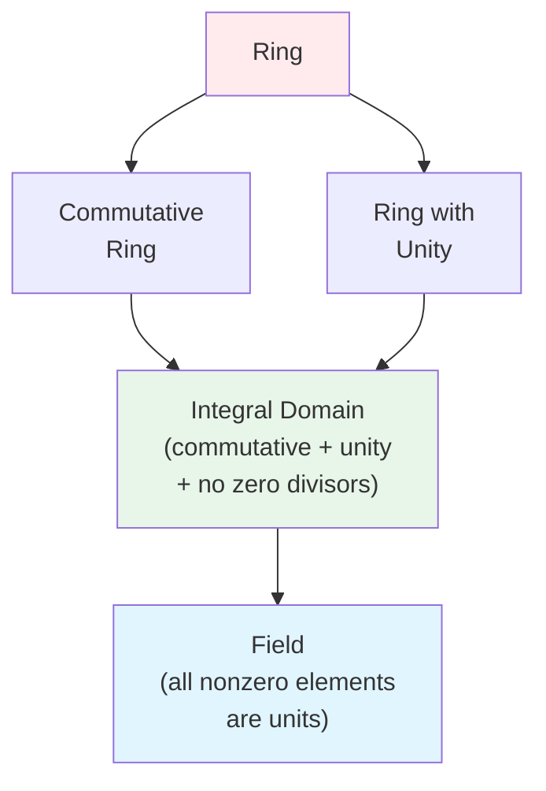

# Integral Domains

## Introduction

Integral domains occupy a crucial middle ground in the hierarchy of ring structures, positioned between general commutative rings and fields. They capture the essential properties that make integer arithmetic work smoothly—particularly the absence of zero divisors—while not requiring the full structure of a field where every non-zero element must be invertible.

The name "integral domain" reflects their connection to generalizations of the integers, particularly in algebraic number theory where mathematicians study rings like the Gaussian integers $\mathbb{Z}[i]$ and other rings of algebraic integers.

## Definition

**Definition**: An **integral domain** is a commutative ring with unity and no zero divisors.

More precisely, ring $D$ is an integral domain if:
1. **Commutative**: $ab = ba$ for all $a, b \in D$
2. **Has unity**: There exists $1 \in D$ (with $1 \neq 0$) such that $1 \cdot a = a$ for all $a \in D$
3. **No zero divisors**: If $ab = 0$, then $a = 0$ or $b = 0$

**Alternative formulation**: The third condition is equivalent to: If $a \neq 0$ and $b \neq 0$, then $ab \neq 0$.

This last property is sometimes called the **cancellation property** because it ensures: if $a \neq 0$ and $ab = ac$, then $b = c$ (we can "cancel" $a$ from both sides).

## Understanding Integral Domains in Ring Hierarchy

The following diagram illustrates where integral domains fit in the hierarchy of ring structures:

**Key insight**: Integral domains are the "middle ground" between general rings and fields. They have enough structure to support cancellation and many familiar arithmetic properties, but don't require all elements to be invertible.

## Motivation and Intuition

Why do we care about integral domains? Consider the equation $ab = 0$ in different rings:

- In $\mathbb{Z}$: If $ab = 0$, then $a = 0$ or $b = 0$. This is obvious and fundamental to solving equations.
- In $\mathbb{Z}_6$: We have $2 \cdot 3 = 0$ but $2 \neq 0$ and $3 \neq 0$. This violates our intuition!

Integral domains are exactly those rings where our intuition about multiplication holds: non-zero times non-zero is non-zero.

## Examples

### Example 1: $\mathbb{Z}$

The integers form the prototypical integral domain.

Verification:
- Commutative: $ab = ba$ for all integers
- Unity: 1 serves as multiplicative identity
- No zero divisors: If $ab = 0$ in $\mathbb{Z}$, then $a = 0$ or $b = 0$ (fundamental property of integers)

The integers motivated the entire theory of integral domains.

### Example 2: $\mathbb{Z}[x]$

Polynomials with integer coefficients form an integral domain.

Why no zero divisors? If $f(x), g(x) \in \mathbb{Z}[x]$ are non-zero polynomials, then:
$$\deg(f \cdot g) = \deg(f) + \deg(g)$$

Since degrees are non-negative and add, the product cannot be the zero polynomial. Thus $\mathbb{Z}[x]$ has no zero divisors.

### Example 3: $\mathbb{Z}[i]$

Gaussian integers: $\mathbb{Z}[i] = \{a + bi : a,b \in \mathbb{Z}\}$ form an integral domain.

Verification of no zero divisors uses the norm: $N(a + bi) = a^2 + b^2$. If $z, w \in \mathbb{Z}[i]$ are non-zero, then:
$$N(zw) = N(z)N(w)$$

Since $N(z), N(w) \geq 1$ for non-zero $z, w$, we have $N(zw) \geq 1$, so $zw \neq 0$.

### Example 4: Any Field

Every field is an integral domain (proven in detail in the next section).

Brief argument: If $F$ is a field and $ab = 0$ with $a \neq 0$, multiply both sides by $a^{-1}$:
$$b = a^{-1}(ab) = a^{-1} \cdot 0 = 0$$

Thus fields automatically satisfy the integral domain axioms.

### Example 5: $\mathbb{Q}(\sqrt{2})$

The set $\mathbb{Q}(\sqrt{2}) = \{a + b\sqrt{2} : a, b \in \mathbb{Q}\}$ forms an integral domain.

This is actually a field (every non-zero element has an inverse), so it's automatically an integral domain.

## Non-Examples

### Non-Example 1: $\mathbb{Z}_6$

Has zero divisors: $2 \cdot 3 = 6 \equiv 0 \pmod 6$ but $2 \not\equiv 0, 3 \not\equiv 0$.

Therefore $\mathbb{Z}_6$ is NOT an integral domain.

### Non-Example 2: $M_2(\mathbb{R})$

Matrix rings are non-commutative:
$$\begin{pmatrix} 0 & 1 \\ 0 & 0 \end{pmatrix} \begin{pmatrix} 0 & 0 \\ 1 & 0 \end{pmatrix} = \begin{pmatrix} 1 & 0 \\ 0 & 0 \end{pmatrix} \neq \begin{pmatrix} 0 & 0 \\ 0 & 1 \end{pmatrix}$$

Even though $M_2(\mathbb{R})$ has unity (the identity matrix), it fails commutativity and thus cannot be an integral domain.

Additionally, matrix rings have zero divisors:
$$\begin{pmatrix} 1 & 0 \\ 0 & 0 \end{pmatrix} \begin{pmatrix} 0 & 0 \\ 0 & 1 \end{pmatrix} = \begin{pmatrix} 0 & 0 \\ 0 & 0 \end{pmatrix}$$

### Non-Example 3: $2\mathbb{Z}$

The even integers form a commutative ring without zero divisors, but lack a multiplicative identity. There is no element $e \in 2\mathbb{Z}$ such that $e \cdot (2n) = 2n$ for all even integers $2n$.

Thus $2\mathbb{Z}$ is not an integral domain despite having no zero divisors.

## Properties

### Theorem 1: Cancellation Law

**Theorem**: In an integral domain $D$, if $a \neq 0$ and $ab = ac$, then $b = c$.

**Proof**: From $ab = ac$, we get:
$$ab - ac = 0 \Rightarrow a(b - c) = 0$$

Since $D$ is an integral domain and $a \neq 0$, we must have $b - c = 0$, thus $b = c$. $\square$

**Significance**: This means we can "cancel" non-zero elements in equations, just like in ordinary arithmetic. This property fails in rings with zero divisors.

### Theorem 2: Finite Integral Domains are Fields

**Theorem**: Every finite integral domain is a field.

**Proof**: Let $D$ be a finite integral domain and $a \in D$ with $a \neq 0$. We need to show $a$ has a multiplicative inverse.

Consider the map $\phi_a: D \to D$ defined by $\phi_a(x) = ax$.

**Claim**: $\phi_a$ is injective.

If $\phi_a(x) = \phi_a(y)$, then $ax = ay$. By cancellation (Theorem 1), $x = y$.

Since $D$ is finite and $\phi_a: D \to D$ is injective, it must be surjective (pigeonhole principle).

Therefore, there exists $b \in D$ such that $\phi_a(b) = 1$, i.e., $ab = 1$.

Thus $a$ has a multiplicative inverse $b$. $\square$

**Application**: This powerful result means any finite integral domain automatically has the full structure of a field.

### Theorem 3: Characteristic

**Theorem**: If $D$ is an integral domain, then $\text{char}(D) = 0$ or $\text{char}(D)$ is prime.

**Proof**: Suppose $\text{char}(D) = n > 1$ is composite, say $n = ab$ where $1 < a, b < n$. Then:
$$(a \cdot 1)(b \cdot 1) = (ab) \cdot 1 = n \cdot 1 = 0$$

Since $D$ has no zero divisors, either $a \cdot 1 = 0$ or $b \cdot 1 = 0$. But this contradicts the minimality of $n$ as the characteristic. Therefore $\text{char}(D)$ must be 0 or prime. $\square$

## $\mathbb{Z}_n$ as Integral Domain

**Theorem**: $\mathbb{Z}_n$ is an integral domain if and only if $n$ is prime.

**Proof**:

($\Rightarrow$) Suppose $\mathbb{Z}_n$ is an integral domain. If $n$ is composite, say $n = ab$ with $1 < a, b < n$, then:
$$a \cdot b = ab = n \equiv 0 \pmod n$$
with $a \not\equiv 0$ and $b \not\equiv 0$, contradicting that $\mathbb{Z}_n$ is an integral domain.

($\Leftarrow$) Suppose $n = p$ is prime. If $ab \equiv 0 \pmod p$, then $p | ab$. By Euclid's lemma (since $p$ is prime), $p | a$ or $p | b$. Thus $a \equiv 0 \pmod p$ or $b \equiv 0 \pmod p$.

Therefore $\mathbb{Z}_p$ has no zero divisors and is an integral domain. $\square$

**Consequence**: Combined with Theorem 2, we get: $\mathbb{Z}_p$ is a field if and only if $p$ is prime.

## Units in Integral Domains

While not every non-zero element in an integral domain need be a unit (unlike fields), we can still characterize units:

**Theorem**: In an integral domain, an element cannot be both a unit and a zero divisor.

**Proof**: Suppose $a$ is both a unit and a zero divisor. Then:
- As a unit: $\exists b$ such that $ab = 1$
- As a zero divisor: $\exists c \neq 0$ such that $ac = 0$

Then: $c = 1 \cdot c = (ab)c = a(bc) = a(cb) = (ac)b = 0 \cdot b = 0$

This contradicts $c \neq 0$. $\square$

## Connection to Unique Factorization

Many integral domains (like $\mathbb{Z}$ and $\mathbb{Z}[x]$) satisfy unique factorization: every element can be written uniquely as a product of irreducibles (prime elements). However, not all integral domains have this property.

**Example**: In $\mathbb{Z}[\sqrt{-5}] = \{a + b\sqrt{-5} : a, b \in \mathbb{Z}\}$, we have:
$$6 = 2 \cdot 3 = (1 + \sqrt{-5})(1 - \sqrt{-5})$$

These are two distinct factorizations into irreducibles, showing unique factorization can fail.

Integral domains with unique factorization are called **unique factorization domains** (UFDs), which form an important special class.

## Summary

- **Integral domain**: commutative ring with 1, no zero divisors
- **Examples**: $\mathbb{Z}, \mathbb{Z}[x], \mathbb{Z}[i]$, all fields
- **$\mathbb{Z}_p$ is integral domain if and only if $p$ prime**
- **Cancellation law holds** for non-zero elements
- **Finite integral domains are automatically fields**
- **Characteristic is 0 or prime**
- Building block between general rings and fields

Integral domains capture the essential properties that make arithmetic work intuitively, without requiring the full structure of a field.

## Key Takeaways

1. Integral domains eliminate zero divisors, enabling cancellation laws
2. The three conditions (commutative, unity, no zero divisors) work together to create a "nice" arithmetic
3. $\mathbb{Z}_n$ is an integral domain precisely when $n$ is prime
4. Every finite integral domain is automatically a field
5. Characteristic must be 0 or prime in integral domains
6. Not all integral domains have unique factorization
7. Integral domains provide the natural setting for developing fraction fields (field of fractions construction)
