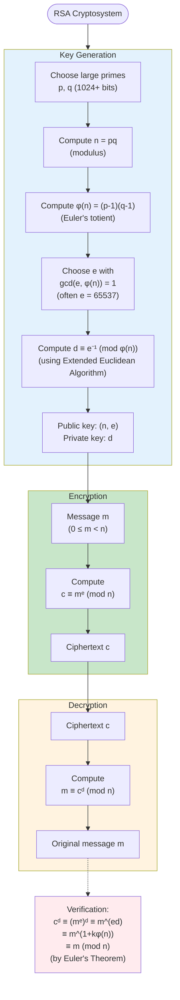

# RSA Algorithm

## Introduction

The RSA algorithm, published by Ron Rivest, Adi Shamir, and Leonard Adleman in 1977, represents one of the most significant breakthroughs in the history of cryptography. Before RSA, secure communication required parties to share secret keys through secure channels—a logistical challenge that limited the scalability of cryptographic systems. RSA solved this problem by introducing **public-key cryptography**, where anyone can encrypt a message using a publicly available key, but only the holder of a corresponding private key can decrypt it.

The security of RSA rests on a beautiful mathematical foundation: the difficulty of factoring large composite numbers. While it is computationally easy to multiply two large primes together, reversing this process—factoring the product—remains computationally infeasible for sufficiently large numbers, even with modern computers. This asymmetry between multiplication and factorization enables RSA's security guarantees.

Beyond encryption, RSA enables digital signatures, key exchange, and certificate-based authentication, making it foundational to internet security protocols including TLS/SSL, PGP, and SSH.

## Mathematical Foundation

RSA's correctness relies on **Euler's theorem**: if $\gcd(m, n) = 1$, then $m^{\phi(n)} \equiv 1 \pmod{n}$.

For RSA modulus $n = pq$ (product of distinct primes), we have $\phi(n) = (p-1)(q-1)$.

The key insight: if $ed \equiv 1 \pmod{\phi(n)}$, then $ed = 1 + k\phi(n)$ for some integer $k$, and:
$$m^{ed} = m^{1 + k\phi(n)} = m \cdot (m^{\phi(n)})^k \equiv m \cdot 1^k = m \pmod{n}$$

This means encryption with exponent $e$ followed by decryption with exponent $d$ recovers the original message.

## RSA Algorithm Flowchart

## Key Generation

The security and functionality of RSA depend critically on proper key generation.

### Step-by-Step Process

**Step 1: Choose primes $p$ and $q$**
- Select two large distinct prime numbers, typically 1024 bits or larger each
- Modern standards recommend 2048-bit primes (yielding 4096-bit modulus)
- Primes should be randomly generated and tested for primality using Miller-Rabin test
- Primes should be similar in magnitude but not too close (to resist Fermat factorization)

**Step 2: Compute modulus $n$**
$$n = pq$$

The modulus $n$ becomes part of both public and private keys. Its size (in bits) determines the key size.

**Step 3: Compute Euler's totient $\phi(n)$**
$$\phi(n) = (p-1)(q-1) = n - p - q + 1$$

This value is kept secret. Knowledge of $\phi(n)$ is equivalent to knowing the factorization of $n$.

**Step 4: Choose public exponent $e$**
- Select $e$ such that $1 < e < \phi(n)$ and $\gcd(e, \phi(n)) = 1$
- Common choice: $e = 65537 = 2^{16} + 1$ (fourth Fermat number)
- This value enables fast encryption (only 17 bits set, so exponentiation is fast)
- Verify coprimality using Euclidean algorithm

**Step 5: Compute private exponent $d$**
$$d \equiv e^{-1} \pmod{\phi(n)}$$

Compute using Extended Euclidean Algorithm. This satisfies $ed \equiv 1 \pmod{\phi(n)}$.

**Step 6: Publish keys**
- **Public key**: $(n, e)$ — shared openly
- **Private key**: $d$ (also keep $p, q, \phi(n)$ secret)

**Security note**: The primes $p$ and $q$ should be securely deleted or stored encrypted after key generation. If an attacker learns $p$ and $q$, they can compute $\phi(n)$ and then $d$, completely breaking the system.

## Encryption

**Input**: Message $m$ where $0 \leq m < n$

**Process**: Using the recipient's public key $(n, e)$, compute:
$$c \equiv m^e \pmod{n}$$

**Output**: Ciphertext $c$

**Computational method**: Use repeated squaring algorithm for efficient modular exponentiation.

**Requirements**:
- Message must be in range $[0, n-1]$
- For longer messages, break into blocks or use hybrid encryption
- In practice, use padding scheme (OAEP) for security

**Example**: With public key $(n, e) = (3233, 17)$, encrypt $m = 123$:
$$c = 123^{17} \bmod 3233$$

Using repeated squaring:
- $123^1 = 123$
- $123^2 = 15129 \equiv 1665 \pmod{3233}$
- $123^4 \equiv 1665^2 = 2772225 \equiv 2754 \pmod{3233}$
- $123^8 \equiv 2754^2 = 7584516 \equiv 2916 \pmod{3233}$
- $123^{16} \equiv 2916^2 = 8502056 \equiv 904 \pmod{3233}$
- $123^{17} = 123^{16} \cdot 123^1 \equiv 904 \cdot 123 = 111192 \equiv 855 \pmod{3233}$

Therefore, $c = 855$.

## Decryption

**Input**: Ciphertext $c$

**Process**: Using the private key $d$, compute:
$$m \equiv c^d \pmod{n}$$

**Output**: Original message $m$

**Why it works**:
$$c^d \equiv (m^e)^d = m^{ed} \equiv m^{1 + k\phi(n)} = m \cdot (m^{\phi(n)})^k \equiv m \pmod{n}$$

by Euler's theorem.

**Continuing the example**: With private key $d = 2753$, decrypt $c = 855$:
$$m = 855^{2753} \bmod 3233$$

This computation (using repeated squaring) yields $m = 123$, recovering the original message. ✓

## Complete Worked Example

Let's work through a complete RSA example with small numbers (for pedagogy; real RSA uses much larger values).

**Key Generation**:
1. Choose primes: $p = 61, q = 53$
2. Compute $n = 61 \cdot 53 = 3233$
3. Compute $\phi(n) = (61-1)(53-1) = 60 \cdot 52 = 3120$
4. Choose $e = 17$ (verify: $\gcd(17, 3120) = 1$ ✓)
5. Compute $d$: Extended Euclidean Algorithm gives $17 \cdot 2753 = 46801 = 15 \cdot 3120 + 1$, so $d = 2753$

**Public key**: $(3233, 17)$
**Private key**: $2753$

**Encryption**: Alice wants to send $m = 123$ to Bob.
$$c = 123^{17} \bmod 3233 = 855$$

Alice sends $c = 855$ over insecure channel.

**Decryption**: Bob receives $c = 855$ and computes:
$$m = 855^{2753} \bmod 3233 = 123$$

Bob recovers the original message $m = 123$. ✓

**Verification**:
$$855^{2753} \equiv (123^{17})^{2753} = 123^{17 \cdot 2753} = 123^{46801} \pmod{3233}$$

Since $46801 = 1 + 15 \cdot 3120 = 1 + 15\phi(n)$:
$$123^{46801} = 123 \cdot (123^{3120})^{15} \equiv 123 \cdot 1^{15} = 123 \pmod{3233}$$

## Security Analysis

### Hardness Assumption

**RSA problem**: Given $(n, e, c)$ where $c \equiv m^e \pmod{n}$, find $m$.

**Security basis**: The RSA problem is believed computationally intractable when:
- $n$ is sufficiently large (2048+ bits)
- $p$ and $q$ are random, similar-sized primes
- Proper padding is used

**Relationship to factoring**: If an attacker can factor $n = pq$, they can compute $\phi(n) = (p-1)(q-1)$, then find $d \equiv e^{-1} \pmod{\phi(n)}$, completely breaking the system.

### Current Key Size Recommendations

- **1024-bit**: Deprecated, considered breakable by well-funded adversaries
- **2048-bit**: Current minimum standard for most applications
- **3072-bit**: Recommended for high-security applications
- **4096-bit**: Maximum commonly used; diminishing returns beyond this

### Known Attacks

**Factorization attacks**:
- General Number Field Sieve (GNFS): Best classical factoring algorithm, subexponential complexity
- RSA-768 (768-bit modulus) was factored in 2009 after 2 years of computation
- RSA-2048 remains secure against classical computers

**Small exponent attacks**:
- If $e$ is very small and message is short, $m^e < n$, allowing direct root extraction
- **Mitigation**: Use proper padding (OAEP)

**Common modulus attack**:
- If same $n$ is used with different $e$ values, system is vulnerable
- **Mitigation**: Never reuse moduli across different key pairs

**Timing attacks**:
- Measure time for decryption operations to infer bits of private key
- **Mitigation**: Constant-time implementations, blinding

**Chosen ciphertext attacks**:
- Attacker manipulates ciphertext and observes decryption results
- **Mitigation**: Use OAEP padding, authenticate ciphertexts

### Quantum Computing Threat

**Shor's algorithm** (1994) can factor large integers in polynomial time on a quantum computer, completely breaking RSA. Large-scale quantum computers capable of running Shor's algorithm do not yet exist but are theoretically possible. This has motivated post-quantum cryptography research.

## Practical Considerations

### Padding Schemes

**Raw RSA** (textbook RSA) is insecure in practice. Always use padding:

**OAEP (Optimal Asymmetric Encryption Padding)**: Randomized padding that:
- Prevents deterministic encryption (same plaintext → same ciphertext)
- Protects against chosen ciphertext attacks
- Adds randomness to each encryption

**PKCS#1 v1.5**: Older padding standard, deprecated due to vulnerabilities

### Hybrid Encryption

RSA is **slow** compared to symmetric encryption (AES). Standard practice:

1. Generate random symmetric key $K$ (e.g., 256-bit AES key)
2. Encrypt message with AES: $c_{\text{data}} = \text{AES}_K(m)$
3. Encrypt symmetric key with RSA: $c_{\text{key}} = \text{RSA}_{\text{pub}}(K)$
4. Send $(c_{\text{key}}, c_{\text{data}})$

Recipient decrypts $K$ with RSA, then decrypts data with AES. This combines RSA's key distribution with AES's speed.

### Digital Signatures

RSA also enables digital signatures (proving message authenticity and integrity):

**Signing**: Hash message to digest $h = H(m)$, then compute signature $s \equiv h^d \pmod{n}$

**Verification**: Given $(m, s)$, compute $h' = H(m)$ and $h'' \equiv s^e \pmod{n}$. Accept if $h' = h''$.

This works because $s^e \equiv (h^d)^e = h^{ed} \equiv h \pmod{n}$.

## Historical Impact

RSA's publication in 1977 was revolutionary. For the first time, secure communication was possible without pre-shared secrets. The algorithm enabled:

- **E-commerce**: Secure online transactions
- **TLS/SSL**: Encrypted web browsing (HTTPS)
- **Email encryption**: PGP, S/MIME
- **Code signing**: Verifying software authenticity
- **Digital certificates**: PKI infrastructure

In 2000, the RSA patent expired, making the algorithm freely available worldwide and accelerating its adoption.

## Summary

The RSA algorithm demonstrates the profound power of abstract algebra in solving practical problems:

- **Public key**: $(n, e)$ for encryption
- **Private key**: $d$ for decryption
- **Encryption**: $c \equiv m^e \pmod{n}$
- **Decryption**: $m \equiv c^d \pmod{n}$
- **Correctness**: Guaranteed by Euler's theorem
- **Security**: Based on hardness of factoring $n = pq$
- **Key sizes**: 2048+ bits recommended
- **Practical use**: Hybrid encryption, digital signatures, key exchange

RSA transformed cryptography from a specialized military tool into the foundation of digital commerce and communication. Its mathematical elegance—combining modular arithmetic, Euler's theorem, and the factorization problem—exemplifies how abstract mathematics enables concrete applications that affect billions of people daily.

## Key Takeaways

- RSA enables public-key cryptography, solving the key distribution problem
- Security relies on the computational difficulty of factoring large semiprimes
- Euler's theorem proves correctness of encryption/decryption
- Proper implementation requires padding (OAEP), adequate key sizes (2048+ bits), and secure random number generation
- Hybrid encryption combines RSA key exchange with symmetric encryption for efficiency
- RSA remains widely deployed despite quantum computing threats, driving post-quantum cryptography research
- The algorithm exemplifies the practical power of abstract algebra and number theory
