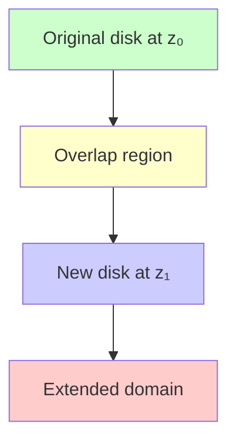

# Analytic Continuation

Analytic continuation is the process of extending the domain of an analytic function beyond its original region of definition while preserving analyticity. This profound technique reveals that analytic functions defined on small regions can often be uniquely extended to much larger domains, exposing deep connections between seemingly different function representations. Analytic continuation is fundamental to understanding special functions, the Riemann zeta function, and many results in number theory and mathematical physics.

## The Concept and Motivation

### The Problem

Many important functions are initially defined only on restricted domains:

- **Geometric series**: $\sum_{n=0}^{\infty} z^n$ converges only for $|z| < 1$
- **Riemann zeta function**: $\zeta(s) = \sum_{n=1}^{\infty} n^{-s}$ converges only for $\text{Re}(s) > 1$
- **Gamma function**: $\Gamma(s) = \int_0^\infty t^{s-1}e^{-t} dt$ converges only for $\text{Re}(s) > 0$

Yet these functions "want" to exist on larger domains. The geometric series equals $\frac{1}{1-z}$, which is defined everywhere except $z = 1$. Can we systematically extend functions beyond their initial domains of convergence?

### The Answer

Analytic continuation provides a rigorous framework for such extensions. The key insight is the **identity theorem**: if two analytic functions agree on a set with a limit point, they must agree on their entire common domain of analyticity.

This means: **if an extension exists, it is unique**.

## The Identity Theorem

**Theorem (Identity Theorem)**: Let $f$ and $g$ be analytic on a connected domain $D$. If $f(z_n) = g(z_n)$ for a sequence $\{z_n\}$ with a limit point in $D$, then $f(z) = g(z)$ for all $z \in D$.

### Proof

Let $h = f - g$. Then $h$ is analytic and $h(z_n) = 0$ for all $n$.

Let $z_0 = \lim z_n \in D$. By continuity, $h(z_0) = 0$.

Expand $h$ in a Taylor series around $z_0$:
$$h(z) = \sum_{k=0}^{\infty} a_k (z - z_0)^k$$

If $h$ is not identically zero, let $m$ be the smallest index with $a_m \neq 0$. Then:
$$h(z) = (z - z_0)^m \left(a_m + a_{m+1}(z-z_0) + \cdots\right)$$

The factor in parentheses is nonzero at $z_0$ (it equals $a_m$), so it's nonzero in a neighborhood of $z_0$. But then $h$ has only finitely many zeros near $z_0$, contradicting that $h(z_n) = 0$ for infinitely many $z_n \to z_0$.

Therefore $h \equiv 0$ near $z_0$, and by connectedness, $h \equiv 0$ on all of $D$.

### Consequence for Analytic Continuation

If $f$ is analytic on $D_1$ and there exists an analytic function $g$ on a larger domain $D_2 \supset D_1$ with $f = g$ on $D_1$, then $g$ is uniquely determined by $f$.

We call $g$ the **analytic continuation** of $f$ to $D_2$.

## Methods of Analytic Continuation

### Power Series Chains

The most direct method uses overlapping disks of convergence.

**Procedure**:
1. Start with a Taylor series for $f$ centered at $z_0$ with radius of convergence $R_0$
2. Pick a point $z_1$ with $|z_1 - z_0| < R_0$
3. Compute the Taylor series of $f$ at $z_1$
4. This new series may converge in a disk extending beyond the original

**Example**: Consider $f(z) = \log(1 + z)$ defined by:
$$\log(1 + z) = z - \frac{z^2}{2} + \frac{z^3}{3} - \cdots, \quad |z| < 1$$

To continue past the boundary $|z| = 1$, expand around $z = 0.5$:
$$\log(1.5 + w) = \log(1.5) + \sum_{n=1}^{\infty} \frac{(-1)^{n+1}}{n \cdot 1.5^n} w^n$$

This converges for $|w| < 1.5$, extending the domain.

### Functional Equations

Some functions satisfy equations that define them on larger domains.

**Example: Riemann Zeta Function**

The series $\zeta(s) = \sum_{n=1}^{\infty} n^{-s}$ converges only for $\text{Re}(s) > 1$.

The **functional equation**:
$$\zeta(s) = 2^s \pi^{s-1} \sin\left(\frac{\pi s}{2}\right) \Gamma(1-s) \zeta(1-s)$$

defines $\zeta(s)$ for $\text{Re}(s) < 0$ in terms of $\zeta(1-s)$ where $\text{Re}(1-s) > 1$.

Combined with intermediate techniques, $\zeta$ extends to all of $\mathbb{C}$ except for a simple pole at $s = 1$.

### Integral Representations

Integral formulas often extend naturally beyond the original domain.

**Example: Gamma Function**

The integral $\Gamma(s) = \int_0^\infty t^{s-1}e^{-t} dt$ converges for $\text{Re}(s) > 0$.

Integration by parts gives:
$$\Gamma(s+1) = s\Gamma(s)$$

Rearranging: $\Gamma(s) = \frac{\Gamma(s+1)}{s}$

This defines $\Gamma(s)$ for $-1 < \text{Re}(s) < 0$ (except $s = 0$).

Iterating: $\Gamma(s) = \frac{\Gamma(s+n)}{s(s+1)\cdots(s+n-1)}$ extends $\Gamma$ to all of $\mathbb{C}$ except for simple poles at $s = 0, -1, -2, \ldots$

## The Schwarz Reflection Principle

A powerful tool when boundary values are known.

**Theorem**: Let $f$ be analytic in the upper half-plane and continuous up to the real axis. If $f$ takes real values on the real axis, then $f$ can be continued to the lower half-plane by:
$$f(\bar{z}) = \overline{f(z)}$$

The extended function is analytic on $\mathbb{C}$ (minus any singularities of $f$).

### Generalization

More generally, if $f$ is analytic in a domain $D$ symmetric about the real axis, and $f$ is real on a real interval, then:
- $f(\bar{z}) = \overline{f(z)}$ throughout $D$
- The Taylor coefficients of $f$ at any real point are all real

## Natural Boundaries

Analytic continuation is not always possible. Some functions have **natural boundaries**: curves beyond which no analytic continuation exists.

### Example: Lacunary Series

The function:
$$f(z) = \sum_{n=0}^{\infty} z^{2^n} = z + z^2 + z^4 + z^8 + z^{16} + \cdots$$

converges for $|z| < 1$, but the unit circle is a natural boundary.

**Why**: The gaps in exponents grow exponentially. There is a dense set of points on the unit circle where the partial sums oscillate wildly. No portion of the circle can be "crossed" by analytic continuation.

### Example: Dirichlet Series

Certain Dirichlet series have natural boundaries along vertical lines in the complex plane, preventing extension to other half-planes.

## Monodromy and Multi-Valued Functions

When continuing around closed paths, we may return with a different value.

### Example: Logarithm

Starting with $\log z$ near $z = 1$ and continuing around the origin:
- Going counterclockwise once returns $\log z + 2\pi i$
- Each circuit adds another $2\pi i$

This reveals that $\log z$ is inherently multi-valued. The **Riemann surface** for $\log z$ is an infinite helicoid covering the punctured plane.

### Example: Square Root

$\sqrt{z}$ continued around the origin returns to $-\sqrt{z}$. The Riemann surface is a two-sheeted cover of $\mathbb{C}$, branched at the origin.

### Monodromy Group

The **monodromy group** of a function captures how analytic continuation around different loops permutes the branches of a multi-valued function. This leads to deep connections with:
- Galois theory and algebraic functions
- Differential equations (monodromy of solutions)
- Topology (fundamental group of the domain)

## Applications

### Number Theory

The Riemann zeta function's analytic continuation reveals:
- The trivial zeros at $s = -2, -4, -6, \ldots$
- The critical strip $0 < \text{Re}(s) < 1$ containing the nontrivial zeros
- The Riemann Hypothesis (all nontrivial zeros have $\text{Re}(s) = 1/2$)

### Physics

- **Quantum field theory**: Analytic continuation in momenta (Wick rotation from Euclidean to Minkowski space)
- **Statistical mechanics**: Extending partition functions to complex temperatures
- **Scattering theory**: Analytic continuation to complex energies reveals resonances and bound states

### Special Functions

Most special functions (Bessel, Legendre, hypergeometric) are defined initially by series or integrals with restricted convergence, then extended via analytic continuation.

## Common Mistakes to Avoid

1. **Assuming continuation always exists**: Natural boundaries are real. Not every function extends beyond its initial domain.

2. **Forgetting uniqueness conditions**: The identity theorem requires the domains to overlap on a set with a limit point—not just a single point.

3. **Ignoring multi-valuedness**: Continuation around branch points changes the function value. Track which sheet you're on.

4. **Confusing the function with its series**: The geometric series $\sum z^n$ and the function $\frac{1}{1-z}$ are equal where the series converges, but only the rational function exists at $z = 2$.

5. **Forgetting to check analyticity**: An extension must be analytic on the extended domain, not just continuous or defined.

## Summary

Analytic continuation is one of the most profound concepts in complex analysis:

- **Uniqueness**: If an analytic extension exists, it is unique (identity theorem)
- **Methods**: Power series chains, functional equations, integral representations, Schwarz reflection
- **Limits**: Natural boundaries mark insurmountable obstacles to continuation
- **Multi-valuedness**: Continuation around branch points reveals the true structure of functions
- **Applications**: Number theory (zeta function), physics (quantum field theory), special functions

The ability to extend functions beyond their initial definitions—while respecting the rigid constraints of analyticity—reveals the deep structure of complex functions and their interconnections. This makes analytic continuation not just a technique but a fundamental principle in understanding the complex plane.

## Key Takeaways

- Analytic continuation extends functions beyond their original domains of definition
- The identity theorem guarantees uniqueness: any two extensions must agree
- Power series chains, functional equations, and integral representations are key tools
- Not all functions can be continued: natural boundaries are real obstacles
- Multi-valued functions arise from continuation around branch points
- The Riemann zeta function's properties are revealed through analytic continuation
- This technique is fundamental to both pure mathematics and theoretical physics
