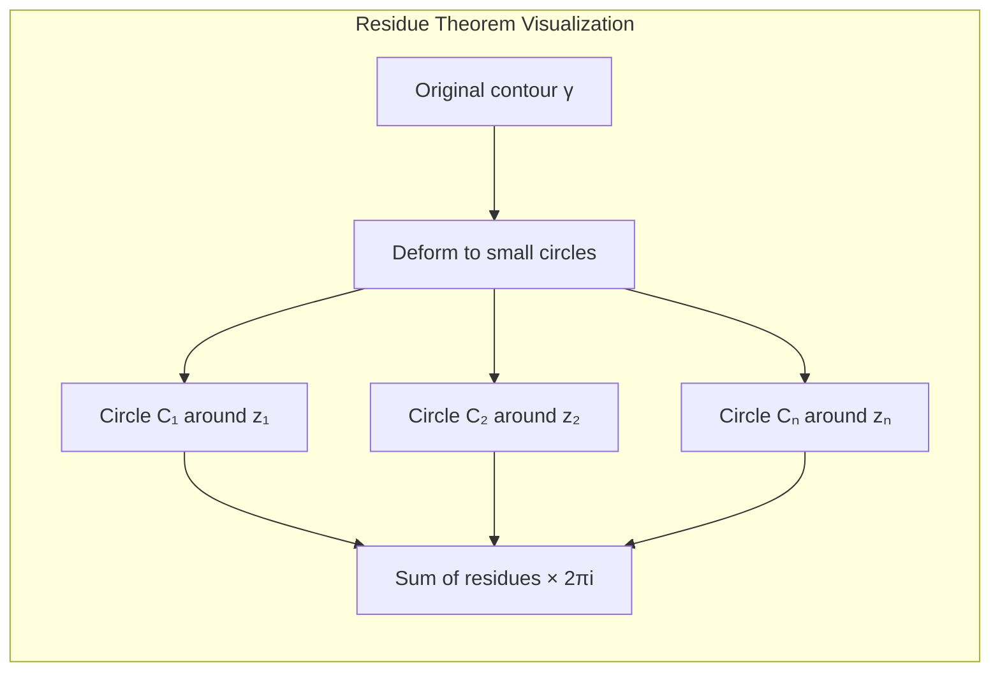

# The Residue Theorem

The residue theorem is the crown jewel of complex integration. It states that the integral of a function around a closed contour equals $2\pi i$ times the sum of residues at singularities inside the contour. This remarkable result transforms difficult integration problems into simple algebraic calculations and has countless applications in mathematics, physics, and engineering.

## Statement

**Theorem (Residue Theorem)**: Let $f$ be analytic in a domain $D$ except for isolated singularities at $z_1, \ldots, z_n$. Let $\gamma$ be a simple closed contour in $D$ enclosing these singularities (and no others). Then:

$$\oint_\gamma f(z) \, dz = 2\pi i \sum_{k=1}^n \text{Res}(f, z_k)$$

The residue $\text{Res}(f, z_k)$ at a singularity $z_k$ is defined as the coefficient $a_{-1}$ in the Laurent series expansion of $f$ around $z_k$:

$$f(z) = \sum_{n=-\infty}^{\infty} a_n(z - z_k)^n$$

This theorem reduces contour integration to a purely algebraic problem: finding coefficients in Laurent series expansions.

## Proof

The proof relies on several key ideas from earlier in complex analysis.

**Step 1: Contour Deformation**

By Cauchy's theorem and the deformation of contours principle, we can replace the contour $\gamma$ with a collection of small circles $C_1, \ldots, C_n$ around each singularity $z_k$, oriented counterclockwise. Since $f$ is analytic in the region between $\gamma$ and these circles, we have:

$$\oint_\gamma f(z) \, dz = \sum_{k=1}^n \oint_{C_k} f(z) \, dz$$

**Step 2: Laurent Series Integration**

Around each singularity $z_k$, we have the Laurent series:

$$f(z) = \sum_{n=-\infty}^{\infty} a_n^{(k)}(z - z_k)^n$$

where $a_n^{(k)}$ denotes the coefficient in the expansion around $z_k$. Integrating term-by-term around the circle $C_k$:

$$\oint_{C_k} f(z) \, dz = \oint_{C_k} \sum_{n=-\infty}^{\infty} a_n^{(k)}(z - z_k)^n \, dz = \sum_{n=-\infty}^{\infty} a_n^{(k)} \oint_{C_k} (z - z_k)^n \, dz$$

**Step 3: Computing Each Integral**

For a circle $C_k$ of radius $r$ centered at $z_k$, parametrize as $z = z_k + re^{i\theta}$ for $\theta \in [0, 2\pi]$:

$$\oint_{C_k} (z - z_k)^n \, dz = \int_0^{2\pi} r^n e^{in\theta} \cdot ire^{i\theta} \, d\theta = ir^{n+1} \int_0^{2\pi} e^{i(n+1)\theta} \, d\theta$$

When $n \neq -1$:
$$\int_0^{2\pi} e^{i(n+1)\theta} \, d\theta = \frac{e^{i(n+1)\theta}}{i(n+1)}\bigg|_0^{2\pi} = 0$$

When $n = -1$:
$$\int_0^{2\pi} e^{0} \, d\theta = 2\pi$$

Therefore:
$$\oint_{C_k} (z - z_k)^n \, dz = \begin{cases} 2\pi i & \text{if } n = -1 \\ 0 & \text{if } n \neq -1 \end{cases}$$

**Step 4: Conclusion**

Only the $n = -1$ term contributes to the integral:

$$\oint_{C_k} f(z) \, dz = 2\pi i \cdot a_{-1}^{(k)} = 2\pi i \cdot \text{Res}(f, z_k)$$

Summing over all singularities:

$$\oint_\gamma f(z) \, dz = \sum_{k=1}^n 2\pi i \cdot \text{Res}(f, z_k) = 2\pi i \sum_{k=1}^n \text{Res}(f, z_k)$$

This completes the proof.

## Examples

### Example 1: Simple Poles

Evaluate $\oint_{|z|=2} \frac{1}{z(z-1)} \, dz$.

**Solution**: First, identify the singularities. The function $f(z) = \frac{1}{z(z-1)}$ has singularities where the denominator vanishes: $z = 0$ and $z = 1$. Both are simple poles (the denominator has a simple zero at each point), and both lie inside the contour $|z| = 2$.

For a simple pole at $z_0$, the residue formula is:
$$\text{Res}(f, z_0) = \lim_{z \to z_0} (z - z_0) f(z)$$

At $z = 0$:
$$\text{Res}(f, 0) = \lim_{z \to 0} z \cdot \frac{1}{z(z-1)} = \lim_{z \to 0} \frac{1}{z-1} = \frac{1}{-1} = -1$$

At $z = 1$:
$$\text{Res}(f, 1) = \lim_{z \to 1} (z-1) \cdot \frac{1}{z(z-1)} = \lim_{z \to 1} \frac{1}{z} = 1$$

By the residue theorem:
$$\oint_{|z|=2} \frac{1}{z(z-1)} \, dz = 2\pi i(-1 + 1) = 0$$

This result makes sense: the two residues cancel exactly.

### Example 2: Higher Order Pole

Evaluate $\oint_{|z|=1} \frac{e^z}{z^3} \, dz$.

**Solution**: The function has a pole of order 3 at $z = 0$, which lies inside the contour. For a pole of order $m$ at $z_0$, the residue is:

$$\text{Res}(f, z_0) = \frac{1}{(m-1)!} \lim_{z \to z_0} \frac{d^{m-1}}{dz^{m-1}}[(z-z_0)^m f(z)]$$

Here $m = 3$, so:
$$\text{Res}\left(\frac{e^z}{z^3}, 0\right) = \frac{1}{2!} \lim_{z \to 0} \frac{d^2}{dz^2}[z^3 \cdot \frac{e^z}{z^3}] = \frac{1}{2} \lim_{z \to 0} \frac{d^2}{dz^2}[e^z]$$

$$= \frac{1}{2} \lim_{z \to 0} e^z = \frac{1}{2}$$

Therefore:
$$\oint_{|z|=1} \frac{e^z}{z^3} \, dz = 2\pi i \cdot \frac{1}{2} = \pi i$$

### Example 3: Multiple Singularities

Evaluate $\oint_{|z|=3} \frac{z}{(z^2+1)(z-2)} \, dz$.

**Solution**: Factor $z^2 + 1 = (z-i)(z+i)$, giving:
$$f(z) = \frac{z}{(z-i)(z+i)(z-2)}$$

Singularities: $z = i$, $z = -i$, and $z = 2$. All are simple poles. Check which lie inside $|z| = 3$:
- $|i| = 1 < 3$ ✓
- $|-i| = 1 < 3$ ✓
- $|2| = 2 < 3$ ✓

All three singularities are inside the contour.

For a rational function $f(z) = \frac{p(z)}{q(z)}$ with a simple pole at $z_0$ (where $p(z_0) \neq 0$ and $q$ has a simple zero):
$$\text{Res}(f, z_0) = \frac{p(z_0)}{q'(z_0)}$$

Here $p(z) = z$ and $q(z) = (z^2+1)(z-2) = z^3 - 2z^2 + z - 2$.

Thus $q'(z) = 3z^2 - 4z + 1$.

At $z = i$:
$$\text{Res}(f, i) = \frac{i}{3i^2 - 4i + 1} = \frac{i}{-3 - 4i + 1} = \frac{i}{-2 - 4i} = \frac{i(-2 + 4i)}{(-2-4i)(-2+4i)} = \frac{-2i - 4}{4 + 16} = \frac{-4 - 2i}{20} = \frac{-2 - i}{10}$$

At $z = -i$:
$$\text{Res}(f, -i) = \frac{-i}{3(-i)^2 - 4(-i) + 1} = \frac{-i}{-3 + 4i + 1} = \frac{-i}{-2 + 4i} = \frac{-i(-2 - 4i)}{(-2+4i)(-2-4i)} = \frac{2i - 4}{4 + 16} = \frac{-4 + 2i}{20} = \frac{-2 + i}{10}$$

At $z = 2$:
$$\text{Res}(f, 2) = \frac{2}{3(4) - 4(2) + 1} = \frac{2}{12 - 8 + 1} = \frac{2}{5}$$

Sum of residues:
$$\sum \text{Res} = \frac{-2-i}{10} + \frac{-2+i}{10} + \frac{2}{5} = \frac{-4}{10} + \frac{4}{10} = 0$$

Therefore:
$$\oint_{|z|=3} \frac{z}{(z^2+1)(z-2)} \, dz = 2\pi i \cdot 0 = 0$$

## Geometric Interpretation

The residue theorem has a beautiful geometric interpretation. The integral $\oint_\gamma f(z) \, dz$ measures how much the function "winds" around the origin when weighted by $f$. The residues capture local winding behavior near each singularity, and the theorem says that the global winding is the sum of local contributions.

## Connection to Cauchy's Integral Formula

The residue theorem generalizes Cauchy's integral formula. If $f$ is analytic everywhere inside $\gamma$, then all residues are zero, giving $\oint_\gamma f(z) \, dz = 0$, which is Cauchy's theorem. If $f(z) = \frac{g(z)}{z - z_0}$ where $g$ is analytic, then the only singularity is a simple pole at $z_0$ with residue $g(z_0)$, giving $\oint_\gamma \frac{g(z)}{z-z_0} \, dz = 2\pi i g(z_0)$, which is Cauchy's integral formula.

## Common Mistakes

1. **Forgetting to check which singularities are inside the contour**: Always verify $|z_k| < R$ for contour $|z| = R$.

2. **Using the wrong residue formula**: Simple poles, higher-order poles, and essential singularities require different techniques.

3. **Sign errors in orientation**: The contour must be traversed counterclockwise for the standard formula.

4. **Arithmetic errors in partial fractions**: When dealing with multiple poles, carefully compute each residue.

5. **Not simplifying before computing residues**: Sometimes algebraic manipulation greatly simplifies residue calculations.

## Summary

- The residue theorem: $\oint_\gamma f = 2\pi i \sum \text{Res}(f, z_k)$
- Residue = coefficient $a_{-1}$ in Laurent series
- Proof uses contour deformation and Laurent series integration
- Only the $n = -1$ term in Laurent series contributes to contour integrals
- Transforms contour integrals into residue calculations
- One of the most powerful tools in mathematics
- Applications: evaluating real integrals, summing series, inverse transforms, solving differential equations
- Generalizes Cauchy's integral formula and Cauchy's theorem

The residue theorem is truly remarkable: it reduces a potentially difficult integral over a curve in the complex plane to a sum of algebraic quantities (residues) at isolated points. This transformation from analysis to algebra is one of the great achievements of complex analysis.
