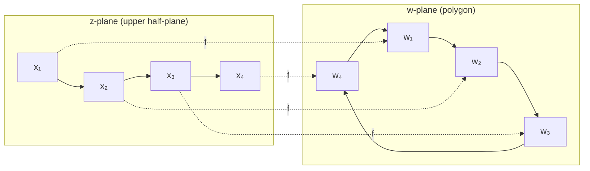

# Schwarz-Christoffel Transformation

The Schwarz-Christoffel transformation provides an explicit formula for conformal mappings from the upper half-plane to polygonal regions. This powerful technique has applications in electrostatics, fluid dynamics, and other areas requiring solutions to Laplace's equation in polygonal domains. Unlike the Riemann Mapping Theorem, which guarantees existence non-constructively, the Schwarz-Christoffel formula gives a concrete integral representation.

## Motivation and Problem Setting

Many physical problems involve domains bounded by straight line segments:
- Channels and ducts in fluid mechanics
- Polygonal conductors in electrostatics
- Heat conduction regions with straight edges
- Airfoils and wings (approximated by polygons)

The Schwarz-Christoffel formula constructs conformal maps to such regions systematically, enabling solutions to Laplace's equation by transformation to the half-plane where explicit solutions exist.

**Goal**: Map the upper half-plane $\mathbb{H} = \{z : \text{Im}(z) > 0\}$ conformally onto the interior of a polygon with specified vertices and angles.

## The Schwarz-Christoffel Formula

**Theorem (Schwarz-Christoffel)**: A conformal map from $\mathbb{H}$ onto a polygon with vertices $w_1, \ldots, w_n$ and interior angles $\alpha_1\pi, \ldots, \alpha_n\pi$ (where each $0 < \alpha_k < 2$) is given by:

$$f(z) = A + C\int_{z_0}^z \prod_{k=1}^{n} (\zeta - x_k)^{\alpha_k - 1} d\zeta$$

where:
- $x_1 < x_2 < \cdots < x_n$ are real points (preimages of vertices)
- $\alpha_k$ is the interior angle at vertex $w_k$ in units of $\pi$
- $A, C$ are complex constants
- The angle sum satisfies $\sum_{k=1}^n \alpha_k = n - 2$ (polygon angle sum formula)

## Derivation of the Formula

The formula arises from understanding how conformal maps behave at polygon vertices.

### Angle Change at Vertices

At vertex $w_k$ with interior angle $\alpha_k\pi$, the boundary direction changes by the exterior angle $(1-\alpha_k)\pi$.

If $f$ maps $x_k$ to $w_k$, then as $z$ passes through $x_k$ along the real axis:
$$\arg(f'(z)) \text{ jumps by } (1-\alpha_k)\pi$$

### The Derivative Formula

This jump behavior suggests:
$$f'(z) = C\prod_{k=1}^n (z - x_k)^{\alpha_k - 1}$$

**Verification**: Near $z = x_k$:
- $f'(z) \approx (z - x_k)^{\alpha_k - 1} \cdot [\text{nonzero factor}]$
- As $z$ crosses $x_k$ on the real axis, $\arg(z - x_k)$ changes from $\pi$ to $0$
- Therefore $\arg(f')$ changes by $(\alpha_k - 1)\pi = -(1 - \alpha_k)\pi$

The exterior angle is exactly $(1-\alpha_k)\pi$, confirming the formula.

### Integration

Integrating the derivative gives:
$$f(z) = A + C\int_{z_0}^z \prod_{k=1}^{n} (\zeta - x_k)^{\alpha_k - 1} d\zeta$$

where $A$ is the constant of integration (determining translation) and $C$ controls rotation and scaling.

## Simple Examples

### Upper Half-Plane to Infinite Strip

Map $\mathbb{H}$ to the infinite strip $0 < \text{Im}(w) < \pi$.

This is a "polygon" with two vertices at infinity (where the strip's parallel edges meet at $\pm\infty$), each with interior angle $\pi$ ($\alpha_1 = \alpha_2 = 1$).

Since vertices are at infinity, we need only one finite vertex at $w = 0$ with angle $\pi$.

**Solution**: The map is:
$$f(z) = \log z$$

which maps $\mathbb{H}$ to the strip $0 < \text{Im}(w) < \pi$. The real axis maps to the strip boundaries: positive real axis to $\text{Im}(w) = 0$, negative real axis to $\text{Im}(w) = \pi$.

### Upper Half-Plane to First Quadrant

Map $\mathbb{H}$ to the first quadrant $\{w : \text{Re}(w) > 0, \text{Im}(w) > 0\}$.

The first quadrant is an "infinite polygon" with one finite vertex at the origin (interior angle $\pi/2$, so $\alpha = 1/2$) and vertices at infinity on the positive real and imaginary axes (each with angle $\pi$).

Taking the preimage of the origin at $z = 0$:
$$f'(z) = Cz^{1/2 - 1} = \frac{C}{\sqrt{z}}$$

Integrating:
$$f(z) = 2C\sqrt{z} + A$$

Choosing $C = 1, A = 0$: $f(z) = 2\sqrt{z}$ maps $\mathbb{H}$ to the right half-plane, so $f(z) = \sqrt{z}$ maps to the first quadrant.

### Upper Half-Plane to Rectangle

Map $\mathbb{H}$ to a rectangle with vertices at $0, K, K + iK', iK'$.

All four interior angles are $\pi/2$, so $\alpha_1 = \alpha_2 = \alpha_3 = \alpha_4 = 1/2$.

$$f'(z) = \frac{C}{\sqrt{(z - x_1)(z - x_2)(z - x_3)(z - x_4)}}$$

By symmetry, take preimages at $x_1 = -1/k$, $x_2 = -1$, $x_3 = 1$, $x_4 = 1/k$ for some $0 < k < 1$:

$$f(z) = \int_0^z \frac{d\zeta}{\sqrt{(1 - \zeta^2)(1 - k^2\zeta^2)}}$$

This is the **incomplete elliptic integral of the first kind**! The side lengths involve the complete elliptic integrals $K(k)$ and $K'(k) = K(\sqrt{1-k^2})$.

### Upper Half-Plane to Triangle

Map $\mathbb{H}$ to a triangle with interior angles $\alpha\pi, \beta\pi, \gamma\pi$ where $\alpha + \beta + \gamma = 1$.

Take preimages at $x_1 = 0, x_2 = 1, x_3 = \infty$:

$$f(z) = C\int_0^z \zeta^{\alpha - 1}(\zeta - 1)^{\beta - 1} d\zeta$$

**Special case** (equilateral triangle): $\alpha = \beta = \gamma = 1/3$.

The integral involves the **Beta function** and related special functions.

## Parameter Determination

The Schwarz-Christoffel formula involves several parameters:
- Positions $x_1, \ldots, x_n$ on the real axis (preimages of vertices)
- Complex constants $A$ (translation) and $C$ (rotation + scaling)

**Degrees of freedom analysis**:
- The $n$ real preimage points give $n$ real parameters
- By Möbius invariance of $\mathbb{H}$, we can fix 3 of these (e.g., $x_1 = 0, x_2 = 1, x_n = \infty$)
- This leaves $n - 3$ real parameters
- The complex constants $A, C$ give 4 real parameters

**Constraints from polygon geometry**:
- The $n$ vertex positions provide $2n$ real constraints
- The angle constraints are automatically satisfied

For a general $n$-gon, we must solve $n - 3$ transcendental equations to determine the free preimage positions.

## Handling Infinite Vertices

Vertices at infinity are handled by sending the corresponding preimage to $\infty$.

**Procedure**: If vertex $w_k$ is at infinity with angle $\alpha_k\pi$, omit the factor $(z - x_k)^{\alpha_k - 1}$ from the product and send $x_k \to \infty$.

**Example**: For the semi-infinite strip $\{w : 0 < \text{Re}(w) < 1, \text{Im}(w) > 0\}$:
- Finite vertices at $w = 0$ and $w = 1$ (both with angle $\pi/2$)
- Two vertices at infinity (angle $\pi$ each)

$$f(z) = \frac{1}{\pi}\sin^{-1}(z)$$

## Applications

### Electrostatics

**Problem**: Find the electric potential in a region with polygonal conducting boundaries.

**Method**:
1. Map the polygonal region to the upper half-plane via inverse Schwarz-Christoffel
2. Solve Laplace's equation in the half-plane (explicit solution via Poisson kernel)
3. Transform the solution back to the polygon

**Example**: Potential between a grounded plate and a charged polygonal conductor.

### Fluid Flow

**Problem**: Model incompressible flow through channels with corners or around obstacles with straight edges.

**Method**:
1. Map flow domain to half-plane
2. Use complex potential for parallel flow: $\Omega(z) = Uz$
3. Transform back to find streamlines and velocity field

**Example**: Flow in a channel with a step, flow around a polygonal obstacle.

### Heat Conduction

**Problem**: Find steady-state temperature distribution in a plate with polygonal boundary.

**Method**: Same as electrostatics—transform, solve, transform back.

## Practical Computation

1. **Choose preimages**: Fix three by Möbius symmetry (e.g., $0, 1, \infty$)
2. **Set up equations**: Require vertex positions to match polygon
3. **Solve numerically**: Use Newton's method or optimization
4. **Evaluate integral**: Numerical integration (may require special handling near singularities)
5. **Verify**: Check that computed map has correct geometry

Software packages exist for computing Schwarz-Christoffel maps:
- **MATLAB**: SC Toolbox (Driscoll)
- **Python**: `schwarz` and related packages
- **Mathematica**: Built-in elliptic function support

## Limitations and Challenges

1. **Parameter problem complexity**: Determining preimage positions requires solving transcendental equations
2. **Special functions**: Rectangle and other cases involve elliptic integrals
3. **Numerical issues**: Integrand singularities require careful handling
4. **Many vertices**: Computational cost grows with polygon complexity

## Summary

- **Schwarz-Christoffel formula**: Explicit conformal map from half-plane to polygon via integral
- **Formula**: $f(z) = A + C\int \prod (z - x_k)^{\alpha_k - 1} dz$
- **Parameters**: Preimage positions $x_k$, interior angles $\alpha_k\pi$, constants $A, C$
- **Simple cases**: Strip (logarithm), first quadrant (square root), triangle (Beta function)
- **Rectangle**: Involves elliptic integrals
- **Applications**: Electrostatics, fluid flow, heat conduction in polygonal domains
- **Challenges**: Parameter determination, special function evaluation
- **Software**: Numerical toolboxes available for practical computation

The Schwarz-Christoffel transformation exemplifies the power of complex analysis to provide explicit, constructive solutions to geometric mapping problems that would otherwise require numerical methods.
