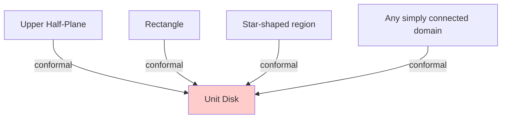

# Riemann Mapping Theorem

The Riemann Mapping Theorem is one of the crown jewels of complex analysis, asserting that any simply connected proper subdomain of the complex plane can be conformally mapped to the unit disk. This profound result demonstrates the remarkable rigidity and uniformity of complex geometry, showing that simply connected domains have a hidden equivalence invisible in real analysis.

## Statement of the Theorem

**Theorem (Riemann Mapping Theorem)**: Let $\Omega \subsetneq \mathbb{C}$ be a simply connected domain (not equal to all of $\mathbb{C}$). Then there exists a conformal map (biholomorphic function) $f: \Omega \to \mathbb{D}$, where $\mathbb{D} = \{z : |z| < 1\}$ is the unit disk.

Moreover, for any $z_0 \in \Omega$ and any $\theta \in \mathbb{R}$, there is a unique such map with:
- $f(z_0) = 0$
- $\arg(f'(z_0)) = \theta$

The conditions $f(z_0) = 0$ and $f'(z_0) > 0$ (taking $\theta = 0$) uniquely determine the map.

## Significance and Implications

### Universal Model Domain

Every simply connected domain (except $\mathbb{C}$ itself) is conformally equivalent to the unit disk. This means:
- The half-plane is equivalent to the disk
- Any region bounded by a Jordan curve is equivalent to the disk
- Weird, fractal-boundaried domains are equivalent to the disk

### Uniqueness via Normalization

The three real parameters (fixing $z_0 \mapsto 0$ and the argument of the derivative) eliminate the ambiguity from disk automorphisms. Without normalization, there would be a 3-parameter family of conformal maps.

### Non-Constructive Nature

The proof uses compactness arguments (normal families) and doesn't provide an explicit formula for the map. For specific domains, finding the actual map requires separate work (Schwarz-Christoffel, etc.).

### Dimension-Specificity

There is no analogue in higher dimensions. In $\mathbb{C}^n$ ($n \geq 2$), the unit ball and unit polydisk are not biholomorphically equivalent (they have different automorphism groups). The Riemann Mapping Theorem is a uniquely two-dimensional phenomenon.

## Key Ideas of the Proof

The modern proof uses the theory of normal families and an extremal principle.

### Step 1: Reducing to Bounded Domains

If $\Omega \neq \mathbb{C}$, there exists a point $a \notin \Omega$. The function:
$$g(z) = \sqrt{z - a}$$

(choosing a branch, which is possible since $\Omega$ is simply connected and $a \notin \Omega$) is injective on $\Omega$. Moreover, since $g(z_1) = -g(z_2)$ would imply $z_1 = z_2$, the image $g(\Omega)$ avoids some disk around the origin. By further composition with a Möbius transformation, we can assume $\Omega$ is bounded.

### Step 2: The Family of Competing Functions

Fix $z_0 \in \Omega$ and let $\mathcal{F}$ be the family of all injective analytic functions $f: \Omega \to \mathbb{D}$ with $f(z_0) = 0$.

By Step 1 and composition with linear maps, $\mathcal{F}$ is non-empty.

### Step 3: Maximizing the Derivative

Consider the quantity $|f'(z_0)|$ for $f \in \mathcal{F}$.

**Claim**: There exists $f^* \in \mathcal{F}$ that maximizes $|f'(z_0)|$.

**Proof**: The family $\mathcal{F}$ is:
- Locally bounded (since $f(\Omega) \subseteq \mathbb{D}$, we have $|f(z)| < 1$ everywhere)
- Hence normal by Montel's theorem

Take a maximizing sequence $\{f_n\}$ with $|f_n'(z_0)| \to M = \sup_{f \in \mathcal{F}} |f'(z_0)|$. By normality, some subsequence converges locally uniformly to an analytic function $f^*$. By Hurwitz's theorem, $f^*$ is either constant or injective. Since $|f^*{}'(z_0)| = M > 0$ (the family contains non-constant functions), $f^*$ is injective and achieves the maximum.

### Step 4: The Maximizer is Surjective

**Claim**: $f^*(\Omega) = \mathbb{D}$.

**Proof by contradiction**: Suppose there exists $w_0 \in \mathbb{D} \setminus f^*(\Omega)$.

Define the disk automorphism:
$$\phi(w) = \frac{w - w_0}{1 - \overline{w_0}w}$$

Then $\phi \circ f^*: \Omega \to \mathbb{D}$ is injective with $\phi(f^*(z_0)) = \phi(0) = -w_0 \neq 0$.

Now take a square root: since $\Omega$ is simply connected and $-w_0 \neq 0$, we can define:
$$h(z) = \sqrt{\phi(f^*(z))}$$

which maps $\Omega$ injectively to $\mathbb{D}$. Finally, compose with another Möbius transformation to send $h(z_0)$ to $0$, obtaining $\tilde{f} \in \mathcal{F}$.

**Key computation**: By the chain rule and properties of the square root and Möbius maps:
$$|\tilde{f}'(z_0)| > |f^*{}'(z_0)|$$

This contradicts the maximality of $f^*$. Therefore $f^*$ is surjective.

### Step 5: Uniqueness

Given the normalization $f(z_0) = 0$ and $\arg(f'(z_0)) = \theta$, uniqueness follows from the extremal property: if $g$ were another such map, the composition $f^{-1} \circ g$ would be an automorphism of $\Omega$ fixing $z_0$ with a specific derivative, forcing it to be the identity.

## Examples with Explicit Formulas

Despite the non-constructive proof, many domains have known Riemann maps.

### Upper Half-Plane to Disk

$$f(z) = \frac{z - i}{z + i}$$

**Verification**:
- $f(i) = 0$ (maps the "center" of $\mathbb{H}$ to $0$)
- Real axis maps to $|w| = 1$
- Upper half-plane maps to interior of disk

### Right Half-Plane to Disk

$$f(z) = \frac{z - 1}{z + 1}$$

Maps $\{z : \text{Re}(z) > 0\}$ to $\mathbb{D}$, with $f(1) = 0$.

### Horizontal Strip to Disk

For the strip $\{z : |\text{Im}(z)| < \pi/2\}$:
$$f(z) = \tanh(z)$$

The exponential first maps the strip to the right half-plane, then a Möbius transformation completes the map.

### Sector to Disk

For the sector $\{z : 0 < \arg(z) < \alpha\}$:
1. $w = z^{\pi/\alpha}$ maps the sector to the upper half-plane
2. Compose with the half-plane to disk map

Combined: $f(z) = \frac{z^{\pi/\alpha} - i}{z^{\pi/\alpha} + i}$

## Domains Without Explicit Formulas

For many domains, no closed-form expression exists:
- General polygons (Schwarz-Christoffel gives an integral, not a formula)
- Regions with curved boundaries
- Domains with complicated topology

Numerical methods are required in these cases.

## Why $\mathbb{C}$ is Excluded

The entire complex plane $\mathbb{C}$ cannot be conformally mapped to $\mathbb{D}$.

**Proof**: Suppose $f: \mathbb{C} \to \mathbb{D}$ is conformal. Then $f$ is:
- Entire (analytic on all of $\mathbb{C}$)
- Bounded (since $|f(z)| < 1$ for all $z$)

By Liouville's theorem, $f$ must be constant—contradiction.

This shows that simple connectivity alone is not sufficient; the domain must be a *proper* subset of $\mathbb{C}$.

## Multiply Connected Domains

The Riemann Mapping Theorem fails for multiply connected domains.

**Example**: The annulus $A_r = \{z : 1 < |z| < r\}$ for different values of $r > 1$ are not conformally equivalent unless they have the same ratio of outer to inner radius.

**Proof**: The **modulus** $\log(r)$ is a conformal invariant of the annulus. Two annuli are conformally equivalent if and only if they have the same modulus.

More generally, multiply connected domains have **conformal moduli**—finitely many real numbers that are invariant under conformal maps. Two such domains are conformally equivalent only if all their moduli match.

## Applications

### Solving the Dirichlet Problem

To solve $\Delta u = 0$ in domain $\Omega$ with boundary condition $u|_{\partial\Omega} = g$:

1. Find the Riemann map $f: \Omega \to \mathbb{D}$
2. Transform boundary data: $\tilde{g} = g \circ f^{-1}$
3. Solve in the disk using the Poisson kernel (explicit formula)
4. Pull back: $u = \tilde{u} \circ f$

### Uniformization

The Riemann Mapping Theorem is a special case of the Uniformization Theorem, which classifies all simply connected Riemann surfaces as conformally equivalent to either $\mathbb{D}$, $\mathbb{C}$, or the Riemann sphere.

### Conformal Field Theory

In theoretical physics, conformal mappings are central to conformal field theory (CFT). The Riemann Mapping Theorem guarantees that local physics on any simply connected 2D surface can be related to physics on the disk or half-plane.

## Numerical Computation

When explicit formulas don't exist, numerical methods approximate Riemann maps:

- **Zipper algorithm**: Iteratively "zips up" the boundary
- **Schwarz-Christoffel toolbox**: For polygonal domains
- **Fast multipole methods**: For complicated boundaries
- **Integral equation methods**: Based on boundary integral formulations

These are implemented in MATLAB, Python, and other computational environments.

## Historical Context

- **Riemann (1851)**: Stated the theorem in his dissertation, gave an intuitive argument
- **Osgood (1900)**: First rigorous proof for domains with analytic boundary
- **Carathéodory, Koebe (1912-1913)**: Complete rigorous proofs
- **Modern approach**: Uses Montel's theorem on normal families

## Summary

- **Statement**: Any simply connected $\Omega \subsetneq \mathbb{C}$ is conformally equivalent to $\mathbb{D}$
- **Uniqueness**: Normalization at one point determines the map uniquely
- **Proof strategy**: Normal families, extremal property, contradiction via square root construction
- **Explicit formulas**: Known for half-plane, strip, sector, and simple domains
- **General domains**: Numerical methods required
- **Exclusion of $\mathbb{C}$**: Liouville's theorem prevents bounded entire functions
- **Multiply connected domains**: Fail to satisfy the theorem; have conformal moduli
- **Applications**: Solving PDEs, uniformization, theoretical physics

The Riemann Mapping Theorem reveals a deep uniformity in the conformal geometry of the plane, showing that complexity of domain shape is illusory from the conformal viewpoint. This is one of the most beautiful and surprising results in all of mathematics.
