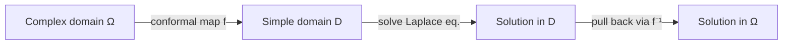
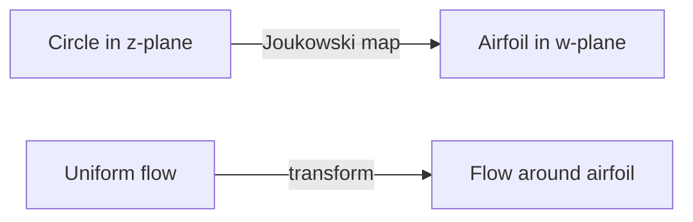

# Physical Applications of Conformal Mapping

Conformal mappings transform physical problems from complicated domains to simpler ones while preserving the governing equations. This technique is invaluable in electrostatics, fluid dynamics, heat transfer, and other areas governed by Laplace's equation. The angle-preserving property ensures that physical relationships—such as the orthogonality of equipotential lines and field lines—remain intact under transformation.

## Why Conformal Maps Preserve Physics

Many physical phenomena in two dimensions are described by **harmonic functions**—solutions to Laplace's equation:
$$\Delta u = \frac{\partial^2 u}{\partial x^2} + \frac{\partial^2 u}{\partial y^2} = 0$$

**Key Theorem**: If $u$ is harmonic on domain $D_2$ and $f: D_1 \to D_2$ is conformal, then $u \circ f$ is harmonic on $D_1$.

**Why this works**: The Laplace equation in two dimensions is conformally invariant. Under a conformal change of coordinates $w = f(z)$, the Laplacian transforms as:
$$\Delta_w u = \frac{1}{|f'(z)|^2} \Delta_z (u \circ f)$$

Since conformal maps have $|f'(z)| \neq 0$, if $\Delta_w u = 0$ then $\Delta_z (u \circ f) = 0$.

This allows us to solve problems in simple domains (disk, half-plane) and transform solutions back to complicated regions.

## Electrostatics

### Electric Potential

In a charge-free region, the electric potential $\phi$ satisfies Laplace's equation:
$$\Delta\phi = 0$$

**Boundary conditions**: Conductors are equipotential surfaces. If conductor $C_k$ is held at potential $V_k$, then $\phi = V_k$ on $\partial C_k$.

### The Complex Potential

For 2D electrostatic problems, we introduce the **complex potential**:
$$\Omega(z) = \phi(x, y) + i\psi(x, y)$$

where:
- $\phi$ is the electric potential
- $\psi$ is the electric flux function (stream function)

Since $\phi$ and $\psi$ satisfy the Cauchy-Riemann equations:
- Equipotential lines ($\phi = \text{const}$) and flux lines ($\psi = \text{const}$) are orthogonal
- The electric field is: $E_x - iE_y = -\Omega'(z)$

### Example: Parallel Plate Capacitor

**Domain**: Strip between plates at $y = 0$ and $y = h$.

**Boundary conditions**: $\phi(x, 0) = 0$, $\phi(x, h) = V_0$.

**Solution**: By inspection (separable), $\phi(x, y) = V_0 y/h$.

**Electric field**: $\mathbf{E} = (0, -V_0/h)$ (uniform, pointing from high to low potential).

**Complex potential**: $\Omega(z) = -iV_0 z/h$

### Example: Cylindrical Capacitor

**Geometry**: Coaxial cylinders of radii $a$ (inner) and $b$ (outer).

In the 2D cross-section, we have an annular region $a < |z| < b$.

**Boundary conditions**: $\phi(a) = V_0$, $\phi(b) = 0$.

**Solution**: By radial symmetry, $\phi$ depends only on $r = |z|$:
$$\phi(r) = V_0 \frac{\log(b/r)}{\log(b/a)}$$

**Complex potential**: $\Omega(z) = \frac{V_0}{\log(b/a)} \log\left(\frac{b}{z}\right)$

**Capacitance per unit length**: $C = \frac{2\pi\epsilon_0}{\log(b/a)}$

### Example: Edge Effects and Corners

Consider a capacitor with a corner. The field near a corner with interior angle $\alpha\pi$ behaves like:
$$|E| \sim r^{(\pi/\alpha) - 1}$$

For a $90°$ corner ($\alpha = 1/2$): $|E| \sim r$, field vanishes at corner.
For a sharp edge ($\alpha = 2$): $|E| \sim r^{-1/2}$, field diverges at edge.

Conformal mapping can transform corner problems to simpler geometries for analysis.

## Fluid Dynamics

### Incompressible Inviscid Flow

For 2D incompressible, irrotational (potential) flow:
- Velocity potential $\phi$: $\mathbf{v} = \nabla\phi$
- Stream function $\psi$: streamlines are level curves of $\psi$

Both satisfy Laplace's equation: $\Delta\phi = 0$, $\Delta\psi = 0$.

**Complex potential**: $\Omega(z) = \phi + i\psi$

**Complex velocity**: $\frac{d\Omega}{dz} = v_x - iv_y$

### Example: Uniform Flow

For uniform flow with speed $U$ in the $x$-direction:
$$\Omega(z) = Uz$$

Velocity: $v_x = U$, $v_y = 0$.

### Example: Flow Around a Cylinder

For flow around a cylinder of radius $R$:
$$\Omega(z) = U\left(z + \frac{R^2}{z}\right)$$

**Features**:
- Far from cylinder: $\Omega \approx Uz$ (uniform flow)
- On cylinder $|z| = R$: $\text{Im}(\Omega) = 0$ (impermeable boundary)
- Stagnation points at $z = \pm R$

### The Joukowski Airfoil

The Joukowski transformation:
$$w = z + \frac{c^2}{z}$$

maps circles (slightly offset from origin) to airfoil shapes.

**Application**: Model lift on an airfoil by computing circulation around the transformed contour.

**Kutta-Joukowski Theorem**: The lift force per unit span is:
$$L = \rho U \Gamma$$

where $\rho$ is fluid density, $U$ is free-stream velocity, and $\Gamma$ is circulation.

### Example: Flow in a Channel with Step

**Problem**: Find flow pattern in a channel with a sudden step.

**Method**:
1. Map the stepped channel to a half-plane or strip via Schwarz-Christoffel
2. Solve for uniform flow in the simple domain
3. Transform back to find streamlines

## Heat Transfer

### Steady-State Temperature

In steady state with no heat sources, temperature $T$ satisfies:
$$\Delta T = 0$$

**Boundary conditions**: Specified temperatures (Dirichlet) or heat fluxes (Neumann).

### Example: Heat Flow in a Wedge

**Geometry**: Wedge-shaped region $0 < \arg(z) < \alpha$.

**Boundary conditions**: $T = T_1$ on lower edge, $T = T_2$ on upper edge.

**Method**: The map $w = z^{\pi/\alpha}$ takes the wedge to the upper half-plane. In the half-plane, the solution is linear in the angle.

**Solution**:
$$T(r, \theta) = T_1 + (T_2 - T_1)\frac{\theta}{\alpha}$$

The temperature varies linearly with angle, independent of radius.

### Example: Insulated vs. Isothermal Boundaries

**Mixed problem**: Part of boundary at fixed temperature, part insulated.

**Approach**: Use conformal mapping to transform to a domain where the mixed boundary becomes simpler (e.g., real axis with part Dirichlet, part Neumann).

## Gravitational and Magnetic Fields

In 2D, gravitational potential (away from masses) and magnetic potential (in source-free regions) also satisfy Laplace's equation.

**Applications**:
- Gravitational field around 2D mass distributions
- Magnetic shielding and focusing
- Tidal and geophysical problems

## Example: Eccentric Cylinders

**Problem**: Find potential between two non-concentric cylinders.

**Challenge**: Eccentric geometry has no simple coordinate system.

**Solution via conformal mapping**:
1. Use a Möbius transformation to map eccentric cylinders to concentric ones (annulus)
2. Solve in the annulus (logarithmic potential)
3. Transform back

The mapping uses the fact that Möbius transformations take circles to circles.

## Advantages of Conformal Mapping Methods

1. **Simplification**: Complex domains become simple (disk, half-plane, strip)
2. **Explicit solutions**: Often available in canonical domains
3. **Preservation of equations**: Laplace equation unchanged under conformal maps
4. **Geometric insight**: Reveals symmetries and structure of solutions
5. **Orthogonality preserved**: Field lines and equipotentials remain perpendicular

## Limitations

1. **Two dimensions only**: In 3D, conformal maps are too rigid (only Möbius maps exist)
2. **Numerical challenges**: Finding maps for arbitrary domains may require numerical methods
3. **Boundary complexity**: Highly irregular boundaries are difficult to handle
4. **Time-dependent problems**: Conformal methods work best for steady-state problems

## Computational Tools

Modern software handles conformal mapping for physical applications:
- **MATLAB**: Schwarz-Christoffel Toolbox for polygonal domains
- **COMSOL**: Finite element with conformal mapping preprocessing
- **Python**: Various packages for conformal mapping and potential theory
- **Mathematica**: Built-in functions for standard maps and special functions

## Summary

- **Electrostatics**: Complex potential $\Omega = \phi + i\psi$ combines potential and flux
- **Fluid dynamics**: Same framework for incompressible irrotational flow
- **Heat transfer**: Temperature distribution in steady state
- **Method**: Map to simple domain → solve → transform back
- **Key property**: Laplace equation preserved by conformal maps
- **Complex potential**: $\Omega'(z)$ gives field (electric, velocity, temperature gradient)
- **Joukowski transform**: Maps circles to airfoils for aerodynamic analysis
- **Limitations**: Works only in 2D; 3D requires different methods

Conformal mapping remains one of the most elegant applications of complex analysis to physics and engineering, providing exact solutions in situations where numerical methods would otherwise be required.
