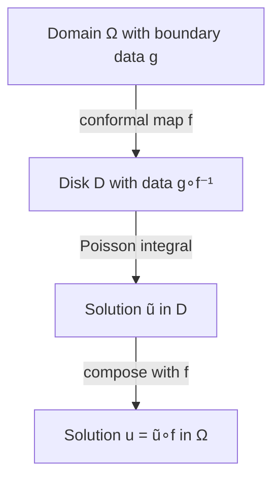

# Boundary Value Problems

Boundary value problems (BVPs) seek functions satisfying a differential equation in a domain with specified conditions on the boundary. Conformal mapping is a powerful tool for solving BVPs involving harmonic functions, transforming complex domains into simpler ones where solutions are known or easily computed. This section covers the Dirichlet and Neumann problems, the Poisson kernel, Green's functions, and the role of conformal mapping in their solution.

## The Dirichlet Problem

The **Dirichlet problem** is the fundamental boundary value problem for Laplace's equation.

### Statement

Given a domain $\Omega \subset \mathbb{C}$ and a continuous function $g: \partial\Omega \to \mathbb{R}$, find a harmonic function $u: \Omega \to \mathbb{R}$ such that:

$$\begin{cases}
\Delta u = 0 & \text{in } \Omega \\
u = g & \text{on } \partial\Omega
\end{cases}$$

### Existence and Uniqueness

For bounded domains with reasonably smooth boundaries (e.g., domains with piecewise smooth boundary), the Dirichlet problem has a unique solution.

**Uniqueness Proof**: Suppose $u_1, u_2$ are both solutions. Then $w = u_1 - u_2$ is harmonic with $w = 0$ on the boundary. By the maximum principle, a harmonic function attains its maximum and minimum on the boundary. Since $w = 0$ on $\partial\Omega$, we have $w \leq 0$ and $w \geq 0$ everywhere, so $w = 0$.

**Existence**: Proved constructively for simple domains (disk, half-plane) and by Perron's method for general domains.

## The Poisson Kernel for the Unit Disk

For the unit disk $\mathbb{D} = \{z : |z| < 1\}$ with boundary data $g(\theta)$ on the unit circle $|z| = 1$, the unique solution is given by the **Poisson integral formula**:

$$u(re^{i\phi}) = \frac{1}{2\pi}\int_0^{2\pi} P_r(\theta - \phi) g(\theta) \, d\theta$$

where the **Poisson kernel** is:
$$P_r(\theta) = \frac{1 - r^2}{1 - 2r\cos\theta + r^2}$$

### Properties of the Poisson Kernel

1. **Positive**: $P_r(\theta) > 0$ for $r < 1$
2. **Normalized**: $\frac{1}{2\pi}\int_0^{2\pi} P_r(\theta) d\theta = 1$
3. **Approximate identity**: As $r \to 1^-$, $P_r(\theta)$ concentrates near $\theta = 0$
4. **Symmetry**: $P_r(\theta) = P_r(-\theta)$

### Derivation from Complex Analysis

For a holomorphic function $f(z) = u + iv$ on the disk, the Cauchy integral formula gives:
$$f(z) = \frac{1}{2\pi i}\oint_{|w|=1} \frac{f(w)}{w - z} dw$$

Taking real parts and using $w = e^{i\theta}$, $z = re^{i\phi}$:
$$u(re^{i\phi}) = \text{Re}\left[\frac{1}{2\pi}\int_0^{2\pi} \frac{e^{i\theta}}{e^{i\theta} - re^{i\phi}} f(e^{i\theta}) d\theta\right]$$

After computation, this yields the Poisson integral formula with the kernel above.

## The Poisson Kernel for the Upper Half-Plane

For the upper half-plane $\mathbb{H} = \{z : \text{Im}(z) > 0\}$ with boundary data $g(t)$ on the real axis:

$$u(x, y) = \frac{y}{\pi}\int_{-\infty}^{\infty} \frac{g(t)}{(x-t)^2 + y^2} \, dt$$

The kernel is:
$$P_y(x) = \frac{y}{\pi(x^2 + y^2)}$$

This is the **Poisson kernel for the half-plane**, also known as the Cauchy distribution in probability.

### Connection to Disk via Conformal Mapping

The Möbius transformation $f(z) = \frac{z - i}{z + i}$ maps $\mathbb{H}$ to $\mathbb{D}$. The Poisson kernels are related by this conformal equivalence.

## Solving Dirichlet Problems via Conformal Mapping

### General Strategy

To solve the Dirichlet problem in a general domain $\Omega$:

1. **Find a conformal map** $f: \Omega \to \mathbb{D}$ (Riemann Mapping Theorem guarantees existence for simply connected domains)
2. **Transform boundary data**: $\tilde{g} = g \circ f^{-1}$ on $\partial\mathbb{D}$
3. **Solve in the disk** using the Poisson integral formula
4. **Pull back the solution**: $u = \tilde{u} \circ f$

**Why it works**: Harmonic functions compose with conformal maps to give harmonic functions. The boundary values are preserved by the transformation.

### Example: Dirichlet Problem in Upper Half-Disk

**Domain**: $\Omega = \{z : |z| < 1, \text{Im}(z) > 0\}$.

**Boundary**: Semicircle $|z| = 1$, $\text{Im}(z) \geq 0$ and diameter $[-1, 1]$.

**Boundary data**: $g = 1$ on semicircle, $g = 0$ on diameter.

**Method**:
1. Map $\Omega$ to upper half-plane via $w = \frac{1+z}{1-z}$ (semicircle → positive imaginary axis, diameter → positive real axis)
2. In $\mathbb{H}$, solve with $g = 1$ on imaginary axis, $g = 0$ on real axis
3. Solution in half-plane: $\tilde{u} = \frac{1}{\pi}\arg(w)$
4. Transform back

**Solution**: $u(z) = \frac{2}{\pi}\arg\left(\frac{1+z}{1-z}\right)$

## The Neumann Problem

The **Neumann problem** specifies the normal derivative on the boundary:

$$\begin{cases}
\Delta u = 0 & \text{in } \Omega \\
\frac{\partial u}{\partial n} = h & \text{on } \partial\Omega
\end{cases}$$

### Compatibility Condition

A necessary condition for existence is:
$$\int_{\partial\Omega} h \, ds = 0$$

This follows from the divergence theorem: $\int_\Omega \Delta u \, dA = \int_{\partial\Omega} \frac{\partial u}{\partial n} ds$.

### Uniqueness

Solutions are unique only up to an additive constant—if $u$ is a solution, so is $u + c$ for any constant $c$.

### Physical Interpretation

- **Heat flow**: $h$ specifies heat flux through boundary; compatibility means net heat in equals net heat out (steady state)
- **Electrostatics**: $h$ specifies normal electric field on boundary

## Green's Functions

The **Green's function** $G(z, w)$ for domain $\Omega$ solves:
$$\Delta_z G(z, w) = \delta(z - w)$$
with $G(z, w) = 0$ for $z \in \partial\Omega$.

### Representation Formula

The solution to the Dirichlet problem can be written:
$$u(w) = -\int_{\partial\Omega} g(z) \frac{\partial G}{\partial n_z}(z, w) \, ds_z$$

where $\frac{\partial}{\partial n_z}$ is the outward normal derivative with respect to $z$.

### Green's Function for the Unit Disk

$$G(z, w) = \frac{1}{2\pi}\log\left|\frac{z - w}{1 - \bar{w}z}\right|$$

The term $\log|z - w|$ is the fundamental solution; the term $-\log|1 - \bar{w}z|$ is the "correction" that makes $G = 0$ on $|z| = 1$.

**Observation**: The factor $\frac{z - w}{1 - \bar{w}z}$ is a Möbius transformation taking $w$ to $0$ and the unit circle to itself.

### Construction via Conformal Mapping

If $f: \Omega \to \mathbb{D}$ is the Riemann map, then:
$$G_\Omega(z, w) = G_\mathbb{D}(f(z), f(w)) = \frac{1}{2\pi}\log\left|\frac{f(z) - f(w)}{1 - \overline{f(w)}f(z)}\right|$$

This shows how conformal mapping extends the disk's Green's function to general domains.

## Harmonic Measure

For domain $\Omega$ and boundary subset $E \subset \partial\Omega$, the **harmonic measure** $\omega(z, E, \Omega)$ is the solution to:

$$\begin{cases}
\Delta \omega = 0 & \text{in } \Omega \\
\omega = 1 & \text{on } E \\
\omega = 0 & \text{on } \partial\Omega \setminus E
\end{cases}$$

### Probabilistic Interpretation

$\omega(z, E, \Omega)$ equals the probability that Brownian motion starting at $z$ exits $\Omega$ through the set $E$.

### Conformal Invariance

Harmonic measure is conformally invariant: if $f: \Omega_1 \to \Omega_2$ is conformal, then:
$$\omega(z, E, \Omega_1) = \omega(f(z), f(E), \Omega_2)$$

This makes harmonic measure a fundamental object in complex analysis and potential theory.

## Mixed Boundary Conditions

**Problem**: Different conditions on different boundary segments.

**Example**: $u = g_1$ on $\Gamma_1$ (Dirichlet), $\frac{\partial u}{\partial n} = h_2$ on $\Gamma_2$ (Neumann).

**Approach**: Conformal mapping can sometimes simplify mixed problems by transforming the boundary to one where conditions are easier to handle. In general, numerical methods or integral equation approaches are needed.

## Numerical Methods

For domains without explicit conformal maps, numerical methods solve BVPs:

1. **Finite Differences**: Discretize Laplace equation on a grid; solve linear system
2. **Finite Elements**: Variational formulation; triangular mesh approximation
3. **Boundary Element Method**: Reduce to boundary integral equation; solve on boundary only
4. **Conformal Mapping + Poisson**: Numerically approximate conformal map, then use Poisson kernel

Each method has trade-offs in accuracy, efficiency, and ease of implementation.

## Summary

- **Dirichlet problem**: $\Delta u = 0$ with $u = g$ on boundary; unique solution for nice domains
- **Neumann problem**: $\Delta u = 0$ with $\frac{\partial u}{\partial n} = h$; requires compatibility, unique up to constant
- **Poisson kernel**: Explicit formula for disk and half-plane
- **Conformal mapping strategy**: Transform domain → solve in simple domain → transform back
- **Green's function**: Fundamental solution with boundary condition; gives solution via boundary integral
- **Harmonic measure**: Probability of Brownian exit through boundary subset; conformally invariant
- **Numerical methods**: Required for domains without known conformal maps

The interplay between conformal mapping, harmonic functions, and boundary value problems exemplifies the deep unity of complex analysis with physics and partial differential equations. These techniques remain foundational tools in applied mathematics and mathematical physics.
