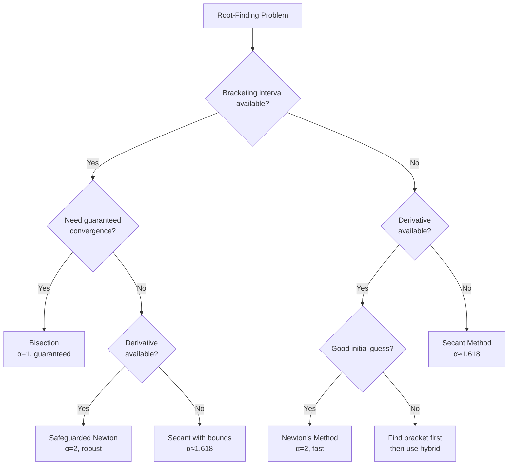

# Convergence Rates

Understanding convergence rates helps choose appropriate algorithms and predict computational cost.

## Order of Convergence

A sequence $\{x_n\}$ converging to $p$ has **order of convergence** $\alpha$ if:

$$\lim_{n \to \infty} \frac{|x_{n+1} - p|}{|x_n - p|^\alpha} = \lambda$$

where $0 < \lambda < \infty$ is the **asymptotic error constant**.

- $\alpha = 1, \lambda < 1$: **Linear convergence**
- $\alpha = 2$: **Quadratic convergence**
- $1 < \alpha < 2$: **Superlinear convergence**

## Common Methods

| Method | Order $\alpha$ | Conditions | Function Evals/Iter |
|--------|----------------|------------|---------------------|
| Bisection | 1 ($\lambda = 0.5$) | Bracketing interval | 1 |
| Fixed-point | 1 | $\|g'(p)\| < 1$ | 1 |
| Secant | $\phi \approx 1.618$ | Simple root | 1 |
| Newton | 2 | Simple root, $f' \neq 0$ | 2 (f and f') |
| Halley | 3 | Simple root | 3 (f, f', f'') |

The following diagram illustrates how to select the appropriate root-finding method:



Visual comparison of convergence rates:

```plot
{
  "xAxis": { "domain": [0, 10], "label": "Iteration" },
  "yAxis": { "domain": [1e-12, 1] },
  "grid": true,
  "data": [
    { "fn": "0.1 * 0.5^x", "color": "#3b82f6" },
    { "fn": "0.1 * (1/x)^1.618", "color": "#22c55e", "range": [1, 10] },
    { "fn": "0.1^(2^x)", "color": "#ef4444", "range": [0, 4] }
  ]
}
```

This shows the error decay patterns: bisection (blue, linear), secant (green, superlinear), and Newton (red, quadratic). Notice how quickly quadratic convergence achieves machine precision.

```python
import numpy as np
import matplotlib.pyplot as plt

def estimate_convergence_order(errors):
    """
    Estimate convergence order from error sequence.
    
    Uses log-log regression on consecutive errors.
    """
    errors = np.array([e for e in errors if e > 0])
    if len(errors) < 3:
        return None
    
    # Use last few iterations for better estimate
    n = min(5, len(errors) - 1)
    ratios = []
    
    for i in range(len(errors) - n, len(errors) - 1):
        if errors[i] > 1e-15 and errors[i+1] > 1e-15:
            alpha = np.log(errors[i+1]) / np.log(errors[i])
            ratios.append(alpha)
    
    return np.mean(ratios) if ratios else None

# Test different methods
def test_convergence_rates():
    """Compare convergence rates experimentally."""
    f = lambda x: x**2 - 2
    f_prime = lambda x: 2*x
    f_double_prime = lambda x: 2
    true_root = np.sqrt(2)
    
    # Bisection
    def bisection_errors():
        a, b = 1, 2
        errors = []
        for _ in range(20):
            c = (a + b) / 2
            errors.append(abs(c - true_root))
            if f(a) * f(c) < 0:
                b = c
            else:
                a = c
        return errors
    
    # Newton
    def newton_errors():
        x = 1.5
        errors = []
        for _ in range(10):
            errors.append(abs(x - true_root))
            x = x - f(x) / f_prime(x)
        return errors
    
    # Secant
    def secant_errors():
        x0, x1 = 1.0, 2.0
        errors = [abs(x0 - true_root), abs(x1 - true_root)]
        for _ in range(15):
            f0, f1 = f(x0), f(x1)
            x2 = x1 - f1 * (x1 - x0) / (f1 - f0)
            errors.append(abs(x2 - true_root))
            x0, x1 = x1, x2
        return errors
    
    methods = [
        (bisection_errors(), "Bisection", 1.0),
        (newton_errors(), "Newton", 2.0),
        (secant_errors(), "Secant", 1.618),
    ]
    
    print("Convergence Rate Estimates:")
    print(f"{'Method':<15} {'Estimated α':<15} {'Theoretical α':<15}")
    print("=" * 45)
    
    for errors, name, theoretical in methods:
        estimated = estimate_convergence_order(errors)
        print(f"{name:<15} {estimated if estimated else 'N/A':<15.3f} {theoretical:<15.3f}")
    
    # Plot
    plt.figure(figsize=(12, 5))
    
    for errors, name, _ in methods:
        plt.semilogy(range(len(errors)), errors, 'o-', label=name, linewidth=2, markersize=5)
    
    plt.xlabel('Iteration')
    plt.ylabel('|x_n - √2|')
    plt.title('Convergence Comparison')
    plt.legend()
    plt.grid(True, alpha=0.3)
    plt.savefig('convergence_rates_comparison.png', dpi=150, bbox_inches='tight')
    plt.close()
    print("\nPlot saved")

test_convergence_rates()
```

## Efficiency Index

Accounts for computational cost:

$$E = \alpha^{1/p}$$

where $p$ is the number of function evaluations per iteration.

```python
def efficiency_comparison():
    """Compare efficiency indices."""
    methods = [
        ("Bisection", 1, 1),
        ("Secant", 1.618, 1),
        ("Newton", 2, 2),
        ("Halley", 3, 3),
    ]
    
    print("\nEfficiency Analysis:")
    print(f"{'Method':<15} {'Order α':<10} {'Evals/Iter':<12} {'Efficiency E':<15}")
    print("=" * 55)
    
    for name, alpha, evals in methods:
        efficiency = alpha ** (1 / evals)
        print(f"{name:<15} {alpha:<10.3f} {evals:<12} {efficiency:<15.3f}")

efficiency_comparison()
```

## Determining Order Experimentally

```python
def compute_convergence_factors(errors):
    """Compute convergence factors for different assumed orders."""
    print(f"\n{'n':<5} {'Error':<15} {'α=1':<12} {'α=1.6':<12} {'α=2':<12}")
    print("=" * 60)
    
    for i in range(min(10, len(errors) - 1)):
        e_n = errors[i]
        e_n1 = errors[i+1]
        
        if e_n > 1e-15:
            factor_1 = e_n1 / e_n
            factor_16 = e_n1 / (e_n ** 1.6)
            factor_2 = e_n1 / (e_n ** 2)
            
            print(f"{i:<5} {e_n:<15.2e} {factor_1:<12.5f} {factor_16:<12.5f} {factor_2:<12.5f}")

# Test on Newton's method
f = lambda x: x**3 - 2
f_prime = lambda x: 3*x**2
true_root = 2**(1/3)

x = 2.0
errors = []
for _ in range(8):
    errors.append(abs(x - true_root))
    x = x - f(x) / f_prime(x)

print("Newton's Method on x³ - 2 = 0:")
compute_convergence_factors(errors)
```

## Practical Considerations

### Choosing Based on Convergence Rate

The convergence rate determines how quickly an algorithm approaches the solution:

**Linear Convergence ($\alpha = 1$)**: Each iteration adds roughly a constant number of correct digits. For bisection with $\lambda = 0.5$, each iteration approximately doubles accuracy.

**Quadratic Convergence ($\alpha = 2$)**: The number of correct digits approximately doubles with each iteration. This is why Newton's method can achieve machine precision in very few iterations.

**Superlinear Convergence ($1 < \alpha < 2$)**: The secant method with $\alpha = \phi \approx 1.618$ (golden ratio) provides a middle ground between linear and quadratic convergence.

```python
def compare_iterations_to_tolerance():
    """
    Estimate iterations needed to reach tolerance.

    For linear convergence: n ≈ log(tol/e_0) / log(λ)
    For quadratic: n ≈ log(log(tol/e_0)) / log(2)
    """
    e_0 = 0.1  # Initial error
    tol = 1e-10

    print("Iterations to reach tolerance 1e-10:")
    print(f"{'Method':<15} {'Order':<10} {'Estimated Iters':<15}")
    print("=" * 45)

    # Bisection (linear, λ=0.5)
    n_bisect = np.ceil(np.log(tol/e_0) / np.log(0.5))
    print(f"{'Bisection':<15} {'1 (λ=0.5)':<10} {int(n_bisect):<15}")

    # Secant (superlinear, α≈1.618)
    # Approximate using α^n formula
    n_secant = np.ceil(np.log(np.log(tol/e_0)) / np.log(1.618))
    print(f"{'Secant':<15} {'1.618':<10} {int(n_secant):<15}")

    # Newton (quadratic, α=2)
    n_newton = np.ceil(np.log2(np.log(tol/e_0)))
    print(f"{'Newton':<15} {'2':<10} {int(n_newton):<15}")

    print("\nNote: These are theoretical estimates; actual iterations may vary")

compare_iterations_to_tolerance()
```

### Error Analysis

Understanding how errors propagate is crucial for predicting algorithm behavior:

**Error Equation**: For order $\alpha$:
$$|e_{n+1}| = \lambda |e_n|^\alpha + O(|e_n|^{\alpha+1})$$

This means:
- **Linear**: Error multiplied by constant factor each iteration
- **Quadratic**: Error squared each iteration (rapid convergence near solution)
- **Cubic**: Error cubed (even faster, but requires more function evaluations)

```python
def analyze_error_propagation():
    """Visualize error reduction patterns."""
    import matplotlib.pyplot as plt

    e_0 = 0.1
    iterations = 10

    # Bisection (linear, λ=0.5)
    errors_bisect = [e_0 * (0.5)**n for n in range(iterations)]

    # Newton (quadratic, λ=1)
    errors_newton = [e_0]
    for _ in range(iterations - 1):
        errors_newton.append(errors_newton[-1]**2)

    # Secant (α=1.618)
    errors_secant = [e_0, 0.05]
    for _ in range(iterations - 2):
        if errors_secant[-1] > 0:
            errors_secant.append(errors_secant[-1]**1.618)

    plt.figure(figsize=(10, 6))
    plt.semilogy(errors_bisect, 'o-', label='Bisection (α=1)', linewidth=2)
    plt.semilogy(errors_newton[:7], 's-', label='Newton (α=2)', linewidth=2)
    plt.semilogy(errors_secant[:8], '^-', label='Secant (α≈1.618)', linewidth=2)

    plt.xlabel('Iteration', fontsize=12)
    plt.ylabel('Error', fontsize=12)
    plt.title('Error Reduction Patterns for Different Convergence Orders', fontsize=14)
    plt.legend(fontsize=10)
    plt.grid(True, alpha=0.3)
    plt.savefig('error_propagation.png', dpi=150, bbox_inches='tight')
    plt.close()
    print("Error propagation plot saved")

analyze_error_propagation()
```

## Advanced Topics

### Asymptotic vs. Global Convergence

**Asymptotic convergence** describes behavior near the root, while **global convergence** concerns behavior from arbitrary starting points.

- Newton's method has excellent asymptotic properties (quadratic) but poor global properties (may diverge)
- Bisection has linear asymptotic convergence but guaranteed global convergence
- Hybrid methods combine both: use bisection to get close, then switch to Newton

```python
def hybrid_method(f, f_prime, a, b, switch_tol=0.1, tol=1e-10, max_iter=100):
    """
    Hybrid bisection-Newton method.

    Uses bisection until within switch_tol of root, then switches to Newton.
    """
    # Phase 1: Bisection
    phase = "Bisection"
    iterations_bisect = 0

    while b - a > switch_tol and iterations_bisect < max_iter:
        c = (a + b) / 2
        if f(a) * f(c) < 0:
            b = c
        else:
            a = c
        iterations_bisect += 1

    # Phase 2: Newton from midpoint
    x = (a + b) / 2
    phase = "Newton"
    iterations_newton = 0

    for i in range(max_iter):
        fx = f(x)
        if abs(fx) < tol:
            break

        fpx = f_prime(x)
        if abs(fpx) < 1e-15:
            break

        x = x - fx / fpx
        iterations_newton += 1

    print(f"Hybrid Method Results:")
    print(f"  Bisection iterations: {iterations_bisect}")
    print(f"  Newton iterations: {iterations_newton}")
    print(f"  Total iterations: {iterations_bisect + iterations_newton}")
    print(f"  Final approximation: {x}")

    return x

# Test hybrid method
f = lambda x: x**3 - 2*x - 5
f_prime = lambda x: 3*x**2 - 2

root = hybrid_method(f, f_prime, 2, 3)
```

### Computational Cost Analysis

Beyond theoretical order, practical efficiency depends on:

1. **Function evaluations**: Cost per iteration
2. **Convergence rate**: Iterations to convergence
3. **Implementation complexity**: Overhead per iteration

**Example**: Comparing Newton vs Secant

```python
def cost_analysis():
    """Compare computational cost considering function evaluations."""
    print("\nComputational Cost Analysis:")
    print("=" * 70)

    # Assume derivative costs 50% more than function evaluation
    cost_f = 1.0
    cost_fprime = 1.5

    methods = [
        ("Bisection", 1, 0.5, 1, 34),  # name, order, λ, f_evals, iters
        ("Secant", 1.618, 1, 1, 7),
        ("Newton", 2, 1, 2, 5),
        ("Halley", 3, 1, 3, 4),
    ]

    print(f"{'Method':<12} {'Iters':<8} {'F Evals':<10} {'Cost Units':<12} {'Efficiency':<12}")
    print("-" * 70)

    for name, order, lam, f_per_iter, iters in methods:
        if name == "Newton":
            total_cost = iters * (cost_f + cost_fprime)
        elif name == "Halley":
            total_cost = iters * (cost_f + cost_fprime + cost_fprime)
        else:
            total_cost = iters * cost_f

        efficiency = order ** (1/f_per_iter)

        print(f"{name:<12} {iters:<8} {iters*f_per_iter:<10} {total_cost:<12.1f} {efficiency:<12.3f}")

cost_analysis()
```

## Key Takeaways

1. **Order of convergence** quantifies how rapidly errors decrease near the root
2. **Higher order doesn't always mean faster**: Must consider function evaluation cost
3. **Efficiency index** $E = \alpha^{1/p}$ balances order and cost
4. **Secant method** often optimal: superlinear convergence with only one function evaluation
5. **Experimental estimation** of convergence order validates theoretical analysis
6. **Hybrid approaches** combine global robustness with local speed
7. **Context matters**: Best method depends on function properties and computational resources

## Common Mistakes

1. **Ignoring cost per iteration**: High-order methods may be slower overall if derivatives are expensive
2. **Using asymptotic rates too early**: Convergence order describes behavior near the root, not far from it
3. **Underestimating bisection**: Despite linear convergence, guaranteed convergence and simplicity make it valuable
4. **Not monitoring convergence**: Always check if observed convergence matches theoretical predictions
5. **Forgetting numerical stability**: Some high-order methods can be numerically unstable
