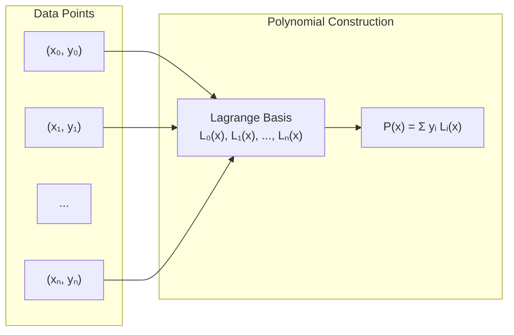

# Lagrange Interpolation

Lagrange interpolation constructs a polynomial that passes through a given set of points using basis polynomials.

## Interpolation Problem

Given $n+1$ distinct points $(x_0, y_0), \ldots, (x_n, y_n)$, find polynomial $P_n(x)$ of degree at most $n$ such that:

$$P_n(x_i) = y_i, \quad i = 0, 1, \ldots, n$$

**Existence and Uniqueness**: Such a polynomial exists and is unique.

The following diagram illustrates the interpolation problem:



Example of Lagrange interpolation through 4 points:

```plot
{
  "xAxis": { "domain": [-2, 4] },
  "yAxis": { "domain": [-5, 15] },
  "grid": true,
  "data": [
    { "fn": "x^3 - 3*x^2 + 2*x + 1", "color": "#3b82f6" },
    { "fn": "0", "color": "#e5e7eb" }
  ]
}
```

This shows a cubic polynomial passing through points at $x = 0, 1, 2, 3$.

## Lagrange Basis Polynomials

Define the $i$-th Lagrange basis polynomial:

$$L_i(x) = \prod_{j=0, j \neq i}^{n} \frac{x - x_j}{x_i - x_j}$$

Properties:
- $L_i(x_i) = 1$
- $L_i(x_j) = 0$ for $j \neq i$
- $\sum_{i=0}^n L_i(x) = 1$

## Lagrange Interpolating Polynomial

$$P_n(x) = \sum_{i=0}^n y_i L_i(x)$$

```python
import numpy as np
import matplotlib.pyplot as plt

def lagrange_basis(x, x_data, i):
    """Compute i-th Lagrange basis polynomial at x."""
    n = len(x_data)
    L = np.ones_like(x, dtype=float)

    for j in range(n):
        if j != i:
            L *= (x - x_data[j]) / (x_data[i] - x_data[j])

    return L

def lagrange_interpolation(x, x_data, y_data):
    """
    Lagrange interpolation.

    Parameters:
    - x: evaluation points
    - x_data: interpolation node x-coordinates
    - y_data: interpolation node y-coordinates

    Returns:
    - P(x): interpolating polynomial values
    """
    n = len(x_data)
    P = np.zeros_like(x, dtype=float)

    for i in range(n):
        P += y_data[i] * lagrange_basis(x, x_data, i)

    return P

# Example 1: Interpolate sin(x)
x_data = np.array([0, np.pi/4, np.pi/2, 3*np.pi/4, np.pi])
y_data = np.sin(x_data)

x = np.linspace(0, np.pi, 200)
P = lagrange_interpolation(x, x_data, y_data)

plt.figure(figsize=(10, 6))
plt.plot(x, np.sin(x), 'b-', label='sin(x)', linewidth=2)
plt.plot(x, P, 'r--', label='Lagrange interpolation', linewidth=2)
plt.plot(x_data, y_data, 'ko', markersize=8, label='Data points')
plt.xlabel('x')
plt.ylabel('y')
plt.title('Lagrange Interpolation of sin(x)')
plt.legend()
plt.grid(True, alpha=0.3)
plt.savefig('lagrange_interpolation.png', dpi=150, bbox_inches='tight')
plt.close()

print("Lagrange interpolation example:")
print(f"Nodes: {len(x_data)}")
print(f"Max error: {np.max(np.abs(P - np.sin(x))):.2e}")
```

## Error Analysis

For $f \in C^{n+1}[a, b]$, the interpolation error is:

$$f(x) - P_n(x) = \frac{f^{(n+1)}(\xi)}{(n+1)!} \prod_{i=0}^n (x - x_i)$$

for some $\xi \in [a, b]$.

The error depends on:
1. $(n+1)$-th derivative of $f$
2. Product $\prod (x - x_i)$ (nodal polynomial)

```python
def analyze_interpolation_error():
    """Analyze error vs. number of nodes."""
    f = lambda x: 1 / (1 + 25*x**2)  # Runge's function

    x = np.linspace(-1, 1, 500)
    f_true = f(x)

    degrees = [5, 10, 15, 20]

    plt.figure(figsize=(12, 8))

    for idx, n in enumerate(degrees, 1):
        # Equally spaced nodes
        x_data = np.linspace(-1, 1, n+1)
        y_data = f(x_data)

        P = lagrange_interpolation(x, x_data, y_data)
        error = np.abs(f_true - P)

        plt.subplot(2, 2, idx)
        plt.plot(x, f_true, 'b-', label='True function', linewidth=2)
        plt.plot(x, P, 'r--', label='Interpolation', linewidth=2)
        plt.plot(x_data, y_data, 'ko', markersize=5)
        plt.title(f'n = {n}, Max Error = {np.max(error):.2e}')
        plt.legend()
        plt.grid(True, alpha=0.3)

    plt.tight_layout()
    plt.savefig('lagrange_error_analysis.png', dpi=150, bbox_inches='tight')
    plt.close()

    print("\nError analysis complete")

analyze_interpolation_error()
```

## Runge's Phenomenon

High-degree interpolation with equally spaced nodes can produce large oscillations near endpoints.

**Solution**: Use Chebyshev nodes instead:

$$x_i = \cos\left(\frac{2i+1}{2(n+1)}\pi\right), \quad i = 0, \ldots, n$$

```python
def compare_node_distributions():
    """Compare equally spaced vs Chebyshev nodes."""
    f = lambda x: 1 / (1 + 25*x**2)
    n = 15

    x = np.linspace(-1, 1, 500)
    f_true = f(x)

    # Equally spaced
    x_equal = np.linspace(-1, 1, n+1)
    y_equal = f(x_equal)
    P_equal = lagrange_interpolation(x, x_equal, y_equal)

    # Chebyshev nodes
    k = np.arange(n+1)
    x_cheb = np.cos((2*k + 1) * np.pi / (2*(n+1)))
    y_cheb = f(x_cheb)
    P_cheb = lagrange_interpolation(x, x_cheb, y_cheb)

    plt.figure(figsize=(12, 5))

    plt.subplot(1, 2, 1)
    plt.plot(x, f_true, 'b-', label='True', linewidth=2)
    plt.plot(x, P_equal, 'r--', label='Interpolation', linewidth=2)
    plt.plot(x_equal, y_equal, 'ko', markersize=5)
    plt.title(f'Equally Spaced (max error: {np.max(np.abs(f_true - P_equal)):.2e})')
    plt.legend()
    plt.grid(True, alpha=0.3)
    plt.ylim([-0.5, 1.5])

    plt.subplot(1, 2, 2)
    plt.plot(x, f_true, 'b-', label='True', linewidth=2)
    plt.plot(x, P_cheb, 'r--', label='Interpolation', linewidth=2)
    plt.plot(x_cheb, y_cheb, 'ko', markersize=5)
    plt.title(f'Chebyshev Nodes (max error: {np.max(np.abs(f_true - P_cheb)):.2e})')
    plt.legend()
    plt.grid(True, alpha=0.3)
    plt.ylim([-0.5, 1.5])

    plt.tight_layout()
    plt.savefig('node_distribution_comparison.png', dpi=150, bbox_inches='tight')
    plt.close()

compare_node_distributions()
```

## Computational Complexity

Direct evaluation:
- **Construction**: $O(n^2)$
- **Evaluation at one point**: $O(n^2)$
- **Evaluation at $m$ points**: $O(mn^2)$

For many evaluations, precompute basis functions or use barycentric form.

## Barycentric Form

More numerically stable:

$$P_n(x) = \frac{\sum_{i=0}^n \frac{w_i}{x - x_i} y_i}{\sum_{i=0}^n \frac{w_i}{x - x_i}}$$

where $w_i = \frac{1}{\prod_{j \neq i} (x_i - x_j)}$ are barycentric weights.

```python
def barycentric_weights(x_data):
    """Compute barycentric weights."""
    n = len(x_data)
    w = np.ones(n)

    for i in range(n):
        for j in range(n):
            if i != j:
                w[i] /= (x_data[i] - x_data[j])

    return w

def barycentric_interpolation(x, x_data, y_data, w=None):
    """Barycentric form of Lagrange interpolation."""
    if w is None:
        w = barycentric_weights(x_data)

    # Handle exact nodes
    P = np.zeros_like(x, dtype=float)

    for k in range(len(x)):
        # Check if x[k] coincides with a node
        exact = False
        for i, xi in enumerate(x_data):
            if abs(x[k] - xi) < 1e-14:
                P[k] = y_data[i]
                exact = True
                break

        if not exact:
            numer = sum(w[i] * y_data[i] / (x[k] - x_data[i]) for i in range(len(x_data)))
            denom = sum(w[i] / (x[k] - x_data[i]) for i in range(len(x_data)))
            P[k] = numer / denom

    return P

# Compare performance
x_data = np.linspace(0, 1, 20)
y_data = np.sin(2*np.pi*x_data)
x = np.linspace(0, 1, 1000)

import time

# Standard form
start = time.time()
P1 = lagrange_interpolation(x, x_data, y_data)
time1 = time.time() - start

# Barycentric form
w = barycentric_weights(x_data)
start = time.time()
P2 = barycentric_interpolation(x, x_data, y_data, w)
time2 = time.time() - start

print(f"\nPerformance comparison:")
print(f"Standard Lagrange: {time1:.6f}s")
print(f"Barycentric form: {time2:.6f}s")
print(f"Speedup: {time1/time2:.2f}x")
print(f"Max difference: {np.max(np.abs(P1 - P2)):.2e}")
```

## Applications

1. **Function approximation** when derivative information unavailable
2. **Numerical differentiation and integration**
3. **Root finding** (inverse interpolation)
4. **Data fitting** for smooth functions

## Summary

Lagrange interpolation:
- **Exact** at interpolation nodes
- **Unique** polynomial of degree $\leq n$
- **Suffers from** Runge's phenomenon with equally spaced nodes
- **Barycentric form** more stable and efficient
- **Best for** moderate degree with well-chosen nodes (Chebyshev)
- **Avoid** high degrees with equally spaced nodes
