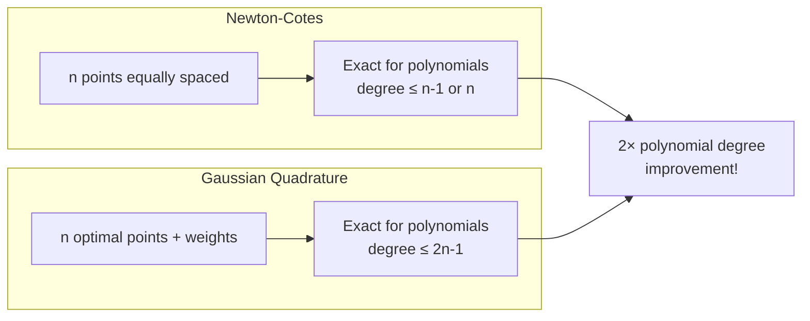

# Gaussian Quadrature

Gaussian quadrature achieves maximum accuracy by optimally choosing both evaluation points and weights, integrating polynomials of degree up to $2n-1$ exactly using only $n$ function evaluations.

## Introduction

The following diagram compares Newton-Cotes (equally-spaced points) with Gaussian quadrature (optimally-placed points):



Visual comparison of integration point placement:

```plot
{
  "xAxis": { "domain": [-1.2, 1.2] },
  "yAxis": { "domain": [-0.2, 1.2] },
  "grid": true,
  "data": [
    { "fn": "1 - x^2", "color": "#3b82f6" },
    { "fn": "0", "color": "#6b7280" }
  ]
}
```

This shows $f(x) = 1 - x^2$ on $[-1, 1]$. Gauss-Legendre 2-point quadrature evaluates at $x = \pm 1/\sqrt{3}$ (optimal), not at $x = \pm 1$ (Newton-Cotes endpoints).

Newton-Cotes formulas use **equally-spaced points**, which is convenient but suboptimal. For $n$ points, we have $2n$ degrees of freedom:
- $n$ evaluation points $x_i$
- $n$ weights $w_i$

**Key insight**: By choosing points optimally (not equally-spaced), we can achieve much higher accuracy!

Gaussian quadrature uses points and weights such that:

$$\int_a^b f(x)\,dx \approx \sum_{i=1}^n w_i f(x_i)$$

integrates all polynomials of degree $\leq 2n-1$ **exactly**.

**Comparison**:
- Newton-Cotes with $n$ points: Degree $n-1$ (or $n$ for even formulas)
- Gaussian quadrature with $n$ points: Degree $2n-1$

This is a **factor of 2 improvement** in polynomial degree!

## Gauss-Legendre Quadrature

The most common form integrates over $[-1, 1]$:

$$\int_{-1}^1 f(x)\,dx \approx \sum_{i=1}^n w_i f(x_i)$$

### Derivation via Orthogonal Polynomials

The optimal points $x_i$ are the **roots of the Legendre polynomial** $P_n(x)$.

**Legendre polynomials** satisfy:
- Orthogonality: $\int_{-1}^1 P_m(x)P_n(x)\,dx = 0$ for $m \neq n$
- Recurrence: $P_0(x) = 1$, $P_1(x) = x$,
  $$(n+1)P_{n+1}(x) = (2n+1)xP_n(x) - nP_{n-1}(x)$$

**First few Legendre polynomials**:
- $P_0(x) = 1$
- $P_1(x) = x$
- $P_2(x) = \frac{1}{2}(3x^2 - 1)$
- $P_3(x) = \frac{1}{2}(5x^3 - 3x)$
- $P_4(x) = \frac{1}{8}(35x^4 - 30x^2 + 3)$

### Computing Nodes and Weights

**Nodes** $x_i$: Roots of $P_n(x)$

**Weights** $w_i$:

$$w_i = \frac{2}{(1-x_i^2)[P_n'(x_i)]^2}$$

These are always positive and symmetric about zero.

### Examples

**n=1** (one point):
- Node: $x_1 = 0$
- Weight: $w_1 = 2$
- Formula: $\int_{-1}^1 f(x)\,dx \approx 2f(0)$ (midpoint rule)

**n=2** (two points):
- Nodes: $x_1 = -1/\sqrt{3} \approx -0.5774$, $x_2 = 1/\sqrt{3} \approx 0.5774$
- Weights: $w_1 = w_2 = 1$
- Formula: $\int_{-1}^1 f(x)\,dx \approx f(-1/\sqrt{3}) + f(1/\sqrt{3})$

**n=3** (three points):
- Nodes: $x_1 = -\sqrt{3/5}$, $x_2 = 0$, $x_3 = \sqrt{3/5}$
- Weights: $w_1 = 5/9$, $w_2 = 8/9$, $w_3 = 5/9$

## Change of Variables

To integrate over $[a, b]$, use the transformation:

$$x = \frac{b-a}{2}t + \frac{a+b}{2}, \quad dx = \frac{b-a}{2}\,dt$$

This maps $[-1, 1] \to [a, b]$, giving:

$$\int_a^b f(x)\,dx = \frac{b-a}{2}\int_{-1}^1 f\left(\frac{b-a}{2}t + \frac{a+b}{2}\right)\,dt$$

Apply Gaussian quadrature on the right-hand side.

## Implementation

```python
import numpy as np
from numpy.polynomial import legendre

def gauss_legendre_nodes_weights(n):
    """
    Compute Gauss-Legendre nodes and weights.

    Parameters:
    - n: number of quadrature points

    Returns:
    - nodes: quadrature points in [-1, 1]
    - weights: corresponding weights
    """
    # Use numpy's built-in Legendre polynomial roots
    nodes, weights = legendre.leggauss(n)
    return nodes, weights

def gauss_quadrature(f, a, b, n):
    """
    Gaussian quadrature for ∫_a^b f(x)dx.

    Parameters:
    - f: function to integrate
    - a, b: integration limits
    - n: number of quadrature points

    Returns:
    - Approximation to integral
    """
    # Get nodes and weights for [-1, 1]
    nodes, weights = gauss_legendre_nodes_weights(n)

    # Transform to [a, b]
    x = 0.5 * (b - a) * nodes + 0.5 * (a + b)

    # Compute integral
    integral = 0.5 * (b - a) * np.sum(weights * f(x))

    return integral

# Example: ∫₀^1 exp(x)dx = e - 1
f = lambda x: np.exp(x)
a, b = 0, 1
exact = np.exp(1) - 1

print("Gaussian Quadrature for ∫₀¹ exp(x)dx")
print(f"Exact value: {exact:.15f}\n")

for n in [1, 2, 3, 4, 5]:
    approx = gauss_quadrature(f, a, b, n)
    error = abs(approx - exact)
    print(f"n={n}: {approx:.15f}  Error: {error:.2e}")
```

## Accuracy and Degree of Precision

Gaussian quadrature with $n$ points has **degree of precision $2n-1$**.

**Verification**: Test on polynomials

```python
def test_degree_of_precision(n):
    """Test that n-point Gaussian quadrature integrates
    polynomials up to degree 2n-1 exactly."""

    print(f"\nTesting n={n} point Gaussian quadrature:")
    print(f"Expected degree of precision: {2*n-1}\n")

    for degree in range(2*n + 2):
        # Integrate x^degree from 0 to 1
        f = lambda x: x**degree
        exact = 1 / (degree + 1)
        approx = gauss_quadrature(f, 0, 1, n)
        error = abs(approx - exact)

        status = "✓" if error < 1e-14 else "✗"
        print(f"Degree {degree}: Error = {error:.2e} {status}")

test_degree_of_precision(3)
```

Output shows exact integration up to degree 5, failure at degree 6!

## Comparison with Newton-Cotes

**Example**: Integrate $\int_0^1 e^x\,dx = e - 1 \approx 1.718281828$

| Method | Points | Error |
|--------|--------|-------|
| Trapezoidal | 2 | $9.4 \times 10^{-2}$ |
| Simpson's | 3 | $1.4 \times 10^{-3}$ |
| Gauss (n=2) | 2 | $1.1 \times 10^{-4}$ |
| Gauss (n=3) | 3 | $2.1 \times 10^{-7}$ |

Gaussian quadrature achieves **1000× better accuracy** with the same number of points!

## Composite Gaussian Quadrature

For difficult functions, subdivide $[a,b]$ and apply Gaussian quadrature on each subinterval:

```python
def composite_gauss(f, a, b, n_points, n_intervals):
    """
    Composite Gaussian quadrature.

    Parameters:
    - n_points: Gaussian points per subinterval
    - n_intervals: number of subintervals
    """
    h = (b - a) / n_intervals
    integral = 0

    for i in range(n_intervals):
        a_i = a + i * h
        b_i = a_i + h
        integral += gauss_quadrature(f, a_i, b_i, n_points)

    return integral

# Example: Oscillatory function
f = lambda x: np.sin(10 * x)
a, b = 0, np.pi

result_simple = gauss_quadrature(f, a, b, 5)
result_composite = composite_gauss(f, a, b, 3, 10)

print(f"\nSimple Gauss (5 pts):    {result_simple:.10f}")
print(f"Composite Gauss (3×10):  {result_composite:.10f}")
```

## Weighted Gaussian Quadrature

Generalize to integrals with **weight functions** $w(x)$:

$$\int_a^b w(x)f(x)\,dx \approx \sum_{i=1}^n w_i f(x_i)$$

Different weight functions give different orthogonal polynomials:

| Name | Interval | Weight $w(x)$ | Orthogonal Polynomial |
|------|----------|---------------|----------------------|
| Gauss-Legendre | $[-1,1]$ | $1$ | Legendre $P_n$ |
| Gauss-Chebyshev | $[-1,1]$ | $1/\sqrt{1-x^2}$ | Chebyshev $T_n$ |
| Gauss-Laguerre | $[0,\infty)$ | $e^{-x}$ | Laguerre $L_n$ |
| Gauss-Hermite | $(-\infty,\infty)$ | $e^{-x^2}$ | Hermite $H_n$ |

### Gauss-Chebyshev Quadrature

For $\int_{-1}^1 \frac{f(x)}{\sqrt{1-x^2}}\,dx$:

**Nodes**: $x_i = \cos\left(\frac{2i-1}{2n}\pi\right)$

**Weights**: $w_i = \frac{\pi}{n}$ (all equal!)

```python
def gauss_chebyshev(f, n):
    """Gauss-Chebyshev quadrature for ∫_{-1}^1 f(x)/√(1-x²) dx."""
    nodes = np.cos((2*np.arange(1, n+1) - 1) * np.pi / (2*n))
    weights = np.pi / n
    return weights * np.sum(f(nodes))

# Example
result = gauss_chebyshev(lambda x: np.exp(x), 10)
print(f"Gauss-Chebyshev: {result:.10f}")
```

### Gauss-Laguerre Quadrature

For $\int_0^\infty e^{-x}f(x)\,dx$:

Nodes are roots of Laguerre polynomial $L_n(x)$.

```python
from scipy.special import roots_laguerre

def gauss_laguerre(f, n):
    """Gauss-Laguerre quadrature for ∫₀^∞ e^{-x}f(x)dx."""
    nodes, weights = roots_laguerre(n)
    return np.sum(weights * f(nodes))

# Example: ∫₀^∞ e^{-x}x² dx = 2
result = gauss_laguerre(lambda x: x**2, 10)
print(f"Gauss-Laguerre: {result:.15f}")
print(f"Exact: 2")
```

## Error Analysis

For Gauss-Legendre quadrature on $[a,b]$ with $n$ points:

$$E = \frac{(b-a)^{2n+1}[(n!)^4]}{(2n+1)[(2n)!]^3}f^{(2n)}(\xi)$$

for some $\xi \in (a,b)$.

**Key observation**: Error depends on $f^{(2n)}$, requiring function to be very smooth for high accuracy.

## Adaptive Gaussian Quadrature

Combine Gaussian quadrature with adaptive refinement:

```python
def adaptive_gauss(f, a, b, tol=1e-10, n_points=3, max_depth=10):
    """
    Adaptive Gaussian quadrature.

    Recursively subdivides until tolerance is met.
    """
    def integrate_recursive(a, b, depth):
        if depth > max_depth:
            return gauss_quadrature(f, a, b, n_points)

        # Compute on full interval and two halves
        I_full = gauss_quadrature(f, a, b, n_points)
        mid = (a + b) / 2
        I_left = gauss_quadrature(f, a, mid, n_points)
        I_right = gauss_quadrature(f, mid, b, n_points)
        I_split = I_left + I_right

        # Check if refinement needed
        if abs(I_full - I_split) < tol * (b - a):
            return I_split
        else:
            return (integrate_recursive(a, mid, depth+1) +
                    integrate_recursive(mid, b, depth+1))

    return integrate_recursive(a, b, 0)

# Example: Sharp peak
f = lambda x: np.exp(-100*(x-0.5)**2)
result = adaptive_gauss(f, 0, 1, tol=1e-12)
print(f"Adaptive Gauss: {result:.15f}")
```

## Applications

### Numerical Solution of Differential Equations

Gauss points are optimal collocation points for spectral methods.

### Finite Element Methods

Gaussian quadrature evaluates integrals in weak formulations efficiently.

### Statistics

Gauss-Hermite quadrature computes expectations under normal distributions:

$$E[f(X)] = \int_{-\infty}^\infty f(x)\frac{e^{-x^2}}{\sqrt{\pi}}\,dx$$

## Key Takeaways

- Gaussian quadrature **optimally chooses both points and weights**
- Achieves **degree of precision $2n-1$** with $n$ points
- **Factor of 2 better** than Newton-Cotes in polynomial degree
- Nodes are **roots of orthogonal polynomials** (Legendre for standard case)
- **Different weight functions** give different variants (Chebyshev, Laguerre, Hermite)
- Extremely efficient for **smooth functions**
- Can be **combined with adaptive refinement** for robustness
- Not optimal for **non-smooth or oscillatory functions**

## Common Mistakes

1. **Forgetting coordinate transformation**: Must map $[a,b]$ to $[-1,1]$ correctly
2. **Using for non-smooth functions**: Accuracy degrades rapidly at discontinuities
3. **Assuming more points is always better**: Diminishing returns for very smooth functions
4. **Ignoring weight function**: Using Gauss-Legendre when Chebyshev is more appropriate
5. **Not adapting for sharp features**: Single-interval quadrature fails for localized peaks
6. **Computing nodes/weights manually**: Use established libraries (numpy, scipy)
