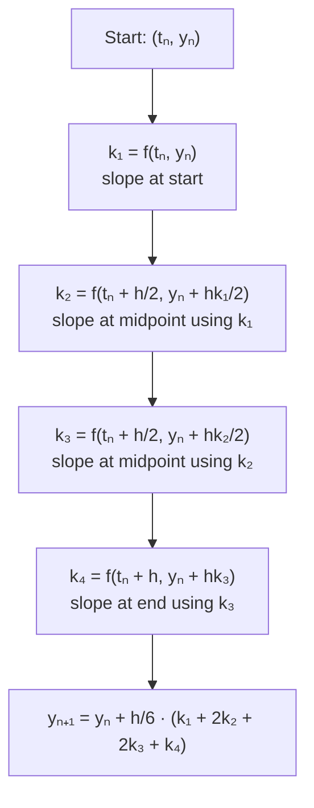

# Runge-Kutta Methods

## Introduction

Runge-Kutta methods represent a family of powerful numerical techniques for solving ordinary differential equations that significantly improve upon the simple Euler method. Developed by German mathematicians Carl Runge and Martin Kutta around 1900, these methods achieve higher accuracy by evaluating the derivative function at multiple points within each step. The most widely used member of this family is the fourth-order Runge-Kutta method (RK4), which provides an excellent balance between accuracy and computational efficiency.

The key innovation of Runge-Kutta methods is the use of weighted averages of slopes evaluated at different points in the interval, effectively capturing more information about the solution's behavior without requiring derivative calculations. This makes them both more accurate than single-step Euler methods and more practical than Taylor series methods that require higher derivatives.

## Second-Order Runge-Kutta (RK2)

Before discussing the popular fourth-order method, let's examine the second-order Runge-Kutta method, also known as the midpoint method or modified Euler method. For the initial value problem $y' = f(t, y)$, the RK2 formula is:

$$k_1 = f(t_n, y_n)$$
$$k_2 = f\left(t_n + \frac{h}{2}, y_n + \frac{h}{2}k_1\right)$$
$$y_{n+1} = y_n + h k_2$$

The idea is to evaluate the slope at the midpoint of the interval using a half-step Euler prediction, then use that slope for the full step. This method has local truncation error $O(h^3)$ and global error $O(h^2)$, making it a second-order method.

## Fourth-Order Runge-Kutta (RK4)

The following diagram illustrates how RK4 evaluates slopes at multiple points:

The classical fourth-order Runge-Kutta method is the most popular choice for solving ODEs. It evaluates the derivative at four carefully chosen points and combines them with specific weights:

$$k_1 = f(t_n, y_n)$$
$$k_2 = f\left(t_n + \frac{h}{2}, y_n + \frac{h}{2}k_1\right)$$
$$k_3 = f\left(t_n + \frac{h}{2}, y_n + \frac{h}{2}k_2\right)$$
$$k_4 = f(t_n + h, y_n + h k_3)$$
$$y_{n+1} = y_n + \frac{h}{6}(k_1 + 2k_2 + 2k_3 + k_4)$$

The four slopes represent:
- $k_1$: slope at the beginning of the interval
- $k_2$: slope at the midpoint using Euler's method with $k_1$
- $k_3$: slope at the midpoint using Euler's method with $k_2$
- $k_4$: slope at the end using Euler's method with $k_3$

The weighted average gives double weight to the midpoint slopes, producing a local truncation error of $O(h^5)$ and global error of $O(h^4)$.

## Error Analysis

The RK4 method achieves fourth-order accuracy, meaning the global error is proportional to $h^4$. This is dramatically better than the first-order Euler method. If we halve the step size:
- Euler method: error reduces by factor of 2
- RK4 method: error reduces by factor of 16

This superior error behavior allows RK4 to achieve high accuracy with relatively large step sizes, making it computationally efficient despite requiring four function evaluations per step.

## Worked Example

**Problem**: Solve $y' = t - y$ with $y(0) = 1$ on $[0, 0.5]$ using RK4 with $h = 0.5$.

**Solution**:

Given: $f(t, y) = t - y$, $t_0 = 0$, $y_0 = 1$, $h = 0.5$

**Calculate $k_1$**:
$$k_1 = f(0, 1) = 0 - 1 = -1$$

**Calculate $k_2$**:
$$k_2 = f\left(0 + \frac{0.5}{2}, 1 + \frac{0.5}{2}(-1)\right) = f(0.25, 0.75)$$
$$k_2 = 0.25 - 0.75 = -0.5$$

**Calculate $k_3$**:
$$k_3 = f\left(0 + \frac{0.5}{2}, 1 + \frac{0.5}{2}(-0.5)\right) = f(0.25, 0.875)$$
$$k_3 = 0.25 - 0.875 = -0.625$$

**Calculate $k_4$**:
$$k_4 = f(0 + 0.5, 1 + 0.5(-0.625)) = f(0.5, 0.6875)$$
$$k_4 = 0.5 - 0.6875 = -0.1875$$

**Calculate $y_1$**:
$$y_1 = 1 + \frac{0.5}{6}(-1 + 2(-0.5) + 2(-0.625) + (-0.1875))$$
$$y_1 = 1 + \frac{0.5}{6}(-1 - 1 - 1.25 - 0.1875)$$
$$y_1 = 1 + \frac{0.5}{6}(-3.4375) = 1 - 0.286458 = 0.713542$$

The exact solution is $y(t) = t - 1 + 2e^{-t}$, giving $y(0.5) = 0.713061$. The RK4 approximation has an error of only 0.000481, demonstrating excellent accuracy even with a relatively large step size.

## Implementation

\`\`\`python
import numpy as np
import matplotlib.pyplot as plt

def rk4_step(f, t, y, h):
    """
    Perform a single RK4 step.

    Parameters:
    -----------
    f : function
        The derivative function f(t, y)
    t : float
        Current time
    y : float or array
        Current solution value
    h : float
        Step size

    Returns:
    --------
    y_next : float or array
        Solution at t + h
    """
    k1 = f(t, y)
    k2 = f(t + h/2, y + h*k1/2)
    k3 = f(t + h/2, y + h*k2/2)
    k4 = f(t + h, y + h*k3)

    return y + (h/6) * (k1 + 2*k2 + 2*k3 + k4)

def rk4_method(f, t0, y0, t_final, h):
    """
    Solve ODE using RK4 method.

    Parameters:
    -----------
    f : function
        The function f(t, y) defining the ODE y' = f(t, y)
    t0 : float
        Initial time
    y0 : float or array
        Initial condition
    t_final : float
        Final time
    h : float
        Step size

    Returns:
    --------
    t : array
        Time points
    y : array
        Solution values at time points
    """
    n_steps = int((t_final - t0) / h)
    t = np.linspace(t0, t_final, n_steps + 1)
    y = np.zeros(n_steps + 1)
    y[0] = y0

    for i in range(n_steps):
        y[i + 1] = rk4_step(f, t[i], y[i], h)

    return t, y

# Example: Solve y' = t - y, y(0) = 1
def f(t, y):
    return t - y

t, y = rk4_method(f, 0, 1, 2, 0.1)

# Compare with exact solution
t_exact = np.linspace(0, 2, 100)
y_exact = t_exact - 1 + 2*np.exp(-t_exact)

plt.plot(t, y, 'bo-', label='RK4 method', markersize=4)
plt.plot(t_exact, y_exact, 'r-', label='Exact solution')
plt.xlabel('t')
plt.ylabel('y')
plt.title('RK4 vs Exact Solution')
plt.legend()
plt.grid(True)
plt.show()
\`\`\`

## Stability Analysis

The RK4 method has superior stability properties compared to the Euler method. For the test equation $y' = \lambda y$ with $\lambda < 0$, the stability region is much larger. The method remains stable for:

$$|1 + \lambda h + \frac{(\lambda h)^2}{2} + \frac{(\lambda h)^3}{6} + \frac{(\lambda h)^4}{24}| < 1$$

This allows significantly larger step sizes than the Euler method before instability occurs, making RK4 practical for a wider range of problems.

## Adaptive Runge-Kutta Methods

Modern implementations often use embedded Runge-Kutta methods that provide error estimates and adaptive step size control. The Runge-Kutta-Fehlberg method (RK45) uses a combination of fourth and fifth-order formulas to estimate the local truncation error and automatically adjust the step size to maintain a desired accuracy tolerance.

## Key Takeaways

- Runge-Kutta methods achieve higher accuracy by evaluating derivatives at multiple points per step
- RK4 is fourth-order accurate with global error $O(h^4)$, providing excellent accuracy for the computational cost
- The method requires four function evaluations per step but allows much larger step sizes than lower-order methods
- RK4 has superior stability properties compared to simpler methods like Euler
- The method is self-starting and does not require information from previous steps
- RK4 is the workhorse method for non-stiff ODE problems in scientific computing
- Adaptive variants like RK45 automatically adjust step size for optimal efficiency

## Common Mistakes

**Incorrect weighting of slopes**: The weights $\frac{1}{6}(k_1 + 2k_2 + 2k_3 + k_4)$ must be applied correctly. The middle slopes $k_2$ and $k_3$ receive double weight.

**Using wrong midpoint values**: When computing $k_2$ and $k_3$, remember to use $t_n + h/2$ for the time argument, not $t_n + h$.

**Confusion between $k_2$ and $k_3$**: Although both use midpoint times, $k_3$ uses the slope from $k_2$ to estimate the midpoint value, while $k_2$ uses $k_1$.

**Assuming RK4 solves all problems**: While excellent for non-stiff problems, RK4 still struggles with stiff differential equations that require implicit methods.

**Not considering computational cost**: RK4 requires four function evaluations per step. For expensive function evaluations, lower-order methods with smaller steps might be more efficient.
