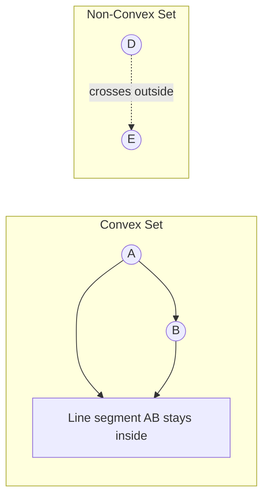

# Introduction to Convexity

## Why Convexity Matters

Convexity is the most important property in optimization theory. Convex optimization problems have remarkable properties:

1. **Every local minimum is a global minimum**
2. **Efficient polynomial-time algorithms exist**
3. **Strong duality theory provides powerful insights**
4. **Optimality conditions are necessary and sufficient**

The difference between convex and nonconvex optimization is fundamental—it's the difference between tractable and potentially intractable problems.

## Convex Sets

A set $\mathcal{C} \subseteq \mathbb{R}^n$ is **convex** if for any two points in the set, the line segment connecting them is also in the set.



**Formal definition**: $\mathcal{C}$ is convex if for all $x, y \in \mathcal{C}$ and all $\theta \in [0, 1]$:

$$
\theta x + (1 - \theta) y \in \mathcal{C}
$$

The point $\theta x + (1 - \theta) y$ is called a **convex combination** of $x$ and $y$.

### Examples of Convex Sets

**1. Hyperplanes**: $\{x : a^T x = b\}$ for $a \in \mathbb{R}^n$, $b \in \mathbb{R}$

**2. Half-spaces**: $\{x : a^T x \leq b\}$

**3. Euclidean balls**: $\{x : \|x - x_c\| \leq r\}$ for center $x_c$ and radius $r$

**4. Ellipsoids**: $\{x : (x - x_c)^T P (x - x_c) \leq 1\}$ where $P \succ 0$ (positive definite)

**5. Polyhedra**: $\{x : Ax \leq b, Cx = d\}$ (intersection of half-spaces and hyperplanes)

**6. Positive semidefinite cone**: $\mathbb{S}^n_+ = \{X \in \mathbb{R}^{n \times n} : X = X^T, X \succeq 0\}$

### Examples of Non-Convex Sets

**1. Discrete sets**: $\{0, 1, 2, 3\}$ (no line segments between points)

**2. Non-convex polygons**: L-shapes, stars

**3. Union of disjoint convex sets**: $\{x : x \leq -1\} \cup \{x : x \geq 1\}$

**4. Regions with "holes"**: Annulus $\{x : 1 \leq \|x\| \leq 2\}$

### Properties of Convex Sets

**Theorem 1 (Intersection)**: The intersection of convex sets is convex.

If $\mathcal{C}_1, \mathcal{C}_2, \ldots, \mathcal{C}_m$ are convex, then:

$$
\mathcal{C} = \bigcap_{i=1}^m \mathcal{C}_i
$$

is convex. This extends to infinite intersections.

**Proof**: Let $x, y \in \mathcal{C}$ and $\theta \in [0, 1]$. Then $x, y \in \mathcal{C}_i$ for all $i$. Since each $\mathcal{C}_i$ is convex, $\theta x + (1-\theta) y \in \mathcal{C}_i$ for all $i$, so $\theta x + (1-\theta) y \in \mathcal{C}$.

**Important consequence**: Polyhedra are convex (intersections of half-spaces).

**Theorem 2 (Affine transformation)**: If $\mathcal{C}$ is convex and $f(x) = Ax + b$ is an affine function, then:
- $f(\mathcal{C}) = \{Ax + b : x \in \mathcal{C}\}$ is convex (image)
- $f^{-1}(\mathcal{D}) = \{x : Ax + b \in \mathcal{D}\}$ is convex if $\mathcal{D}$ is convex (preimage)

**Warning**: The union of convex sets is generally NOT convex.

## Convex Functions

A function $f: \mathbb{R}^n \to \mathbb{R}$ is **convex** if its domain is convex and for all $x, y$ in the domain and $\theta \in [0, 1]$:

$$
f(\theta x + (1 - \theta) y) \leq \theta f(x) + (1 - \theta) f(y)
$$

**Geometric interpretation**: The function lies below the line segment connecting any two points on its graph.

The following plot shows a convex function $f(x) = x^2$ and a non-convex function $f(x) = \sin(x)$:

```plot
{
  "xAxis": { "domain": [-3, 3] },
  "yAxis": { "domain": [-2, 9] },
  "data": [
    { "fn": "x^2", "color": "#2563eb", "title": "Convex: x²" },
    { "fn": "sin(x)*2", "color": "#dc2626", "title": "Non-convex: sin(x)" }
  ]
}
```

Notice how for the convex function $x^2$, any chord (line segment between two points on the curve) lies **above** the curve. For the non-convex function $\sin(x)$, chords can lie below the curve.

### Strict and Strong Convexity

**Strictly convex**: The inequality is strict for $\theta \in (0, 1)$ and $x \neq y$:

$$
f(\theta x + (1 - \theta) y) < \theta f(x) + (1 - \theta) f(y)
$$

**Strongly convex**: There exists $m > 0$ such that $f(x) - \frac{m}{2}\|x\|^2$ is convex.

Strong convexity implies strict convexity implies convexity.

### Concave Functions

A function $f$ is **concave** if $-f$ is convex:

$$
f(\theta x + (1 - \theta) y) \geq \theta f(x) + (1 - \theta) f(y)
$$

Note: Maximizing a concave function is equivalent to minimizing a convex function.

### Examples of Convex Functions

**1. Affine functions**: $f(x) = a^T x + b$ (both convex and concave)

**2. Exponential**: $f(x) = e^{ax}$ for any $a \in \mathbb{R}$

**3. Powers**: $f(x) = x^p$ on $\mathbb{R}_+$ for $p \geq 1$ or $p \leq 0$

**4. Negative logarithm**: $f(x) = -\log x$ on $\mathbb{R}_{++}$

**5. Norms**: Any norm $\|x\|$ (e.g., $\|x\|_1$, $\|x\|_2$, $\|x\|_\infty$)

**6. Quadratic**: $f(x) = \frac{1}{2} x^T Q x + b^T x + c$ where $Q \succeq 0$ (positive semidefinite)

**7. Max function**: $f(x) = \max\{x_1, x_2, \ldots, x_n\}$

**8. Log-sum-exp**: $f(x) = \log(\sum_{i=1}^n e^{x_i})$

### Examples of Non-Convex Functions

**1. Concave powers**: $f(x) = x^p$ for $0 < p < 1$ on $\mathbb{R}_+$

**2. Logarithm**: $f(x) = \log x$ (concave, not convex)

**3. Sine and cosine**: $f(x) = \sin(x)$, $f(x) = \cos(x)$

**4. Negative quadratic**: $f(x) = -x^T Q x$ where $Q \succ 0$

**5. Reciprocal**: $f(x) = 1/x$ on $\mathbb{R}_{++}$ (not convex, not concave)

## First-Order Characterization

**Theorem (First-order condition)**: A differentiable function $f$ is convex if and only if its domain is convex and for all $x, y$ in the domain:

$$
f(y) \geq f(x) + \nabla f(x)^T (y - x)
$$

**Interpretation**: The first-order Taylor approximation (tangent hyperplane) is a global underestimator.

**Proof sketch** ($\Leftarrow$ direction):
Let $z = \theta x + (1-\theta) y$. Then:
$$
\begin{align}
f(x) &\geq f(z) + \nabla f(z)^T (x - z) \\
f(y) &\geq f(z) + \nabla f(z)^T (y - z)
\end{align}
$$

Multiply the first by $\theta$, the second by $1-\theta$, and add:
$$
\theta f(x) + (1-\theta) f(y) \geq f(z) + \nabla f(z)^T [\theta(x-z) + (1-\theta)(y-z)] = f(z)
$$

since $\theta(x-z) + (1-\theta)(y-z) = 0$.

### Consequence: Gradient Inequality

At any point $x$, the gradient $\nabla f(x)$ defines a supporting hyperplane to the epigraph of $f$.

## Second-Order Characterization

**Theorem (Second-order condition)**: A twice differentiable function $f$ is convex if and only if its domain is convex and the Hessian $\nabla^2 f(x)$ is positive semidefinite for all $x$:

$$
\nabla^2 f(x) \succeq 0 \quad \text{for all } x
$$

For **strict convexity**: $\nabla^2 f(x) \succ 0$ (sufficient but not necessary).

For **strong convexity** with parameter $m$: $\nabla^2 f(x) \succeq m I$ for all $x$.

### Checking Convexity via Hessian

**Example 1**: $f(x_1, x_2) = x_1^2 + x_2^2$

$$
\nabla^2 f = \begin{bmatrix} 2 & 0 \\ 0 & 2 \end{bmatrix} = 2I \succ 0
$$

Positive definite, so $f$ is strictly convex (and strongly convex with $m = 2$).

**Example 2**: $f(x_1, x_2) = x_1^2 - x_2^2$

$$
\nabla^2 f = \begin{bmatrix} 2 & 0 \\ 0 & -2 \end{bmatrix}
$$

Indefinite (has negative eigenvalue), so $f$ is not convex.

**Example 3**: $f(x_1, x_2) = x_1^2 + x_1 x_2 + x_2^2$

$$
\nabla^2 f = \begin{bmatrix} 2 & 1 \\ 1 & 2 \end{bmatrix}
$$

Eigenvalues: $\lambda_1 = 3$, $\lambda_2 = 1$ (both positive), so positive definite and strictly convex.

## Operations Preserving Convexity

### 1. Nonnegative Weighted Sum

If $f_1, \ldots, f_m$ are convex and $w_1, \ldots, w_m \geq 0$, then:

$$
f(x) = \sum_{i=1}^m w_i f_i(x)
$$

is convex.

### 2. Composition with Affine Function

If $f$ is convex and $g(x) = Ax + b$, then $f \circ g$ is convex:

$$
h(x) = f(Ax + b)
$$

### 3. Pointwise Maximum

If $f_1, \ldots, f_m$ are convex, then:

$$
f(x) = \max\{f_1(x), f_2(x), \ldots, f_m(x)\}
$$

is convex.

**Example**: Piecewise linear function
$$
f(x) = \max\{a_1^T x + b_1, a_2^T x + b_2, \ldots, a_m^T x + b_m\}
$$

### 4. Pointwise Supremum

Even for infinite collections: if $f(x, y)$ is convex in $x$ for each $y \in \mathcal{A}$, then:

$$
g(x) = \sup_{y \in \mathcal{A}} f(x, y)
$$

is convex.

## Epigraphs and Sublevel Sets

**Epigraph**: The region above the graph of $f$:

$$
\text{epi}(f) = \{(x, t) : x \in \text{dom}(f), f(x) \leq t\}
$$

**Theorem**: $f$ is convex if and only if $\text{epi}(f)$ is a convex set.

**Sublevel set**: The set where $f$ is at most $\alpha$:

$$
\mathcal{S}_\alpha = \{x : f(x) \leq \alpha\}
$$

**Theorem**: If $f$ is convex, then all sublevel sets are convex.

**Warning**: The converse is false! Convex sublevel sets don't imply convex function.

**Example**: $f(x) = -e^x$ has convex sublevel sets but is not convex.

## Convex Optimization Problems

A **convex optimization problem** has the form:

$$
\begin{align}
\text{minimize} \quad & f_0(x) \\
\text{subject to} \quad & f_i(x) \leq 0, \quad i = 1, \ldots, m \\
& a_j^T x = b_j, \quad j = 1, \ldots, p
\end{align}
$$

where:
- $f_0, f_1, \ldots, f_m$ are convex functions
- Equality constraints are affine

**Key property**: The feasible set of a convex problem is convex (intersection of convex sets).

### Why Convex Problems are Special

**Theorem (Local = Global)**: Any local minimum of a convex optimization problem is a global minimum.

**Proof**: Suppose $x^*$ is a local minimum but not global. Then there exists $y$ with $f_0(y) < f_0(x^*)$. Since the problem is convex, the line segment from $x^*$ to $y$ is feasible. For small enough $\epsilon > 0$, the point $x^* + \epsilon(y - x^*)$ is in the local neighborhood of $x^*$ and:

$$
f_0(x^* + \epsilon(y - x^*)) \leq (1 - \epsilon) f_0(x^*) + \epsilon f_0(y) < f_0(x^*)
$$

This contradicts $x^*$ being a local minimum.

### Recognizing Convex Problems

**Is this convex?**

$$
\begin{align}
\min \quad & x_1^2 + x_2^2 \\
\text{s.t.} \quad & x_1 + x_2 \geq 1 \\
& x_1 \geq 0, \; x_2 \geq 0
\end{align}
$$

- Objective: $x_1^2 + x_2^2$ is convex ✓
- Constraint $x_1 + x_2 \geq 1$ must be rewritten as $-x_1 - x_2 \leq -1$ (convex) ✓
- Bounds $x_i \geq 0$ are convex ✓

**Yes, this is convex!**

**Is this convex?**

$$
\begin{align}
\min \quad & x_1^2 - x_2^2 \\
\text{s.t.} \quad & x_1 + x_2 = 1
\end{align}
$$

- Objective: $x_1^2 - x_2^2$ is NOT convex (saddle function) ✗

**No, this is NOT convex.**

## Python Implementation

```python
import numpy as np
import matplotlib.pyplot as plt
from mpl_toolkits.mplot3d import Axes3D
import cvxpy as cp

print("=" * 70)
print("CONVEXITY DEMONSTRATIONS")
print("=" * 70)

# Example 1: Checking convexity via Hessian
print("\n" + "=" * 70)
print("Example 1: Checking Convexity via Hessian")
print("=" * 70)

def check_convexity(hessian, func_name):
    """Check if a function is convex based on its Hessian."""
    eigenvalues = np.linalg.eigvals(hessian)
    min_eig = np.min(eigenvalues)

    print(f"\n{func_name}:")
    print(f"  Hessian:\n{hessian}")
    print(f"  Eigenvalues: {eigenvalues}")

    if min_eig > 1e-10:
        print(f"  → Strictly convex (min eigenvalue = {min_eig:.4f} > 0)")
    elif min_eig >= -1e-10:
        print(f"  → Convex (min eigenvalue = {min_eig:.4f} ≥ 0)")
    else:
        print(f"  → NOT convex (min eigenvalue = {min_eig:.4f} < 0)")

# f(x1, x2) = x1^2 + x2^2
H1 = np.array([[2, 0], [0, 2]])
check_convexity(H1, "f(x1, x2) = x1² + x2²")

# f(x1, x2) = x1^2 - x2^2
H2 = np.array([[2, 0], [0, -2]])
check_convexity(H2, "f(x1, x2) = x1² - x2²")

# f(x1, x2) = x1^2 + x1*x2 + x2^2
H3 = np.array([[2, 1], [1, 2]])
check_convexity(H3, "f(x1, x2) = x1² + x1·x2 + x2²")

# f(x1, x2) = x1^2 + 3*x1*x2 + x2^2
H4 = np.array([[2, 3], [3, 2]])
check_convexity(H4, "f(x1, x2) = x1² + 3x1·x2 + x2²")

# Example 2: First-order condition verification
print("\n" + "=" * 70)
print("Example 2: First-Order Condition (Supporting Hyperplane)")
print("=" * 70)

def f_convex(x):
    """Convex function: x^2"""
    return x**2

def grad_f_convex(x):
    """Gradient of x^2"""
    return 2*x

# Test first-order condition at x = 1
x_point = 1.0
x_test = np.linspace(-2, 4, 100)

f_values = f_convex(x_test)
linear_approx = f_convex(x_point) + grad_f_convex(x_point) * (x_test - x_point)

print(f"\nTesting f(x) = x² at x = {x_point}")
print(f"f({x_point}) = {f_convex(x_point)}")
print(f"∇f({x_point}) = {grad_f_convex(x_point)}")

# Check if f(y) >= f(x) + ∇f(x)^T(y - x) for all y
below_count = np.sum(f_values < linear_approx - 1e-10)
print(f"\nFirst-order condition check:")
if below_count == 0:
    print("  ✓ f(y) ≥ f(x) + ∇f(x)ᵀ(y - x) for all test points")
    print("  → Confirms convexity")
else:
    print(f"  ✗ Condition violated at {below_count} points")

# Example 3: Convex sets
print("\n" + "=" * 70)
print("Example 3: Convex Sets")
print("=" * 70)

def is_in_ball(x, center, radius):
    """Check if point is in Euclidean ball."""
    return np.linalg.norm(x - center) <= radius

def is_in_polyhedron(x, A, b):
    """Check if point is in polyhedron Ax <= b."""
    return np.all(A @ x <= b + 1e-10)

# Test convexity of Euclidean ball
center = np.array([1, 1])
radius = 2

# Test 100 random pairs of points
n_tests = 100
ball_convex = True

for _ in range(n_tests):
    # Two random points in the ball
    angle1, angle2 = np.random.rand(2) * 2 * np.pi
    r1, r2 = np.random.rand(2) * radius

    x1 = center + r1 * np.array([np.cos(angle1), np.sin(angle1)])
    x2 = center + r2 * np.array([np.cos(angle2), np.sin(angle2)])

    # Test convex combination
    theta = np.random.rand()
    x_combo = theta * x1 + (1 - theta) * x2

    if not is_in_ball(x_combo, center, radius):
        ball_convex = False
        break

print(f"Euclidean ball (center={center}, radius={radius}):")
print(f"  Tested {n_tests} random convex combinations")
print(f"  → {'Convex ✓' if ball_convex else 'Not convex ✗'}")

# Test polyhedron
A = np.array([[1, 1], [-1, 0], [0, -1]])
b = np.array([5, 0, 0])

poly_convex = True
for _ in range(n_tests):
    # Two random points in polyhedron
    x1 = np.random.rand(2) * 5
    x2 = np.random.rand(2) * 5

    while not is_in_polyhedron(x1, A, b):
        x1 = np.random.rand(2) * 5
    while not is_in_polyhedron(x2, A, b):
        x2 = np.random.rand(2) * 5

    theta = np.random.rand()
    x_combo = theta * x1 + (1 - theta) * x2

    if not is_in_polyhedron(x_combo, A, b):
        poly_convex = False
        break

print(f"\nPolyhedron (x1 + x2 ≤ 5, x1 ≥ 0, x2 ≥ 0):")
print(f"  Tested {n_tests} random convex combinations")
print(f"  → {'Convex ✓' if poly_convex else 'Not convex ✗'}")

# Example 4: Solving convex vs non-convex problems
print("\n" + "=" * 70)
print("Example 4: Convex vs Non-Convex Optimization")
print("=" * 70)

# Convex problem: minimize x1^2 + x2^2 subject to x1 + x2 >= 1
x_convex = cp.Variable(2)
obj_convex = cp.Minimize(cp.sum_squares(x_convex))
constraints_convex = [cp.sum(x_convex) >= 1]

prob_convex = cp.Problem(obj_convex, constraints_convex)
prob_convex.solve()

print("\nConvex problem: min x1² + x2² s.t. x1 + x2 ≥ 1")
print(f"  Status: {prob_convex.status}")
print(f"  Optimal solution: x = {x_convex.value}")
print(f"  Optimal value: {prob_convex.value:.6f}")
print(f"  → Globally optimal (convex problem)")

# Visualization
fig = plt.figure(figsize=(18, 12))

# Plot 1: Convex vs Non-Convex Functions (1D)
ax1 = fig.add_subplot(2, 3, 1)
x = np.linspace(-2, 2, 400)
y_convex = x**2
y_nonconvex = x**3 - 3*x

ax1.plot(x, y_convex, 'b-', linewidth=2, label='Convex: $f(x) = x^2$')
ax1.plot(x, y_nonconvex, 'r-', linewidth=2, label='Non-convex: $f(x) = x^3 - 3x$')

# Show tangent line for convex function
x0 = 0.5
y0_convex = x0**2
slope_convex = 2*x0
tangent_convex = y0_convex + slope_convex * (x - x0)
ax1.plot(x, tangent_convex, 'b--', alpha=0.5, label='Tangent (underestimator)')
ax1.plot(x0, y0_convex, 'bo', markersize=8)

ax1.set_xlabel('x', fontsize=11)
ax1.set_ylabel('f(x)', fontsize=11)
ax1.set_title('1D: Convex vs Non-Convex Functions', fontsize=12, fontweight='bold')
ax1.legend(fontsize=9)
ax1.grid(True, alpha=0.3)
ax1.set_ylim(-5, 5)

# Plot 2: Convex function surface (3D)
ax2 = fig.add_subplot(2, 3, 2, projection='3d')
x1 = np.linspace(-2, 2, 50)
x2 = np.linspace(-2, 2, 50)
X1, X2 = np.meshgrid(x1, x2)
Z_convex = X1**2 + X2**2

surf = ax2.plot_surface(X1, X2, Z_convex, cmap='viridis', alpha=0.8)
ax2.set_xlabel('$x_1$', fontsize=10)
ax2.set_ylabel('$x_2$', fontsize=10)
ax2.set_zlabel('$f(x_1, x_2)$', fontsize=10)
ax2.set_title('Convex: $f(x_1, x_2) = x_1^2 + x_2^2$', fontsize=11, fontweight='bold')

# Plot 3: Non-convex function surface (3D)
ax3 = fig.add_subplot(2, 3, 3, projection='3d')
Z_nonconvex = X1**2 - X2**2  # Saddle function

surf = ax3.plot_surface(X1, X2, Z_nonconvex, cmap='plasma', alpha=0.8)
ax3.set_xlabel('$x_1$', fontsize=10)
ax3.set_ylabel('$x_2$', fontsize=10)
ax3.set_zlabel('$f(x_1, x_2)$', fontsize=10)
ax3.set_title('Non-convex: $f(x_1, x_2) = x_1^2 - x_2^2$', fontsize=11, fontweight='bold')

# Plot 4: Convex set examples
ax4 = fig.add_subplot(2, 3, 4)

# Euclidean ball
theta = np.linspace(0, 2*np.pi, 100)
circle_x = 2 + 1.5*np.cos(theta)
circle_y = 2 + 1.5*np.sin(theta)
ax4.fill(circle_x, circle_y, alpha=0.3, color='blue', label='Ball (convex)')
ax4.plot(circle_x, circle_y, 'b-', linewidth=2)

# Polyhedron
poly_x = [0, 3, 3, 0, 0]
poly_y = [0, 0, 2, 2, 0]
ax4.fill(poly_x, poly_y, alpha=0.3, color='green')
ax4.plot(poly_x, poly_y, 'g-', linewidth=2, label='Polyhedron (convex)')

ax4.set_xlabel('$x_1$', fontsize=11)
ax4.set_ylabel('$x_2$', fontsize=11)
ax4.set_title('Examples of Convex Sets', fontsize=12, fontweight='bold')
ax4.legend(fontsize=9)
ax4.grid(True, alpha=0.3)
ax4.set_aspect('equal')
ax4.set_xlim(-1, 5)
ax4.set_ylim(-1, 5)

# Plot 5: Non-convex set examples
ax5 = fig.add_subplot(2, 3, 5)

# L-shape (non-convex)
l_shape_x = [0, 2, 2, 1, 1, 0, 0]
l_shape_y = [0, 0, 1, 1, 3, 3, 0]
ax5.fill(l_shape_x, l_shape_y, alpha=0.3, color='red')
ax5.plot(l_shape_x, l_shape_y, 'r-', linewidth=2, label='L-shape (non-convex)')

# Show why it's non-convex
p1 = np.array([0.5, 2.5])
p2 = np.array([1.5, 0.5])
ax5.plot([p1[0], p2[0]], [p1[1], p2[1]], 'k--', linewidth=2, alpha=0.7, label='Line segment outside set')
ax5.plot(p1[0], p1[1], 'ko', markersize=8)
ax5.plot(p2[0], p2[1], 'ko', markersize=8)

ax5.set_xlabel('$x_1$', fontsize=11)
ax5.set_ylabel('$x_2$', fontsize=11)
ax5.set_title('Example of Non-Convex Set', fontsize=12, fontweight='bold')
ax5.legend(fontsize=9)
ax5.grid(True, alpha=0.3)
ax5.set_aspect('equal')
ax5.set_xlim(-0.5, 3)
ax5.set_ylim(-0.5, 3.5)

# Plot 6: First-order condition visualization
ax6 = fig.add_subplot(2, 3, 6)

x_plot = np.linspace(-2, 4, 400)
f_plot = x_plot**2

# Multiple tangent lines
for x0 in [-1, 0, 1, 2]:
    f0 = x0**2
    grad_f0 = 2*x0
    tangent = f0 + grad_f0 * (x_plot - x0)
    ax6.plot(x_plot, tangent, '--', alpha=0.5, linewidth=1.5)
    ax6.plot(x0, f0, 'ro', markersize=6)

ax6.plot(x_plot, f_plot, 'b-', linewidth=2.5, label='$f(x) = x^2$')
ax6.set_xlabel('x', fontsize=11)
ax6.set_ylabel('f(x)', fontsize=11)
ax6.set_title('First-Order Condition:\nTangents Always Underestimate', fontsize=12, fontweight='bold')
ax6.legend(fontsize=9)
ax6.grid(True, alpha=0.3)
ax6.set_ylim(-2, 10)

plt.tight_layout()
plt.savefig('convexity_introduction.png', dpi=300, bbox_inches='tight')
print("\n" + "=" * 70)
print("Visualization saved as 'convexity_introduction.png'")
print("=" * 70)
```

## Summary

### Key Concepts

1. **Convex sets**: Line segments between any two points remain in the set
2. **Convex functions**: Function lies below line segments (first-order condition, second-order condition)
3. **Operations preserving convexity**: Sums, compositions, pointwise max
4. **Convex problems**: Convex objective + convex constraints (affine equalities)
5. **Local = Global**: Any local minimum is global for convex problems

### Why It Matters

Convexity is the dividing line between tractable and intractable optimization:
- **Convex**: Polynomial-time algorithms, global optimality guarantees
- **Non-convex**: Potentially exponential complexity, multiple local minima

Recognizing and exploiting convexity is essential for effective optimization.

In the next sections, we'll explore local vs. global optimality and derive the fundamental optimality conditions.
