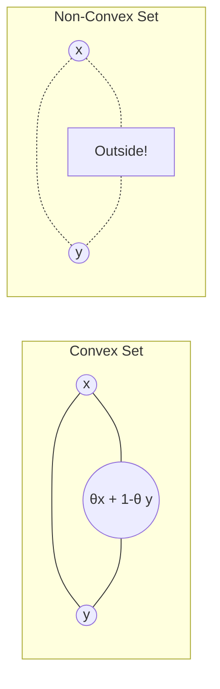

# Convex Sets

Convexity is the fundamental bedrock of modern optimization theory. While linear programming relies on polyhedra (a specific type of convex set), general convex optimization deals with a broader class of sets that share critical geometric properties. Understanding convex sets is essential because they determine when optimization problems are tractable and when they are computationally hard.

## Definition

A set $C \subseteq \mathbb{R}^n$ is **convex** if the line segment between any two points in $C$ lies entirely in $C$.

Mathematically:
$$ \forall x, y \in C, \forall \theta \in [0, 1], \quad \theta x + (1 - \theta)y \in C $$

This definition captures a simple but powerful geometric idea: you can "see" any point in the set from any other point without leaving the set.

### Geometric Intuition

- **Convex:** A circle, a square, a solid ellipse, the entire plane. If you see it, it "bulges out" or is flat. It has no dents or holes.
- **Non-Convex:** A crescent moon, a star, a donut (torus). You can pick two points in the set (e.g., opposite tips of the crescent) such that the line connecting them goes outside the set.

The following diagram illustrates the convex set concept:

### Verifying Convexity

To verify that a set $C$ is convex, you must show that for any two arbitrary points $x, y \in C$ and any $\theta \in [0,1]$, the point $\theta x + (1-\theta)y$ is also in $C$. This often involves algebraic manipulation to show the convex combination satisfies the defining constraints of $C$.

## Important Examples

### 1. Affine Sets

A set is **affine** if the line passing through any two points lies in the set (i.e., $\theta \in \mathbb{R}$, not just $[0,1]$).
- Example: Lines, planes, hyperplanes, the solution set of $Ax=b$.
- Every affine set is convex (affine is a stronger condition).
- The empty set $\emptyset$, singletons $\{x_0\}$, and $\mathbb{R}^n$ are all affine.

### 2. Hyperplanes and Halfspaces

A **hyperplane** is a set of the form:
$$ \{ x \mid a^T x = b \} $$
where $a \neq 0$. It divides space into two halves. In $\mathbb{R}^2$, a hyperplane is a line; in $\mathbb{R}^3$, it is a plane.

A **halfspace** is a set of the form:
$$ \{ x \mid a^T x \leq b \} $$
Halfspaces are convex. The intersection of halfspaces forms a polyhedron. Halfspaces represent the feasible region of a single linear inequality constraint.

### 3. Euclidean Balls and Ellipsoids

A **Euclidean ball** centered at $x_c$ with radius $r$:
$$ B(x_c, r) = \{ x \mid \| x - x_c \|_2 \leq r \} $$
Balls are convex. This can be proven by using the triangle inequality.

An **Ellipsoid**:
$$ \mathcal{E} = \{ x \mid (x - x_c)^T P^{-1} (x - x_c) \leq 1 \} $$
where $P$ is symmetric and positive definite ($P \succ 0$). Ellipsoids are convex and generalize balls by allowing different "radii" in different directions. The matrix $P$ determines the shape and orientation of the ellipsoid.

### 4. Norm Balls

More generally, for any norm $\|\cdot\|$, the **norm ball** is convex:
$$ B = \{ x \mid \|x\| \leq r \} $$

This includes:
- **$\ell_1$-ball:** $\{x \mid \sum |x_i| \leq 1\}$ — a diamond shape in 2D, an octahedron in 3D
- **$\ell_\infty$-ball:** $\{x \mid \max |x_i| \leq 1\}$ — a hypercube
- **$\ell_2$-ball:** The standard Euclidean ball

### 5. Polyhedra

A **polyhedron** is defined by a finite number of linear inequalities and equalities:
$$ P = \{ x \mid Ax \leq b, Cx = d \} $$
Since it is the intersection of a finite number of halfspaces and hyperplanes (all convex), a polyhedron is convex. Polyhedra are the feasible regions of linear programs.

A **polytope** is a bounded polyhedron. Examples include simplices (triangles, tetrahedra), hypercubes, and the feasible regions of bounded linear programs.

### 6. Positive Semidefinite Cone

The set of symmetric positive semidefinite $n \times n$ matrices, denoted $\mathbb{S}^n_+$, is a convex cone.
If $A \succeq 0$ and $B \succeq 0$, then for any $\theta \in [0,1]$, $\theta A + (1-\theta)B \succeq 0$.

*Proof:* For any vector $v$, $v^T(\theta A + (1-\theta)B)v = \theta v^T A v + (1-\theta) v^T B v \geq 0$ since both terms are non-negative.

This cone is fundamental in semidefinite programming (SDP), a powerful generalization of linear programming.

## Properties of Convex Sets

### Intersection

**Theorem:** The intersection of *any* number (finite or infinite) of convex sets is convex.
$$ C = \bigcap_{\alpha \in I} C_\alpha $$

*Proof:* If $x, y \in C$, then $x, y \in C_\alpha$ for all $\alpha$. Since each $C_\alpha$ is convex, the segment $xy$ is in each $C_\alpha$. Thus, the segment is in the intersection $C$.

*Example:* Since a halfspace is convex, and a polyhedron is the intersection of halfspaces, a polyhedron must be convex.

This property is crucial for constraint satisfaction: if each constraint defines a convex set, the feasible region (intersection of all constraints) is convex.

### Union (Not Always Convex!)

**Warning:** The union of convex sets is generally **not** convex. Consider two disjoint balls — their union is not convex because a line between points in different balls passes through empty space.

### Image and Pre-image

Let $f(x) = Ax + b$ be an affine function.
- If $C \subseteq \mathbb{R}^n$ is convex, its **image** $f(C)$ is convex.
- If $D \subseteq \mathbb{R}^m$ is convex, its **inverse image** $f^{-1}(D)$ is convex.

*Example:* The projection of a convex set onto a coordinate axis is a convex interval.

### Scaling and Translation

If $C$ is convex, then:
- $\alpha C = \{\alpha x \mid x \in C\}$ is convex for any scalar $\alpha$
- $C + a = \{x + a \mid x \in C\}$ is convex for any vector $a$

### Minkowski Sum

The **Minkowski sum** of two sets $C$ and $D$ is:
$$ C + D = \{x + y \mid x \in C, y \in D\} $$

If both $C$ and $D$ are convex, then $C + D$ is convex.

## Why Convexity Matters in Optimization

In optimization, if the feasible region is a convex set:

1. **Local optimum is global optimum:** For convex objective functions over convex sets, any local minimum is automatically the global minimum. There are no "traps" — gradient descent won't get stuck in suboptimal valleys.

2. **Efficient traversal:** We can efficiently move from any point to any other point via a straight line without leaving the set. This enables gradient-based methods.

3. **Mathematical tractability:** Separation theorems, supporting hyperplanes, and duality theory all apply to convex sets, giving us powerful analytical tools.

4. **Polynomial-time algorithms:** Many convex optimization problems can be solved in polynomial time (e.g., interior-point methods).

Conversely, optimizing over non-convex sets is generally NP-hard. Non-convex problems may have many local minima, and finding the global optimum may require exponential time.

## Common Mistakes

1. **Assuming unions are convex:** The union of convex sets is not generally convex.

2. **Confusing convex sets with convex functions:** A convex set is a geometric object; a convex function is a mapping. They are related (via epigraphs) but distinct concepts.

3. **Forgetting boundary cases:** When $\theta = 0$ or $\theta = 1$, the convex combination equals one of the endpoints. Ensure your proof handles these cases.

4. **Not verifying the domain:** When checking convexity, ensure the set's domain is clearly specified. A set might be convex on $\mathbb{R}^n$ but not on a restricted domain.

## Key Takeaways

- A set is convex if the line segment between any two points lies entirely within the set.
- Affine sets, halfspaces, balls, ellipsoids, polyhedra, and cones are all convex.
- Intersections of convex sets are convex; unions typically are not.
- Convexity enables efficient optimization algorithms and guarantees global optimality.
- The positive semidefinite cone is a fundamental convex set in advanced optimization.
