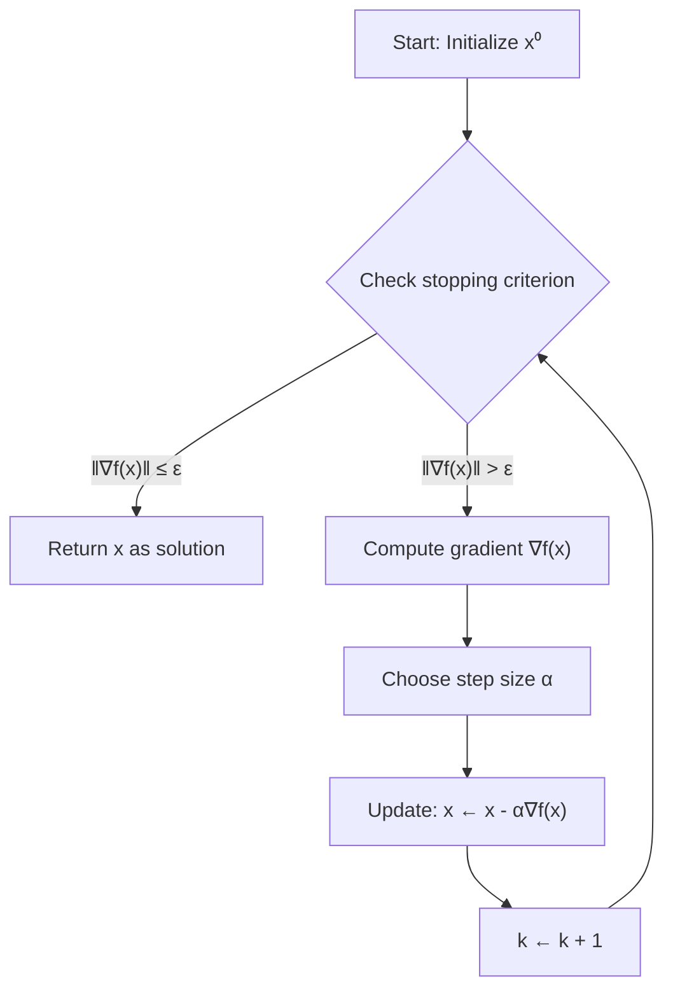

# Gradient Descent

Gradient Descent is the "Hello World" of optimization algorithms, yet it (and its variants) underpins the entire modern machine learning revolution. It is a first-order iterative method for finding a local minimum of a differentiable function.

## The Algorithm

To minimize a function $f(x)$:
1.  Start at an initial guess $x^{(0)}$.
2.  Iterate:
    $$ x^{(k+1)} = x^{(k)} - \alpha_k \nabla f(x^{(k)}) $$
    where $\alpha_k > 0$ is the **step size** (or learning rate).
3.  Stop when $\|\nabla f(x^{(k)})\| \leq \epsilon$ or maximum iterations reached.

### Geometric Intuition
The gradient $\nabla f(x)$ points in the direction of **steepest ascent** (greatest increase).
Therefore, $-\nabla f(x)$ points in the direction of **steepest descent**.
We take a small step downhill. Like rolling a ball down a hill, eventually, we should reach the bottom (a minimum).

The following flowchart shows the gradient descent algorithm:



Consider the simple quadratic function $f(x) = x^2$. The gradient is $\nabla f(x) = 2x$, pointing away from the minimum at $x=0$. Taking steps opposite to the gradient moves us toward the minimum:

```plot
{
  "xAxis": { "domain": [-3, 3] },
  "yAxis": { "domain": [-1, 9] },
  "data": [
    { "fn": "x^2", "color": "#2563eb", "title": "f(x) = x²" },
    { "fn": "2*x", "color": "#16a34a", "title": "Gradient: 2x" }
  ]
}
```

When $x > 0$, the gradient is positive (pointing right), so we move left (toward the minimum). When $x < 0$, the gradient is negative (pointing left), so we move right (toward the minimum).

## Why the Negative Gradient?

Consider the first-order Taylor expansion of $f$ around $x$:
$$ f(x + \Delta x) \approx f(x) + \nabla f(x)^T \Delta x $$
We want to choose a step $\Delta x$ of fixed length $\|\Delta x\| = \delta$ to maximize the decrease $f(x) - f(x + \Delta x) \approx - \nabla f(x)^T \Delta x$.
This is equivalent to minimizing $\nabla f(x)^T \Delta x$.
By Cauchy-Schwarz, $u^T v \geq -\|u\| \|v\|$, with equality when $v$ opposes $u$.
So the best direction $\Delta x$ is parallel to $-\nabla f(x)$.

## Step Size Strategies

The choice of $\alpha_k$ is critical.
- **Too small:** Convergence is agonizingly slow.
- **Too large:** The algorithm overshoots, oscillates, or diverges.

### 1. Constant Step Size
$\\alpha_k = \alpha$. Simple, but hard to tune.

### 2. Exact Line Search
Choose $\\alpha_k$ to minimize $f$ along the ray:
$$ \alpha_k = \arg \min_{\\alpha \geq 0} f(x^{(k)} - \alpha \nabla f(x^{(k)})) $$
Computationally expensive (requires solving a 1D optimization problem each step).

### 3. Backtracking Line Search (Armijo)
A practical approximation. Start with a large $\\alpha$ and shrink it ($\\alpha \leftarrow \\beta \\alpha$, e.g., $\\beta=0.5$) until the "Sufficient Decrease Condition" is met:
$$ f(x - \alpha \nabla f) \leq f(x) - c \alpha \|\nabla f\|^2 $$
Typically $c \in (0, 0.5)$. This guarantees convergence without full minimization.

## Example: Quadratic Bowl

$$ f(x) = \frac{1}{2} (x_1^2 + \gamma x_2^2), \quad \gamma > 1 $$
Gradient: $\nabla f(x) = [x_1, \gamma x_2]^T$.
Update:
$x_1^{(k+1)} = x_1^{(k)} (1 - \alpha)$
$x_2^{(k+1)} = x_2^{(k)} (1 - \alpha \gamma)$

If $\\gamma = 1$ (Circular bowl), setting $\\alpha = 1$ reaches optimum in 1 step.
If $\\gamma = 10$ (Elongated ellipsoid):
- $\\alpha$ needs to be small ($\\approx 1/10$) to handle the steep $x_2$ direction.
- But this makes progress in $x_1$ very slow.
- The path "zig-zags" down the valley.

This highlights the main weakness of Gradient Descent: it struggles with **ill-conditioned** problems (high condition number $\\kappa$).

## Theoretical Convergence

For a convex function with $L$-Lipschitz gradient ($\|\nabla f(x) - \nabla f(y)\| \leq L\|x-y\|$):
Gradient Descent with $\\alpha = 1/L$ converges at rate **$O(1/k)$**.
$$ f(x^{(k)}) - f^* \leq \frac{L \|x^{(0)} - x^*\|^2}{2k} $$

For a **strongly convex** function (curvature at least $m > 0$):
Convergence is **linear** (geometric progression, $O(c^k)$).
$$ f(x^{(k)}) - f^* \leq \left(1 - \frac{m}{L}\right)^k (f(x^{(0)}) - f^*) $$
The term $L/m$ is the **condition number** $\\kappa$.
If $\\kappa$ is large (1,000,000), convergence is slow. If $\\kappa \approx 1$, it's fast.

## Variants and Extensions

### Gradient Descent with Momentum

One way to address the slow convergence in ravines is to add **momentum**. The idea is to accumulate a velocity vector that grows in persistent directions and dampens in oscillating directions.

Update rule:
$$ v^{(k+1)} = \beta v^{(k)} - \alpha \nabla f(x^{(k)}) $$
$$ x^{(k+1)} = x^{(k)} + v^{(k+1)} $$

where $\beta \in [0, 1)$ is the momentum parameter (typically 0.9). This accelerates convergence and helps escape shallow local minima.

### Nesterov Accelerated Gradient

An improved version of momentum that "looks ahead":
$$ v^{(k+1)} = \beta v^{(k)} - \alpha \nabla f(x^{(k)} + \beta v^{(k)}) $$
$$ x^{(k+1)} = x^{(k)} + v^{(k+1)} $$

This achieves provably optimal convergence rates for first-order methods: $O(1/k^2)$ for convex functions.

### Preconditioning

If we knew the Hessian $H$, we could use the preconditioned gradient:
$$ x^{(k+1)} = x^{(k)} - \alpha H^{-1} \nabla f(x^{(k)}) $$

This is Newton's method. For cheaper approximations, we can use diagonal preconditioning (scaling each coordinate by an estimate of its curvature). This is the idea behind adaptive learning rate methods like **AdaGrad** and **RMSprop**.

## Detailed Example: Quadratic Function

Let's work through gradient descent on the quadratic function:
$$ f(x) = \frac{1}{2}x^T Q x - b^T x $$
where $Q$ is a symmetric positive definite matrix.

The gradient is:
$$ \nabla f(x) = Qx - b $$

The optimal solution (where gradient vanishes) is:
$$ x^* = Q^{-1}b $$

With exact line search, the optimal step size is:
$$ \alpha^* = \frac{\nabla f^T \nabla f}{\nabla f^T Q \nabla f} $$

The convergence rate depends on the condition number $\kappa = \lambda_{\max}/\lambda_{\min}$ of $Q$:
$$ \|x^{(k)} - x^*\|_Q^2 \leq \left(\frac{\kappa - 1}{\kappa + 1}\right)^{2k} \|x^{(0)} - x^*\|_Q^2 $$

For $Q = I$ (sphere), $\kappa = 1$ and convergence is achieved in one step. For ill-conditioned $Q$ with $\kappa = 10^6$, convergence is extremely slow.

## Common Mistakes and Pitfalls

### 1. Step Size Too Large
If $\alpha > 2/L$, gradient descent can diverge. The iterates oscillate with increasing amplitude.

**Example:** For $f(x) = \frac{1}{2}x^2$ with $L=1$, using $\alpha = 3$ gives:
$$ x^{(k+1)} = x^{(k)} - 3(x^{(k)}) = -2x^{(k)} $$
The sequence alternates with doubling magnitude: $x^{(0)} = 1, x^{(1)} = -2, x^{(2)} = 4, \ldots$

### 2. Forgetting to Normalize Features
If features have different scales (e.g., one variable ranges from 0-1, another from 0-1000), the gradient will be dominated by the large-scale variable. This creates an elongated ellipsoid and slow convergence.

**Solution:** Standardize features to have zero mean and unit variance before optimization.

### 3. Using Gradient Descent on Non-Convex Functions
Gradient descent can get stuck in local minima or saddle points. For deep learning, this is mitigated by:
- Random initialization
- Momentum (helps escape shallow minima)
- Stochastic gradients (noise helps exploration)

### 4. Not Checking Convergence Criteria
Always monitor both the gradient norm $\|\nabla f(x)\|$ and the function value change $|f(x^{(k)}) - f(x^{(k-1)})|$. Stop when either becomes sufficiently small.

## Practical Implementation Considerations

### Numerical Stability
When computing the gradient, numerical errors can accumulate. For very small gradients near the minimum, use higher precision arithmetic or check for stagnation.

### Parallel Implementation
Gradient computation can often be parallelized, especially when $f(x) = \sum_i f_i(x)$ (finite sum). Compute $\nabla f_i(x)$ in parallel and sum the results.

### Memory Efficiency
Gradient descent requires storing only:
- Current point $x^{(k)}$ (n values)
- Gradient $\nabla f(x^{(k)})$ (n values)
Total: $O(n)$ memory, making it suitable for high-dimensional problems.

## Connection to Other Methods

Gradient descent is the foundation for many advanced algorithms:
- **Conjugate Gradient:** Uses previous gradients to construct better search directions
- **L-BFGS:** Approximates second-order information from gradient history
- **Proximal Gradient:** Extends gradient descent to non-smooth objectives
- **Mirror Descent:** Generalizes to non-Euclidean geometries

## Key Takeaways

1. **Simplicity:** Gradient descent is the simplest optimization algorithm, requiring only gradient computation.

2. **First-Order Method:** Uses only first derivatives, making it scalable but potentially slow.

3. **Step Size Critical:** The learning rate $\alpha$ determines convergence speed and stability. Too small is slow; too large diverges.

4. **Condition Number:** Convergence rate depends heavily on $\kappa = L/m$. Well-conditioned problems ($\kappa \approx 1$) converge fast; ill-conditioned problems ($\kappa \gg 1$) converge slowly.

5. **Convexity Matters:** For convex functions, any local minimum is global. For non-convex functions, gradient descent can get stuck.

6. **Convergence Rates:**
   - General convex + smooth: $O(1/k)$
   - Strongly convex + smooth: $O((1-1/\kappa)^k)$ (linear)

7. **Improvements Available:** Momentum, adaptive learning rates, and second-order methods can dramatically improve performance.

8. **Practical Algorithm:** Despite its limitations, gradient descent (and variants like SGD, Adam) powers modern machine learning and is the workhorse of deep learning.