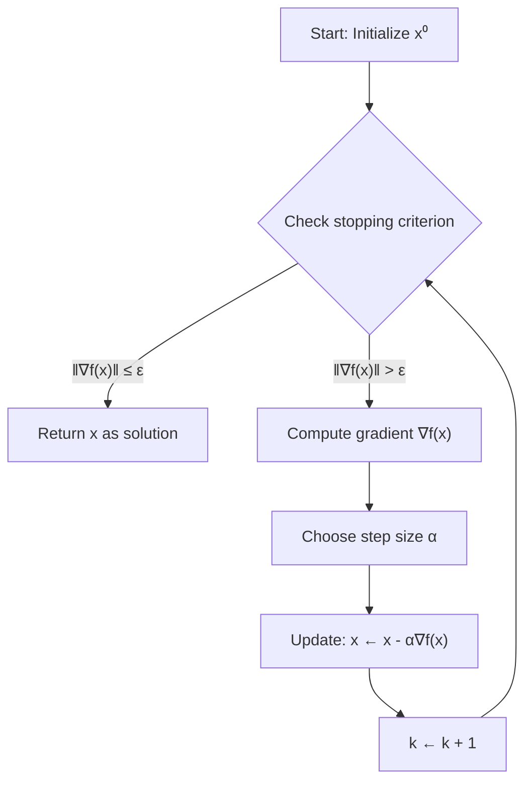

# Gradient Descent

Gradient Descent is the "Hello World" of optimization algorithms, yet it (and its variants) underpins the entire modern machine learning revolution. It is a first-order iterative method for finding a local minimum of a differentiable function.

## The Algorithm

To minimize a function $f(x)$:
1.  Start at an initial guess $x^{(0)}$.
2.  Iterate:
    $$ x^{(k+1)} = x^{(k)} - \alpha_k \nabla f(x^{(k)}) $$
    where $\alpha_k > 0$ is the **step size** (or learning rate).
3.  Stop when $\|\nabla f(x^{(k)})\| \leq \epsilon$ or maximum iterations reached.

### Geometric Intuition
The gradient $\nabla f(x)$ points in the direction of **steepest ascent** (greatest increase).
Therefore, $-\nabla f(x)$ points in the direction of **steepest descent**.
We take a small step downhill. Like rolling a ball down a hill, eventually, we should reach the bottom (a minimum).

The following flowchart shows the gradient descent algorithm:



Consider the simple quadratic function $f(x) = x^2$. The gradient is $\nabla f(x) = 2x$, pointing away from the minimum at $x=0$. Taking steps opposite to the gradient moves us toward the minimum:

```plot
{
  "xAxis": { "domain": [-3, 3] },
  "yAxis": { "domain": [-1, 9] },
  "data": [
    { "fn": "x^2", "color": "#2563eb", "title": "f(x) = x²" },
    { "fn": "2*x", "color": "#16a34a", "title": "Gradient: 2x" }
  ]
}
```

When $x > 0$, the gradient is positive (pointing right), so we move left (toward the minimum). When $x < 0$, the gradient is negative (pointing left), so we move right (toward the minimum).

## Why the Negative Gradient?

Consider the first-order Taylor expansion of $f$ around $x$:
$$ f(x + \Delta x) \approx f(x) + \nabla f(x)^T \Delta x $$
We want to choose a step $\Delta x$ of fixed length $\|\Delta x\| = \delta$ to maximize the decrease $f(x) - f(x + \Delta x) \approx - \nabla f(x)^T \Delta x$.
This is equivalent to minimizing $\nabla f(x)^T \Delta x$.
By Cauchy-Schwarz, $u^T v \geq -\|u\| \|v\|$, with equality when $v$ opposes $u$.
So the best direction $\Delta x$ is parallel to $-\nabla f(x)$.

## Step Size Strategies

The choice of $\alpha_k$ is critical.
- **Too small:** Convergence is agonizingly slow.
- **Too large:** The algorithm overshoots, oscillates, or diverges.

### 1. Constant Step Size
$\\alpha_k = \alpha$. Simple, but hard to tune.

### 2. Exact Line Search
Choose $\\alpha_k$ to minimize $f$ along the ray:
$$ \alpha_k = \arg \min_{\\alpha \geq 0} f(x^{(k)} - \alpha \nabla f(x^{(k)})) $$
Computationally expensive (requires solving a 1D optimization problem each step).

### 3. Backtracking Line Search (Armijo)
A practical approximation. Start with a large $\\alpha$ and shrink it ($\\alpha \leftarrow \\beta \\alpha$, e.g., $\\beta=0.5$) until the "Sufficient Decrease Condition" is met:
$$ f(x - \alpha \nabla f) \leq f(x) - c \alpha \|\nabla f\|^2 $$
Typically $c \in (0, 0.5)$. This guarantees convergence without full minimization.

## Example: Quadratic Bowl

$$ f(x) = \frac{1}{2} (x_1^2 + \gamma x_2^2), \quad \gamma > 1 $$
Gradient: $\nabla f(x) = [x_1, \gamma x_2]^T$.
Update:
$x_1^{(k+1)} = x_1^{(k)} (1 - \alpha)$
$x_2^{(k+1)} = x_2^{(k)} (1 - \alpha \gamma)$

If $\\gamma = 1$ (Circular bowl), setting $\\alpha = 1$ reaches optimum in 1 step.
If $\\gamma = 10$ (Elongated ellipsoid):
- $\\alpha$ needs to be small ($\\approx 1/10$) to handle the steep $x_2$ direction.
- But this makes progress in $x_1$ very slow.
- The path "zig-zags" down the valley.

This highlights the main weakness of Gradient Descent: it struggles with **ill-conditioned** problems (high condition number $\\kappa$).

## Theoretical Convergence

For a convex function with $L$-Lipschitz gradient ($\|\nabla f(x) - \nabla f(y)\| \leq L\|x-y\|$):
Gradient Descent with $\\alpha = 1/L$ converges at rate **$O(1/k)$**.
$$ f(x^{(k)}) - f^* \leq \frac{L \|x^{(0)} - x^*\|^2}{2k} $$

For a **strongly convex** function (curvature at least $m > 0$):
Convergence is **linear** (geometric progression, $O(c^k)$).
$$ f(x^{(k)}) - f^* \leq \left(1 - \frac{m}{L}\right)^k (f(x^{(0)}) - f^*) $$
The term $L/m$ is the **condition number** $\\kappa$.
If $\\kappa$ is large (1,000,000), convergence is slow. If $\\kappa \approx 1$, it's fast.

## Summary

- **Pros:** Simple, low memory ($O(n)$), easy to implement.
- **Cons:** Slow on ill-conditioned problems, sensitive to scaling.
- **Fixes:** Momentum, Preconditioning, Newton's Method.