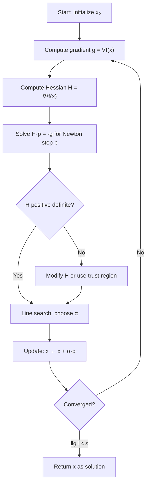

# Newton's Method

Gradient Descent uses only the first derivative (slope). It treats the function as a plane locally.
**Newton's Method** uses the second derivative (curvature) as well. It treats the function as a quadratic bowl locally. This allows it to adapt to the geometry of the function, correcting for ill-conditioning.

## The Derivation

Consider the second-order Taylor expansion of $f(x)$ around $x_k$:
$$ f(x_k + p) \approx f(x_k) + \nabla f(x_k)^T p + \frac{1}{2} p^T \nabla^2 f(x_k) p $$
Let $m_k(p)$ be this quadratic approximation.
We want to choose the step $p$ that minimizes $m_k(p)$.

Take the gradient with respect to $p$ and set to zero:
$$ \nabla_p m_k(p) = \nabla f(x_k) + \nabla^2 f(x_k) p = 0 $$
$$ \implies \nabla^2 f(x_k) p = -\nabla f(x_k) $$

Assuming the Hessian $\nabla^2 f(x_k)$ is positive definite (invertible), the optimal step is:
$$ p_k = -(\nabla^2 f(x_k))^{-1} \nabla f(x_k) $$

This is the **Newton Step**.

## The Algorithm

1.  Start at $x_0$.
2.  Compute gradient $g_k = \nabla f(x_k)$ and Hessian $H_k = \nabla^2 f(x_k)$.
3.  Solve linear system $H_k p_k = -g_k$ for $p_k$.
4.  Update $x_{k+1} = x_k + \alpha_k p_k$. (Pure Newton uses $\alpha_k = 1$).
5.  Repeat until convergence.

## Properties

1.  **Affine Invariance:** Newton's method is independent of linear scaling of coordinates. If you change units (meters to millimeters), Newton's method takes the exact same path. Gradient descent does not.
2.  **Quadratic Convergence:** Near the minimum, the number of correct digits doubles every iteration.
3.  **Self-Correcting:** It naturally handles ill-conditioned problems (valleys). The Hessian inverse scales the step large in flat directions and small in steep directions.

## The Catch (Drawbacks)

1.  **Computation Cost:** Requires computing the Hessian ($O(n^2)$) and inverting it (solving system) ($O(n^3)$). For $n=10,000$, this is impossible.
2.  **Memory:** Need to store $n \times n$ matrix.
3.  **Non-Convexity:** If $H_k$ is not positive definite (e.g., saddle point), the Newton step might move towards the saddle or maximum, not minimum.
4.  **Global Convergence:** Pure Newton ($\alpha=1$) may diverge if started far from optimum. (Use Damped Newton with line search to fix this).

## Modifications

### Damped Newton
Use line search to choose $\alpha_k$. Ensures global convergence.

### Newton-CG
Instead of solving $H_k p_k = -g_k$ exactly (expensive $O(n^3)$), use Conjugate Gradient method to solve it approximately. Since we only need matrix-vector products $H_k v$, we don't even need to form the Hessian explicitly!

### Quasi-Newton (BFGS)
Approximates the Hessian inverse using gradient information (Topic 6.5).

## Example Comparison

Minimize Rosenbrock function (banana valley).
- **Gradient Descent:** Zig-zags wildly down the valley. Thousands of steps.
- **Newton's Method:** Curves correctly along the valley floor. Typically < 20 steps.

## Equality Constrained Newton

Newton's method naturally extends to equality constraints $Ax=b$.
We minimize the quadratic approximation subject to linearized constraints.
This leads to the **KKT System**:
$$
\begin{bmatrix}
\nabla^2 f(x) & A^T \\
A & 0
\end{bmatrix}
\begin{bmatrix}
 p \\
w
\end{bmatrix}
=
\begin{bmatrix}
-\nabla f(x) \\
0
\end{bmatrix}
$$
Solving this one linear system gives the primal step $p$ and dual step $w$.

## Detailed Example: Newton vs Gradient Descent

Consider minimizing the **Rosenbrock function**:
$$ f(x, y) = (1-x)^2 + 100(y-x^2)^2 $$

This is the classic test function with a narrow curved valley. The minimum is at $(1, 1)$ with $f(1,1) = 0$.

**Gradient:**
$$ \nabla f = \begin{bmatrix} -2(1-x) - 400x(y-x^2) \\ 200(y-x^2) \end{bmatrix} $$

**Hessian:**
$$ \nabla^2 f = \begin{bmatrix} 2 + 1200x^2 - 400y & -400x \\ -400x & 200 \end{bmatrix} $$

Starting from $x^{(0)} = [0, 0]^T$:

**Gradient Descent** (with $\alpha = 0.001$):
- Takes a small step along $-\nabla f = [2, 0]^T$
- Zig-zags across the valley
- After 1000 iterations: $x \approx [0.8, 0.6]$, still far from $(1,1)$

**Newton's Method**:
- Computes Hessian and solves $H p = -g$
- Takes a curved step that follows the valley
- After 10 iterations: $x \approx [1.0, 1.0]$, converged!

The difference is dramatic: Newton understands the curvature and adapts accordingly.

## When Newton's Method Fails

### 1. Indefinite Hessian (Saddle Point or Maximum)

If $H_k$ has negative eigenvalues, the Newton step may point **uphill** toward a maximum or saddle.

**Example:** $f(x) = x^3$. At $x=0$, $\nabla f = 0$ (stationary), $\nabla^2 f = 0$ (degenerate).
Pure Newton is undefined. At $x = 1$, $\nabla f = 3$, $\nabla^2 f = 6$, so $p = -3/6 = -0.5$, correct.
At $x = -1$, $\nabla f = -3$, $\nabla^2 f = -6$, so $p = -(-3)/(-6) = -0.5$, moves away from zero!

**Fix:** Use a **modified Newton** method that adjusts $H$ to be positive definite:
$$ H_{\text{mod}} = H + \tau I $$
where $\tau > 0$ is chosen so that $H_{\text{mod}} \succ 0$. This is similar to the Levenberg-Marquardt algorithm.

### 2. Singular Hessian

If $H$ is singular (non-invertible), we cannot solve $Hp = -g$.

**Example:** $f(x, y) = x^2$ (independent of $y$). Then:
$$ H = \begin{bmatrix} 2 & 0 \\ 0 & 0 \end{bmatrix} $$
is singular.

**Fix:** Use a pseudo-inverse $H^{\dagger}$ or add regularization $H + \epsilon I$.

### 3. Far from Minimum (Globalization)

Pure Newton with $\alpha=1$ assumes the quadratic model is accurate. Far from the minimum, this fails.

**Example:** $f(x) = \log(1 + e^x)$ (smooth version of $\max(0, x)$).
Starting at $x = -10$, Newton might overshoot dramatically.

**Fix:** Use **damped Newton** with line search to ensure $f$ decreases at each step.

### 4. Computational Cost

For $n = 10{,}000$, storing the Hessian requires $10^8$ entries (40 GB at double precision!).
Factorizing it takes $O(n^3) \approx 10^{12}$ operations (hours on a CPU).

**Fixes:**
- **Newton-CG:** Use conjugate gradient to solve $Hp = -g$ iteratively without forming $H$
- **L-BFGS:** Approximate $H^{-1}$ from gradient history
- **Gauss-Newton:** For nonlinear least squares, use structure of the Hessian

## Quasi-Newton as Middle Ground

Full Newton: Expensive but fast convergence.
Gradient Descent: Cheap but slow convergence.

**Quasi-Newton (BFGS):** Approximate $H^{-1}$ using only gradients.
- Superlinear convergence (between linear and quadratic)
- $O(n^2)$ cost per iteration (vs $O(n^3)$ for Newton, $O(n)$ for GD)
- Maintains positive definiteness automatically

For most practical problems, BFGS or L-BFGS is the best choice.

## Iterative Hessian Inversion: Newton-CG

Instead of computing $p = -H^{-1}g$ directly (expensive), solve the linear system $Hp = -g$ using **Conjugate Gradient**.

CG only needs matrix-vector products $Hv$, which can be computed via:
- **Finite differences:** $Hv \approx \frac{\nabla f(x + \epsilon v) - \nabla f(x)}{\epsilon}$
- **Automatic differentiation:** Modern frameworks (JAX, PyTorch) can compute Hessian-vector products efficiently

This reduces cost from $O(n^3)$ to $O(n^2)$ or better, making Newton feasible for larger problems.

## Trust Region Variant

Instead of damping with line search, **trust region** methods solve:
$$ \min_p \quad m(p) = f(x) + g^T p + \frac{1}{2}p^T H p \quad \text{s.t.} \quad \|p\| \leq \Delta $$

This constrains the Newton step to a ball of radius $\Delta$ (the trust region).
- If the step is good (predicted reduction matches actual reduction), increase $\Delta$
- If the step is bad, decrease $\Delta$

The constrained minimization is solved using the **dogleg** or **Steihaug** method.

Trust regions are more robust than line search for non-convex problems.

## Practical Implementation Tips

### 1. Compute Hessian Symbolically or Automatically
Don't compute second derivatives by hand! Use:
- **Symbolic math:** SymPy, Mathematica
- **Automatic differentiation:** JAX (`jax.hessian`), PyTorch (`torch.autograd.functional.hessian`)

### 2. Use Sparse Solvers for Structured Problems
If $H$ is sparse (e.g., from discretized PDEs), use sparse linear solvers:
- **scipy.sparse.linalg.spsolve**
- **Cholesky factorization** for positive definite $H$

### 3. Check Convergence Criteria
Monitor:
- Gradient norm: $\|\nabla f(x)\| < 10^{-6}$
- Newton decrement: $\lambda = \sqrt{g^T H^{-1} g}$ (predicted decrease)
- Step size: $\|p\| < 10^{-6}$

### 4. Hybrid Approach
Start with gradient descent or L-BFGS (cheap, global), then switch to Newton near the solution (fast, local).

## Connection to Other Methods

Newton's method is the foundation for:
- **Gauss-Newton:** For nonlinear least squares, approximates $H \approx J^T J$
- **Levenberg-Marquardt:** Adds regularization $H + \lambda I$ (trust region variant)
- **Interior Point Methods:** For constrained optimization, solves KKT system
- **Sequential Quadratic Programming:** Solves sequence of quadratic subproblems

## Convergence Theory: Quadratic Rate Proof Sketch

**Theorem:** If $f$ is twice continuously differentiable, $\nabla^2 f$ is Lipschitz continuous with constant $M$, and $\nabla^2 f(x^*) \succ mI$, then for $x$ sufficiently close to $x^*$:
$$ \|x^{(k+1)} - x^*\| \leq \frac{M}{2m} \|x^{(k)} - x^*\|^2 $$

**Sketch:**
By Taylor expansion around $x^*$:
$$ \nabla f(x) = \nabla f(x^*) + \nabla^2 f(x^*)(x - x^*) + O(\|x - x^*\|^2) $$

Since $\nabla f(x^*) = 0$:
$$ \nabla f(x) \approx \nabla^2 f(x^*)(x - x^*) $$

The Newton step from $x$ is:
$$ p = -(\nabla^2 f(x))^{-1} \nabla f(x) $$

Substituting and using Lipschitz continuity of $\nabla^2 f$, we get the quadratic bound.

## Key Takeaways

1. **Newton's method uses second-order information** (Hessian) to achieve quadratic convergence near the minimum.

2. **Quadratic convergence is extremely fast:** The number of correct digits doubles each iteration once close to $x^*$.

3. **Computational cost is $O(n^3)$ per iteration**, making it impractical for very large $n$ without modifications.

4. **Requires positive definite Hessian** for descent direction. Far from the minimum, $H$ may be indefinite (needs modification).

5. **Damped Newton with line search** ensures global convergence from any starting point.

6. **Affine invariance:** Newton's method is independent of coordinate scaling, handling ill-conditioned problems naturally.

7. **Practical implementations use:**
   - **Newton-CG** for large problems (iterative Hessian inversion)
   - **L-BFGS** for very large problems (Hessian approximation)
   - **Trust regions** for robustness on non-convex problems

8. **Newton is the gold standard for local optimization** when Hessian computation is feasible. For large-scale problems, quasi-Newton methods are preferred.