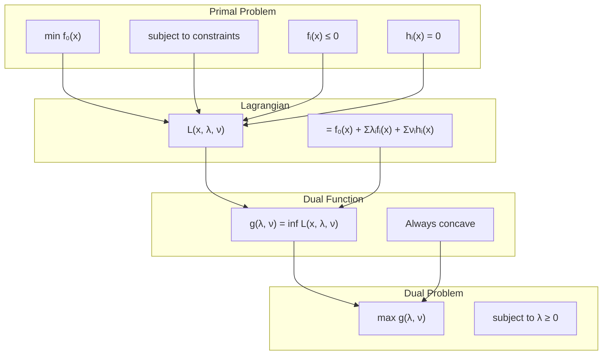

# The Lagrangian

The Lagrangian function is the bridge that connects constrained optimization to unconstrained optimization. It converts constraints into objective function terms using weighted penalties (Lagrange multipliers).

## Definition

Consider the standard optimization problem:
$$
\begin{align}
\min \quad & f_0(x) \\
\text{s.t.} \quad & f_i(x) \leq 0, \quad i = 1, \ldots, m \\
& h_i(x) = 0, \quad i = 1, \ldots, p
\end{align}
$$
Domain $\mathcal{D} = \bigcap \textbf{dom} f_i \cap \bigcap \textbf{dom} h_i$.

The **Lagrangian** function $L: \mathbb{R}^n \times \mathbb{R}^m \times \mathbb{R}^p \to \mathbb{R}$ is defined as:

$$ L(x, \lambda, \nu) = f_0(x) + \sum_{i=1}^m \lambda_i f_i(x) + \sum_{i=1}^p \nu_i h_i(x) $$

- $x$: Primal variables.
- $\lambda_i$: Dual variables (multipliers) associated with inequalities. **Must be $\geq 0$.**
- $\nu_i$: Dual variables associated with equalities. **Unrestricted (Free).**

## Interpretation

The Lagrangian is a weighted sum of the objective and the constraints.
- If $x$ satisfies constraints ($f_i(x) \leq 0, h_i(x) = 0$) and $\lambda \geq 0$:
  $$ L(x, \lambda, \nu) \leq f_0(x) $$
  (Since $\lambda_i f_i(x) \leq 0$ and $\nu_i h_i(x) = 0$).

The Lagrangian provides a **lower bound** on the objective function for feasible points.

## The Dual Function

The **Lagrange Dual Function** $g(\lambda, \nu)$ is the minimum of the Lagrangian over $x$:

$$ g(\lambda, \nu) = \inf_{x \in \mathcal{D}} L(x, \lambda, \nu) = \inf_{x \in \mathcal{D}} \left( f_0(x) + \sum \lambda_i f_i(x) + \sum \nu_i h_i(x) \right) $$

**Key Property:** The dual function $g(\lambda, \nu)$ is **always concave**, even if the original problem is non-convex.
*Proof:* $L$ is affine in $(\lambda, \nu)$ for fixed $x$. $g$ is the pointwise infimum of a family of affine functions. Infimum of affine functions is concave.

## Lower Bound Property

For any feasible $\tilde{x}$ and any feasible dual pair $(\lambda, \nu)$ with $\lambda \geq 0$:
$$ g(\lambda, \nu) \leq f_0(\tilde{x}) $$

*Proof:*
$g(\lambda, \nu) = \inf_x L(x, \lambda, \nu) \leq L(\tilde{x}, \lambda, \nu)$
$= f_0(\tilde{x}) + \sum \lambda_i f_i(\tilde{x}) + \sum \nu_i h_i(\tilde{x})$
Since $\tilde{x}$ is feasible, $f_i(\tilde{x}) \leq 0$ and $h_i(\tilde{x}) = 0$. Since $\lambda \geq 0$, $\lambda_i f_i(\tilde{x}) \leq 0$.
So $L(\tilde{x}, \lambda, \nu) \leq f_0(\tilde{x})$.

This confirms the Weak Duality theorem for general optimization. The dual problem ($\max g(\lambda, \nu)$) provides the best lower bound.

## Example: Least Squares

$$ \min x^T x \quad \text{s.t.} \quad Ax = b $$
Lagrangian: $L(x, \nu) = x^T x + \nu^T (Ax - b)$.
To find dual function $g(\nu)$, minimize $L$ w.r.t $x$.
$\nabla_x L = 2x + A^T \nu = 0 \implies x = -(1/2) A^T \nu$.
Substitute back:
$g(\nu) = \frac{1}{4} \nu^T A A^T \nu + \nu^T (A(-\frac{1}{2}A^T \nu) - b)$
$g(\nu) = \frac{1}{4} \nu^T A A^T \nu - \frac{1}{2} \nu^T A A^T \nu - \nu^T b$
$g(\nu) = -\frac{1}{4} \nu^T A A^T \nu - b^T \nu$.

Dual Problem:
$\max_\nu -\frac{1}{4} \nu^T A A^T \nu - b^T \nu$.
This is an unconstrained concave quadratic maximization.
Solution: $\nu = -2(AA^T)^{-1} b$.
Recover primal: $x = -(1/2)A^T (-2(AA^T)^{-1} b) = A^T(AA^T)^{-1}b$.
This is the standard Least Norm solution!

## Example: Linear Programming

Consider the linear program:
$$ \min c^T x \quad \text{s.t.} \quad Ax \leq b, \quad x \geq 0 $$

The Lagrangian is:
$$ L(x, \lambda, \mu) = c^T x + \lambda^T (Ax - b) - \mu^T x $$

where $\lambda \geq 0$ (for inequality $Ax \leq b$) and $\mu \geq 0$ (for inequality $x \geq 0$).

To find the dual function, minimize over $x$:
$$ g(\lambda, \mu) = \inf_x \left\{ c^T x + \lambda^T Ax - \mu^T x \right\} - \lambda^T b $$
$$ = \inf_x \left\{ (c^T + \lambda^T A - \mu^T) x \right\} - \lambda^T b $$

For this to be bounded below, we need the coefficient of $x$ to be zero (otherwise we can make $x$ arbitrarily negative in the direction of the gradient to get $-\infty$):
$$ c + A^T \lambda - \mu = 0 \implies \mu = c + A^T \lambda $$

For $\mu \geq 0$, we need $c + A^T \lambda \geq 0$.

When this condition holds:
$$ g(\lambda, \mu) = -\lambda^T b $$

The dual problem becomes:
$$ \max_{\lambda} -\lambda^T b \quad \text{s.t.} \quad A^T \lambda + c \geq 0, \quad \lambda \geq 0 $$

Or equivalently (flipping signs):
$$ \min_{\lambda} \lambda^T b \quad \text{s.t.} \quad A^T \lambda + c \geq 0, \quad \lambda \geq 0 $$

This is precisely the standard **dual linear program**!

## Visualization of the Lagrangian

The following diagram illustrates the relationship between primal and dual variables:

## Strong Duality and the Duality Gap

The **duality gap** is defined as:
$$ \text{gap} = p^* - d^* $$

where $p^*$ is the optimal primal value and $d^*$ is the optimal dual value.

**Weak Duality** guarantees $d^* \leq p^*$ (gap $\geq 0$).

**Strong Duality** occurs when $d^* = p^*$ (gap $= 0$).

For convex problems with Slater's condition (strict feasibility), strong duality holds. This means:
1. The dual optimal value equals the primal optimal value.
2. The KKT conditions are necessary and sufficient for optimality.
3. We can solve either the primal or dual problem.

## Common Mistakes

1. **Forgetting Sign Constraints**: The multipliers $\lambda_i$ for inequality constraints MUST be non-negative ($\lambda_i \geq 0$). The multipliers $\nu_i$ for equality constraints are unrestricted. Confusing these leads to incorrect dual functions.

2. **Unbounded Dual Function**: When computing $g(\lambda, \nu) = \inf_x L(x, \lambda, \nu)$, if the infimum is $-\infty$ for some $(\lambda, \nu)$, this means those dual variables are infeasible. The dual function is only defined when the infimum is finite.

3. **Domain Restrictions**: Always respect the domain $\mathcal{D}$ when minimizing the Lagrangian. The infimum is taken over $x \in \mathcal{D}$, not all of $\mathbb{R}^n$.

4. **Interpreting Dual Variables**: The dual variables represent "shadow prices" or "marginal costs" of the constraints. $\lambda_i$ tells you how much the objective would improve if you relaxed constraint $i$ by one unit.

## Key Takeaways

1. **The Lagrangian converts constrained problems to unconstrained**: By incorporating constraints into the objective with weighted penalties.

2. **Dual function is always concave**: Regardless of whether the original problem is convex. This makes the dual problem a concave maximization (convex minimization).

3. **Lower bound property**: For any feasible primal point and any feasible dual point, $g(\lambda, \nu) \leq f_0(x)$. This is the foundation of weak duality.

4. **Dual variables have economic interpretation**: They represent the sensitivity of the objective to constraint perturbations. In economics, they're called "shadow prices."

5. **Strong duality enables solution methods**: When strong duality holds, we can solve the dual problem instead of the primal, or use primal-dual methods that update both simultaneously.

6. **The Lagrangian is fundamental to all constrained optimization algorithms**: Whether it's penalty methods, augmented Lagrangian, interior point methods, or SQP, they all build on the Lagrangian framework.