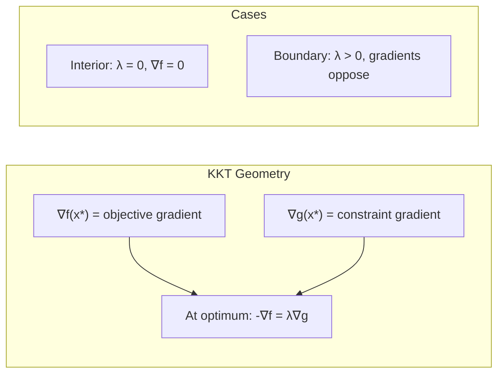

# Karush-Kuhn-Tucker (KKT) Conditions

The KKT conditions are the "Maxwell's Equations" of optimization. They describe the necessary (and often sufficient) conditions for a solution to be optimal in a constrained problem.

## The Conditions

For a problem:
$$ \min f_0(x) \quad \text{s.t.} \quad f_i(x) \leq 0, \quad h_i(x) = 0 $$

Let $x^*$ be primal optimal and $(\lambda^*, \nu^*)$ be dual optimal.
Assuming Strong Duality holds (e.g., Convex + Slater's condition), the KKT conditions must hold:

### 1. Stationarity (Gradient Condition)
The gradient of the Lagrangian with respect to $x$ vanishes.
$$ \nabla f_0(x^*) + \sum_{i=1}^m \lambda_i^* \nabla f_i(x^*) + \sum_{i=1}^p \nu_i^* \nabla h_i(x^*) = 0 $$
*Interpretation:* The negative gradient of the objective $-\nabla f_0$ lies in the cone generated by the gradients of the active constraints. Forces balance.

### 2. Primal Feasibility
The solution must satisfy the original constraints.
$$ f_i(x^*) \leq 0, \quad i = 1, \dots, m $$
$$ h_i(x^*) = 0, \quad i = 1, \dots, p $$

### 3. Dual Feasibility
The multipliers for inequality constraints must be non-negative.
$$ \lambda_i^* \geq 0, \quad i = 1, \dots, m $$
(No sign restriction on $\nu_i^*$).

### 4. Complementary Slackness
$$ \lambda_i^* f_i(x^*) = 0, \quad i = 1, \dots, m $$
*Interpretation:* Either the constraint is active ($f_i(x^*)=0$) or the multiplier is zero ($\lambda_i^*=0$). You can't have a non-zero "force" from a constraint you aren't touching.

## Necessity vs Sufficiency

### Necessity
If $x^*$ is a local optimum for a differentiable problem and **constraint qualifications** (like LICQ or Slater's) hold, then there MUST exist $(\lambda^*, \nu^*)$ satisfying KKT.
(If qualifications fail, KKT might not hold—example: $x^2$ s.t. $x^3 \leq 0$).

### Sufficiency
If the problem is **Convex** (convex objective, convex inequalities, affine equalities), then KKT conditions are **sufficient**.
Any point $(x^*, \lambda^*, \nu^*)$ satisfying KKT implies $x^*$ is the global optimum.

## Solving Problems with KKT

For small problems, we can solve the KKT system analytically.

**Example:**
Min $\frac{1}{2} x^2$ s.t. $x \geq 2 \iff 2 - x \leq 0$.
$L(x, \lambda) = \frac{1}{2} x^2 + \lambda (2 - x)$.

**KKT Conditions:**
1. $\nabla_x L = x - \lambda = 0 \implies x = \lambda$
2. $2 - x \leq 0 \implies x \geq 2$
3. $\lambda \geq 0$
4. $\lambda (2 - x) = 0$

**Cases from (4):**
- Case A: $\lambda = 0$.
  From (1), $x = 0$.
  Check (2): $0 \geq 2$? False. Impossible.
- Case B: $2 - x = 0 \implies x = 2$.
  From (1), $\lambda = 2$.
  Check (3): $2 \geq 0$. True.
  
**Solution:** $x^* = 2, \lambda^* = 2$.
Optimal value $\frac{1}{2}(2)^2 = 2$.

## Geometric Interpretation

Consider minimizing $f(x)$ subject to $g(x) \leq 0$.



At the optimum $x^*$:
1.  If $g(x^*) < 0$ (interior), then we must be at an unconstrained minimum $\nabla f(x^*) = 0$. KKT matches ($\lambda = 0$).
2.  If $g(x^*) = 0$ (boundary), then the level curves of $f$ and $g$ must be tangent.
    Also, $-\nabla f$ must point **into** the feasible region (opposing $\nabla g$).
    $-\nabla f = \lambda \nabla g$ with $\lambda \geq 0$.
    $\nabla f + \lambda \nabla g = 0$.

The example $\min \frac{1}{2}x^2$ s.t. $x \geq 2$ is illustrated below. The unconstrained minimum is at $x=0$, but the constraint forces the solution to $x=2$:

```plot
{
  "xAxis": { "domain": [-1, 5] },
  "yAxis": { "domain": [-1, 13] },
  "data": [
    { "fn": "0.5*x^2", "color": "#2563eb", "title": "f(x) = x²/2" },
    { "fn": "2", "color": "#dc2626", "title": "Constraint: x = 2" }
  ]
}
```

## Generalized KKT

For non-differentiable convex problems, gradients are replaced by **subgradients**.
$$ 0 \in \partial f_0(x^*) + \sum \lambda_i \partial f_i(x^*) + \sum \nu_i \nabla h_i(x^*) $$
This handles terms like $|x|$ or $\max(x)$.