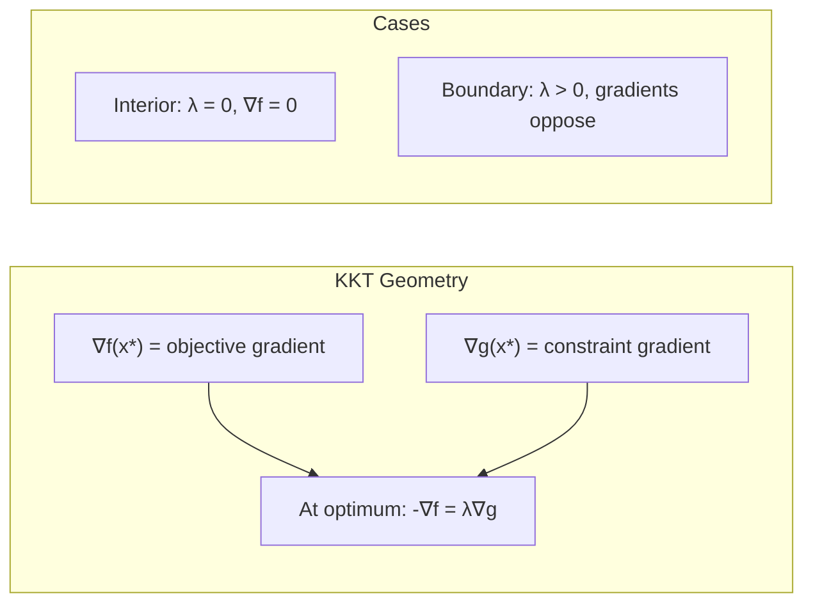

# Karush-Kuhn-Tucker (KKT) Conditions

The KKT conditions are the "Maxwell's Equations" of optimization. They describe the necessary (and often sufficient) conditions for a solution to be optimal in a constrained problem.

## The Conditions

For a problem:
$$ \min f_0(x) \quad \text{s.t.} \quad f_i(x) \leq 0, \quad h_i(x) = 0 $$

Let $x^*$ be primal optimal and $(\lambda^*, \nu^*)$ be dual optimal.
Assuming Strong Duality holds (e.g., Convex + Slater's condition), the KKT conditions must hold:

### 1. Stationarity (Gradient Condition)
The gradient of the Lagrangian with respect to $x$ vanishes.
$$ \nabla f_0(x^*) + \sum_{i=1}^m \lambda_i^* \nabla f_i(x^*) + \sum_{i=1}^p \nu_i^* \nabla h_i(x^*) = 0 $$
*Interpretation:* The negative gradient of the objective $-\nabla f_0$ lies in the cone generated by the gradients of the active constraints. Forces balance.

### 2. Primal Feasibility
The solution must satisfy the original constraints.
$$ f_i(x^*) \leq 0, \quad i = 1, \dots, m $$
$$ h_i(x^*) = 0, \quad i = 1, \dots, p $$

### 3. Dual Feasibility
The multipliers for inequality constraints must be non-negative.
$$ \lambda_i^* \geq 0, \quad i = 1, \dots, m $$
(No sign restriction on $\nu_i^*$).

### 4. Complementary Slackness
$$ \lambda_i^* f_i(x^*) = 0, \quad i = 1, \dots, m $$
*Interpretation:* Either the constraint is active ($f_i(x^*)=0$) or the multiplier is zero ($\lambda_i^*=0$). You can't have a non-zero "force" from a constraint you aren't touching.

## Necessity vs Sufficiency

### Necessity
If $x^*$ is a local optimum for a differentiable problem and **constraint qualifications** (like LICQ or Slater's) hold, then there MUST exist $(\lambda^*, \nu^*)$ satisfying KKT.
(If qualifications fail, KKT might not hold—example: $x^2$ s.t. $x^3 \leq 0$).

### Sufficiency
If the problem is **Convex** (convex objective, convex inequalities, affine equalities), then KKT conditions are **sufficient**.
Any point $(x^*, \lambda^*, \nu^*)$ satisfying KKT implies $x^*$ is the global optimum.

## Solving Problems with KKT

For small problems, we can solve the KKT system analytically.

**Example:**
Min $\frac{1}{2} x^2$ s.t. $x \geq 2 \iff 2 - x \leq 0$.
$L(x, \lambda) = \frac{1}{2} x^2 + \lambda (2 - x)$.

**KKT Conditions:**
1. $\nabla_x L = x - \lambda = 0 \implies x = \lambda$
2. $2 - x \leq 0 \implies x \geq 2$
3. $\lambda \geq 0$
4. $\lambda (2 - x) = 0$

**Cases from (4):**
- Case A: $\lambda = 0$.
  From (1), $x = 0$.
  Check (2): $0 \geq 2$? False. Impossible.
- Case B: $2 - x = 0 \implies x = 2$.
  From (1), $\lambda = 2$.
  Check (3): $2 \geq 0$. True.
  
**Solution:** $x^* = 2, \lambda^* = 2$.
Optimal value $\frac{1}{2}(2)^2 = 2$.

## Geometric Interpretation

Consider minimizing $f(x)$ subject to $g(x) \leq 0$.



At the optimum $x^*$:
1.  If $g(x^*) < 0$ (interior), then we must be at an unconstrained minimum $\nabla f(x^*) = 0$. KKT matches ($\lambda = 0$).
2.  If $g(x^*) = 0$ (boundary), then the level curves of $f$ and $g$ must be tangent.
    Also, $-\nabla f$ must point **into** the feasible region (opposing $\nabla g$).
    $-\nabla f = \lambda \nabla g$ with $\lambda \geq 0$.
    $\nabla f + \lambda \nabla g = 0$.

The example $\min \frac{1}{2}x^2$ s.t. $x \geq 2$ is illustrated below. The unconstrained minimum is at $x=0$, but the constraint forces the solution to $x=2$:

```plot
{
  "xAxis": { "domain": [-1, 5] },
  "yAxis": { "domain": [-1, 13] },
  "data": [
    { "fn": "0.5*x^2", "color": "#2563eb", "title": "f(x) = x²/2" },
    { "fn": "2", "color": "#dc2626", "title": "Constraint: x = 2" }
  ]
}
```

## Generalized KKT

For non-differentiable convex problems, gradients are replaced by **subgradients**.
$$ 0 \in \partial f_0(x^*) + \sum \lambda_i \partial f_i(x^*) + \sum \nu_i \nabla h_i(x^*) $$
This handles terms like $|x|$ or $\max(x)$.

## Detailed Example: Portfolio Optimization

Consider an investor allocating wealth across $n$ assets with expected returns $\mu_i$ and covariance matrix $\Sigma$. We want to minimize risk while achieving a target return $r_{\text{target}}$:

$$
\begin{align}
\min \quad & \frac{1}{2} x^T \Sigma x \\
\text{s.t.} \quad & \mu^T x \geq r_{\text{target}} \\
& \mathbf{1}^T x = 1 \\
& x \geq 0
\end{align}
$$

**Lagrangian:**
$$ L(x, \lambda, \nu, \gamma) = \frac{1}{2} x^T \Sigma x - \lambda (\mu^T x - r_{\text{target}}) + \nu (\mathbf{1}^T x - 1) - \gamma^T x $$

Note: We use $-\lambda$ because the constraint is $\mu^T x - r_{\text{target}} \geq 0$, which we rewrite as $-(\mu^T x - r_{\text{target}}) \leq 0$.

**KKT Conditions:**

1. **Stationarity:**
   $$ \Sigma x^* - \lambda \mu + \nu \mathbf{1} - \gamma = 0 $$

2. **Primal Feasibility:**
   $$ \mu^T x^* \geq r_{\text{target}}, \quad \mathbf{1}^T x^* = 1, \quad x^* \geq 0 $$

3. **Dual Feasibility:**
   $$ \lambda \geq 0, \quad \gamma \geq 0 $$

4. **Complementary Slackness:**
   $$ \lambda (\mu^T x^* - r_{\text{target}}) = 0, \quad \gamma_i x_i^* = 0 \text{ for all } i $$

**Analysis:**

If the return constraint is active ($\mu^T x^* = r_{\text{target}}$), then from the equality constraint and stationarity:
$$ x^* = \Sigma^{-1} (\lambda \mu - \nu \mathbf{1} + \gamma) $$

For assets with $x_i^* > 0$, we have $\gamma_i = 0$ (complementary slackness).

This system can be solved numerically, but it illustrates how KKT conditions encode the economic principle that optimal portfolios balance risk-adjusted returns.

## Constraint Qualifications

KKT conditions are necessary **only when constraint qualifications hold**. These are technical conditions that ensure the gradients of active constraints are "well-behaved."

### Linear Independence Constraint Qualification (LICQ)

The gradients $\nabla f_i(x^*)$ for active inequality constraints and $\nabla h_i(x^*)$ for all equality constraints are **linearly independent**.

**Example where LICQ fails:**
$$ \min x \quad \text{s.t.} \quad x^3 \leq 0 $$

At $x^* = 0$ (the optimum), we have $\nabla f(x^*) = 0$ (the gradient vanishes!). This violates LICQ.

The KKT condition $1 + \lambda \cdot 0 = 0$ has no solution for $\lambda$.

### Slater's Condition (for Convex Problems)

There exists a strictly feasible point: $x$ such that $f_i(x) < 0$ for all $i$ and $h_i(x) = 0$.

This is weaker than LICQ but sufficient for convex problems. It ensures strong duality and thus KKT necessity/sufficiency.

## Second-Order Conditions

For local optimality, KKT is only first-order necessary. **Second-order sufficient conditions** (SOSC) refine this:

If $(x^*, \lambda^*, \nu^*)$ satisfies KKT and the Hessian of the Lagrangian is positive definite on the tangent space of active constraints, then $x^*$ is a **strict local minimum**.

Mathematically, for all $v \neq 0$ such that:
- $\nabla h_i(x^*)^T v = 0$ (tangent to equality constraints)
- $\nabla f_i(x^*)^T v = 0$ for active inequalities ($\lambda_i > 0$)

We require:
$$ v^T \nabla_{xx}^2 L(x^*, \lambda^*, \nu^*) v > 0 $$

## Common Mistakes

1. **Forgetting Complementary Slackness**: Students often check stationarity, feasibility, and dual feasibility but forget to verify $\lambda_i f_i(x^*) = 0$. This condition is crucial and often eliminates candidate solutions.

2. **Sign Errors**: The standard form has constraints $f_i(x) \leq 0$. If your problem has $g_i(x) \geq 0$, you must rewrite as $-g_i(x) \leq 0$ before forming the Lagrangian. The multiplier sign changes accordingly.

3. **Assuming Sufficiency for Non-Convex Problems**: KKT conditions are necessary (under constraint qualifications) for all problems, but sufficient **only for convex problems**. For non-convex problems, KKT gives candidates; you must check the objective values.

4. **Ignoring Inactive Constraints**: Just because a constraint is inactive ($f_i(x^*) < 0$) doesn't mean you can ignore it in the problem setup. The multiplier $\lambda_i = 0$ must still be checked.

5. **Constraint Qualification Violations**: Always verify that constraint qualifications hold. If LICQ fails, KKT may not provide all local optima.

## Active Set Interpretation

The **active set** at $x^*$ is:
$$ \mathcal{A}(x^*) = \{ i : f_i(x^*) = 0 \} $$

Complementary slackness tells us that $\lambda_i > 0$ only for constraints in the active set. Geometrically:
- Active constraints with $\lambda_i > 0$ are "pushing" against the optimum.
- Inactive constraints ($f_i(x^*) < 0$) have no influence ($\lambda_i = 0$).

The stationarity condition says:
$$ -\nabla f_0(x^*) = \sum_{i \in \mathcal{A}} \lambda_i \nabla f_i(x^*) + \sum_i \nu_i \nabla h_i(x^*) $$

The negative objective gradient is a **conic combination** of active constraint gradients. This is the geometric essence of KKT: at the optimum, you can't improve the objective without violating constraints.

## Key Takeaways

1. **KKT conditions are the cornerstone of constrained optimization**: They provide a unified framework for characterizing optimal solutions.

2. **Four parts, all essential**: Stationarity (gradient balance), primal feasibility (satisfy constraints), dual feasibility (sign of multipliers), complementary slackness (inactive constraints have zero multipliers).

3. **Necessity vs. Sufficiency**: Necessary under constraint qualifications for all problems; sufficient for convex problems.

4. **Multipliers have physical meaning**: $\lambda_i$ represents the "force" exerted by constraint $i$. In economics, it's the marginal value of relaxing the constraint.

5. **Complementary slackness is powerful**: It dramatically reduces the solution space by linking primal and dual variables.

6. **Active set methods**: Many algorithms (like SQP) work by guessing which constraints are active, solving the resulting equality-constrained problem using KKT, and checking optimality.

7. **Geometric intuition**: At the optimum, the negative gradient of the objective lies in the cone spanned by gradients of active constraints. You cannot improve without leaving the feasible region.