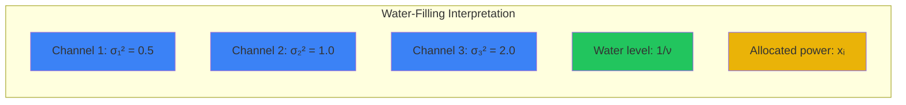

# KKT Examples

Applying KKT conditions analytically usually involves checking combinations of active/inactive constraints.

## Example 1: Water-Filling (Communication Channels)

Problem: Allocate total power $P_{tot}$ across $n$ channels with noise levels $\sigma_i^2$ to maximize capacity.
$$
\begin{align}
\min \quad & - \sum_{i=1}^n \log(1 + x_i/\sigma_i^2) \\
\text{s.t.} \quad & \sum x_i = P_{tot} \\
& x_i \geq 0 \quad (\iff -x_i \leq 0)
\end{align}
$$

**Lagrangian:**
$$ L(x, \lambda, \nu) = - \sum \log(1 + x_i/\sigma_i^2) + \nu (\sum x_i - P_{tot}) - \sum \lambda_i x_i $$

**Stationarity:**
$$ \frac{\partial L}{\partial x_i} = - \frac{1/\sigma_i^2}{1 + x_i/\sigma_i^2} + \nu - \lambda_i = 0 $$
$$ \frac{-1}{\sigma_i^2 + x_i} + \nu - \lambda_i = 0 $$
$$ \nu - \lambda_i = \frac{1}{\sigma_i^2 + x_i} $$

**Complementary Slackness:**
$\lambda_i x_i = 0$ and $\lambda_i \geq 0, x_i \geq 0$.

**Analysis:**
- If $x_i > 0$, then $\lambda_i = 0$.
  $\nu = \frac{1}{\sigma_i^2 + x_i} \implies \sigma_i^2 + x_i = \frac{1}{\nu}$.
  $x_i = \frac{1}{\nu} - \sigma_i^2$.
- If $x_i = 0$, then $\lambda_i \geq 0$.
  $\nu - \lambda_i = \frac{1}{\sigma_i^2} \implies \nu \geq \frac{1}{\sigma_i^2}$.
  $\sigma_i^2 \geq \frac{1}{\nu} \implies \frac{1}{\nu} - \sigma_i^2 \leq 0$.

**Unified Solution:**
$$ x_i = \max \left( 0, \frac{1}{\nu} - \sigma_i^2 \right) $$
The constant $1/\nu$ is the "water level".
We pour water (power) into the channels (vessels) with bottom height $\sigma_i^2$.
If noise $\sigma_i^2$ is high (above water level), allocated power is 0.

Find $\nu$ such that $\sum x_i = P_{tot}$.

## Example 2: Projection onto the Probability Simplex

Given $y \in \mathbb{R}^n$, find closest probability vector $x$.
$$ 
\min \frac{1}{2} \|x - y\|^2 \quad \text{s.t.} \quad \sum x_i = 1, x \geq 0
$$ 

**KKT Conditions:**
1. $x_i - y_i + \nu - \lambda_i = 0 \implies x_i = y_i - \nu + \lambda_i$
2. $\lambda_i x_i = 0, \lambda_i \geq 0, x_i \geq 0$
3. $\sum x_i = 1$

**Analysis:**
Similar to water-filling.
If $x_i > 0, \lambda_i = 0 \implies x_i = y_i - \nu$.
If $x_i = 0, \lambda_i = \nu - y_i \geq 0 \implies y_i - \nu \leq 0$.
So $x_i = \max(0, y_i - \nu)$.

We need to find $\nu$ such that $\sum \max(0, y_i - \nu) = 1$.
This can be solved by sorting $y$ and checking $n$ thresholds. $O(n \log n)$.

## Example 3: Support Vector Machines (SVM)

Primal:
$$
\min \frac{1}{2} \|w\|^2 + C \sum \xi_i
$$
$$
\text{s.t.} \quad y_i(w^T x_i + b) \geq 1 - \xi_i, \quad \xi_i \geq 0
$$

Deriving the dual via KKT leads to the famous kernel trick formulation.
$\lambda_i$ (dual var for margin constraint) becomes the coefficient for support vectors.
Complementary slackness tells us:
- $\lambda_i = 0$: Point correctly classified, far from boundary.
- $0 < \lambda_i < C$: Point is ON the margin. (Support vector).
- $\lambda_i = C$: Point violates margin ($\xi_i > 0$).

This sparsity (most $\lambda_i=0$) makes SVMs efficient.

## Example 4: Distance to a Plane

Find the point in $\mathbb{R}^n$ closest to a given point $x_0$ subject to a linear constraint $a^T x = b$ (a hyperplane).

$$
\begin{align}
\min \quad & \frac{1}{2} \|x - x_0\|^2 \\
\text{s.t.} \quad & a^T x = b
\end{align}
$$

**Lagrangian:**
$$ L(x, \nu) = \frac{1}{2} \|x - x_0\|^2 + \nu (a^T x - b) $$

**KKT Conditions:**

1. **Stationarity:**
   $$ \nabla_x L = (x^* - x_0) + \nu a = 0 \implies x^* = x_0 - \nu a $$

2. **Primal Feasibility:**
   $$ a^T x^* = b $$

**Solution:**

Substitute $x^* = x_0 - \nu a$ into the constraint:
$$ a^T (x_0 - \nu a) = b $$
$$ a^T x_0 - \nu \|a\|^2 = b $$
$$ \nu = \frac{a^T x_0 - b}{\|a\|^2} $$

Therefore:
$$ x^* = x_0 - \frac{a^T x_0 - b}{\|a\|^2} a $$

**Interpretation:** The optimal point is the projection of $x_0$ onto the hyperplane. The distance is:
$$ d = \|x^* - x_0\| = |\nu| \|a\| = \frac{|a^T x_0 - b|}{\|a\|} $$

This is the classic point-to-plane distance formula, derived directly from KKT!

## Example 5: Constrained Least Squares

Solve a regression problem with inequality constraints on the coefficients:
$$
\begin{align}
\min \quad & \frac{1}{2} \|Ax - b\|^2 \\
\text{s.t.} \quad & x_i \geq 0, \quad i = 1, \ldots, n
\end{align}
$$

This is called **Non-Negative Least Squares (NNLS)**, common in signal processing and statistics.

**Lagrangian:**
$$ L(x, \lambda) = \frac{1}{2} \|Ax - b\|^2 - \lambda^T x $$

**KKT Conditions:**

1. **Stationarity:**
   $$ \nabla_x L = A^T (Ax^* - b) - \lambda = 0 $$
   $$ A^T A x^* - A^T b = \lambda $$

2. **Primal Feasibility:**
   $$ x^* \geq 0 $$

3. **Dual Feasibility:**
   $$ \lambda \geq 0 $$

4. **Complementary Slackness:**
   $$ \lambda_i x_i^* = 0 \text{ for all } i $$

**Analysis:**

Define the gradient $g = A^T(Ax^* - b)$. From stationarity, $\lambda = -g$.

For dual feasibility, we need $-g \geq 0$, i.e., $g \leq 0$.

From complementary slackness:
- If $x_i^* > 0$, then $\lambda_i = 0$, so $g_i = 0$.
- If $x_i^* = 0$, then $g_i \leq 0$ (to ensure $\lambda_i = -g_i \geq 0$).

**Solution Strategy:**

At the optimum:
- For indices where $x_i^* > 0$: The gradient component $g_i = [A^T(Ax^* - b)]_i = 0$.
- For indices where $x_i^* = 0$: The gradient component $g_i \leq 0$.

This partitions variables into "free" (positive) and "fixed at zero" (negative gradient).

**Active Set Algorithm:**

1. Guess which variables are zero (inactive set $\mathcal{I}$) and which are positive (active set $\mathcal{A}$).
2. Set $x_i = 0$ for $i \in \mathcal{I}$.
3. Solve the unconstrained least squares for variables in $\mathcal{A}$:
   $$ \min_{x_{\mathcal{A}}} \frac{1}{2} \|A_{\mathcal{A}} x_{\mathcal{A}} - b\|^2 $$
4. Check KKT:
   - If any $x_i < 0$ for $i \in \mathcal{A}$, move $i$ to $\mathcal{I}$.
   - If any $g_i > 0$ for $i \in \mathcal{I}$, move $i$ to $\mathcal{A}$.
5. Repeat until KKT satisfied.

## Example 6: Power Allocation with Individual Constraints

Extend the water-filling problem with per-channel power limits:
$$
\begin{align}
\min \quad & - \sum_{i=1}^n \log(1 + x_i/\sigma_i^2) \\
\text{s.t.} \quad & \sum x_i = P_{tot} \\
& 0 \leq x_i \leq P_{\max}, \quad i = 1, \ldots, n
\end{align}
$$

**Lagrangian:**
$$ L(x, \lambda, \mu, \nu) = - \sum \log(1 + x_i/\sigma_i^2) + \nu (\sum x_i - P_{tot}) - \sum \lambda_i x_i + \sum \mu_i (x_i - P_{\max}) $$

**Stationarity:**
$$ \frac{\partial L}{\partial x_i} = -\frac{1}{\sigma_i^2 + x_i} + \nu - \lambda_i + \mu_i = 0 $$

**Complementary Slackness:**
$$ \lambda_i x_i = 0, \quad \mu_i (x_i - P_{\max}) = 0 $$

**Analysis:**

For each channel, there are three cases:

1. **$x_i = 0$** (channel unused):
   $\lambda_i \geq 0, \mu_i = 0$.
   From stationarity: $\nu - \lambda_i = \frac{1}{\sigma_i^2} \implies \nu \geq \frac{1}{\sigma_i^2}$.

2. **$0 < x_i < P_{\max}$** (interior):
   $\lambda_i = 0, \mu_i = 0$.
   From stationarity: $\nu = \frac{1}{\sigma_i^2 + x_i} \implies x_i = \frac{1}{\nu} - \sigma_i^2$.

3. **$x_i = P_{\max}$** (saturated):
   $\lambda_i = 0, \mu_i \geq 0$.
   From stationarity: $\nu + \mu_i = \frac{1}{\sigma_i^2 + P_{\max}} \implies \nu \leq \frac{1}{\sigma_i^2 + P_{\max}}$.

**Unified Solution:**
$$ x_i = \begin{cases}
0 & \text{if } \frac{1}{\nu} - \sigma_i^2 \leq 0 \\
\frac{1}{\nu} - \sigma_i^2 & \text{if } 0 < \frac{1}{\nu} - \sigma_i^2 < P_{\max} \\
P_{\max} & \text{if } \frac{1}{\nu} - \sigma_i^2 \geq P_{\max}
\end{cases} $$

This is "clipped water-filling" where the water level is capped at height $\sigma_i^2 + P_{\max}$ for each channel.

## Visualization of Water-Filling

The "vessels" have bottoms at height $\sigma_i^2$ (noise level). Water is poured until total volume equals $P_{tot}$. The water level $1/\nu$ equalizes across all active channels.

## Common Mistakes

1. **Case Enumeration Errors**: When complementary slackness creates multiple cases (e.g., $x_i = 0$ vs $x_i > 0$), students often forget to check all combinations. Systematic enumeration is essential.

2. **Forgetting to Verify Solutions**: After finding a candidate from KKT, always check:
   - Primal feasibility (do constraints hold?)
   - Dual feasibility (are multipliers non-negative?)
   - Complementary slackness (products equal zero?)
   - Stationarity (does the gradient condition hold?)

3. **Misinterpreting Water-Filling**: The water level $1/\nu$ is determined by the total power constraint. You cannot set it arbitrarily; it must satisfy $\sum x_i = P_{tot}$.

4. **Sign Confusion in Lagrangian**: For $\geq$ constraints, rewrite as $\leq$ (multiply by $-1$) before forming the Lagrangian. The signs matter!

## Key Takeaways

1. **KKT provides analytical solutions for small problems**: When you can enumerate constraint activation patterns, KKT gives closed-form solutions.

2. **Water-filling is a universal pattern**: Many resource allocation problems (power, bandwidth, portfolio weights) reduce to water-filling solutions via KKT.

3. **Complementary slackness creates cases**: The condition $\lambda_i f_i(x) = 0$ splits the problem into cases based on which constraints are active. This is the foundation of active-set methods.

4. **Economic interpretation**: Dual variables (multipliers) represent marginal costs. In water-filling, $\nu$ is the "water level" or "price" that equalizes marginal utility across channels.

5. **Projection problems have elegant solutions**: KKT reduces many projection problems (onto simplices, halfspaces, boxes) to simple formulas.

6. **Dual variables encode sparsity**: In problems like SVM, most multipliers are zero. This sparsity is exploited algorithmically.

7. **Verification is crucial**: KKT gives necessary conditions. For non-convex problems, you must verify optimality by comparing candidate solutions.