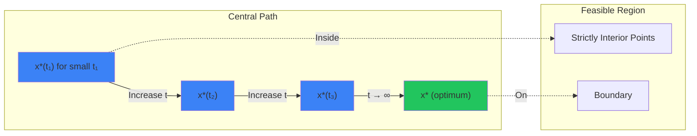

# Interior Point Methods

Interior Point Methods (IPMs) revolutionized optimization. Before 1984, Linear Programming was solved by the Simplex Method (exponential worst-case, visits vertices). Karmarkar introduced an algorithm that cuts through the interior of the feasible set, achieving polynomial time complexity. This was later generalized to convex non-linear problems.

## The Barrier Problem

Minimize $f_0(x)$ subject to $f_i(x) \leq 0$ and $Ax = b$.

We convert inequalities to a barrier term in the objective:
$$ \min \quad t f_0(x) - \sum_{i=1}^m \log(-f_i(x)) $$
$$ \text{s.t.} \quad Ax = b $$

Here, $t > 0$ is a parameter (inverse of $\mu$ in previous topic). As $t \to \infty$, we recover the original problem.

## Optimality Conditions (KKT)

The KKT conditions for the barrier problem are:
1.  $\nabla (t f_0(x) - \sum \log(-f_i(x))) + A^T \nu = 0$
    $t \nabla f_0(x) + \sum \frac{1}{-f_i(x)} \nabla f_i(x) + A^T \nu = 0$
2.  $Ax = b$

Let's define dual variables $\lambda_i = \frac{1}{-t f_i(x)}$.
Note that since $f_i(x) < 0$ and $t > 0$, we have $\lambda_i > 0$ (Strictly dual feasible).
Rearranging: $-\lambda_i f_i(x) = 1/t$.

So the conditions become:
1.  $\nabla f_0(x) + \sum \lambda_i \nabla f_i(x) + A^T (\nu/t) = 0$ (Stationarity)
2.  $Ax = b$ (Primal Feasibility)
3.  $-\lambda_i f_i(x) = 1/t$ (Perturbed Complementary Slackness)

Compare to original KKT:
Original: $\lambda_i f_i(x) = 0$.
Barrier: $\lambda_i f_i(x) = -1/t$.
As $t \to \infty$, $1/t \to 0$, and we approach the true solution.

## Primal-Dual Interior Point Methods

Instead of solving the barrier minimization for a sequence of $t$'s (which takes many Newton steps per $t$), we can solve the perturbed KKT system directly using Newton's method.
We treat $x, \lambda, \nu$ as variables and update them simultaneously.

**System of Equations $R(x, \lambda, \nu) = 0$:**
1.  $r_{dual} = \nabla f_0 + Df^T \lambda + A^T \nu$ (Dual residual)
2.  $r_{cent} = -\text{diag}(\lambda) f(x) - (1/t)\mathbf{1}$ (Centrality residual)
3.  $r_{pri} = Ax - b$ (Primal residual)

**Newton Step:**
Linearize $R$ and solve for $(\Delta x, \Delta \lambda, \Delta \nu)$:
$$ \begin{bmatrix}
\nabla^2 L & Df^T & A^T \\
-\text{diag}(\lambda) Df & -\text{diag}(f) & 0 \\
A & 0 & 0
\end{bmatrix} \begin{bmatrix}
\Delta x \\
\Delta \lambda \\
\Delta \nu
\end{bmatrix} =
- \begin{bmatrix}
 r_{dual} \\
 r_{cent} \\
 r_{pri}
\end{bmatrix} $$

**Update:**
$(x, \lambda, \nu) \leftarrow (x, \lambda, \nu) + \alpha (\Delta x, \Delta \lambda, \Delta \nu)$.
Line search $\alpha$ to ensure $f_i(x) < 0$ and $\lambda > 0$ (stay in interior).

**Update $t$:**
Compute duality gap $\eta = -f(x)^T \lambda$.
Set $t = \mu m / \eta$ where $\mu > 1$ (e.g., 10).

## Why is it so fast?

1.  **Newton Convergence:** Each step uses curvature info.
2.  **Central Path:** The path is smooth and easy to follow.
3.  **One Step:** We don't solve to optimality for each $t$. We take one Newton step and then increase $t$.

This **Primal-Dual Predictor-Corrector** algorithm is the state-of-the-art for LP, QP, SOCP, and SDP.

## Detailed Example: Quadratically Constrained Quadratic Program (QCQP)

Consider:
$$
\begin{align}
\min \quad & \frac{1}{2} x^T Q_0 x + c_0^T x \\
\text{s.t.} \quad & \frac{1}{2} x^T Q_i x + c_i^T x + d_i \leq 0, \quad i = 1, \ldots, m
\end{align}
$$

where $Q_i \succeq 0$ (positive semidefinite), making this a convex problem.

**Barrier Function:**
$$ B(x; t) = t \left( \frac{1}{2} x^T Q_0 x + c_0^T x \right) - \sum_{i=1}^m \log\left( -\frac{1}{2} x^T Q_i x - c_i^T x - d_i \right) $$

**Gradient:**
$$ \nabla B = t(Q_0 x + c_0) + \sum_{i=1}^m \frac{Q_i x + c_i}{\frac{1}{2} x^T Q_i x + c_i^T x + d_i} $$

**Hessian:**
$$ \nabla^2 B = t Q_0 + \sum_{i=1}^m \left( \frac{Q_i}{h_i(x)} + \frac{(Q_i x + c_i)(Q_i x + c_i)^T}{h_i(x)^2} \right) $$

where $h_i(x) = \frac{1}{2} x^T Q_i x + c_i^T x + d_i$ (note: $h_i(x) < 0$ for feasibility).

**Newton Step:**
Solve $\nabla^2 B(x_k; t) \Delta x = -\nabla B(x_k; t)$ for $\Delta x$.

**Line Search:**
$$ \alpha = \arg \max \{ \alpha \in (0, 1] : h_i(x_k + \alpha \Delta x) < 0 \text{ for all } i \} $$

We must ensure we stay in the feasible region (where all $h_i(x) < 0$).

Typically use backtracking: Start with $\alpha = 1$, reduce by factor (e.g., $\alpha \leftarrow 0.5 \alpha$) until feasible and objective decreases.

## The Central Path and Its Properties

The **central path** is the set $\{ x^*(t) : t > 0 \}$ where $x^*(t)$ minimizes $B(x; t)$.

**Properties:**

1. **Existence and Uniqueness:** If the problem is strictly feasible and has finite optimum, the central path exists and is unique for all $t > 0$.

2. **Analyticity:** $x^*(t)$ is an analytic function of $t$ (infinitely differentiable).

3. **Convergence:** $\lim_{t \to \infty} x^*(t) = x^*$ (the true optimum).

4. **Duality Gap:** At $x^*(t)$, the duality gap is exactly $m/t$ where $m$ is the number of inequalities.

**Visualization:**

The central path starts deep in the interior (small $t$) and approaches the boundary as $t \to \infty$.

## Algorithm Variants

### Path-Following Method

Stay close to the central path at all times.

1. Start with feasible $x_0$ and $t_0 > 0$.
2. Minimize $B(x; t_k)$ to high accuracy (multiple Newton steps).
3. Increase $t_{k+1} = \mu t_k$ (e.g., $\mu = 10$).
4. Warm-start next minimization from $x_k$.
5. Stop when duality gap $m/t < \epsilon$.

**Pros:** Robust, guaranteed convergence.
**Cons:** Requires multiple Newton steps per barrier update.

### Primal-Dual Short-Step Method

Take small steps in both primal and dual space, staying very close to the central path.

Update $t$ by a constant factor (e.g., $t_{k+1} = (1 + \alpha/\sqrt{m}) t_k$ where $\alpha$ is small).

**Pros:** Proven polynomial complexity.
**Cons:** Very conservative step sizes, slow in practice.

### Primal-Dual Predictor-Corrector (Most Practical)

Combine large "predictor" steps with "corrector" steps to re-center.

1. **Predictor:** Solve KKT system with current $t$ to get direction $(\Delta x_p, \Delta \lambda_p, \Delta \nu_p)$.
2. **Estimate:** Predict new duality gap after a full step.
3. **Corrector:** Adjust $t$ based on predicted gap and solve again.
4. **Line Search:** Combine predictor and corrector directions, use backtracking to ensure feasibility and descent.

This method adaptively balances making progress vs staying near the central path.

## Complexity Analysis

For a convex problem with $m$ inequality constraints:

**Iteration Complexity:** $O(\sqrt{m} \log(m/\epsilon))$ Newton steps to achieve duality gap $< \epsilon$.

**Per-Iteration Cost:** Dominated by solving the KKT linear system, which is $O(n^3)$ for dense problems (where $n$ is the problem dimension).

**Total Cost:** $O(\sqrt{m} \log(m/\epsilon) \cdot n^3)$.

For sparse problems, the linear system can be solved much faster using iterative methods or exploiting structure, reducing the $n^3$ to nearly linear in the number of non-zeros.

## Self-Concordance

A function $f: \mathbb{R}^n \to \mathbb{R}$ is **self-concordant** if:
$$ |D^3 f(x)[h, h, h]| \leq 2 (D^2 f(x)[h, h])^{3/2} $$

for all $x$ in the domain and all directions $h$.

**Intuition:** The third derivative (which measures how the Hessian changes) is bounded by the Hessian itself.

**Key Fact:** Logarithmic barriers $-\log(-f_i(x))$ for convex $f_i$ are self-concordant. Sums of self-concordant functions are self-concordant.

**Why it Matters:** For self-concordant functions, Newton's method has a **quadratic convergence region** that can be characterized independently of the problem size. This is the key to proving polynomial complexity.

Specifically, if $\|\nabla f(x)\|_{x} < \beta$ (where $\|\cdot\|_x$ is the local norm induced by $\nabla^2 f(x)$) and $\beta$ is small enough (e.g., $\beta < 1/4$), then Newton's method with backtracking converges quadratically.

## Handling Equality Constraints

For equality constraints $Ax = b$, we can:

1. **Eliminate variables:** If $A$ has full row rank, solve $Ax = b$ for some variables in terms of others, reducing dimension.

2. **Incorporate directly:** The barrier problem becomes:
   $$ \min \quad t f_0(x) - \sum \log(-f_i(x)) \quad \text{s.t.} \quad Ax = b $$

   The KKT system includes the constraint explicitly:
   $$
   \begin{bmatrix}
   \nabla^2 B & A^T \\
   A & 0
   \end{bmatrix}
   \begin{bmatrix}
   \Delta x \\
   \nu
   \end{bmatrix} =
   -\begin{bmatrix}
   \nabla B \\
   Ax - b
   \end{bmatrix}
   $$

   This is a KKT system for the barrier problem with equalities.

## Comparison with Other Methods

| Method | Complexity (to $\epsilon$-accuracy) | Per-Iteration Cost | Handles Non-Smoothness? |
|--------|-------------------------------------|---------------------|-------------------------|
| Gradient Descent | $O(1/\epsilon)$ | $O(n)$ | No |
| Newton's Method | $O(\log \log(1/\epsilon))$ | $O(n^3)$ | No |
| Interior Point | $O(\sqrt{m} \log(1/\epsilon))$ | $O(n^3)$ | No |
| ADMM | $O(1/\epsilon)$ | $O(n^3)$ or less | Yes |

Interior point methods offer a middle ground: better than first-order methods but not requiring the full Hessian of the objective (only the barrier's Hessian).

## Common Mistakes

1. **Starting from infeasible point**: Interior point methods require strict feasibility. Use a **Phase I** procedure to find a feasible starting point (minimize $s$ subject to $f_i(x) \leq s$, $s \geq 0$).

2. **Not using line search**: Even with Newton's method, you must use backtracking line search to ensure feasibility and sufficient decrease. Pure Newton steps can exit the feasible region.

3. **Updating $t$ too aggressively**: Increasing $t$ by factor 100 each iteration might seem fast but can cause convergence issues. Factors of 2-10 are typical.

4. **Ignoring the Hessian structure**: For large problems, the KKT matrix has structure (sparsity, block structure). Exploit it with specialized linear solvers.

5. **Stopping too early or too late**: Monitor the duality gap $m/t$ or the residuals. Don't stop just because the iterates aren't changing much; the duality gap might still be large.

## Key Takeaways

1. **Interior point methods achieve polynomial complexity**: $O(\sqrt{m} \log(1/\epsilon))$ iterations for convex problems, making them efficient for large-scale optimization.

2. **The central path is a smooth trajectory**: Following this path from the interior to the boundary ensures convergence.

3. **Primal-dual formulation is more efficient**: Updating both $x$ and $(\lambda, \nu)$ simultaneously avoids fully minimizing the barrier at each $t$.

4. **Duality gap is directly controlled**: Gap $= m/t$, so we know exactly when to stop.

5. **Self-concordance is the mathematical foundation**: It ensures Newton's method converges rapidly in a well-defined region.

6. **Wide applicability**: LP, QP, QCQP, SOCP, SDP, and general convex problems all fit the interior point framework.

7. **Modern solvers use sophisticated variants**: Mehrotra's predictor-corrector, adaptive $t$ updates, and warm-starting make practical performance even better than the theoretical bounds suggest.